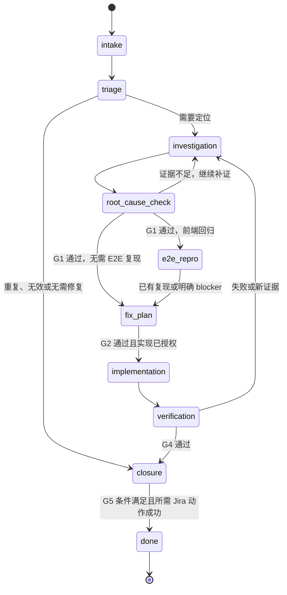

# Defect State Machine

## 主状态机

G1／G2／G4 是检查点，条件满足即可继续。遇到影响下一步的关键未知、方案取舍、范围或风险变化时，按 `confirmation-gates.md` 提问；只暂停依赖该决定的工作。用户只要求诊断时在根因与建议形成后结束，不进入实现或擅自收尾 Jira。

## 流转规则

| From | To | 条件 |
| --- | --- | --- |
| `intake` | `triage` | 最小证据集已建立 |
| `triage` | `investigation` | 需要继续定位根因 |
| `triage` | `closure` | 证据支持重复、无效或无需修复的结论 |
| `investigation` | `e2e-repro` | G1 证据充分，且命中前端用户可感知回归 |
| `investigation` | `fix-plan` | G1 证据充分，且无需单独 E2E repro |
| `e2e-repro` | `fix-plan` | 已形成 failing E2E 或明确自动化 blocker |
| `fix-plan` | `implementation` | G2 的方案、范围与实现授权条件满足 |
| `implementation` | `verification` | 代码改动已完成，开始执行或核对有效验证证据 |
| `verification` | `investigation` | 验证失败或新证据推翻假设 |
| `verification` | `closure` | 必要验证支持当前改动与验收；缺口仍如实记录 |
| `closure` | `done` | G5 的对应授权、收尾条件与所需 Jira 动作均已完成 |

## Jira 同步与本地进度

- 评论、move、assign、最终关闭均检查对应授权；G1 通过不自动授予进行中流转权限。
- 阶段摘要可先在本地准备，有对应授权再同步。评论未授权或同步失败，不阻断无依赖的已授权本地修复和验证；用户要求先同步再实施时遵守该依赖。
- 结果不确定时按评论幂等 reference 回读，不盲目重试。保留待同步摘要并报告 Jira 控制面状态。
- 本地工作完成与 Jira 收尾完成分别报告；缺少最终动作授权或写入失败时停留在 `closure`，不声称 Jira 已关闭。

## 禁止行为

- 未建立最小事实集就猜测根因或修改代码。
- 把候选根因因用户认可而改称已证实，或把验证失败、未执行改报为通过。
- 未获实现授权，或存在未决的关键范围、契约、数据及风险变化时开始依赖它的实现。
- 在前端回归场景跳过 E2E 复现且不说明原因。
- 用本地检查通过替代 Jira 写入授权，或把关联 issue 的授权合并推断。
- Jira 未同步或关闭时将整个交付标记完成。

## 恢复

恢复时保留已确认决定、有效授权和仍适用的证据，只刷新缺失或已变化的部分。证据不足先自主补齐；需要外部决定时说明缺口及受阻动作，不重走全部阶段或重复请求已有授权。
