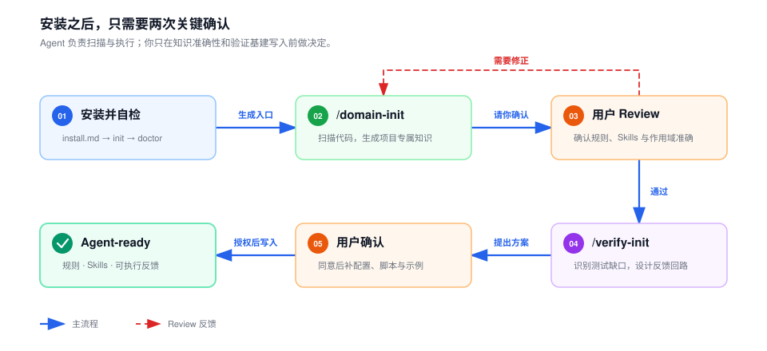
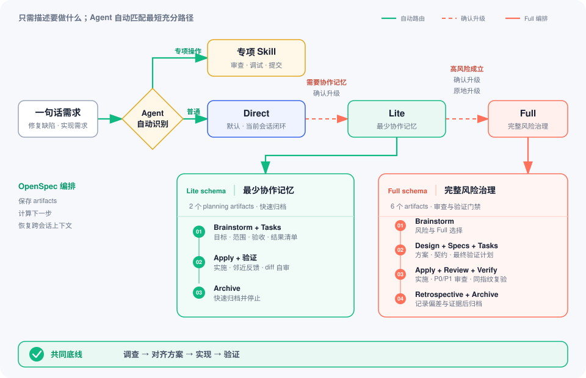
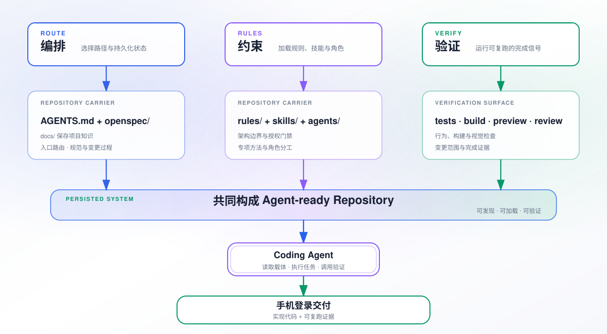

# DevKeel

让现有项目成为 AI Agent **能读懂、会执行、可验证**的工程环境。

DevKeel 为项目建立可供 Coding Agent 使用的知识、专业能力与验证入口。CLI 负责接入和更新，
`AGENTS.md` 负责按任务加载上下文和选择能力。

## 快速开始

需要 **Node.js >= 20.19.0**。在目标项目中打开 Coding Agent，把这段提示交给它：

```text
按照 https://raw.githubusercontent.com/MinLeeV5/devkeel/HEAD/web/public/install.md 完成项目初始化
```

Agent 会按[安装指南](web/public/install.md)确认项目和平台，完成初始化与自检。也可以在终端直接运行：

```bash
npx devkeel@latest init
npx devkeel@latest doctor
```

初始化建立执行入口；项目知识与验证能力可按需补齐。已有资产的合并和写入范围见安装指南。

<picture>
  <source media="(prefers-color-scheme: dark)" srcset="web/public/diagrams/onboarding-flow-dark.svg">
  <source media="(prefers-color-scheme: light)" srcset="web/public/diagrams/onboarding-flow.svg">
  
</picture>

CLI 与 `devkeel-templates` 发布在公共 npm。DevKeel 不采集使用数据，内置 OpenSpec 调用也关闭了遥测。

## 项目知识与验证

`domain-init` 根据实际代码和已有约定维护 `docs/`、项目规则、Skills、专业角色及 `AGENTS.md`；
`verify-init` 检测已有测试基础，只补齐确认的缺口。两者共用项目测试说明和规则。
空项目或已有完整能力的项目可以暂缓这些步骤。

它们是 **Agent Skills，不是 CLI 子命令**：Claude Code 使用 `/domain-init`、`/verify-init`，
Codex 使用 `$domain-init`、`$verify-init`，其他平台使用对应的 Skill 入口。

## 把想法谈清楚

想探索方向、比较方案或补齐已有设计，可调用 `brainstorming`。Agent 先查代码与约束，
每轮只讨论一个关键决定，给出推荐、依据与代价：

- **Lite 讨论**：围绕当前方向补缺，按需调用需求或技术探针。
- **Full 讨论**：检查相关假设、替代方向与风险，完成需求和技术双探针检查，可复用有效结论。

```text
/brainstorming 我想增加手机验证码登录，帮我梳理需求和方案。
```

Agent 根据上下文选择深度，已选工作流提供同名默认值。用户可直接要求“围绕现有方案补缺”或
“深入检查假设与替代方向”；明显扩大探索范围前会先确认。讨论深度可单独调整，不改变工作流
的文档与治理要求。两档都在目标闭合后收敛，不强制增加提问。

Claude Code 使用 `/brainstorming`，Codex 使用 `$brainstorming`，其他平台使用对应的 Skill 入口。
讨论默认留在会话中，经同意才持久化；讨论本身不授权修改代码。
详细方法见 [brainstorming Skill](templates/skills/brainstorming/SKILL.md)。

## 渐进工作流

直接描述任务即可。审查、调试、测试设计等操作由专项 Skill 处理；普通开发先核对关键缺口，
必要时通过 `brainstorming` 逐题讨论，再选择路径。在当前会话中完成的任务走 Direct；
需要跨会话恢复、交接或审计时，经确认进入 Lite；
用户选择 Full，或外部契约协调、严重且难回退的风险成立时，经确认进入 Full。

<picture>
  <source media="(prefers-color-scheme: dark)" srcset="web/public/diagrams/sharing-v2-routing.svg">
  <source media="(prefers-color-scheme: light)" srcset="web/public/diagrams/progressive-path.svg">
  
</picture>

Lite / Full 使用 OpenSpec 保存共同设计和任务过程。常用入口是 `/opsx:new`、`/opsx:continue`；
实施、验证和归档等入口见 [OpenSpec Skills](templates/skills/openspec-new-change/SKILL.md)。
方案确认不自动授权实施，归档也不自动授权 commit、push 或 PR。

## 资产与平台

<picture>
  <source media="(prefers-color-scheme: dark)" srcset="web/public/diagrams/sharing-v2-harness-architecture.svg">
  <source media="(prefers-color-scheme: light)" srcset="web/public/diagrams/project-architecture.svg">
  
</picture>

`docs/` 保存当前项目知识，`.harness/` 保存规则、Skills 和专业角色，`openspec/` 保存规范与任务过程。
项目专属内容根据实际代码生成；初始化产生的目录不代表项目分析或验证已经完成。

支持 Claude Code、Codex CLI、Cursor、GitHub Copilot、Gemini CLI 和 OpenCode。
平台链接、已有入口冲突及 Git 子模块的处理方式见[安装指南](web/public/install.md)。

## CLI 命令

| 命令 | 用途 | 常用选项 |
|------|------|----------|
| `devkeel init` | 初始化协作资产和平台入口 | `--name`、`--targets`、`-y`、`--force` |
| `devkeel doctor` | 检查协作资产 | `--fix` |
| `devkeel sync` | 同步平台入口 | `--targets`、`--force` |
| `devkeel update` | 更新当前项目的模板资产 | `--dry-run`、`--force`、`--beta`、`--template-version` |
| `devkeel evidence` | 收集 OpenSpec change 的实现证据 | `--change <name>`、`--json`、`--write-base` |
| `devkeel openspec <命令>` | 调用内置 OpenSpec CLI | 如 `list`、`status`、`validate` |
| `devkeel -V` | 查询 CLI 与模板的发布渠道版本 | 可加 `--beta` |

其他参数见对应命令的 `--help`。`evidence --write-base` 会写入基线快照；
`init --force` 和 `sync --force` 只处理冲突的技能入口，并在替换前备份。

### 更新 CLI 与模板

CLI 和项目模板独立升级：

```bash
npm install -g devkeel@latest --registry=https://registry.npmjs.org/
devkeel update --dry-run
devkeel update
```

`devkeel update` 不升级全局 CLI。选择“全部更新”或使用 `--force` 会覆盖受管组件中的本地修改；
退役的受管 Skill 目录及其中的自定义内容也可能被删除。更新前先查看 `--dry-run` 结果。

## 开发与文档

从[项目文档索引](docs/README.md)进入开发、测试与构建说明；源码与问题反馈见
[GitHub 仓库](https://github.com/MinLeeV5/devkeel)。

## 许可证

采用 [MIT](LICENSE) 许可证。第三方依赖与嵌入的 Skills 保留各自的许可证和来源标注。
