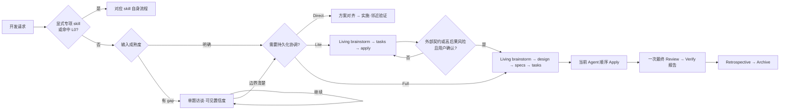

# DevKeel CLI

项目知识框架 CLI —— 为项目建立统一的 AI 协作规范（`.harness/` 作为 single source of truth），通过 symlink 分发到 Claude Code / Cursor / Codex / Copilot / Gemini 等多平台目录。

## 解决什么问题

当团队同时使用多个 AI 编程工具时，面临几个现实问题：

- **规范碎片化**：Claude Code 的 `.claude/`、Cursor 的 `.cursor/rules/`、Codex 的 `.agents/` 各自维护一套规则，内容重复且容易不一致
- **领域知识散落**：前端的 TypeScript 规范、后端的 Java Spring 约定等领域知识没有结构化沉淀
- **工具配置繁琐**：每个新项目都要手动配置各平台的 rules、skills、agents

DevKeel 的做法是：**用 `.harness/` 作为 single source of truth**，通过 symlink 将 rules/skills/agents 分发到各平台的约定目录，确保所有 AI 工具读取同一套规范。

## 核心概念

### 平台适配

DevKeel 通过 symlink 将 `.harness/` 下的资产分发到各平台目录：

```
.harness/
  skills/         ─── symlink ──→  .claude/skills/
  rules/          ─── symlink ──→  .claude/rules/
  agents/         ─── symlink ──→  .claude/agents/
  commands/       ─── symlink ──→  .claude/commands/
  rules/          ─── symlink ──→  .cursor/rules/
  skills/         ─── symlink ──→  .agents/skills/
  rules/          ─── symlink ──→  .agents/rules/
  commands/       ─── symlink ──→  .agents/commands/
```

支持的目标平台：

| 平台 | 链接策略 |
|------|---------|
| **Claude Code** | symlink skills/rules/agents/commands + 生成 CLAUDE.md |
| **Cursor** | symlink rules |
| **Codex CLI** | symlink skills/rules/commands 到 .agents/ |
| **GitHub Copilot** | 生成 .github/copilot-instructions.md（引用 @AGENTS.md） |
| **Gemini CLI** | 生成 GEMINI.md |

### 领域包 (Domain)

领域包是面向特定技术栈的规则集合。内置领域包：

- **frontend** — TypeScript、React 等前端规范
- **backend** — Java Spring、API 契约等后端规范

`devkeel init` 时根据项目类型自动选择领域包。选择 `fullstack` 会同时安装 frontend 和 backend。

### 内置 Skills

初始化时复制到 `.harness/skills/` 的技能模板，涵盖需求分析、方案设计、代码审查、测试设计、调试排错、提交规范、openspec 工作流等。完整列表见 `templates/skills/` 目录。

Human Review 是显式可选能力：用户调用 `$human-review` 时，DevKeel 会把当前 Lite 或 Full change 的已有 artifacts 渲染为 `human-review.html` 并尝试打开；它不属于 schema、不会改变 status，也不是 apply/archive 门禁。

`brainstorming@8.0.0` 按输入成熟度工作：早期想法逐题探索，成熟方案只做 Gap Check，明确任务无需重复 brainstorm。每轮只解决一件事，附 Agent 猜测和证据，并以 5% 档位显示当前阶段置信度。`requirement-analysis` 与 `technical-design` 在这里作为只读 gap 探针，不另行生成第二套设计。

`workflow-routing@1.0.0` 只在 Direct、Lite、Full 边界不清，或实施中出现持久化与治理升级信号时加载；明确的低风险 Direct 和已由专项 skill 接管的任务不承担这部分上下文。

Brainstorming 默认在聊天中保持 topic-only。边界置信度约 80% 且存在跨会话、交接、并行或审计价值时，Agent 才询问是否持久化；用户同意或显式 `/opsx:new` 后进入 change-draft，并维护同一份 Living `brainstorm.md`。`/opsx:explore` 仍复用这个 skill；它不会修改应用代码或下游 artifacts。

### Direct / Lite / Full 渐进工作流

开发任务先从最轻路径开始，并按实际协调风险升级：



- 开发默认先调查并对齐实现方案，再进入实施；专项 skill 与 Direct 同样遵守，已有有效确认直接复用。
- 显式专项 skill 与自动命中的 L0 使用自身流程；其余请求按成熟度补齐关键 gap。Direct 不创建 OpenSpec change，边界不明确时优先 Direct。
- OpenSpec 是持久化协调层，而不是默认开发前置。无上下文 `/opsx:new` 默认创建 `lite`，并在同一轮初始化 Living brainstorm、记录明确输入和提出下一道问题。Lite 与 Full 共用 brainstorm，已有 Lite 可在
  同一 change 原地升级 Full，通过同一 `.openspec.yaml` 保留已验证进度；用户拒绝 Full 建议后仍可继续 Lite。
- `brainstorm.md` 是唯一共同设计语义源，以 D/A/O 和 DRAFT/CONFIRMED 记录状态。design/specs/tasks 只能投影决定、仓库事实和机械转换；OpenSpec 的文件 `done` 不能替代语义确认。
- `/opsx:continue` 每次最多投影一个 artifact；只有显式 `/opsx:ff` 才快速推进，但仍不能跳过单题决定和最终快照确认。旧 `/opsx:propose` 已退役。
- Full 的 design、specs、tasks、verify、retrospective 都是必选 artifact。规划入口在 tasks 就绪后停止；Verify 只在最终实现与一次 P0/P1 阻断式 Review 之后生成测试报告。
- Apply 默认不创建 worktree、不分派实现 subagent、不强制 TDD、不逐任务提交。Full 仅在稳定测试接缝存在时使用聚焦 TDD。
- Lite 成功后快速归档；Full Archive 要求新鲜的 PASS 验证、生成精简回顾并默认同步 specs。归档后只询问是否另行 commit、push、创建 PR 或清理，默认停止。

### 版本管理

`.harness/versions.yml` 跟踪所有内置资产的版本，`devkeel update` 可将本地资产升级到最新模板版本。

CLI 与模板独立发布、独立升级：

```bash
npm install -g devkeel@latest --registry=https://registry.npmjs.org/  # 升级 CLI 程序
devkeel update                                                   # 更新当前项目的模板资产
```

更新检查比较当前项目的模板版本与 npm `latest`，仅在远端版本更高时显示终端提示，不再自动打开浏览器。
检查结果缓存三天；预发布版本按 SemVer 顺序比较，不会把较旧的正式版提示为升级。需要 beta 模板时显式使用
`devkeel update --beta`。`devkeel update` 不会升级全局安装的 CLI。

内置 skill 退役时，Update 会按版本表差异直接删除对应的受管目录，不再保留同名自定义内容或做快照比对。讨论 skill 的合并升级例外地采用先安装并校验新 skill 与 `/opsx:explore`、再退休旧入口的事务顺序。

## 快速开始

### 安装

```bash
npm install -g devkeel --registry=https://registry.npmjs.org/
```

要求 Node.js >= 20.19.0。

`devkeel init` 和 `devkeel update` 从 npm 公共仓库下载 `devkeel-templates`，无需企业网络或私有源配置。
项目协作资产保存在 `.harness/`。Schema 名称统一为 `lite` / `full`；`devkeel update` 会迁移旧 selector，保留原来的 Lite / Full 流程选择。
DevKeel 不采集或上报使用数据，内置 OpenSpec 命令的遥测也已关闭。

### 初始化项目

```bash
cd your-project
devkeel init
```

交互式引导会依次询问：
1. 项目名称（自动从 package.json 推断）
2. 目标平台（Claude Code / Copilot / Codex / Cursor / Gemini / OpenCode，可多选，默认选中已有平台）
3. 子模块初始化（如检测到 git submodule）

初始化完成后生成：

```
.harness/
  versions.yml            # 资产版本跟踪
  rules/                  # 基线规则
  skills/                 # 技能模板
  agents/                 # 子代理模板
  commands/               # 命令模板 (opsx-*)
openspec/                 # 任务过程与当前规范（schemas + 目录骨架）
AGENTS.md                 # 跨平台执行契约
CLAUDE.md                 # Claude Code 入口（含 @AGENTS.md）
GEMINI.md                 # Gemini CLI 入口（如选择该平台）
.claude/ → .harness/      # symlink（如选择 Claude Code）
.cursor/ → .harness/      # symlink（如选择 Cursor）
.agents/ → .harness/      # symlink（如选择 Codex）
```

项目初始化后，`domain-init` 和 `verify-init` 按需在当前项目 `docs/` 维护项目知识；
AGENTS 保留执行契约和读取入口，rules 保留简短约束。根项目与子项目使用相同分类规则。
`openspec/changes/` 保存任务过程，`openspec/specs/` 继续保存当前能力规范。
本仓库的开发与架构资料见 [项目文档](docs/README.md)。

## CLI 命令

### `devkeel -V`

显示 npm `latest` dist-tag 指向的 CLI 与模板版本；显式传入 `--beta` 时改为显示 beta 渠道版本。

```bash
devkeel -V          # 显示 latest 渠道
devkeel -V --beta   # 显示 beta 渠道
```

### `devkeel init`

初始化 `.harness/` 目录。交互式选择目标平台，复制模板、建立 symlink、生成入口文件。

- 自动检测 package.json 推断项目名
- 检测 git submodules 并提供领域配置选项
- 从 Git 子模块关系和已有 AGENTS.md 自动识别仓库角色
- 自动维护 .gitignore

已有的 Codex / Claude Code skills 入口发生冲突时，默认保留原件并停止。确认需要替换时使用 `devkeel init --force`，覆盖前自动备份并输出备份位置。

### `devkeel sync`

按本次选择的目标平台建立链接，交互选择默认选中已有平台。`.claude/skills`、`.agents/skills` 整目录链接到 `.harness/skills`；新增或修改共享技能无需再次同步。平台运行中的技能列表可能需要重开会话刷新。

```bash
devkeel sync --targets claude-code,codex
devkeel sync --force    # 先备份，再替换冲突的 skills 入口
```

默认整批检查 skills 入口，冲突时停止同步并保留原入口。强制覆盖只针对本次 skills 目标，保留平台目录中的其他内容。备份位于 `.harness/skills-backups/`，其中 `restore.json` 记录原入口路径；受管链接记录在 `.harness/skills-state.json`，两者均为本地状态。

技能公共流程写在 `SKILL.md`，Claude 原生配置按需使用 frontmatter，Codex 元数据按需使用技能包内的 `agents/openai.yaml`。有执行差异时由技能按平台读取参考文件；手动调用分别使用 Claude 的 `/skill-name`、Codex 的 `$skill-name`。

### `devkeel doctor`

按自动识别的仓库角色和平台入口检查协作资产：

| 检查项 | 说明 |
|--------|------|
| 目录完整性 | rules/skills/agents 目录是否存在 |
| Codex / Claude skills | 链接目标及归属、技能 frontmatter、可选 Codex 元数据是否有效 |
| AGENTS.md | 执行契约文件是否存在 |
| CLAUDE.md | 是否包含 @AGENTS.md 引用（仅 claude-code 目标） |
| openspec/ | 主仓库的任务与规范目录是否已初始化 |
| versions.yml | 版本跟踪文件是否存在 |
| submodule | 子模块是否完成 DevKeel 配置 |

`devkeel doctor --fix` 可补齐缺失的 skills 链接；遇到同名目录或错误链接时保留原件，并提示使用 `devkeel sync --force`。静态检查通过不代表所有技能的运行行为已验证。

### `devkeel update`

更新内置资产到最新版本。对比 `.harness/versions.yml` 与内置版本号，列出可更新项。

```bash
devkeel update            # 交互式确认
devkeel update --force    # 强制覆盖全部受管组件
devkeel update --dry-run  # 仅预览，不执行
devkeel update --template-version 1.2.3      # 使用指定模板版本
devkeel update 1.2.3-beta.1                  # 使用位置参数指定模板版本
devkeel update --beta                        # 使用 npm beta dist-tag 指向的模板版本
devkeel update --beta --force                # 使用 beta 渠道并强制覆盖全部受管组件
```

冲突处理：检测到本地修改时，提供「跳过」或「覆盖」选择。
Codex / Claude skills 入口冲突需先通过 `devkeel sync --force` 备份处理，`update --force` 保持原有的模板资产覆盖语义。

## 自动识别，无需项目配置文件

DevKeel 不再生成或读取 `.harness/config.yml`，无需维护 `targets`、`repoType` 或项目类型。
Agent 根据项目结构、代码和 `AGENTS.md` 理解项目职责与执行范围；CLI 从实际入口和 Git 上下文识别操作范围。

- **平台**：从 `.claude/`、`.agents/` 或 `.codex/`、`.cursor/`、`.opencode/`、
  `.github/copilot-instructions.md`、`GEMINI.md` 识别。`init` 和 `sync` 默认选中已有平台，
  可交互调整，也可通过 `--targets` 指定本次操作的平台；选择不写入配置文件。
- **仓库角色**：Git 子模块或 `AGENTS.md` 顶部带 `<!-- harness:domain-agents -->` 标记的项目按领域子仓库处理，
  其余按主仓库处理。子仓库单独检出后仍可由已有执行契约识别，`init/update/doctor` 使用相同规则。
- **缺失入口**：平台目录仍在时，`doctor --fix` 可补齐受管链接；整个入口都被删除且没有其他识别线索时，
  使用 `devkeel sync --targets <平台>` 重新建立。
- **已有项目**：旧 `.harness/config.yml` 被忽略且不会被改写，可自行删除；资产版本仍由
  `.harness/versions.yml` 跟踪，OpenSpec 继续使用自己的 `openspec/config.yaml`。

子模块在 `devkeel init` 中初始化、在 `devkeel doctor` 中检查，无需注册。
`devkeel submodule` 和 `devkeel migrate` 已移除；历史任务文件可按需手动复制归档，当前项目知识维护在 `docs/`。

## 项目结构

```
src/
  index.ts                  # CLI 入口 (Commander)
  commands/
    init.ts                 # 交互式初始化
    doctor.ts               # 协作资产检查
    update.ts               # 内置资产更新
    sync.ts                 # 平台入口同步
  lib/
    versions.ts             # 资产版本管理
    detect.ts               # 环境、仓库角色与子模块检测
    templates.ts            # 模板复制、symlink 创建、渲染
    agents-md.ts            # 根/子仓库 AGENTS 模板选择与原内容合并
    gitignore.ts            # .gitignore 条目管理
templates/
  skills/                   # 内置 skill 模板
  agents/                   # 子代理模板 (code-reviewer)
  commands/                 # opsx 命令模板
  domain/                   # 领域包 (frontend, backend)
  openspec/                 # openspec 目录骨架 + schemas
  agents-md.md              # 根仓库 AGENTS.md 完整执行契约模板
  agents-domain-md.md       # 子仓库 AGENTS.md 领域执行契约模板
  claude-md.md              # CLAUDE.md 模板
  gemini-md.md              # GEMINI.md 模板
  versions-yml.yml          # versions.yml 模板
  gitignore                 # .gitignore 模板
tests/                      # vitest 单元测试
```

## 开发

```bash
pnpm install          # 安装依赖
pnpm dev              # watch 模式开发
pnpm build            # tsup 构建 ESM → dist/
pnpm test             # vitest run
pnpm test:watch       # vitest watch
pnpm lint             # tsc --noEmit 类型检查
node bin/devkeel.js   # 本地运行 CLI
```

### 技术栈

- **Runtime**: Node.js >= 20.19.0, TypeScript, ESM-only
- **CLI**: Commander (命令解析) + @clack/prompts (交互式 UI)
- **构建**: tsup
- **测试**: vitest
- **配置格式**: YAML (yaml 包)

## License

MIT

## 开源协作

源码与问题反馈：[MinLeeV5/devkeel](https://github.com/MinLeeV5/devkeel)。

## 许可证

采用 [MIT](LICENSE) 许可证。第三方依赖与嵌入的 skills 保留各自的许可证和来源标注。
