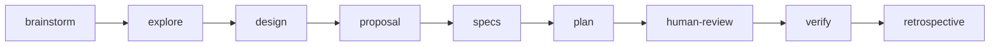

# superpowers-bridge schema 工作流重设计

## TL;DR

重排 superpowers-bridge schema 的 artifact 流程，解决三个问题：
1. 规划阶段缺乏源码调查（仅 brainstorm 有浅度探索）
2. proposal 在不知道影响全貌时就要求写 Impact
3. tasks 和 plan 是同一件事的两个粒度，冗余

## 变更概览

```
现有: brainstorm → proposal → design → specs → tasks → plan → human-review
新:   brainstorm → explore → design → proposal → specs → plan → human-review
```

| 变更 | 类型 | 说明 |
|------|------|------|
| 新增 `explore` | 新 artifact | brainstorm 之后，针对性深入调查受影响区域的源码架构 |
| `proposal` 后移 | 依赖变更 | 从 `requires: [brainstorm]` 改为 `requires: [design]`，此时才真正知道影响范围 |
| `tasks` + `plan` 合并 | 合并 | plan 内含粗粒度分组（checkbox）+ 微步骤，`apply.tracks` 改为 `plan.md` |
| `tasks` 移除 | 删除 | 不再作为独立 artifact |

## 1. 新增 explore artifact

### 定位

brainstorm 锁定了需求范围后，explore 针对性地深入调查受影响区域的源码，产出结构化的现状分析。

与 brainstorm 中的探索区别：

| | brainstorm 探索 | explore |
|---|---|---|
| 目的 | 了解项目背景，辅助需求讨论 | 深入理解受影响区域的架构、模式、依赖 |
| 深度 | 浅 — 文件结构、文档、近期提交 | 深 — 具体模块实现、调用链、数据流 |
| 范围 | 广 — 整体项目 | 窄 — 聚焦在需求涉及的区域 |

### schema 定义

```yaml
- id: explore
  generates: explore.md
  description: 针对需求涉及区域的源码深度调查与现状分析
  template: explore.md
  instruction: |
    使用 Skill 工具调用 **opsx:explore** 进行源码调查。

    基于 brainstorm.md 中已确认的需求范围，聚焦调查：
    - 受影响模块的当前架构与代码结构
    - 关键代码路径（调用链、数据流）
    - 现有测试覆盖情况
    - 潜在风险点与技术约束

    将调查结果写入本 change 目录的 explore.md。
  requires:
    - brainstorm
```

### explore.md 模板

```markdown
## 调查范围

<!-- 基于 brainstorm.md，列出本次聚焦调查的模块/区域 -->

## 现有架构

<!-- 受影响区域的架构概览，含关键模块及其职责 -->

## 关键代码路径

<!-- 核心调用链、数据流，引用具体文件路径和行号 -->

## 测试覆盖

<!-- 现有测试情况：哪些路径已覆盖、哪些缺失 -->

## 风险与约束

<!-- 技术约束、潜在破坏点、向后兼容性问题 -->
```

## 2. proposal 后移

### 变更

```yaml
# 现有
- id: proposal
  requires:
    - brainstorm

# 新
- id: proposal
  requires:
    - design
```

### 理由

proposal 需要填写 Impact（受影响的代码、API、依赖），但这只有在完成 explore（源码调查）和 design（技术方案）后才能准确判断。现有流程让 proposal 在只有需求分析的情况下猜测影响范围。

后移后 proposal 的输入变为：brainstorm（需求）+ explore（现状）+ design（方案），写出的 Impact 和 Capabilities 才有技术依据。

## 3. tasks + plan 合并

### 变更

移除 `tasks` artifact，将其 checkbox 追踪能力合并到 `plan` 中。

```yaml
# 移除
- id: tasks

# plan 变更
- id: plan
  generates: plan.md
  requires:
    - specs  # 原来 requires tasks，现在直接接 specs

# apply 变更
apply:
  tracks: plan.md  # 原来是 tasks.md
```

### 合并后 plan.md 模板

```markdown
# [功能名称] 实现计划

> **给 agentic 执行器：** 使用 superpowers:subagent-driven-development
> 按任务逐个实现本计划。

**目标：** <!-- 一句话 -->

**架构：** <!-- 2-3 句话 -->

**技术栈：** <!-- 关键技术 -->

---

## 1. <!-- 功能组名称 -->

- [ ] **1.1 任务描述**
  1. 写测试：`path/to/test.ts` — 验证 XX 场景
  2. 实现：`path/to/module.ts` — 添加 XX 逻辑
  3. 验证：`pnpm vitest run path/to/test.ts`
  > commit: feat(scope): description

- [ ] **1.2 任务描述**
  1. ...
  > commit: ...

## 2. <!-- 功能组名称 -->

- [ ] **2.1 任务描述**
  1. ...
```

checkbox（`- [ ]`）是进度追踪单元，缩进的编号列表是微步骤执行指引。

## 4. human-review 模板调整

原有 6 章节变为 6 章节（内容调整）：

| # | 章节 | 来源文件 | 变更 |
|---|------|----------|------|
| 01 | 需求背景 | `brainstorm.md` | 不变 |
| 02 | 现状调查 | `explore.md` | **新增** — 架构概览、关键路径、风险 |
| 03 | 技术设计 | `design.md` | 不变 |
| 04 | 变更提案 | `proposal.md` | **调整** — 从 02 移到 04 |
| 05 | 规格清单 | `specs/*.md` | 从 04 移到 05 |
| 06 | 实现计划 | `plan.md` | **合并** — 原 05+06 合为一章 |

进度条从 7 段（6 完成 + 1 当前）调整为匹配新的章节数。

## 5. 受影响的文件清单

| 文件 | 操作 | 说明 |
|------|------|------|
| `schemas/superpowers-bridge/schema.yaml` | 修改 | 新增 explore、后移 proposal、合并 tasks+plan、更新依赖链 |
| `templates/explore.md` | 新建 | explore artifact 模板 |
| `templates/plan.md` | 修改 | 合并 tasks 的 checkbox 格式 |
| `templates/tasks.md` | 删除 | 合并到 plan |
| `templates/human-review.md` | 修改 | 更新章节结构（6 章重排） |
| `templates/proposal.md` | 不变 | 内容格式不变，仅 schema 中依赖关系变化 |

## 6. 新依赖图



design 仍为可选（`requires: [brainstorm]` 改为 `requires: [explore]`）。
