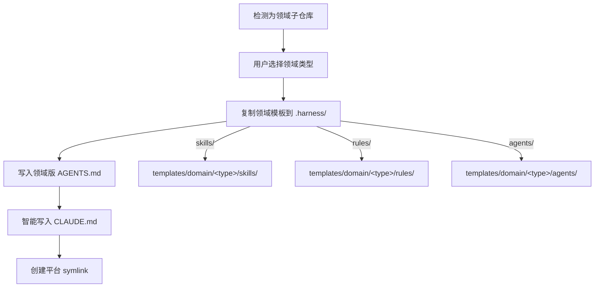

## TL;DR

让 `devkeel init` 区分主仓库和领域子仓库，领域子仓库只落对应领域模板（不含通用模板和 openspec），同时修复 CLAUDE.md / AGENTS.md 被无条件覆写的问题。

## 需求背景

当前 `devkeel init` 存在三个核心问题：

1. **CLAUDE.md 被无条件覆写** — `fs.writeFileSync` 直接写入，用户在项目中精心编写的项目描述、API 文档引用等内容会被模板替换。`detect.ts` 中声称"追加 @AGENTS.md 引用"，但代码实际是全量覆写。AGENTS.md 同理。
2. **无仓库类型区分** — config 只有 `project.types`（frontend/backend/other），没有"主仓库 vs 领域子仓库"概念。所有仓库走完全相同的 init 流程，导致领域子仓库被塞入不需要的通用模板和 openspec 脚手架。
3. **子模块初始化过于简陋** — 当前只创建 `.gitkeep` 存根和一行空白 AGENTS.md，不复制任何领域模板内容，子仓库的 AI 协作规范形同虚设。

触发原因：团队在多仓库（主仓库 + 多个领域子仓库）场景下使用 harness-cli，发现 init 行为不能适应这种结构。

## 目标用户与角色

| 角色 | 关注点 |
|------|--------|
| 主仓库维护者 | init 后所有子仓库都有正确的领域规范，不需要手动二次配置 |
| 领域子仓库开发者 | `.harness/` 中的 skills/rules/agents 与自己的技术栈匹配，无多余噪音 |
| CI/CD 工程师 | config.yml 中有明确的 repoType 字段，便于自动化流程判断 |

## 核心功能用例

### 用例 1：CLAUDE.md / AGENTS.md 智能覆写

**触发条件:** init 执行到写入 CLAUDE.md 或 AGENTS.md 步骤时。

**预期行为:**

| 场景 | 行为 |
|------|------|
| 文件不存在 | 写入完整模板 |
| 文件存在，内容与模板一致（只有占位符） | 覆写为最新模板 |
| 文件存在，包含非模板内容 | 只确保顶部有 `@AGENTS.md` 引用，不修改其余内容 |

判断"非模板内容"的方法：将现有文件内容与渲染后的模板内容做对比，去除注释占位符后如果有实质差异，则认为有用户编写的具体内容。

### 用例 2：仓库类型自动检测 + 手动确认

**触发条件:** init 流程启动后、交互提示阶段。

**预期行为:**

| 检测信号 | 推断类型 | 用户交互 |
|----------|----------|----------|
| 存在 `.gitmodules` 且有子模块 | 主仓库（main） | 提示确认，可改选为 domain |
| 不存在 `.gitmodules` | 领域子仓库（domain） | 提示确认，可改选为 main |

检测结果写入 config.yml 新增的 `project.repoType` 字段（值: `main` \| `domain`）。

领域子仓库还需选择领域类型（`project.domainType`: `backend` \| `frontend` \| `other`），此字段决定复制哪套领域模板。

### 用例 3：主仓库 init

**触发条件:** repoType 确认为 `main`。

**预期行为:** 与当前行为基本一致，新增：
- 仓库类型检测 + 确认步骤
- 子模块批量 init 时为每个子模块选择领域类型（backend/frontend/other）
- CLAUDE.md / AGENTS.md 智能覆写
- 保持复制通用模板 + openspec 的行为

### 用例 4：领域子仓库 init

**触发条件:** repoType 确认为 `domain`。

**入口方式（两种都支持）:**
- **入口 A**: 主仓库 init 时批量处理子模块
- **入口 B**: 子模块目录下单独运行 `devkeel init`

**预期行为:**

领域子仓库 **不**执行：
- 复制通用模板（skills/rules/agents/commands）
- 落 openspec 脚手架
- 复制 commands 目录

## 需求边界

**In Scope:**

- CLAUDE.md / AGENTS.md 智能覆写（对比模板内容判断）
- config.yml 新增 `project.repoType` 字段（`main` | `domain`）
- config.yml 新增 `project.domainType` 字段（领域子仓库专用）
- 仓库类型自动检测（基于 .gitmodules）+ 用户确认
- 领域子仓库 init 流程（只落领域模板 + 领域版 AGENTS.md/CLAUDE.md + 平台 symlink）
- 主仓库 init 时批量为子模块选择领域类型并初始化
- 子模块目录下单独运行 `devkeel init` 自动识别为领域子仓库
- 新增领域子仓库的 AGENTS.md 模板（`templates/agents-md-domain.md`）
- 新增领域子仓库的 CLAUDE.md 模板（`templates/claude-md-domain.md`）

**Out of Scope:**

- setup skill 自动生成项目描述 — 后续迭代
- 领域子仓库的 openspec 支持 — 明确排除
- 新增领域类型 — 当前只支持已有的 backend / frontend / other
- 主仓库/子仓库间的 config 继承或联动机制 — 不需要
- GEMINI.md 的智能覆写 — 跟随 CLAUDE.md / AGENTS.md 相同策略

## 探索过的替代方向

| 方向 | 取舍 |
|------|------|
| CLAUDE.md 始终追加 @AGENTS.md | 不如对比模板内容精准，可能导致重复引用 |
| 只支持子仓库单独 init | 主仓库批量处理更高效，两种入口都支持更灵活 |
| 领域子仓库通用+领域模板叠加 | 增加噪音，领域子仓库应保持精简，只含与自身技术栈相关的规范 |
| 用 .harness/domain/ 子目录存放领域模板（当前主仓库行为） | 领域子仓库直接放顶层 .harness/ 更直觉，减少一层嵌套 |

## 待确认项

无 — 所有关键决策已在需求分析过程中确认。
