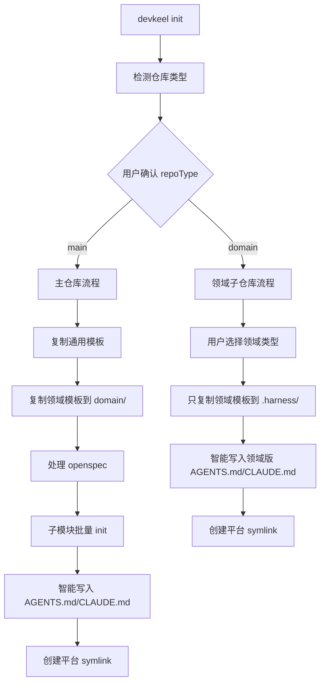

## 初步设计方向（预填充，待 design artifact 阶段完善）

### 1. 数据模型变更

`HarnessConfig` 新增字段：

```typescript
interface HarnessConfig {
  version: string
  project: {
    name: string
    types: string[]
    repoType: 'main' | 'domain'    // 新增
    domainType?: string             // 新增，领域子仓库专用（backend/frontend/other）
  }
  targets: string[]
}
```

### 2. 仓库类型检测

在 `src/lib/detect.ts` 新增 `detectRepoType()`:
- 检查 `.gitmodules` 是否存在且含子模块 → `main`
- 否则 → `domain`
- 返回推断结果供用户确认

### 3. CLAUDE.md / AGENTS.md 智能覆写

在 `src/lib/templates.ts` 新增 `hasUserContent(filePath, templateContent)`:
- 读取现有文件内容
- 渲染模板（填充变量）
- 去除 HTML 注释占位符后对比
- 有实质差异 → 返回 true（有用户内容）

写入策略函数 `writeSmartFile(filePath, templateContent, ensureDirective)`:
- 文件不存在 → 写入完整模板
- 无用户内容 → 覆写为最新模板
- 有用户内容 → 只确保 `@AGENTS.md` 引用存在

### 4. init 流程分支



### 5. 新增模板文件

- `templates/agents-md-domain.md` — 领域子仓库的 AGENTS.md 模板（精简版执行契约）
- `templates/claude-md-domain.md` — 领域子仓库的 CLAUDE.md 模板

### 6. 子模块批量 init 优化

主仓库 init 子模块时，改为调用领域子仓库 init 逻辑（而非当前的 .gitkeep 存根），传入用户选择的领域类型。
