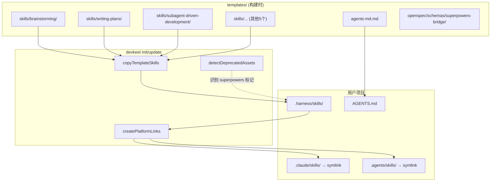
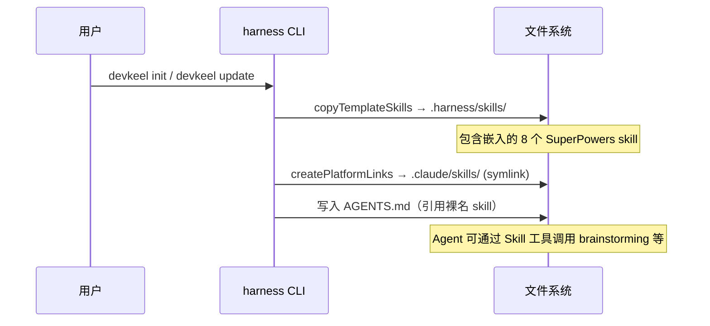

## TL;DR

将 SuperPowers v5.1.0 中 8 个 skill 复制到 `templates/skills/`，修改所有 `superpowers:` 前缀引用为裸名，扩展 `isHarnessGenerated` 以支持废弃资产检测。

交付清单：
1. 8 个 skill 目录（含裁剪）
2. 模板引用全量替换
3. `isHarnessGenerated` 逻辑扩展
4. brainstorming 的 visual-companion 裁剪

## 需求引用

- brainstorm.md: UC1（init 后直接可用）、UC2（裸名引用）、UC3（插件共存）
- 范围：8 个 skill，去掉 visual-companion，metadata 标注 `author: "superpowers"`, `version: "5.1.0"`

## 方案设计

### 架构概览



### ATAM 方案对比

本变更方案单一（直接嵌入），无真正替代方案需要对比。在 brainstorm 阶段已排除：peerDependency、部分嵌入、加前缀等方向。

### 关键时序

无服务交互，核心流程是构建时文件复制：



### 模块设计

**无新模块。** 变更集中在：

1. **模板资产层** — 新增 8 个 skill 目录到 `templates/skills/`

   每个 skill SKILL.md frontmatter：
   ```yaml
   ---
   name: brainstorming
   description: ...
   metadata:
     author: "superpowers"
     version: "5.1.0"
   ---
   ```

2. **引用层** — 所有 `superpowers:xxx` → `xxx`

   影响文件：
   - `templates/agents-md.md`
   - `templates/openspec/schemas/superpowers-bridge/schema.yaml`
   - `templates/openspec/schemas/superpowers-bridge/templates/tasks.md`
   - `templates/openspec/schemas/superpowers-bridge/templates/retrospective.md`
   - 各嵌入 skill 内部交叉引用

3. **检测逻辑层** — `src/lib/templates.ts` 的 `isHarnessGenerated`

   ```typescript
   function isHarnessGenerated(entryPath: string): boolean {
     const skillMd = path.join(entryPath, 'SKILL.md')
     if (fs.existsSync(skillMd)) {
       const content = fs.readFileSync(skillMd, 'utf-8')
       return content.includes('devkeel')
         || content.includes('author: "superpowers"')
         || content.includes('author: "openspec"')
     }
     // ... 其余逻辑不变
   }
   ```

4. **openspec skills metadata 补全** — 11 个 openspec-* skill 的 SKILL.md 增加 metadata

   ```yaml
   metadata:
     author: "openspec"
   ```

4. **裁剪层** — brainstorming skill

   移除：
   - `visual-companion.md`（整个文件）
   - `scripts/` 目录（整个目录）
   - `SKILL.md` 中 "Visual Companion" section（约 20 行）
   - `SKILL.md` checklist 中 "Offer visual companion" 步骤

### 数据设计

N/A — 纯文件操作，无数据模型。

## 质量设计

### SLO 指标

N/A — CLI 工具，非在线服务。

质量验证方式：
- `pnpm lint` — 类型检查通过
- `pnpm test` — 现有测试不回归
- 手动验证：`node bin/devkeel.js init` 后检查 skill 文件完整性

### 安全（STRIDE 简表）

N/A — 模板文件复制，无网络交互、无用户输入处理。

### 旁路隔离

N/A。

## 决策追溯

| 决策 | 追溯 |
|------|------|
| 8 个 skill 全部嵌入 | brainstorm: 形成完整调用链，缺一个会断 |
| 去掉 visual-companion | brainstorm: 依赖插件 scripts，非纯文本 skill |
| 裸名（无前缀） | brainstorm: 项目本地优先级高于插件 |
| metadata 用 `author: "superpowers"` | brainstorm: 参考 openspec 写法，标注来源 |
| 扩展 `isHarnessGenerated` | explore: 发现废弃检测不识别 superpowers 标记 |

## 风险与未决

| 风险 | 缓解 |
|------|------|
| Skill 内部 `superpowers:` 引用遗漏 | 全量 grep 验证，确保 0 残留 |
| brainstorming 裁剪后残留引用 | 检查 SKILL.md 中所有 visual-companion 提及 |
| 上游 SuperPowers 重大更新 | metadata 中 version 标注基线，手动按需同步 |
