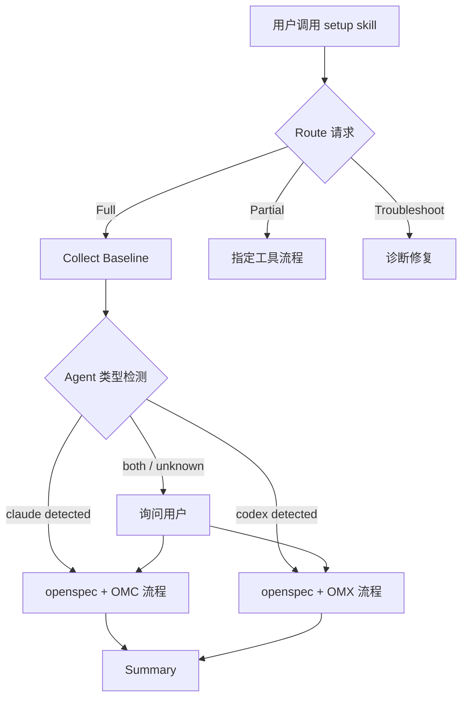
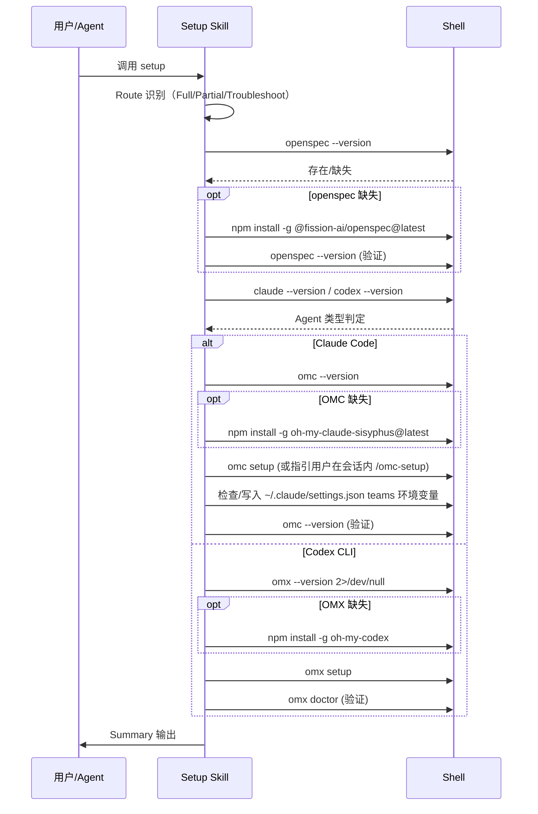

## TL;DR

重写 `templates/skills/setup/` 的 SKILL.md 和 tooling-matrix.md，聚焦三个工具（openspec、OMC、OMX）的检测-安装-配置闭环，新增 Agent 类型自动检测逻辑。纯模板内容变更，不涉及分发管道代码修改。

**首版交付清单：**
1. 重写 `templates/skills/setup/SKILL.md`
2. 重写 `templates/skills/setup/references/tooling-matrix.md`
3. bump SKILL.md metadata version 1.0.0 → 2.0.0

## 需求引用

来自 brainstorm.md：
- **核心目标**：从"全工具链安装器"重构为"推荐库自动配置器"
- **范围**：openspec + OMC + OMX 安装配置；Agent 类型检测
- **排除**：claude-code/codex CLI 安装、SuperPowers、harness-cli、项目依赖
- **已确认**：OMC 推荐 npm 路径、不涉及启动参数推荐、不固定版本

## 方案设计

### 架构概览

本变更的"架构"是 SKILL.md 的文档结构。Agent 在执行 skill 时按段落顺序处理。



### ATAM 方案对比

| 质量属性 | 方案 A: 条件分支 | 方案 B: 独立 skill | 权重 |
|----------|-----------------|-------------------|------|
| 可维护性 | 单文件，分支逻辑在检测段 ⭐ | 两个 skill 各自完整，重复多 | 高 |
| 用户体验 | 统一入口，自动路由 ⭐ | 用户需知道调用哪个 | 高 |
| 可扩展性 | 新 Agent 加分支即可 | 新 Agent 新增整个 skill | 中 |
| 简洁性 | 一个 skill 约 120 行 ⭐ | 两个 skill 各约 80 行 | 中 |

**选定方案：方案 A（条件分支）** — 统一入口 + Agent 自动检测是核心需求之一。用户不应关心底层用哪个 oh-my 工具，setup skill 自动判断。

### 关键时序



### 模块设计

本变更只涉及两个模板文件，无代码模块：

**SKILL.md 结构设计（约 120 行）：**

```
metadata (8 行)
  - name: setup
  - description: 更新为聚焦 openspec/OMC/OMX
  - version: "2.0.0"
  - triggers: ["setup", "环境搭建", "onboarding", "安装工具"]

Overview (6 行)
  - 保留三条路由入口

Hard Rules (10 行)
  - 保留 5 条约束不变

Read First (2 行)
  - 保留引用 references/tooling-matrix.md

Workflow:
  0. Route (12 行) — 保留 Full/Partial/Troubleshoot
  1. Collect Baseline (10 行) — 重写：openspec + omc/omx + agent 类型检测
  2. Install: openspec (6 行) — 简化：仅 npm install + 验证
  3. Install: OMC (20 行) — 新写：npm + omc setup + teams + 验证 + doctor
  4. Install: OMX (16 行) — 新写：npm + omx setup + doctor + exec 验证

Summary Format (18 行) — 保留 4 段输出结构
```

**tooling-matrix.md 结构设计（10 行）：**

| Tool | 说明 | 检测命令 | 安装方式 |
|------|------|----------|----------|
| `openspec` | 知识产出 CLI | `openspec --version` | `npm install -g @fission-ai/openspec@latest` |
| `oh-my-claudecode` | Claude Code 多 agent 编排 | `omc --version` | `npm install -g oh-my-claude-sisyphus@latest` |
| `oh-my-codex` | Codex CLI 工作流增强 | `omx --version 2>/dev/null` | `npm install -g oh-my-codex` |

### 数据设计

本次不涉及 — 纯 Markdown 模板变更，无数据模型或存储。

## 质量设计

### SLO 指标

本次不涉及 — setup skill 是 Markdown 指令模板，不是运行时服务。质量通过以下方式保证：

| 指标 | 验证方式 |
|------|----------|
| 模板分发正确性 | `pnpm test`（现有 templates.test.ts） |
| 安装命令有效性 | 手动验证 npm 包名和版本 |
| 配置完整性 | 对照官方文档逐项核验 |

### 安全（STRIDE 简表）

本次不涉及 — 原因：
- skill 是指令模板，不执行代码
- 安装的包来自公共 npm registry（oh-my-claude-sisyphus、oh-my-codex、@fission-ai/openspec）
- 不涉及认证、数据存储或网络请求

唯一需注意：skill 指引 Agent 修改 `~/.claude/settings.json` 写入 teams 环境变量，属于用户本地配置变更，风险可控。

### 旁路隔离

本次不涉及 — 无旁路系统或观测链路。

## 决策追溯

| 决策 | 追溯需求点 |
|------|-----------|
| 单 skill 条件分支（非拆分两个 skill） | UC-1: Agent 类型自动检测 — 用户不应关心底层工具选择 |
| OMC 推荐 npm 而非 marketplace plugin | 待确认项 #1 — npm 更通用，已确认 |
| openspec 不做项目初始化 | UC-2 用户修订 — 只需 npm install，不需要 init |
| OMC 配置含 teams 环境变量 | UC-3 — omc teams 是核心编排功能 |
| OMX 配置含 doctor + exec 验证 | UC-4 — 官方文档推荐的完整验证链 |
| version bump 1.0.0 → 2.0.0 | explore 发现 — 增量更新依赖 version 字段 |

## 风险与未决

| 风险 | 缓解 | Owner |
|------|------|-------|
| `omc setup` 在终端和会话内行为不同 | skill 明确区分两种场景，标注"会话内运行 `/omc-setup`" | 模板作者 |
| OMX 的 `omx exec` 验证需要有效 OpenAI auth | skill 标注为"可选验证"，失败时不阻塞 | 模板作者 |
| npm 包名变更（oh-my-claude-sisyphus 可能改名） | 使用 `@latest` + 在 tooling-matrix.md 集中维护包名 | 维护者 |

---
## 下一步

在新会话中粘贴以下命令：

/opsx:continue refactor-setup-skill
