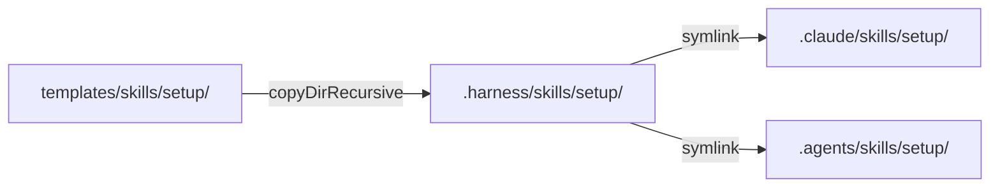

## 调查范围

基于 brainstorm.md 确认的需求，聚焦调查以下区域：

1. `templates/skills/setup/` — 待重构的 skill 模板（SKILL.md + references/tooling-matrix.md）
2. `src/lib/templates.ts` — 模板分发引擎
3. `src/commands/init.ts` — 初始化/更新命令中 skill 分发逻辑
4. `tests/` — 现有测试覆盖

## 现有架构

### 模板分发流程



- `src/lib/templates.ts:14-17` — `copyTemplateSkills()` 将整个 `templates/skills/` 目录复制到目标
- `src/lib/templates.ts:151-163` — `copyDirRecursive()` 递归复制所有子目录，`references/` 原样保留
- `src/commands/init.ts:92-132` — 两种模式：
  - **Fresh install**：调用 `copyTemplateSkills()` 一次性复制全部 skills
  - **Incremental update**：仅复制 `outdated.skills` 列表中的 skill 目录

### 当前 setup skill 文件结构

```
templates/skills/setup/
├── SKILL.md              # 主 skill 文件（165 行）
└── references/
    └── tooling-matrix.md  # 工具检测矩阵（20 行）
```

### SKILL.md 当前结构（关键段落）

| 段落 | 行号 | 内容 | 重构影响 |
|------|------|------|----------|
| metadata | 1-8 | name, description, triggers | 需更新 description |
| Overview | 10-16 | 三条路由入口 | 保留，微调描述 |
| Hard Rules | 18-28 | 5 条执行约束 | 保留不变 |
| Read First | 30-32 | 引用 tooling-matrix.md | 保留 |
| Route 0 | 36-50 | Full/Partial/Troubleshoot 路由 | 保留 |
| Collect Baseline | 58-66 | 检测命令：openspec、claude、omc | **需重写** — 去掉 claude，加入 codex/omx 检测 |
| Install: Claude Code | 70-78 | npm install claude-code | **需删除** |
| Install: openspec | 80-86 | npm install openspec | 保留，简化 |
| Install: OMC | 88-105 | npm + omc install，手动 MCP | **需重写** — 补完整配置流程 |
| Install: SuperPowers (Claude) | 107-115 | plugin marketplace | **需删除** |
| Install: SuperPowers (Codex) | 117-125 | git clone + symlink | **需删除** |
| Verify Project | 127-137 | harness 初始化检测 | **需删除** — 已有 harness 前提 |
| Platform Linking | 139-145 | .claude/skills 等 symlink | **需删除** — 由 devkeel init 负责 |
| Summary Format | 147-165 | 4 段输出格式 | 保留不变 |

### tooling-matrix.md 当前内容

| Tool | 说明 | 需保留？ |
|------|------|----------|
| `claude` | Claude Code CLI | 删除 |
| `openspec` | 知识产出 CLI | 保留 |
| `oh-my-claudecode` | Claude Code 插件 | 保留，更新安装方式 |
| `superpowers` | 流程技能插件 | 删除 |
| `harness-cli` | 项目知识框架 CLI | 删除 |
| `node` | 项目依赖 | 删除 |
| `pnpm` | 项目依赖 | 删除 |

需新增：`oh-my-codex` (OMX)。

## 关键代码路径

### 模板版本追踪

`src/lib/templates.ts` 中每个 skill 有独立版本号（在 SKILL.md metadata 的 `version` 字段）。`init.ts:96-108` 增量更新时按 `outdated.skills` 列表逐个复制。

**这意味着**：修改 setup skill 后需要 bump `version` 字段才能触发增量更新分发。

### Agent 类型检测（新增逻辑）

当前代码中 **不存在** Agent 类型检测逻辑。这是纯新增能力，需要在 SKILL.md 的 workflow 中通过 bash 命令实现：

```bash
# Claude Code 检测
claude --version 2>/dev/null && echo "agent: claude-code"

# Codex CLI 检测
codex --version 2>/dev/null && echo "agent: codex"
```

skill 是纯 Markdown 指令，不是可执行代码 — Agent 类型检测靠 skill 内的检测命令指引 AI 在运行时判断。

## 测试覆盖

### 现有测试

- `tests/templates.test.ts:18-25` — 测试 `copyTemplateSkills()` 能将 skill 复制到目标目录，但仅检查 `SKILL.md` 是否存在，**不检查** `references/` 子目录
- `tests/update.test.ts:23-52` — 测试废弃 skill 检测（增量更新场景）

### 缺失覆盖

- 无 `references/` 子目录复制的专项测试
- 无 setup skill 特定内容的验证测试
- **对本次重构影响低** — 模板分发管道不变，只修改模板内容本身

## 风险与约束

| 风险 | 影响 | 缓解 |
|------|------|------|
| OMC/OMX 安装命令变化 | 官方包名或安装方式可能更新 | skill 引用 `@latest`，不固定版本 |
| Agent 检测误判 | 双平台用户可能两者都有 | 检测逻辑加 fallback：两者都有时列出选项 |
| 增量更新需 version bump | 不 bump 版本号会导致已有项目不会收到更新 | 修改后将 version 从 1.0.0 → 2.0.0 |
| `omc setup` 交互式 | 部分配置步骤需要在 Agent 会话内执行 | skill 明确区分"终端命令"和"会话内命令" |
| OMX 依赖 tmux | macOS/Linux 推荐，Windows 不完全支持 | skill 标注平台差异 |

---
## 下一步

在新会话中粘贴以下命令：

/opsx:continue refactor-setup-skill
