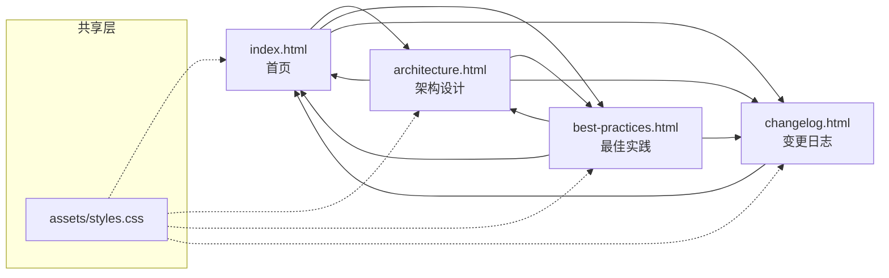
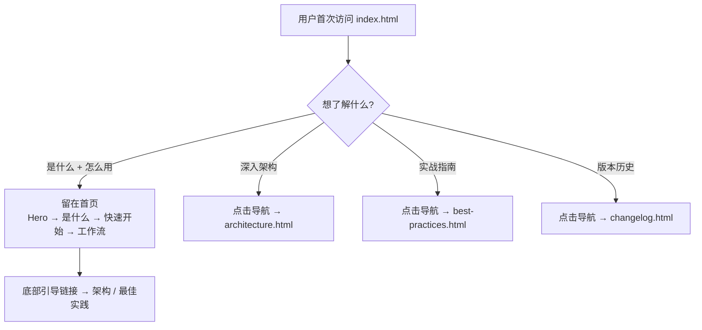

## TL;DR

将 `web/index.html` 拆分为 4 个文件：`index.html`（首页）、`architecture.html`（架构设计）、`best-practices.html`（最佳实践）、`assets/styles.css`（共享样式）。V1→V2 内容直接从首页删除（changelog 已有完整版本）。

首版交付清单：
1. `assets/styles.css` — 从 index.html 抽取公共样式
2. `index.html` — 精简为 Hero + 是什么 + 快速开始 + 工作流演示
3. `architecture.html` — 核心架构 + 路由 + CLI + 选型 + 设计原则 + 基线包 + 领域包 + 多平台
4. `best-practices.html` — 最佳实践 + 场景速查表 + Worktree 占位
5. 更新 `changelog.html` 导航栏
6. 更新 index.html 中 V1→V2 板块：直接删除

## 需求引用

- **brainstorm.md UC-1~UC-4**：首页聚焦三板块、架构迁移、最佳实践迁移、演进内容归入变更日志
- **brainstorm.md 待确认项**（已确认）：文件名 `architecture.html` / `best-practices.html`，CSS 抽取为 `styles.css`，通用基线包完全移走，导航高亮当前页

## 方案设计

### 架构概览

```
web/
├── assets/
│   ├── favicon.ico
│   └── styles.css          # [新] 共享样式
├── index.html               # [改] 精简首页
├── architecture.html        # [新] 架构设计
├── best-practices.html      # [新] 最佳实践
├── changelog.html           # [改] 导航栏更新
├── capability-inventory.html # [不动]
└── v1/                      # [不动]
```

页面关系：



### ATAM 方案对比

| 质量属性 | A: 抽取共享 styles.css | B: 保持内联 CSS（现状） | 权重 |
|----------|----------------------|------------------------|------|
| 可维护性 | **高** — 样式统一修改一处生效 | 低 — 4 个文件各改一次 | 40% |
| 一致性 | **高** — 样式必然一致 | 中 — 人工保持同步，易漂移 | 30% |
| 部署简单度 | **高** — 纯静态，无构建 | **高** — 同样纯静态 | 15% |
| 首次加载 | 中 — 多一个 CSS 请求 | **高** — 零额外请求 | 15% |

**选定方案：A（抽取共享 styles.css）**

理由：用户已确认此方向。4 个页面共享大量相同的 CSS 变量、导航、布局、卡片样式，维护一致性是核心诉求。首次加载多一个 CSS 请求对纯文档站几乎无影响。

### 关键时序

本次变更无运行时交互流程。核心"时序"是**用户浏览路径**：



### 模块设计

#### 1. assets/styles.css

从 index.html 抽取以下共享样式，按逻辑分组：

```
/* === Reset & Base === */
:root 变量定义, *, html, body, ::selection, a, code

/* === Layout === */
section, .container, .section-alt, .tag, .stitle, .sdesc

/* === Navigation === */
nav, .nav-inner, .nav-logo, .nav-mark, .nav-links
.nav-links a.active  ← [新增] 当前页高亮

/* === Buttons === */
.btn, .btn-p, .btn-g

/* === Cards === */
.what-grid, .what-card, .what-icon
.pillar*, .princ-list, .princ

/* === Tables === */
table, th, td, tr

/* === Code Window === */
.code-window, .code-titlebar, .code-dot, .code-body 及颜色 class

/* === Responsive === */
@media 1024px, 768px, 480px

/* === Footer === */
footer
```

以下样式**仅在特定页面使用**，保留为页面内联 `<style>`：

| 页面 | 页面专属样式 |
|------|------------|
| index.html | `.hero-*`, `.wf-*`（工作流 tab/timeline） |
| architecture.html | `.tree-*`, `.route-*`, `.mono-*`, `.cli-*`, `.dp-*`, `.plat-*` |
| best-practices.html | 无额外（复用 `.pillar*` + `table`） |

#### 2. 导航栏设计

统一导航结构，所有页面共享：

```html
<nav>
  <div class="nav-inner">
    <a href="./index.html" class="nav-logo">...</a>
    <div class="nav-links">
      <a href="./index.html" class="active">首页</a>
      <a href="./architecture.html">架构设计</a>
      <a href="./best-practices.html">最佳实践</a>
      <a href="./changelog.html">变更日志</a>
    </div>
  </div>
</nav>
```

高亮实现：`class="active"` 静态标记在对应页面的链接上。

CSS 新增：
```css
.nav-links a.active { color: var(--accent); }
```

#### 3. 各页面内容编排

**index.html**（首页）：
```
Nav → Hero → 是什么(#what) → 快速开始(#quickstart) → 工作流演示(#workflow) → Version Banner → Footer
```

调整：
- 快速开始移到工作流前面（先安装，再看流程）
- Footer 增加指向架构设计和最佳实践的引导链接

**architecture.html**（架构设计）：
```
Nav → Hero(简) → 核心架构(#core) → 路由机制(#routing) → 设计原则(#principles) → 
通用基线包(#baseline) → 领域包(#domain) → 多平台(#platform) → CLI(#cli) → 选型说明(#rationale) → Footer
```

**best-practices.html**（最佳实践）：
```
Nav → Hero(简) → 最佳实践(#practices) → 场景速查表(#scenarios) → Worktree + Setup(#worktree, 占位) → Footer
```

### 数据设计

本次不涉及 — 纯静态 HTML 文档，无数据存储。

## 质量设计

### SLO 指标

本次不涉及 — 纯静态文档站，无后端服务，无运行时性能指标。以下列出替代性的文档质量指标：

| 指标 | 目标值 | 验证方式 |
|------|--------|---------|
| 页面可访问 | 4 个 HTML 文件均可在浏览器直接打开 | 手动打开验证 |
| 导航互通 | 任意页面可通过导航到达其他 3 个页面 | 逐页点击验证 |
| 响应式布局 | 1024px / 768px / 480px 三个断点均正常显示 | 浏览器 DevTools 验证 |
| 内容完整性 | index.html 删除的内容 100% 出现在对应目标文档 | 对比原文检查 |

### 安全（STRIDE 简表）

本次不涉及 — 纯静态 HTML 文档，通过 `file://` 或静态托管访问，无用户输入、无后端、无认证、无数据存储。6 类威胁均不适用。

### 旁路隔离

本次不涉及 — 无运行时服务，无旁路/观测系统。

## 决策追溯

| 决策 | 追溯到 |
|------|--------|
| 抽取 `assets/styles.css` | brainstorm 待确认项 #3（用户确认） |
| 文件名 `architecture.html` / `best-practices.html` | brainstorm 待确认项 #1/#2（用户确认） |
| 导航高亮当前页 | brainstorm 待确认项 #5（用户确认） |
| 通用基线包完全移走 | brainstorm 待确认项 #4（用户确认） |
| V1→V2 从首页删除而非迁移 | explore.md 风险分析：changelog 已有完整版本，内容重复 |
| 首页顺序 Hero→是什么→快速开始→工作流 | brainstorm UC-1 + explore.md 风险"首页内容顺序调整" |
| changelog.html 的 CSS 也改为引用 styles.css | 一致性决策：既然抽取，4 个页面统一 |

## 风险与未决

| 风险 | 缓解 |
|------|------|
| styles.css 抽取后遗漏样式 | 逐页手动验证，对照 explore.md 中的 CSS class 依赖表 |
| changelog.html 改为引用外部 CSS 后布局异常 | changelog 有少量专属样式（`.migration*`, `.version-*` 等），保留为页面内联 `<style>` |
| capability-inventory.html 未纳入导航 | 暂不处理，该页面无导航栏，保持现状 |

---
## 下一步

在新会话中粘贴以下命令：

/opsx:continue refactor-web-docs
