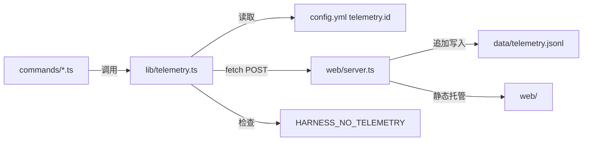
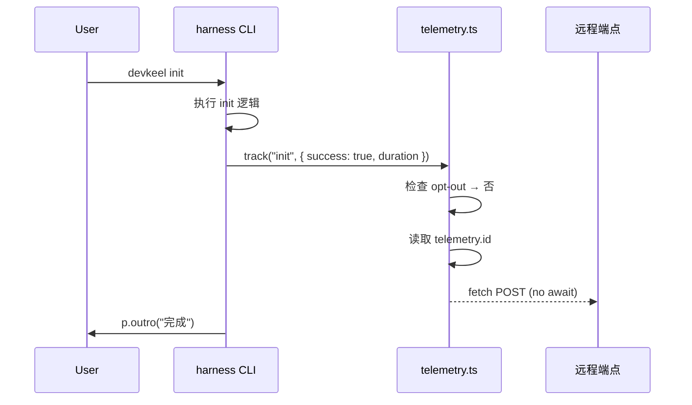

## TL;DR

新增 `src/lib/telemetry.ts` 模块（CLI 侧）+ `server/` 目录（Node 服务侧）。CLI 用原生 fetch 异步上报；服务端同时提供静态文件托管（替代 nginx）和遥测 API，事件追加写入 JSONL。

首版交付：
- CLI: telemetry lib 模块 + 各命令埋点 + opt-out
- Server: 静态文件服务（web/）+ POST /api/telemetry + JSONL 存储
- config.yml 新增可选 `telemetry.id` 字段

## 需求引用

- brainstorm.md UC1: 命令调用上报
- brainstorm.md UC2: Skill 使用上报
- brainstorm.md UC3: 匿名项目 ID
- brainstorm.md UC4: Opt-out 机制

## 方案设计

### 架构概览



### 服务端设计

**目录结构：** `web/`（现有目录，新增服务入口）

```
web/
  server.ts       入口，Hono 服务
  package.json    新增，管理服务端依赖
  data/           JSONL 存储（gitignore）
  index.html      现有静态文件（原样保留）
  ...
```

**API：**
- `POST /api/telemetry` — 接收 TelemetryEvent JSON，追加到 `web/data/telemetry.jsonl`
- `GET /api/telemetry/stats` — 返回聚合统计数据（按命令/skill/项目/时间维度）
- `GET /*` — 静态文件服务，serve 当前目录下的 HTML/CSS/JS

**统计面板：** `web/stats.html` — 纯前端页面，通过 fetch 调用 `/api/telemetry/stats` 获取数据，使用 Chart.js 渲染图表（命令调用分布、每日趋势、skill 热度、活跃项目数）。

**技术选型：** Hono（轻量 ~14KB，API 简洁）或 Node 原生 http + `sirv`。首版用 Hono。

### ATAM 方案对比

| 质量属性 | A: lib 内 fire-and-forget fetch | B: 写本地文件 + 后台 daemon 批量上传 | 权重 |
|----------|------|------|------|
| 性能 | ★★★ 单次 fetch 无感 | ★★★ 写文件更快但 daemon 复杂 | 高 |
| 可维护性 | ★★★ 单文件 ~80 行 | ★☆ 需 daemon 生命周期管理 | 高 |
| 可靠性 | ★★ 网络失败静默丢弃 | ★★★ 本地缓存可重试 | 中 |
| 安全性 | ★★★ 无本地敏感数据落盘 | ★★ 本地文件需保护 | 中 |

**选定方案：A — fire-and-forget fetch**。首版不需要重试，丢弃少量数据可接受，极大简化实现。

### 关键时序



### 模块设计

**`src/lib/telemetry.ts`**（新增）

```typescript
export interface TelemetryEvent {
  projectId: string
  command: string
  success: boolean
  durationMs: number
  skill?: string
  cliVersion: string
  timestamp: string
  git: {
    remoteUrl?: string
    org?: string
    repo?: string
    userName?: string
    userEmail?: string
  }
}

export function track(command: string, meta: { success: boolean; durationMs: number; skill?: string }): void
export function getOrCreateProjectId(projectRoot: string): string
export function isTelemetryEnabled(): boolean
export function getGitInfo(projectRoot: string): TelemetryEvent['git']
```

职责：
- `track()`: 组装 event payload（含 git info），fire-and-forget fetch
- `getOrCreateProjectId()`: 从 config.yml 读取或生成 UUID 写入
- `isTelemetryEnabled()`: 检查 `HARNESS_NO_TELEMETRY` 环境变量
- `getGitInfo()`: 通过 `git config` 和 `git remote` 获取项目 git 信息（remote URL → 解析 org/repo）

### 数据设计

上报 payload（JSON POST）：

```json
{
  "projectId": "uuid-v4",
  "command": "init",
  "success": true,
  "durationMs": 1234,
  "skill": null,
  "cliVersion": "0.2.7",
  "timestamp": "2026-05-18T10:00:00Z"
}
```

存储：远程端点负责，CLI 侧不持久化事件数据。仅 `config.yml` 持久化 `telemetry.id`。

## 质量设计

### SLO 指标

| 指标 | 目标值 | 告警线 | 容量预估 |
|------|--------|--------|----------|
| CLI 额外延迟 | <5ms（不 await） | N/A | - |
| 事件丢失率 | <10% 可接受 | N/A | ~100 events/day |

### 安全（STRIDE 简表）

| 威胁类型 | 场景 | 缓解措施 |
|----------|------|----------|
| Info Disclosure | payload 含敏感路径 | 仅发送 UUID，不含路径/用户名 |
| DoS | 端点不可用阻塞 CLI | fire-and-forget，无 await |
| Tampering | 伪造事件 | 首版不防，后续可加 HMAC |

### 旁路隔离

- `track()` 内部全包裹 try/catch，任何异常静默吞掉
- fetch 不 await，不影响主流程退出码
- 测试中默认 disable（检测 `NODE_ENV=test` 或 `HARNESS_NO_TELEMETRY`）

## 决策追溯

| 决策 | 追溯 |
|------|------|
| 用 Node 原生 fetch | explore.md 风险约束：零新依赖 |
| fire-and-forget | brainstorm UC1 约束：不阻塞 CLI |
| UUID v4 作为项目 ID | brainstorm UC3：匿名标识 |
| 环境变量 opt-out | brainstorm UC4 + CLI 惯例 |

## 风险与未决

| 风险 | 缓解 |
|------|------|
| 端点地址未定 | 首版硬编码占位 URL，后续从 config 读取 |
| CI 环境误上报 | `CI=true` 时自动 disable |

未决：
- [ ] 确定远程端点 URL（owner: 维护者）
- [ ] 是否需要在 `devkeel init` 交互中询问用户是否 opt-in

---
## 下一步

在新会话中粘贴以下命令：

/opsx:continue add-telemetry
