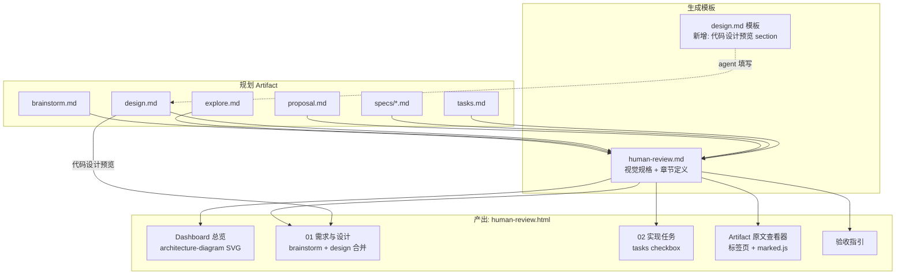
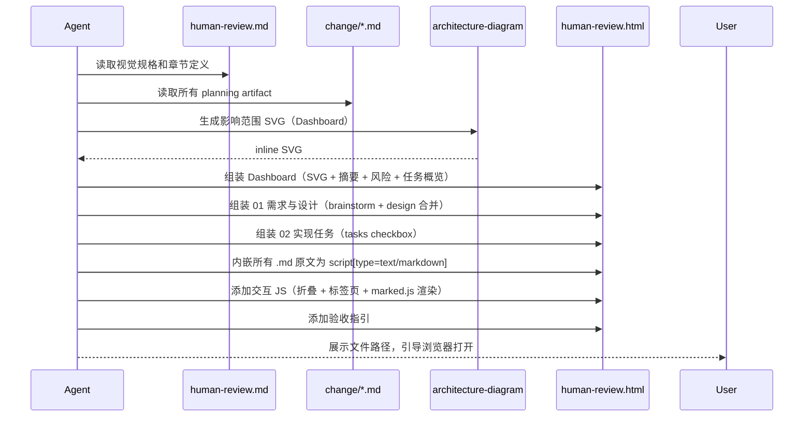

## TL;DR

重构 human-review.html 生成模板：从 6 章全量文档改为 Dashboard + 2 章精简评审页面 + Artifact 原文查看器。涉及 3 个文件变更：human-review.md 模板重写、design.md 模板新增代码设计 section、schema.yaml 版本升级至 v5。

交付清单：
1. `templates/openspec/schemas/superpowers-bridge/templates/human-review.md` — 重写
2. `templates/openspec/schemas/superpowers-bridge/templates/design.md` — 新增 section
3. `templates/openspec/schemas/superpowers-bridge/schema.yaml` — instruction 更新 + version 5
4. `openspec/schemas/superpowers-bridge/` — 同步项目内副本

## 需求引用

- brainstorm UC-1：Dashboard 总览（architecture-diagram SVG + 摘要 + 风险 + 任务概览）
- brainstorm UC-2：代码设计预览（签名 + 伪代码 + Diff）
- brainstorm UC-3：章节折叠/展开（localStorage 记忆）
- brainstorm UC-4：Diff 高亮对比
- brainstorm UC-5：Artifact 原文查看器（内嵌 `<script type="text/markdown">` + marked.js）
- brainstorm 新章节结构：Dashboard → 需求与设计 → 实现任务 → Artifact 原文 → 验收指引

## 方案设计

### 架构概览



### ATAM 方案对比

| 质量属性 | A: 模板重写（选定） | B: 模板参数化（章节开关） | 权重 |
|----------|---------------------|---------------------------|------|
| 可维护性 | 高 — 模板结构清晰，一处定义 | 中 — 条件逻辑增加复杂度 | 35% |
| 评审体验 | 高 — Dashboard 首屏聚焦，交互丰富 | 中 — 仍是线性文档，只是可隐藏 | 35% |
| 向后兼容 | 高 — 已归档 change 不受影响 | 高 — 同 | 15% |
| 实现成本 | 中 — 需重写模板 + 更新 instruction | 低 — 只加开关 | 15% |

**选定方案 A** — 模板重写。方案 B 的章节开关只解决「可隐藏」问题，不解决信息过载和缺少代码设计预览的核心痛点。

### 关键时序



### 模块设计

本次变更不涉及 TypeScript 代码，全部是模板文件（.md + .yaml）。「模块」对应模板文件中的逻辑分区：

#### human-review.md 模板新结构

| 分区 | 职责 | 变更类型 |
|------|------|----------|
| CDN 依赖 | highlight.js + mermaid + **marked.js（新增）** | 修改 |
| 视觉风格 | Slate Indigo 设计令牌（保留） | 不变 |
| 组件样式 | 保留现有 + **新增折叠/Diff/标签页/Dashboard 样式** | 修改 |
| 输出内容 | **从 6 章改为 Dashboard + 2 章 + Artifact 查看器** | 重写 |
| 架构图渲染 | 保留 architecture-diagram skill 指引 | 不变 |
| 交互 JS | **新增折叠/展开 + 标签页切换 + marked.js 按需渲染** | 新增 |

#### design.md 模板新增 section

在「模块设计」和「数据设计」之间插入：

```markdown
### 代码设计预览

#### 关键接口与类型

<!-- 新增/修改的 interface、type、函数签名 -->

#### 核心实现伪代码

<!-- 关键函数的伪代码逻辑，评审者据此判断实现方案 -->

#### 变更前后对比

<!-- 用 diff 代码块展示关键变更 -->
```

### 数据设计

本次不涉及数据模型变更。HTML 中内嵌的 .md 原文以 `<script type="text/markdown" data-artifact="xxx">` 存储，是纯文本，无结构化数据。

### 代码设计预览

> 本 section 即是 design.md 模板新增能力的自我示范。

#### 关键接口与类型

本次无 TypeScript 接口变更。变更对象是 3 个模板文件。

#### 核心实现伪代码

**human-review.md 新章节结构（伪模板）：**

```
HTML 结构:
  <header>  — Pending Review 徽章 + 标题 + 摘要 + 进度条
  <dashboard>
    <影响范围 SVG>  — architecture-diagram skill 生成
    <摘要卡片>      — TL;DR + 标签（feat/refactor/fix）
    <风险信号>      — 破坏性？跨模块？新依赖？
    <任务概览>      — N/M 完成 + 按组折叠
  </dashboard>
  <section 01="需求与设计" collapsible default-open>
    <需求背景>      ← brainstorm.md TL;DR + 目标用户 + 边界
    <技术设计>      ← design.md 架构图 + ATAM + 关键决策
    <代码设计预览>  ← design.md 新 section（签名 + 伪代码 + Diff）
  </section>
  <section 02="实现任务" collapsible default-open>
    <任务 checkbox>  ← tasks.md
  </section>
  <artifact-viewer>
    <tab-bar>  — brainstorm | explore | design | proposal | specs | tasks
    <tab-panel> — marked.js 按需渲染 script[type=text/markdown] 内容
  </artifact-viewer>
  <acceptance>  — 验收指引 + /opsx:apply 命令
```

**交互 JS 伪代码：**

```javascript
// 折叠/展开
document.querySelectorAll('.section-head').forEach(head => {
  head.addEventListener('click', () => {
    const section = head.parentElement
    section.classList.toggle('collapsed')
    localStorage.setItem(section.id, section.classList.contains('collapsed'))
  })
  // 恢复状态
  const saved = localStorage.getItem(head.parentElement.id)
  if (saved === 'true') head.parentElement.classList.add('collapsed')
})

// Artifact 标签页
function switchArtifactTab(name) {
  // 隐藏所有 panel
  // 显示选中 panel
  // 若 panel 未渲染，用 marked.parse() 渲染 script[data-artifact=name] 内容
}
```

#### 变更前后对比

**human-review.md 输出内容 section：**

```diff
- | # | 章节 | 来源文件 | 提取内容 |
- |---|------|----------|----------|
- | 01 | 需求背景 | brainstorm.md | TL;DR + 核心需求 + 目标用户 + 边界 |
- | 02 | 现状调查 | explore.md | 架构 + 代码路径 + 测试 + 风险 |
- | 03 | 技术设计 | design.md | 架构图 + 决策 + SLO |
- | 04 | 变更提案 | proposal.md | Why + What + Capabilities + Impact |
- | 05 | 规格清单 | specs/*.md | Requirement 卡片 + Scenario |
- | 06 | 实现任务 | tasks.md | 任务 checkbox |
+ | # | 章节 | 来源文件 | 提取内容 |
+ |---|------|----------|----------|
+ | — | Dashboard | 所有 artifact | SVG 影响图 + 摘要 + 风险 + 任务概览 |
+ | 01 | 需求与设计 | brainstorm + design | TL;DR + 用户 + 架构图 + 决策 + 代码设计 |
+ | 02 | 实现任务 | tasks.md | 任务 checkbox |
+ | — | Artifact 原文 | 所有 .md | 标签页切换，marked.js 按需渲染 |
+ | — | 验收指引 | — | /opsx:apply 命令 |
```

**schema.yaml 版本：**

```diff
- version: 4
+ version: 5
```

## 质量设计

### SLO 指标

本次不涉及 — 变更对象是模板文件（AI agent 指引文档），无运行时指标。

### 安全（STRIDE 简表）

本次不涉及 — 模板文件不处理用户输入、不存储数据、不暴露网络接口。human-review.html 是本地打开的静态文件。

### 旁路隔离

本次不涉及 — 无旁路/观测系统。

## 决策追溯

| 决策 | 追溯到 |
|------|--------|
| 去掉现状调查、变更提案、规格清单独立章节 | brainstorm 用户确认：完全去掉 |
| Artifact 原文用 `<script type="text/markdown">` 内嵌 | brainstorm UC-5 + 讨论：iframe 不可行（file:// 安全策略），方案 A 胜出 |
| Dashboard 用 architecture-diagram SVG | brainstorm UC-1 + 用户要求「一图胜千言」 |
| design.md 新增代码设计预览 section | brainstorm UC-2 + 用户反馈「没办法判断 AI 准备实施的代码是否满足要求」 |
| schema.yaml 版本升至 v5 | 用户明确要求 |
| marked.js CDN 引入 | explore R1：与现有 CDN 同源（jsdmirror），风险一致 |
| 折叠/展开用 localStorage | brainstorm UC-3 |

## 风险与未决

| 风险 | 严重程度 | 缓解 |
|------|----------|------|
| architecture-diagram skill 不可用 | 中 | human-review.md 指引中说明降级方案：用 Mermaid 图替代 |
| marked.js CDN 加载失败 | 低 | Artifact 查看器降级显示原始 markdown 文本 |
| HTML 体积膨胀 | 低 | 预估 ~50-60KB，仍在合理范围；.md 原文高度可压缩 |
| 双份模板忘记同步 | 低 | tasks 中明确列出同步步骤；可在后续考虑自动化 |

---

## 下一步

在新会话中粘贴以下命令：

/opsx:continue refactor-human-review-html
