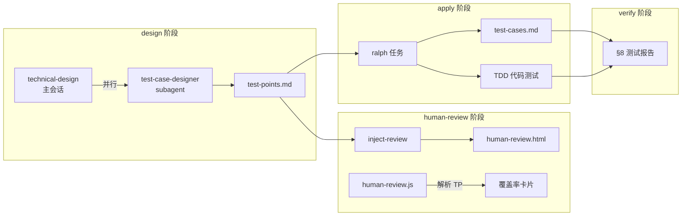
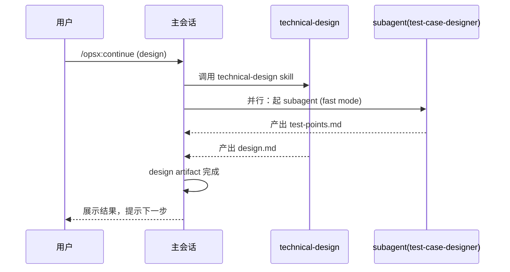

## TL;DR

在 superpowers-bridge schema 中集成测试设计能力：design 阶段 subagent 并行产出 test-points.md，human-review 渲染覆盖率卡片，apply 阶段落地完整测试用例，verify 新增 §8 测试报告。同时将 test-case-designer 和 generate-test-cases 合并为一个双模式 skill。

首版交付清单：
1. schema.yaml design instruction 增加 subagent 调用
2. verify.md 模板增加 §8
3. human-review.md 模板增加测试覆盖区域
4. human-review.js 增加 test-points 解析
5. test-case-designer SKILL.md 重写（合并双模式）
6. generate-test-cases 标记 deprecated

## 方案设计

### 架构概览



### 模块设计

#### M1: schema design instruction 改造

在现有 design instruction 末尾追加一段 subagent 调用逻辑：

```markdown
## 测试设计（并行）

在 technical-design 完成或启动后，起 subagent 并行产出测试点：

1. 确认 `test-case-designer` skill 可用
2. 以快速模式（--mode fast）调用，输入：brainstorm.md + explore.md
3. 产出写入本 change 的 `test-points.md`
4. 若 explore.md 后续有更新，追加补充到 test-points.md

subagent 不阻塞 design 主流程。若 skill 不可用，跳过并在
human-review 中标注"测试点未产出"。
```

#### M2: test-case-designer skill 重写

```yaml
---
name: test-case-designer
description: 测试用例设计师 — 支持完整模式（三阶段门禁）和快速模式（一次性产出）
metadata:
  author: "devkeel"
  version: "2.0.0"
triggers: ["测试设计", "测试用例", "test case", "test design"]
---
```

核心结构：

| 章节 | 内容 |
|------|------|
| 参数 | `mode`（full/fast）、`platform`（frontend/backend/all） |
| 共享层 | 输入源分析、覆盖模型、追溯体系 |
| Mode A: full | 三阶段门禁（原 test-case-designer 流程） |
| Mode B: fast | 一次性产出（原 generate-test-cases 流程） |
| Agent 接口 | subagent 调用时默认 fast 模式 |
| references/ | output-contract.md、source-analysis.md（保留并扩展） |

**合并策略**：

| 能力来源 | 归入位置 |
|---------|---------|
| test-case-designer 三阶段门禁 | Mode A |
| test-case-designer 黑盒+白盒联合 | 共享层 Hard Rules |
| test-case-designer TP 追溯体系 | 共享层 |
| test-case-designer 四视角检查 | 共享层覆盖模型 |
| generate-test-cases platform 参数 | 共享层参数 |
| generate-test-cases OpenSpec spec 映射 | 共享层输入源 |
| generate-test-cases 操作步骤/预期结果规范 | 共享层（Mode B 默认，Mode A 的 03 阶段也采用） |
| generate-test-cases 隐性场景识别 | 共享层覆盖模型 |
| generate-test-cases 自检 checklist | Mode B 自动执行 |

**产出路径**：

| 调用场景 | 产出路径 |
|---------|---------|
| schema 流程内 | `openspec/changes/<name>/test-points.md`、`test-cases.md` |
| 独立调用（full 模式） | `docs/test/<module>/` （保持向后兼容） |

#### M2.5: tasks 阶段的两阶段编排约束

apply 阶段的 tasks.md 必须按 Phase 分组，确保 test-cases.md 先于功能实现产出：

```markdown
## Phase 1: 测试用例落地

- [ ] 基于 test-points.md 和 specs 产出 test-cases.md
  - 读取所有 TP 编号
  - 按 platform 参数展开完整测试用例
  - 标记每条 TC 的 `自动化候选` 字段

## Phase 2: 功能实现（依赖 Phase 1）

- [ ] 实现 feature-X
  - RED: 从 test-cases.md 中 TC-001~TC-003（自动化候选=是）提取断言
  - GREEN: 最小实现
  - REFACTOR: 清理
```

编排规则（写入 schema tasks instruction）：
1. Phase 1 必须在 Phase 2 之前全部完成
2. Phase 2 每个任务的 RED 步骤必须引用具体 TC 编号
3. ralph 不得并行执行跨 Phase 的任务

这样 TDD 的断言来源从"开发者凭理解写"变为"从 test-cases.md 的 TC 中提取"，形成 TP → TC → 自动化测试 → verify §8 的完整闭环。

#### M3: verify.md §8 测试报告

```markdown
## 8. 测试报告

- [ ] test-points.md 中所有 TP 均有对应实现验证（自动化测试或手动确认）

**TP 覆盖映射**：

| TP 编号 | 自动化测试 | 覆盖状态 |
|---------|-----------|---------|
| TP-xxx  | test-file:test-name | ✅ 通过 / ❌ 失败 / ⏭ 手动 |

**测试执行摘要**：

| 指标 | 值 |
|------|---|
| 自动化测试通过率 | X/Y (Z%) |
| TP 覆盖率 | A/B (C%) |
| 覆盖缺口 | 列出未覆盖 TP |

**缺口分析**（若有）：
未覆盖的 TP 是否阻塞归档？是否有等价的手动验证？
```

#### M4: human-review.md 模板改造

在输出结构表中，§01 和 §02 之间插入测试覆盖区域：

| 区域 | 编号 | 来源 | 内容 |
|------|------|------|------|
| 需求与设计 | 01 | brainstorm.md + design.md | 需求摘要 + 设计方案 |
| **测试覆盖** | **02** | **test-points.md** | **覆盖率卡片 + 测试点摘要** |
| 实现任务 | 03 | tasks.md | 任务 checkbox |
| 待确认项 | 04 | brainstorm.md + design.md | TBD 汇总 |
| Artifact 原文 | 05 | — | 标签页查看器 |

#### M5: human-review.js 增加解析逻辑

新增函数 `buildTestCoverageCard()`：

```javascript
function buildTestCoverageCard() {
  var script = document.querySelector('script[data-artifact="test-points"]');
  if (!script) return;
  var md = script.textContent;
  
  // 统计 TP 编号数量
  var tpCount = (md.match(/^####\s+TP-/gm) || []).length;
  
  // 统计覆盖状态
  var covered = (md.match(/已覆盖/g) || []).length;
  var uncovered = (md.match(/未覆盖/g) || []).length;
  var pending = (md.match(/待确认/g) || []).length;
  
  // 渲染到 Dashboard 卡片
  var card = document.querySelector('[data-card="test-coverage"]');
  if (!card) return;
  card.innerHTML = '<h3>测试覆盖</h3>'
    + '<p><strong>' + tpCount + '</strong> 测试点</p>'
    + '<p>已覆盖: ' + covered + ' | 未覆盖: ' + uncovered + ' | 待确认: ' + pending + '</p>';
}
```

在 `DOMContentLoaded` 回调中调用。

### 关键时序



## 风险与未决

| 风险 | 缓解 |
|------|------|
| subagent 可能在 technical-design 完成前未结束 | design instruction 注明"不阻塞"，test-points.md 可后续补充 |
| 快速模式产出质量不如完整模式 | human-review 门禁兜底；快速模式仍执行自检 checklist |
| human-review.js 正则解析 TP 格式变化 | 只匹配 `#### TP-` 前缀，格式稳定 |

---

## M6: 领域自适应测试维度矩阵

### 动机

当前 `platform` 参数局限于 `frontend/backend/all`，无法覆盖桌面端、移动端、CLI、嵌入式等领域。借鉴 domain-init skill 的"自动检测 + 矩阵查表"模式，将测试维度选择从硬编码枚举改为领域自适应。

### 核心设计

```
需求输入（spec/brainstorm/design）
    ↓ 是测试用例的唯一来源
领域矩阵（testing-dimension-matrix.md）
    ↓ 决定"用哪些视角去审视这些需求"
测试点/测试用例
    ↓ 每条都必须回链到需求
```

关键约束：矩阵中的维度不是"无条件扫描"，而是"当需求涉及该维度时，用这个视角深入展开"。未被需求触及的维度即使标 `●` 也不会产出测试点。

### 参数变更

| 原参数 | 新参数 | 说明 |
|--------|--------|------|
| `platform` (frontend/backend/all) | `domain` (auto/前端/后端/移动端/桌面/CLI/库/系统/DevOps) | 默认 `auto`，自动检测项目领域 |

- `auto` 模式：扫描项目信号（package.json、Cargo.toml 等），匹配领域类型
- 多领域叠加：一个项目可命中多个领域（如 Electron = 前端 + 桌面），取并集
- 向后兼容：`frontend`/`backend`/`all` 仍可作为 domain 值使用

### 矩阵结构

分两层：

1. **基础维度 T1-T5**：所有领域均启用（功能正确性、输入验证、异常容错、权限安全、数据一致性）
2. **领域专项维度 T6-T25**：按矩阵表 `●/○/—` 标记启用规则

`●` = 需求触及时默认展开，`○` = 需求显式提及时才展开，`—` = 不适用。

### 使用规则

1. 自动检测优先，用户可显式覆盖
2. 多领域取并集
3. `●` 维度 + 需求触及 → 自动展开测试点
4. `○` 维度 + 需求/spec 显式提及 → 展开
5. `—` 维度 → 跳过
6. custom 领域：所有专项维度按 `○` 处理

### 产出文件

`templates/skills/test-case-designer/references/testing-dimension-matrix.md`

---

## 下一步

/opsx:continue integrate-test-design-into-schema
