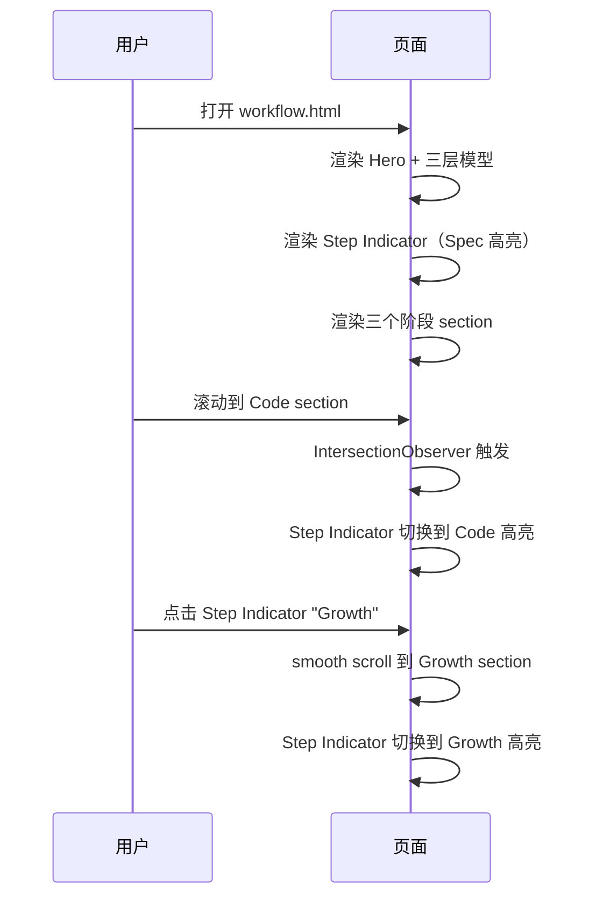

## TL;DR

新建 `web/workflow.html` 纯静态页面，采用三段式结构（理念开场 → 三阶段 Step Indicator → 子步骤明细卡片），复用现有 dark theme 样式体系，嵌入 `add-telemetry` 真实案例片段。同步精简 index.html 工作流 section 并更新所有页面导航栏。

## 方案设计

### 架构概览

```
workflow.html
├── <head> — 共享字体 + styles.css + 页面内联样式
├── <nav>  — 复用统一导航栏（新增"工作流"链接）
├── Section: Hero / 问题驱动开场
│   ├── 痛点三连（跳过 spec / 无门禁 / 无沉淀）
│   └── 引出核心观点 + 三层模型图（openspec / SuperPowers / OMC）
├── Section: Step Indicator（粘性定位）
│   └── ① Spec ──→ ② Code ──→ ③ Growth（点击跳转 + 滚动高亮）
├── Section: Spec（4 子步骤卡片 + 案例片段）
├── Section: Code（4 子步骤卡片）
├── Section: Growth（3 子步骤卡片 + 案例片段）
└── <footer> — 复用统一页脚
```

### 模块设计

#### 1. 三层模型可视化

用三列卡片展示 openspec / SuperPowers / OMC 的角色分工，复用 `.pillar` 样式：

| 卡片 | 色彩 | 标题 | 副标题 |
|------|------|------|--------|
| openspec | `--purple` | 流程编排器 | 定义阶段 · 管理依赖 · 驱动流转 · 归档沉淀 |
| SuperPowers | `--accent` | 方法论工具库 | 需求分析 · TDD · worktree · 代码审查 · 归档复盘 |
| OMC / OMX | `--cyan` | 运行时编排引擎 | 自动选择引擎 · 调度 skill · 多 agent 协调 |

#### 2. Step Indicator

- 横向条，三个圆形节点 + 连接线
- 使用 `position: sticky; top: 56px`（导航栏下方）
- 当前阶段高亮（`--accent` 色），未到达阶段灰色
- 点击跳转到对应 section
- 滚动时用 `IntersectionObserver` 监听 section 可见性切换高亮

```
  ●───────────●───────────●
 Spec        Code       Growth
```

#### 3. 子步骤卡片

每个阶段的子步骤用纵向时间线布局（复用 `.wf-step` 样式模式）：

```html
<div class="phase-step">
  <div class="phase-step-head">
    <span class="phase-num">1</span>
    <h4>提问发散</h4>
    <span class="phase-badge">brainstorm.md</span>
  </div>
  <p>描述文字...</p>
  <div class="phase-example">
    <!-- 案例片段，用 code-window 样式 -->
  </div>
</div>
```

#### 4. 案例片段嵌入

从 `add-telemetry` 归档 change 中精简摘抄关键内容，以 `.code-window` 样式展示：

| 阶段 | 子步骤 | 展示内容 |
|------|--------|---------|
| Spec | 提问发散 | brainstorm.md 的 TL;DR + 核心用例摘要 |
| Spec | 探索与设计 | design.md 的架构概览或关键决策 |
| Spec | 方案定稿 | tasks.md 的任务清单片段 |
| Spec | 人工评审 | human-review.html 截图或链接说明 |
| Growth | 验证交付 | verify.md 的验证清单 |
| Growth | 知识回顾 | retrospective.md 的经验总结 |

Code 阶段无案例片段（运行时行为，用描述 + 示意图表达）。

#### 5. index.html 改造

工作流 section 精简为：

```html
<section id="workflow" class="section-alt">
  <div class="container">
    <div class="tag">工作流</div>
    <h2 class="stitle">从需求到交付，完整闭环</h2>
    <p class="sdesc">
      每次与 Agent 的会话都经历 Spec → Code → Growth 三个阶段。
      OpenSpec 编排流程，SuperPowers 提供方法论，OMC 负责运行时执行。
    </p>
    <a href="./workflow.html" class="btn btn-p">了解完整工作流</a>
  </div>
</section>
```

移除所有 `.wf-tab`, `.wf-panel`, `.wf-timeline` 内容及对应内联 CSS 和 JS。

#### 6. 导航栏更新

所有页面的 `.nav-links` 统一新增：

```html
<a href="./workflow.html">工作流</a>
```

插入位置：在"首页"和"架构设计"之间。受影响文件：
- `web/index.html`
- `web/architecture.html`
- `web/best-practices.html`
- `web/changelog.html`
- `web/stats.html`
- `web/workflow.html`（自身）

### 关键交互时序



## 风险与未决

| 风险 | 缓解 |
|------|------|
| 导航栏需改 6 个 HTML 文件 | 改动机械化，逐个更新即可 |
| index.html 移除工作流内容后页面较空 | 精简后的概述 + CTA 按钮保持节奏，不影响整体信息密度 |
| Step Indicator sticky 与导航栏叠加 | 设置 `top: 56px`（导航栏高度），z-index 低于导航 |

---
## 下一步

在新会话中粘贴以下命令：

/opsx:continue workflow-decomposition-page
