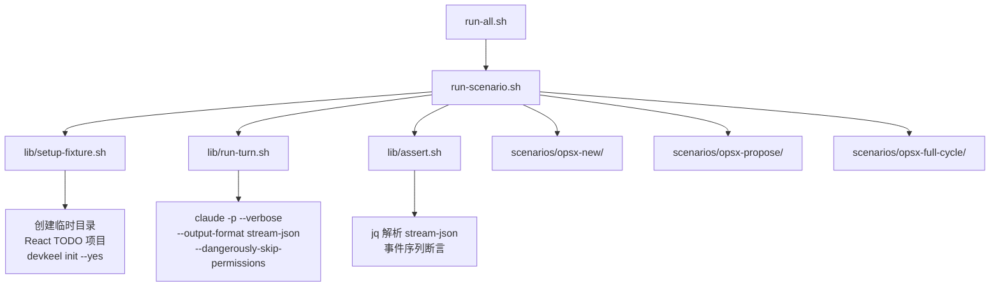
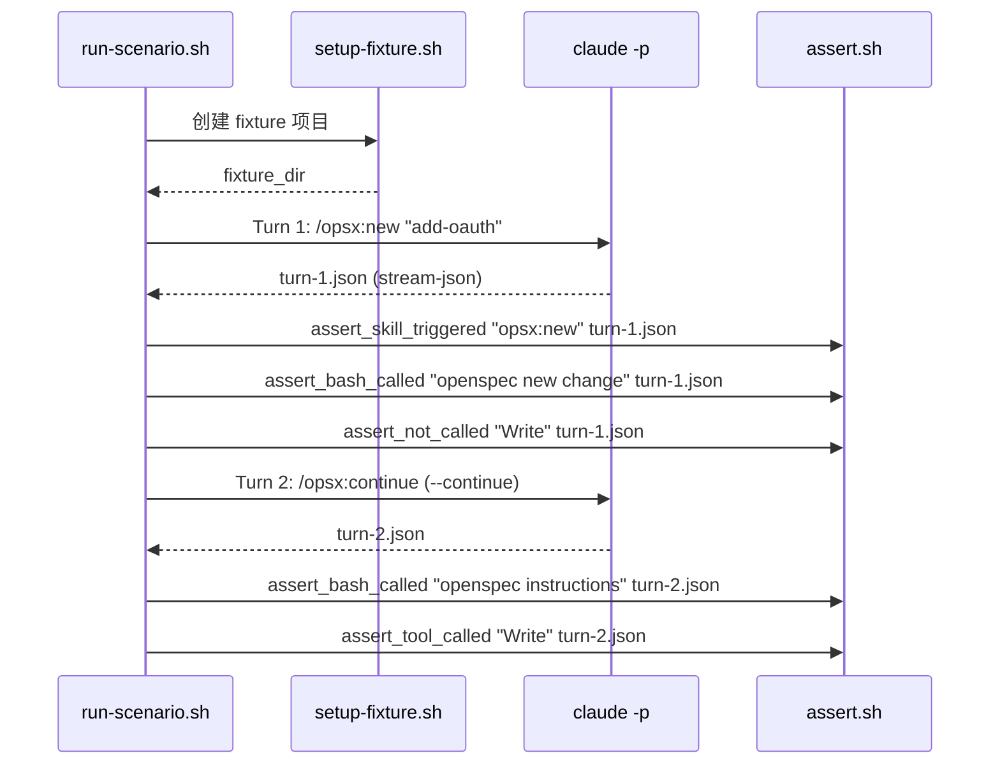

## TL;DR

纯 shell 集成测试框架，通过 `claude -p --continue` 多轮执行 opsx 工作流，用 jq 从 stream-json 提取工具调用事件做有序/无序断言。首版交付：assert 库 + 3 个场景（opsx:new / opsx:propose / full-cycle）。

## 方案设计

### 架构概览



### 模块设计

| 模块 | 职责 |
|------|------|
| `lib/setup-fixture.sh` | 创建临时 React TODO 项目 + `devkeel init --yes` |
| `lib/run-turn.sh` | 封装 `claude -p` 调用，输出 stream-json 到指定文件 |
| `lib/assert.sh` | 断言原语：`assert_bash_called`、`assert_skill_triggered`、`assert_sequence`、`assert_not_called`、`assert_file_exists` |
| `lib/extract.sh` | 从 stream-json 提取工具调用事件（tool name + input） |
| `scenarios/<name>/scenario.sh` | 多轮编排 + 断言调用 |
| `run-scenario.sh` | 执行单场景：setup → turns → assertions → cleanup |
| `run-all.sh` | 批量执行 + 汇总报告 |

### 关键时序



### 代码设计预览

**extract.sh — 核心提取逻辑**：

```bash
# 提取所有 tool_use 事件（tool name + input 摘要）
extract_tool_calls() {
  local json_file="$1"
  jq -r 'select(.type == "assistant") 
    | .message.content[]? 
    | select(.type == "tool_use") 
    | "\(.name):\(.input | tostring)"' "$json_file"
}

# 提取 Bash tool 的 command 参数
extract_bash_commands() {
  local json_file="$1"
  jq -r 'select(.type == "assistant")
    | .message.content[]?
    | select(.type == "tool_use" and .name == "Bash")
    | .input.command' "$json_file"
}
```

**assert.sh — 断言原语**：

```bash
assert_bash_called() {
  local pattern="$1" json_file="$2"
  if extract_bash_commands "$json_file" | grep -q "$pattern"; then
    echo "  ✅ Bash: \"$pattern\" called"
  else
    echo "  ❌ FAIL: Bash \"$pattern\" NOT called"
    FAILURES=$((FAILURES + 1))
  fi
}

assert_skill_triggered() {
  local skill="$1" json_file="$2"
  if extract_tool_calls "$json_file" | grep -qE "^Skill:.*\"skill\":\"([^\"]*:)?${skill}\""; then
    echo "  ✅ Skill \"$skill\" triggered"
  else
    echo "  ❌ FAIL: Skill \"$skill\" NOT triggered"
    FAILURES=$((FAILURES + 1))
  fi
}

assert_not_called() {
  local tool="$1" json_file="$2"
  if ! extract_tool_calls "$json_file" | grep -q "^${tool}:"; then
    echo "  ✅ No \"$tool\" calls (as expected)"
  else
    echo "  ❌ FAIL: \"$tool\" was called unexpectedly"
    FAILURES=$((FAILURES + 1))
  fi
}
```

**run-turn.sh**：

```bash
run_turn() {
  local prompt="$1" output_file="$2" max_turns="${3:-5}" continue_flag="${4:-}"
  
  local args=(
    -p "$prompt"
    --verbose
    --output-format stream-json
    --dangerously-skip-permissions
    --max-turns "$max_turns"
  )
  [ -n "$continue_flag" ] && args+=(--continue)
  
  timeout 300 claude "${args[@]}" > "$output_file" 2>&1 || true
}
```

## 风险与未决

| 风险 | 缓解 |
|------|------|
| stream-json 格式中 tool_use 嵌套在 message.content 数组里，提取逻辑需精确匹配 | 先用真实输出验证 jq 表达式 |
| `--continue` 在不同目录可能续接错误会话 | fixture 在独立临时目录执行，不与其他会话冲突 |
| Skill tool 的 input 是 JSON string，skill 名可能带 namespace 前缀 | 用正则匹配 `([^:]*:)?skillname` |
