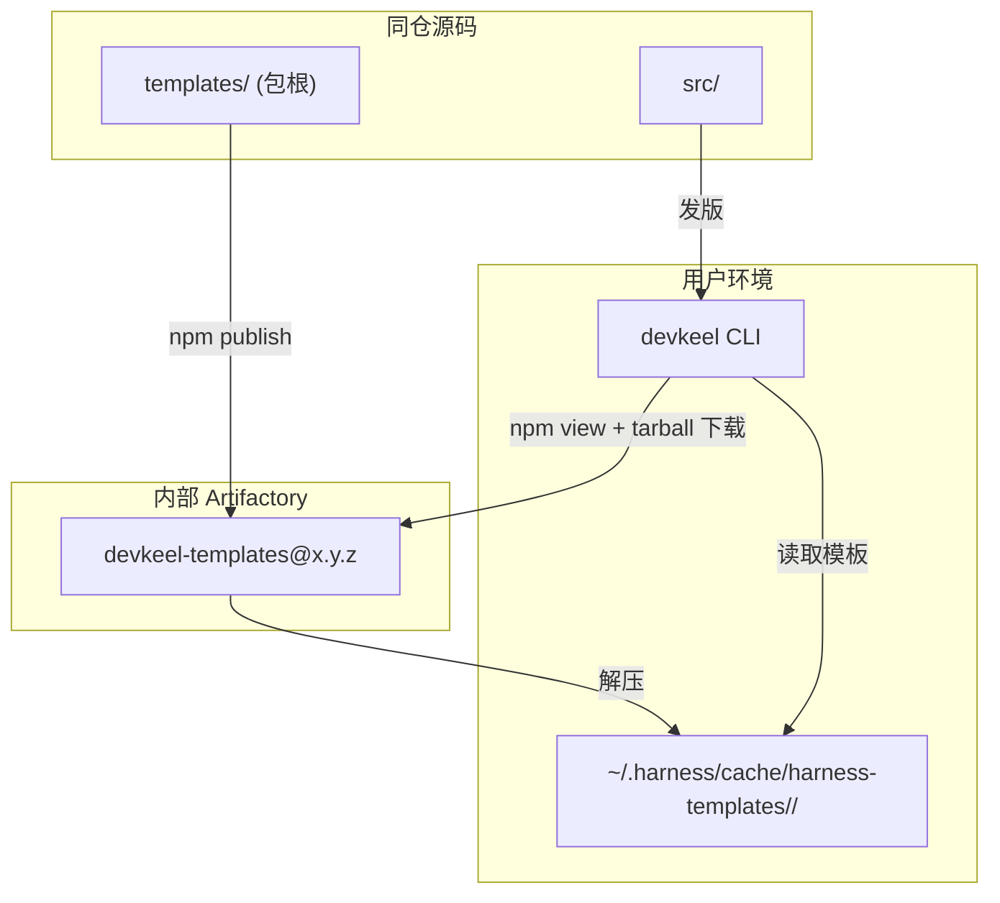
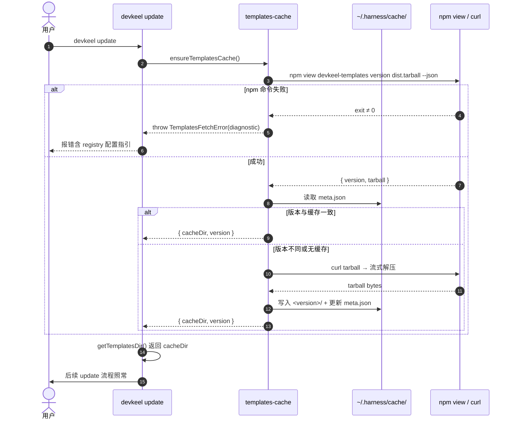

## 一句话描述

`templates/` 就地升级为 `devkeel-templates` 内部 npm 包；CLI 新增 `src/lib/templates-cache.ts`，`devkeel update/init` 前置调用 `ensureTemplatesCache()` 通过 `npm view` + tarball 下载把最新版拉到 `~/.harness/cache/harness-templates/<version>/`，所有模板读取入口改指向缓存。首版交付：`templates/package.json`、`templates-cache.ts`、`getTemplatesDir`/`getBuiltinVersions`/`readSchemaVersion` 三处改造、`update.ts`/`init.ts` 两处入口接入、CLI `package.json` `files` 移除 `templates`。

## 方案设计

### 架构概览



**关键变化：** `templates/` 在仓库里仍是源码目录（开发态），但发布后不再进入 CLI tarball；CLI 运行时通过缓存读取。

### 方案对比

| 维度 | A: runtime dependency | **B: 运行时拉取（采纳）** | 说明 |
|------|----------------------|--------------------------|------|
| "永远最新"语义 | 受 caret 范围限制，需用户 `npm update` | **每次 `update` 必拉 latest** | 需求核心 |
| CLI 升版频率 | 必须跟着模板升 | 解耦 | 模板高频迭代时收益大 |
| 运行时依赖数 | +1 | 0（用环境 npm） | 符合最小依赖原则 |
| 实现复杂度 | 低 | 中（缓存 + 错误处理） | 可接受 |
| 网络依赖 | 仅 `npm install` 时 | 每次 `update`/`init` | 用户接受 |
| 失败模式 | npm install 失败 | npm view 失败 → 报错含修复指引 | 用户选择不 fallback |

**唯一方案排除理由：** 方案 A 在 brainstorm 已被用户排除，因其不满足"永远最新"语义；方案 8b（pacote）违反最小依赖原则；方案 8c（直接 HTTP）绕开 `.npmrc` 鉴权。

### 关键时序



### 模块设计

#### `src/lib/templates-cache.ts`（新增）

**职责：** 封装模板包的拉取、缓存、定位。

**对外接口：**

```typescript
export interface TemplatesCacheInfo {
  cacheDir: string     // ~/.harness/cache/harness-templates/<version>
  version: string      // 实际拉到的版本号
}

export class TemplatesFetchError extends Error {
  readonly diagnostic: string   // 人类可读的修复指引
}

/**
 * 确保模板缓存就绪，返回缓存目录。
 * - 调用 `npm view` 拿 latest 版本
 * - 与缓存比对，必要时下载解压
 * - 失败抛出 TemplatesFetchError（含 registry 配置指引）
 */
export function ensureTemplatesCache(): TemplatesCacheInfo
```

**内部常量：**

```typescript
const PACKAGE_NAME = 'devkeel-templates'
const CACHE_ROOT = path.join(os.homedir(), '.harness', 'cache', 'harness-templates')
const META_FILE = 'meta.json'  // { version, fetchedAt }
const REGISTRY_HINT = `registry=https://registry.npmjs.org/`
```

#### `src/lib/templates.ts` 改造

**`getTemplatesDir()` 改造前后对比：**

```typescript
// 改造前
export function getTemplatesDir(): string {
  const candidate = path.resolve(__dirname, '..', 'templates')
  if (fs.existsSync(candidate)) return candidate
  return path.resolve(__dirname, '..', '..', 'templates')
}

// 改造后
let cachedTemplatesDir: string | null = null

export function setTemplatesDir(dir: string): void {
  cachedTemplatesDir = dir
}

export function getTemplatesDir(): string {
  if (cachedTemplatesDir) return cachedTemplatesDir
  // 本地开发 fallback：源码态的 templates/
  const candidate = path.resolve(__dirname, '..', 'templates')
  if (fs.existsSync(candidate)) return candidate
  return path.resolve(__dirname, '..', '..', 'templates')
}
```

**设计取舍：** 用模块级 mutable 变量而非 DI，是因为 `getTemplatesDir()` 在 10+ 处被调用，注入成本过高。`setTemplatesDir` 仅在 `ensureTemplatesCache()` 成功后由命令层调用一次。

#### `src/lib/config.ts` 改造

`getBuiltinVersions()` 和 `readSchemaVersion()` 内部同样依赖 `getTemplatesDir()`，改造后自动指向缓存。无需额外改动。

#### `src/commands/update.ts` / `init.ts` 入口接入

```typescript
import { ensureTemplatesCache, setTemplatesDir, TemplatesFetchError } from '../lib/templates-cache.js'

export async function runUpdate(...) {
  // ... 现有前置检查
  try {
    const { cacheDir } = ensureTemplatesCache()
    setTemplatesDir(cacheDir)
  } catch (e) {
    if (e instanceof TemplatesFetchError) {
      p.cancel(e.message + '\n\n' + e.diagnostic)
      process.exit(1)
    }
    throw e
  }
  // ... 现有流程
}
```

`init.ts` 同样在读取模板前调用一次。

### 代码设计预览

#### 错误诊断文案（TemplatesFetchError.diagnostic）

```
无法拉取 devkeel-templates：
  <npm 原始 stderr>

请确认：
  1. npm 已安装且在 PATH 中：
       npm --version
  2. ~/.npmrc 包含以下配置（指向内部 Artifactory）：
       registry=https://registry.npmjs.org/
  3. 当前网络可访问 registry：
       curl -I https://registry.npmjs.org/devkeel-templates
  4. 模板包已发布到上述 registry（维护者首次发版后才可用）
```

#### 缓存目录布局

```
~/.harness/cache/harness-templates/
├── meta.json                   # { version: "1.2.3", fetchedAt: "2026-06-15T..." }
├── 1.2.3/                       # 当前版本
│   ├── skills/...
│   ├── rules/...
│   ├── versions-yml.yml
│   └── openspec/schemas/...
└── 1.2.2/                       # 上一版本（保留用于回滚或并发安全）
```

**保留旧版本理由：** 解压新版本时若进程被中断，旧版本目录仍可读；后续 `devkeel doctor` 可提供"清理旧缓存"能力。

### 数据设计

#### `templates/package.json`（新增）

```json
{
  "name": "devkeel-templates",
  "version": "1.0.0",
  "description": "harness CLI 的模板资产（skills/rules/agents/schemas）",
  "files": [
    "skills",
    "rules",
    "agents",
    "commands",
    "domain",
    "openspec",
    "versions-yml.yml",
    "agents-md.md",
    "agents-md-domain.md",
    "claude-md.md",
    "claude-md-domain.md",
    "config-yml.yml",
    "gemini-md.md",
    "gitignore",
    "npmrc"
  ],
  "publishConfig": {
    "registry": "https://registry.npmjs.org/"
  },
  "license": "MIT"
}
```

**设计取舍：** `files` 字段白名单显式列出所有应发布的文件/目录，避免 `node_modules`、`.DS_Store` 等意外进入 tarball。

#### CLI `package.json` 调整

```diff
 "files": [
   "bin",
   "dist",
-  "templates",
   "web/human-review.css",
   "web/human-review.js"
 ],
```

## 风险与未决

| 风险 | 缓解 |
|------|------|
| 解压过程中断导致缓存半残 | 写入临时目录 `<version>.tmp/`，完成后 `rename` 原子切换 |
| `npm view` 输出格式跨 npm 版本不一致 | 加 `--json` 强制 JSON 输出；解析失败时抛出 `TemplatesFetchError` |
| 本地开发时 `getTemplatesDir()` 仍解析源码 `templates/` | 已有 fallback（`fs.existsSync(candidate)`）覆盖；开发者无需配置 |
| `~/.harness` 权限冲突（多用户共享主机） | 用 `os.homedir()` 隔离；权限由 OS 保证 |
| CLI 发版流程漏删 `files.templates` | 在 PR checklist 中显式列出；`pnpm build` 后检查产物不含 `templates/` |

**未决：**

- 同仓双包发版脚本（`pnpm release:templates` vs `pnpm release:cli`）的设计与实现——本 change 不解决，由后续 change 或 CLI 维护者在发版流程中补充。

## 完成检查

- [x] technical-design skill 已调用（手动降级原因：本 change 范围聚焦、方案已在 brainstorm 收敛，无需外部 skill 二次发散；直接基于 brainstorm 已有源码调查产出）
- [x] 存在 ≥ 2 候选方案对比（A vs B，B 采纳；8a/8b/8c、9a/9b/9c 在 brainstorm 已排除）
