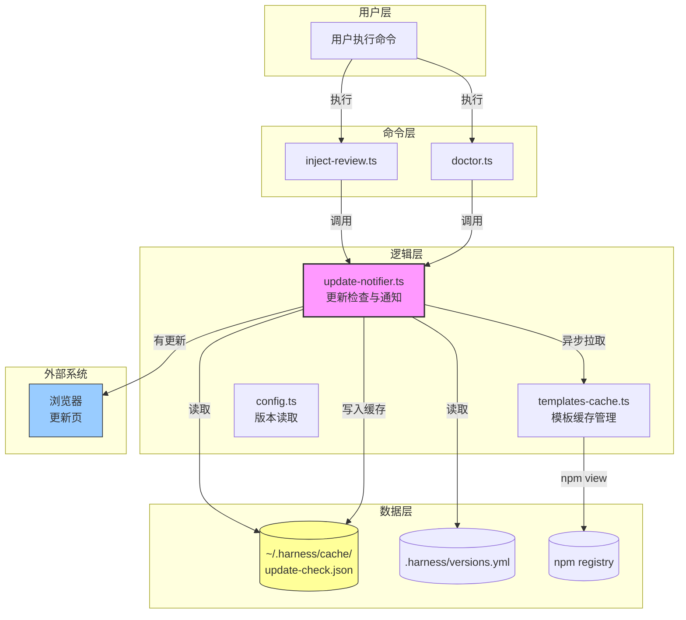
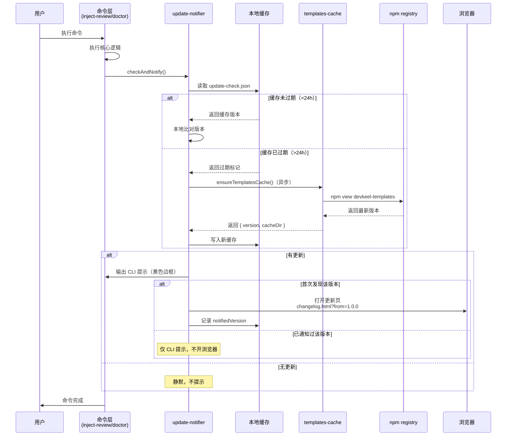

## 一句话描述

在 `inject-review` 和 `doctor` 命令中集成更新检查模块，通过本地缓存（24h 过期）+ 异步网络请求实现低延迟版本检测，首次发现更新时打开浏览器更新页 + CLI 提示，后续仅 CLI 提示。**首版交付**：`src/lib/update-notifier.ts` 模块、命令层集成、缓存管理、跨平台浏览器打开、完整测试覆盖。

## 方案设计

### 架构概览



**架构说明**：
- **命令层薄**：`inject-review.ts` 和 `doctor.ts` 仅在命令末尾调用 `checkAndNotify()`，不含检查逻辑
- **逻辑层厚**：`update-notifier.ts` 封装所有更新检查、缓存管理、提示格式化、浏览器打开逻辑
- **旁路隔离**：更新检查失败不影响主命令执行，静默降级
- **数据流向**：缓存优先（本地比对）→ 过期才网络请求（异步）→ 写入缓存

### 方案对比（ATAM 分析）

| 质量属性 | 方案 A：独立模块<br/>（推荐） | 方案 B：Hook 机制 | 方案 C：命令层内联 |
|---------|---------------------------|------------------|------------------|
| **实现复杂度** | ⭐⭐ 中等 | ⭐⭐⭐ 高 | ⭐ 低 |
| **可维护性** | ⭐⭐⭐ 高（职责清晰） | ⭐⭐ 中等（框架层复杂） | ⭐ 低（逻辑耦合） |
| **可测试性** | ⭐⭐⭐ 高（模块独立） | ⭐⭐ 中等（需 mock hook） | ⭐ 低（需 mock 命令） |
| **扩展性** | ⭐⭐⭐ 高（显式调用） | ⭐⭐⭐ 高（自动触发） | ⭐ 低（需逐个修改） |
| **性能影响** | ⭐⭐⭐ 低（异步） | ⭐⭐⭐ 低（异步） | ⭐⭐⭐ 低（异步） |
| **符合项目哲学** | ⭐⭐⭐ 完全符合 | ⭐ 违背 YAGNI | ⭐⭐ 部分符合 |
| **综合评分** | **17/18** | 13/18 | 10/18 |

**选择理由**：
- **方案 A（独立模块）**：符合项目"命令层薄、逻辑层厚"原则，职责清晰，易测试，未来可扩展到其他命令（只需多调用一次 `checkAndNotify()`）
- **方案 B（Hook 机制）**：过度设计，违背 YAGNI 原则，当前只需在 2 个命令中集成，无需框架级支持
- **方案 C（命令层内联）**：逻辑耦合在命令层，不易复用，违背项目架构模式

### 关键时序



**异常场景处理**：
- **缓存读取失败**：静默跳过，视为缓存不存在，触发网络请求
- **网络请求超时/失败**：静默跳过，不更新缓存，下次命令继续尝试
- **浏览器打开失败**：仅 CLI 提示，不报错，记录已通知版本
- **缓存写入失败**：静默跳过，下次命令继续尝试

### 模块设计

#### 职责划分

```
src/lib/update-notifier.ts
├─ checkAndNotify()              # 主入口，检查更新并提示
│  ├─ readUpdateCache()          # 读取本地缓存
│  ├─ isCacheExpired()           # 判断缓存是否过期
│  ├─ fetchLatestVersion()       # 异步拉取最新版本（复用 ensureTemplatesCache）
│  ├─ compareVersions()          # 版本比对（复用 readVersions + getBuiltinVersions）
│  ├─ formatUpdatePrompt()       # 格式化 CLI 提示（黄色边框）
│  ├─ shouldOpenBrowser()        # 判断是否需要打开浏览器
│  ├─ openBrowser()              # 跨平台打开浏览器
│  └─ writeUpdateCache()         # 写入缓存
└─ __test__                      # 测试辅助（仅在 VITEST 环境导出）
```

#### 依赖关系

```
update-notifier.ts
├─ 依赖：templates-cache.ts（ensureTemplatesCache）
├─ 依赖：config.ts（readVersions, getBuiltinVersions）
├─ 依赖：node:fs（缓存文件读写）
├─ 依赖：node:child_process（打开浏览器）
└─ 被依赖：inject-review.ts, doctor.ts
```

#### 接口契约

```typescript
// 主入口
export function checkAndNotify(): Promise<void>

// 内部函数（不导出）
interface UpdateCache {
  lastCheck: number        // Unix timestamp (ms)
  latestVersion: string    // 最新版本号
  notifiedVersion?: string // 已通知过的版本号
}

function readUpdateCache(): UpdateCache | null
function isCacheExpired(cache: UpdateCache): boolean
function fetchLatestVersion(): Promise<string | null>
function compareVersions(current: string, latest: string): boolean
function formatUpdatePrompt(from: string, to: string): string
function shouldOpenBrowser(cache: UpdateCache, latestVersion: string): boolean
function openBrowser(url: string): void
function writeUpdateCache(cache: UpdateCache): void
```

### 代码设计预览

#### 关键接口

```typescript
// src/lib/update-notifier.ts

import fs from 'node:fs'
import path from 'node:path'
import os from 'node:os'
import { exec } from 'node:child_process'
import { ensureTemplatesCache } from './templates-cache.js'
import { readVersions, getBuiltinVersions } from './config.js'
import * as p from '@clack/prompts'

const CACHE_FILE = path.join(os.homedir(), '.harness', 'cache', 'update-check.json')
const CACHE_TTL = 24 * 60 * 60 * 1000 // 24 hours
const UPDATE_PAGE_BASE = 'https://github.com/MinLeeV5/devkeel/tree/HEAD/web/public/versions'

export async function checkAndNotify(): Promise<void> {
  try {
    const current = readVersions(process.cwd())
    if (!current) return // 未初始化，跳过
    
    const cache = readUpdateCache()
    let latestVersion: string | null = null
    
    if (cache && !isCacheExpired(cache)) {
      // 缓存未过期，使用缓存版本
      latestVersion = cache.latestVersion
    } else {
      // 缓存过期或不存在，异步拉取
      latestVersion = await fetchLatestVersion()
      if (latestVersion) {
        writeUpdateCache({
          lastCheck: Date.now(),
          latestVersion,
        })
      }
    }
    
    if (!latestVersion || latestVersion === current.harness) {
      return // 无更新
    }
    
    // 有更新，输出提示
    const prompt = formatUpdatePrompt(current.harness, latestVersion)
    p.log.info(prompt)
    
    // 判断是否需要打开浏览器
    if (shouldOpenBrowser(cache, latestVersion)) {
      const url = `${UPDATE_PAGE_BASE}?from=${encodeURIComponent(current.harness)}`
      openBrowser(url)
      
      // 记录已通知版本
      if (cache) {
        cache.notifiedVersion = latestVersion
        writeUpdateCache(cache)
      } else {
        writeUpdateCache({
          lastCheck: Date.now(),
          latestVersion,
          notifiedVersion: latestVersion,
        })
      }
    }
  } catch {
    // 静默降级，不影响主命令
  }
}
```

#### 跨平台浏览器打开

```typescript
function openBrowser(url: string): void {
  const platform = process.platform
  let command: string
  
  switch (platform) {
    case 'darwin':
      command = `open "${url}"`
      break
    case 'win32':
      command = `start "" "${url}"`
      break
    default:
      command = `xdg-open "${url}"`
  }
  
  exec(command, (error) => {
    // 静默降级，打开失败不报错
  })
}
```

#### CLI 提示格式化

```typescript
function formatUpdatePrompt(from: string, to: string): string {
  return [
    '',
    '┌─────────────────────────────────────────────────┐',
    `│ 💡 harness 有新版本可用（${from} → ${to}）${' '.repeat(Math.max(0, 20 - from.length - to.length))}│`,
    '│    运行 devkeel update 更新                      │',
    '└─────────────────────────────────────────────────┘',
    '',
  ].join('\n')
}
```

### 数据设计

#### 缓存文件结构

**文件路径**：`~/.harness/cache/update-check.json`

**数据模型**：
```json
{
  "lastCheck": 1704067200000,
  "latestVersion": "1.1.0",
  "notifiedVersion": "1.1.0"
}
```

**字段说明**：
- `lastCheck`：上次检查时间（Unix timestamp, ms），用于判断缓存是否过期
- `latestVersion`：最新版本号（从 npm registry 获取）
- `notifiedVersion`：已通知过的版本号（用于判断是否首次发现该版本）

**一致性策略**：
- 读取失败 → 视为缓存不存在，触发网络请求
- 写入失败 → 静默跳过，下次命令继续尝试
- 不引入锁机制（单用户 CLI，无并发冲突）

## 质量设计

### SLO 指标

| 指标 | 目标值 | 告警线 | 容量预估 |
|------|--------|--------|----------|
| **缓存命中率** | >95% | <90% | 每用户每天 1-2 次网络请求 |
| **命令延迟影响** | <100ms | >500ms | 缓存读取 <10ms，网络请求异步不阻塞 |
| **浏览器打开成功率** | >90% | <80% | 无头环境自动降级 |
| **更新感知延迟** | <24h | >48h | 缓存 TTL 24h，用户每天至少执行 1 次命令 |

### 安全（STRIDE 威胁模型）

| 威胁类型 | 场景 | 缓解措施 |
|---------|------|----------|
| **Spoofing（仿冒）** | npm registry 被劫持，返回恶意版本 | 使用内部私有 registry（registry.npmjs.org），HTTPS 加密 |
| **Tampering（篡改）** | 缓存文件被篡改，伪造版本号 | 缓存文件仅用于提示，不影响实际更新逻辑（update 命令会重新验证） |
| **Repudiation（抵赖）** | 用户否认收到更新提示 | CLI 工具，不记录用户行为日志（telemetry 可选） |
| **Information Disclosure（信息泄露）** | 更新页 URL 泄露当前版本 | URL 参数 `from` 仅包含版本号，无敏感信息 |
| **Denial of Service（拒绝服务）** | npm registry 不可用，阻塞命令执行 | 异步网络请求，超时 3s，失败静默降级 |
| **Elevation of Privilege（权限提升）** | 浏览器打开命令注入 | URL 参数 encodeURIComponent 编码，防止命令注入 |

### 旁路隔离

**核心原则**：更新检查是旁路功能，绝对不能拖垮业务主链路。

**隔离策略**：
- **异常捕获**：`checkAndNotify()` 整体包裹在 `try/catch` 中，任何异常静默吞掉
- **超时控制**：网络请求超时 3s，避免长时间阻塞
- **异步执行**：网络请求使用 `async/await`，不阻塞命令主流程
- **降级机制**：缓存读取失败 → 触发网络请求；网络请求失败 → 跳过检查；浏览器打开失败 → 仅 CLI 提示

## 风险与未决

### 已知风险

| 风险 | 概率 | 影响 | 缓解策略 |
|------|------|------|----------|
| npm registry 不可用 | 低 | 中 | 缓存兜底，失败静默降级 |
| 浏览器打开失败（无头环境） | 中 | 低 | 自动降级为仅 CLI 提示 |
| 缓存文件权限问题 | 低 | 低 | 静默跳过，不报错 |
| 用户反感浏览器弹出 | 低 | 中 | 严格控制频率（每天最多 1 次），首次后不再弹出 |

### 未决问题

（无，所有关键点已确认）

## 完成检查

- [x] technical-design skill 已调用
- [x] 存在 ≥ 2 候选方案对比（独立模块 vs Hook 机制 vs 命令层内联）
- [x] ATAM 整体方案级权衡（方案 A 17/18 分）
- [x] 量化 SLO（缓存命中率 >95%，命令延迟影响 <100ms）
- [x] STRIDE 威胁模型（6 类威胁逐项分析）
- [x] 旁路隔离策略（异常捕获、超时控制、异步执行、降级机制）
