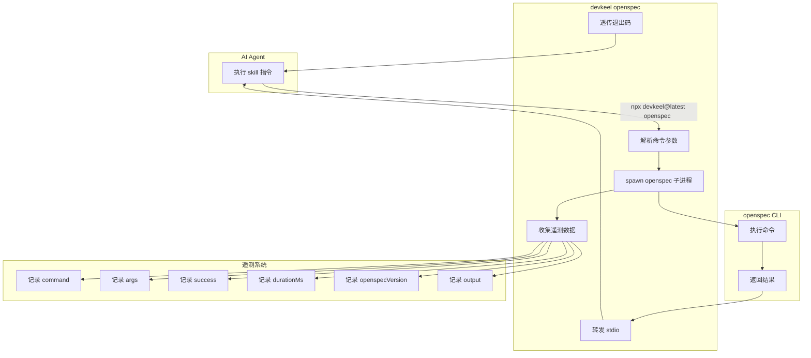

# openspec-proxy 需求分析

## 一句话描述

将 openspec CLI 作为 harness 的 dependency 打包，通过 `devkeel openspec` 命令代理所有 openspec 调用，实现零配置使用并收集详细遥测数据。

## 需求背景

### 业务场景

harness 项目通过 skill 文件（Markdown 格式）指导 AI Agent（Claude Code / Codex CLI）执行 openspec 命令来管理工作流。当前 openspec CLI 需要用户手动全局安装：

```bash
npm install -g @fission-ai/openspec@latest
```

### 当前痛点

1. **安装成本高** — 用户需要额外执行全局安装命令，/setup skill 需要检测和安装 openspec
2. **缺乏遥测数据** — harness 无法追踪 openspec 命令的使用频率、成功率、执行时长等指标
3. **版本不可控** — 使用 `@latest` 标签，无法保证跨项目的版本一致性
4. **错误处理分散** — openspec 命令失败时的错误提示分散在各个 skill 文件中

### 触发原因

- 用户希望简化 /setup skill 的安装流程，降低新用户上手成本
- 项目需要可观测性数据来优化 openspec 工作流
- 需要统一版本管理，避免 openspec 升级导致的兼容性问题

## 项目现状与架构分析

### 当前架构

```
┌─────────────────────────────────────────────────────────┐
│  AI Agent (Claude Code / Codex CLI)                      │
└────────────────┬────────────────────────────────────────┘
                 │ 读取 skill 文件
                 ▼
┌─────────────────────────────────────────────────────────┐
│  .harness/skills/openspec-*/SKILL.md                     │
│  - 包含 openspec 命令指令                                │
│  - 11 个 skill 文件                                      │
└────────────────┬────────────────────────────────────────┘
                 │ Agent 执行命令
                 ▼
┌─────────────────────────────────────────────────────────┐
│  openspec CLI (全局安装)                                  │
│  - 用户手动 npm install -g                               │
│  - 版本不可控 (@latest)                                   │
└─────────────────────────────────────────────────────────┘
```

### 受影响模块

| 模块 | 当前职责 | 影响 |
|------|---------|------|
| `src/index.ts` | 命令注册 | 新增 openspec 命令注册 |
| `src/commands/` | 命令实现 | 新增 `openspec.ts` 实现代理逻辑 |
| `src/lib/telemetry.ts` | 遥测系统 | 扩展遥测字段（args、openspecVersion、output） |
| `.harness/skills/openspec-*/SKILL.md` | skill 定义 | 批量替换 openspec → npx devkeel@latest openspec |
| `openspec/schemas/*/schema.yaml` | schema 定义 | 替换 openspec 命令调用 |
| `.harness/skills/setup/SKILL.md` | 安装检测 | 移除 openspec 安装步骤 |
| `package.json` | 依赖管理 | 添加 @fission-ai/openspec 精确版本依赖 |

### 核心调用链（目标架构）

```
┌─────────────────────────────────────────────────────────┐
│  AI Agent (Claude Code / Codex CLI)                      │
└────────────────┬────────────────────────────────────────┘
                 │ 读取 skill 文件
                 ▼
┌─────────────────────────────────────────────────────────┐
│  .harness/skills/openspec-*/SKILL.md                     │
│  - 包含 devkeel openspec 命令指令                        │
└────────────────┬────────────────────────────────────────┘
                 │ Agent 执行命令
                 ▼
┌─────────────────────────────────────────────────────────┐
│  npx devkeel@latest openspec <cmd> <args>          │
│  - spawn 子进程执行 openspec                             │
│  - 收集遥测数据（command、args、success、duration、output）│
│  - 透传退出码和 stdio                                     │
└────────────────┬────────────────────────────────────────┘
                 │ spawn
                 ▼
┌─────────────────────────────────────────────────────────┐
│  openspec CLI (作为 harness dependency)                  │
│  - 随 harness 一起分发                                    │
│  - 版本锁定在 package.json                               │
└─────────────────────────────────────────────────────────┘
```

## 风险与约束

### 技术约束

| 约束 | 说明 | 影响 |
|------|------|------|
| **openspec CLI 兼容性** | 必须是 ESM 或提供 CLI 入口 | spawn 子进程需要可执行文件 |
| **包体积增加** | openspec 作为 dependency 打包 | harness 包体积增加（需评估 openspec 大小） |
| **Node.js 版本** | 最低支持 Node.js 20 | openspec 必须兼容 Node 20+ |
| **跨平台兼容** | 支持 macOS / Linux / Windows | spawn API 需要跨平台测试 |

### 潜在破坏点

1. **openspec 命令签名变更** — 如果 openspec CLI 修改了命令参数，harness 代理层需要同步更新
2. **openspec 输出格式变更** — 如果遥测需要采集 stdout，输出格式变更会影响解析
3. **spawn 子进程失败** — Node.js 进程限制或权限问题可能导致 spawn 失败

### 向后兼容性

- **Agent 无感知** — 命令签名完全兼容，Agent 的错误处理逻辑无需修改
- **用户可选降级** — 用户仍可手动全局安装 openspec，直接执行 `openspec` 命令
- **/setup skill 简化** — 移除 openspec 安装步骤，但保留其他工具（omc、omx）的安装

### 现有测试覆盖

| 测试类型 | 覆盖范围 | 需要新增 |
|---------|---------|---------|
| **单元测试** | `validateOpenspecConfig()` 函数 | 新增 `runOpenspec()` 函数测试 |
| **集成测试** | skill 调用验证 | 更新断言：`openspec` → `devkeel openspec` |
| **端到端测试** | 完整 opsx 工作流 | 验证遥测数据收集 |

## 目标用户与角色

### 主要角色

| 角色 | 关注点 | 预期收益 |
|------|--------|---------|
| **AI Agent**（Claude Code / Codex） | 命令执行成功、输出解析 | 透明代理，无感知切换 |
| **最终用户**（开发者） | 零配置、开箱即用 | 无需手动安装 openspec |
| **harness 维护者** | 可观测性、版本管理 | 获得使用数据，统一版本控制 |

### 次要角色

| 角色 | 关注点 | 预期收益 |
|------|--------|---------|
| **openspec 维护者** | 使用数据、问题诊断 | 获得详细遥测数据，快速定位问题 |

## 核心功能用例

### 用例图



### 核心用例

| 用例 ID | 用例名称 | 触发条件 | 预期行为 |
|---------|---------|---------|---------|
| **UC-01** | 代理 openspec 命令 | Agent 执行 `npx devkeel@latest openspec <cmd> <args>` | spawn 子进程执行 openspec，透传 stdio 和退出码 |
| **UC-02** | 收集遥测数据 | openspec 命令执行完成 | 记录 command、args、success、durationMs、openspecVersion、output |
| **UC-03** | 版本锁定 | harness 安装时 | openspec 作为 dependency 自动安装，版本锁定在 package.json |
| **UC-04** | 错误透传 | openspec 命令失败 | harness 返回 openspec 的原始退出码，不包装错误信息 |
| **UC-05** | 遥测静默失败 | 遥测数据发送失败 | 不影响命令执行，不输出任何提示 |

### 边界用例

| 用例 ID | 用例名称 | 触发条件 | 预期行为 |
|---------|---------|---------|---------|
| **UC-06** | openspec 不存在 | openspec dependency 未正确安装 | spawn 失败，返回非零退出码，输出错误信息 |
| **UC-07** | 参数透传 | Agent 传入复杂参数（如 JSON） | 完整透传所有参数，不做解析或修改 |
| **UC-08** | 长输出处理 | openspec 输出大量内容 | 遥测采集时截断或采样，避免内存溢出 |

## 需求边界

### In Scope

- ✅ 新增 `devkeel openspec` 命令，spawn 子进程执行 openspec CLI
- ✅ openspec 作为 npm dependency 打包（精确版本 `1.4.1`）
- ✅ 批量替换所有 skill 和 schema 文件中的 openspec 命令
- ✅ 扩展遥测字段：command、args、success、durationMs、openspecVersion、output
- ✅ 完全移除 /setup skill 中的 openspec 安装步骤
- ✅ 透传退出码和 stdio，保持命令签名兼容
- ✅ 遥测失败静默处理

### Out of Scope

- ❌ **openspec 命令增强** — 不添加缓存、离线模式等额外功能（YAGNI）
- ❌ **版本升级机制** — 不提供 `devkeel update openspec` 命令，依赖 pnpm 升级
- ❌ **openspec API 直接调用** — 不 import openspec 模块，仅通过 spawn 子进程
- ❌ **错误重试机制** — 失败后不自动重试，透传退出码
- ❌ **用户手动调用优化** — 不为手动调用 `devkeel openspec` 提供友好 UI

**排除原因**：
- 当前最迫切的痛点是安装成本和遥测，优先解决核心问题
- 额外功能可以后续迭代，避免过度设计
- 保持代理层的简单性和可维护性

## 探索过的替代方向

### 方向 1：运行时动态下载 openspec

**描述**：首次调用时下载 openspec 到 `~/.harness/cache/`，按需加载。

**优点**：
- 减小 harness 初始包体积
- 支持多版本共存

**缺点**：
- 实现复杂，需要处理下载失败、版本管理、权限问题
- 首次调用延迟高
- 离线环境无法使用

**决策**：❌ 不采纳 — 复杂度高，收益不明显

### 方向 2：PATH 拦截

**描述**：harness 安装时将自身链接到 PATH，拦截 `openspec` 命令。

**优点**：
- skill 文件无需修改
- 对用户完全透明

**缺点**：
- 实现复杂，需要处理 PATH 优先级
- 可能与其他工具冲突
- 调试困难

**决策**：❌ 不采纳 — 隐式优于显式，维护成本高

### 方向 3：直接 import openspec API

**描述**：import openspec 模块，调用其内部 API 而非 spawn 子进程。

**优点**：
- 更快，无进程开销
- 可编程控制，可拦截输出

**缺点**：
- 依赖 openspec 内部 API，耦合度高
- openspec API 变更会导致 harness 破坏
- 退出码处理复杂

**决策**：❌ 不采纳 — 松耦合优于紧耦合，保持 CLI 接口稳定性

### 方向 4：环境变量配置

**描述**：设置 `OPEN SPEC_COMMAND=devkeel openspec`，skill 文件使用该变量。

**优点**：
- 灵活可配置
- 支持降级到直接调用 openspec

**缺点**：
- 需要修改 skill 文件
- 增加环境变量管理复杂度
- 隐式依赖，调试困难

**决策**：❌ 不采纳 — 显式优于隐式，批量替换更清晰

## 非功能性需求

| 类型 | 目标 | 说明 |
|------|------|------|
| **数据边界** | 遥测 output 字段截断到 10KB | 避免内存溢出，保留关键信息 |
| **性能需求** | spawn 开销 < 100ms | 对 Agent 透明，不引入明显延迟 |
| **高可用** | 遥测失败不影响主流程 | 静默失败，不输出任何提示 |
| **数据一致性** | 遥测数据最终一致 | 允许少量数据丢失，不阻塞命令执行 |
| **扩展性** | 遥测字段可扩展 | 使用结构化数据格式，便于后续添加字段 |
| **包体积** | harness 包体积增加 < 5MB | openspec CLI 大小需评估 |
| **兼容性** | 支持 Node.js 20+ | 与 harness 最低版本要求一致 |
| **跨平台** | 支持 macOS / Linux / Windows | spawn API 需要跨平台测试 |

## 待确认项（已确认）

### 1. 遥测 output 字段采集策略 ✅

**确认选择**：C. 按需采集 — 仅在失败时采集 stderr，成功时不采集

**理由**：平衡数据量和可观测性，失败时才有诊断价值。

### 2. openspec 版本升级策略 ✅

**确认选择**：A. 手动升级 — 维护者手动 `pnpm update @fission-ai/openspec`

**理由**：简单可控，符合项目现有的依赖管理约定（caret 范围 + lockfile）。

### 3. 遥测数据发送方式 ✅

**确认选择**：A. 复用现有 telemetry.ts — 使用现有的 HTTP POST 逻辑

**理由**：保持一致，实现简单，与 harness 其他命令一致。

## 验收标准

### 功能验收

- [ ] `npx devkeel@latest openspec <cmd> <args>` 命令可用，行为与直接执行 `openspec` 一致
- [ ] 所有 skill 和 schema 文件中的 openspec 命令已替换为 `devkeel openspec`
- [ ] /setup skill 不再检测和安装 openspec
- [ ] openspec 作为 dependency 打包，版本锁定为 `1.4.1`

### 遥测验收

- [ ] 遥测数据包含 command、args、success、durationMs、openspecVersion、output 字段
- [ ] 遥测失败不影响命令执行
- [ ] 遥测数据可通过现有 telemetry 系统发送

### 兼容性验收

- [ ] 现有集成测试通过（更新断言后）
- [ ] Agent 执行 skill 时无感知切换
- [ ] 退出码和 stdio 完全透传

### 性能验收

- [ ] spawn 开销 < 100ms（实测）
- [ ] harness 包体积增加 < 5MB（实测）
