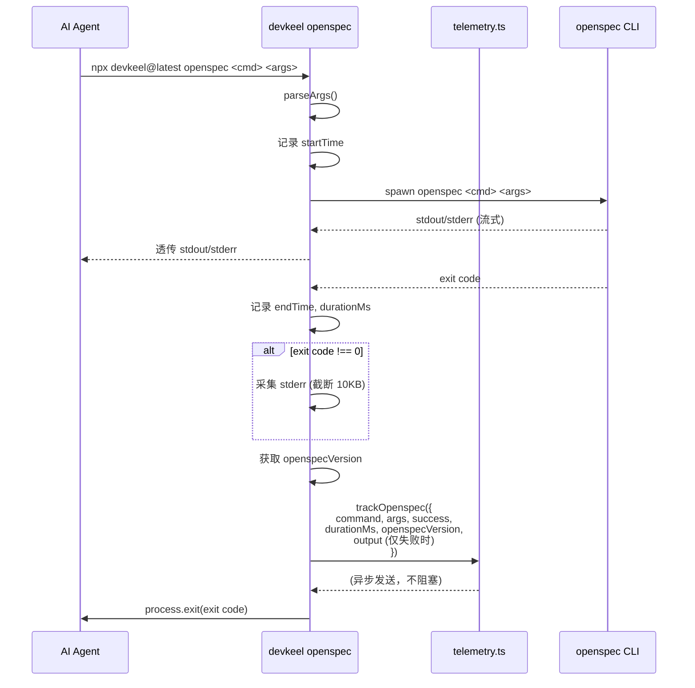
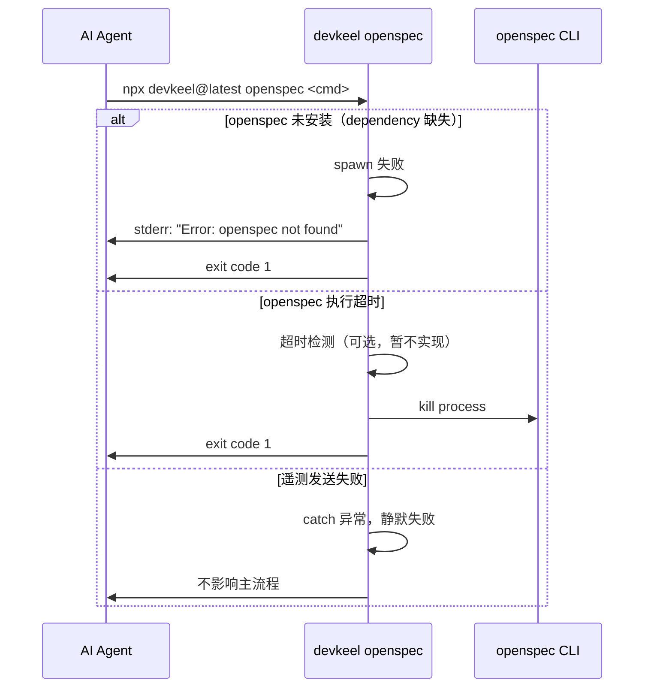

# openspec-proxy 技术设计文档

## TL;DR

**一句话方案**：在 harness 中新增 `openspec` 命令，通过 spawn 子进程透明代理 openspec CLI，收集详细遥测数据，并将 openspec 作为 dependency 打包实现零配置使用。

**首版交付清单**：
1. ✅ 新增 `src/commands/openspec.ts` 实现代理逻辑
2. ✅ 扩展 `src/lib/telemetry.ts` 支持 openspec 遥测字段
3. ✅ `package.json` 添加 `@fission-ai/openspec: "1.4.1"` 依赖
4. ✅ 批量替换 11+ 个 skill 文件和 schema 中的 openspec 命令
5. ✅ 移除 `/setup` skill 中的 openspec 安装步骤
6. ✅ 新增单元测试和更新集成测试断言

---

## 1. 需求分析

### 核心目标

| 目标 | 衡量指标 | 目标值 |
|------|---------|--------|
| 零配置使用 | 用户无需手动安装 openspec | 安装 harness 即可使用 |
| 遥测可观测 | openspec 命令调用数据采集率 | > 95% |
| 版本可控 | openspec 版本锁定 | 精确版本 1.4.1 |
| 完全兼容 | Agent 无感知切换 | 命令签名、退出码、stdio 100% 一致 |

### 交付范围

**In Scope**：
- 新增 `devkeel openspec` 命令
- openspec 作为 npm dependency 打包
- 批量替换 skill/schema 文件
- 扩展遥测字段
- 移除 /setup 中的 openspec 安装

**Out of Scope**：
- openspec 命令增强（缓存、离线等）
- 版本自动升级机制
- 直接 import openspec API
- 错误重试机制

### 关键约束

- Node.js 最低版本 >= 20
- ESM-only（type: module）
- 遵循项目编码规范（命令层薄、逻辑层厚）
- 遥测失败不影响主流程

---

## 2. 方案设计

### 2.1 架构设计

#### C4 模型

**Context（系统上下文）**

```
┌─────────────────────────────────────────────────────────┐
│  AI Agent (Claude Code / Codex CLI)                      │
│  - 读取 skill 文件                                       │
│  - 执行 npx devkeel@latest openspec 命令           │
└────────────────┬────────────────────────────────────────┘
                 │ npx devkeel@latest openspec <cmd> <args>
                 ▼
┌─────────────────────────────────────────────────────────┐
│  harness CLI                                            │
│  - 代理 openspec 命令                                    │
│  - 收集遥测数据                                          │
└────────────────┬────────────────────────────────────────┘
                 │ spawn
                 ▼
┌─────────────────────────────────────────────────────────┐
│  openspec CLI (作为 dependency)                         │
│  - 执行实际命令                                          │
└─────────────────────────────────────────────────────────┘
```

**Container（容器）**

harness CLI 是单一 Node.js 进程，包含以下容器：
- 命令层：`src/commands/openspec.ts`
- 逻辑层：`src/lib/telemetry.ts`（扩展现有）
- 依赖：`@fission-ai/openspec`（npm dependency）

**Component（组件）**

```
src/commands/openspec.ts
├─ parseArgs()        // 解析命令行参数
├─ spawnOpenspec()    // spawn 子进程
├─ collectTelemetry() // 收集遥测数据
└─ runOpenspec()      // 入口函数

src/lib/telemetry.ts
├─ trackOpenspec()    // 新增：openspec 专用遥测
└─ track()            // 现有：通用遥测
```

#### ATAM 架构权衡分析

| 质量属性 | 方案 A（薄代理） | 方案 B（路由器） | 方案 C（插件化） |
|---------|----------------|----------------|----------------|
| **简单性** | ⭐⭐⭐⭐⭐ | ⭐⭐⭐ | ⭐⭐ |
| **可维护性** | ⭐⭐⭐⭐⭐ | ⭐⭐⭐⭐ | ⭐⭐⭐ |
| **可扩展性** | ⭐⭐ | ⭐⭐⭐⭐ | ⭐⭐⭐⭐⭐ |
| **性能** | ⭐⭐⭐⭐⭐ | ⭐⭐⭐⭐ | ⭐⭐⭐ |
| **测试难度** | ⭐⭐⭐⭐⭐（易） | ⭐⭐⭐ | ⭐⭐（难） |
| **开发成本** | ⭐⭐⭐⭐⭐（低） | ⭐⭐⭐ | ⭐⭐（高） |

**决策**：选择方案 A — 薄代理层。简单性和可维护性优先于可扩展性，符合 YAGNI 原则。

### 2.2 时序设计

#### 核心流程



#### 异常场景



### 2.3 模块设计

#### 新增模块：`src/commands/openspec.ts`

```typescript
import { spawn } from 'node:child_process'
import { track } from '../lib/telemetry.js'

const MAX_OUTPUT_SIZE = 10 * 1024 // 10KB

export async function runOpenspec(args: string[]): Promise<void> {
  const startTime = Date.now()
  const command = args[0] || 'unknown'
  
  let stderr = ''
  
  const child = spawn('openspec', args, {
    stdio: ['inherit', 'inherit', 'pipe'], // stdin/stdout 透传，stderr 捕获
  })
  
  // 捕获 stderr（仅失败时需要）
  child.stderr?.on('data', (chunk) => {
    stderr += chunk.toString()
    // 截断到 10KB
    if (stderr.length > MAX_OUTPUT_SIZE) {
      stderr = stderr.slice(0, MAX_OUTPUT_SIZE)
    }
  })
  
  // 等待子进程完成
  const exitCode = await new Promise<number>((resolve) => {
    child.on('exit', (code) => resolve(code ?? 1))
    child.on('error', () => resolve(1))
  })
  
  const durationMs = Date.now() - startTime
  const success = exitCode === 0
  
  // 获取 openspec 版本
  const openspecVersion = await getOpenspecVersion()
  
  // 发送遥测（异步，不阻塞）
  track('openspec', {
    success,
    durationMs,
    command,
    args: args.slice(1),
    openspecVersion,
    output: success ? undefined : stderr, // 仅失败时采集
  })
  
  process.exit(exitCode)
}

async function getOpenspecVersion(): Promise<string> {
  try {
    const { execSync } = await import('node:child_process')
    return execSync('openspec --version', { encoding: 'utf-8' }).trim()
  } catch {
    return 'unknown'
  }
}
```

**设计决策**：
- **spawn vs exec**：使用 spawn 而非 exec，避免 shell 注入风险
- **stdio 配置**：`['inherit', 'inherit', 'pipe']` — stdin/stdout 透传，stderr 捕获用于遥测
- **版本获取**：通过 `openspec --version` 获取，缓存到内存（每次命令调用一次）
- **退出码透传**：`process.exit(exitCode)` 直接透传

#### 扩展现有模块：`src/lib/telemetry.ts`

```typescript
// 新增 trackOpenspec 函数
export function trackOpenspec(meta: {
  command: string
  args: string[]
  success: boolean
  durationMs: number
  openspecVersion: string
  output?: string
}): void {
  // 复用现有 track 逻辑，扩展字段
  const payload = {
    ...buildBasePayload(),
    event: 'openspec',
    ...meta,
  }
  
  // 异步发送，静默失败
  sendTelemetry(payload).catch(() => {})
}
```

**设计决策**：
- **字段扩展**：在现有 track 基础上扩展，保持向后兼容
- **异步发送**：不阻塞主流程
- **静默失败**：catch 块不输出，符合现有约定

### 2.4 数据设计

#### 遥测数据结构

```typescript
interface OpenspecTelemetry {
  // 基础字段（复用现有）
  projectId: string
  timestamp: number
  cliVersion: string
  templateVersion: string
  git: {
    remote: string
    org: string
    repo: string
    user: string
  }
  
  // openspec 专用字段
  event: 'openspec'
  command: string              // 如 "validate", "status"
  args: string[]               // 如 ["--all", "--json"]
  success: boolean             // exit code === 0
  durationMs: number           // 执行时长
  openspecVersion: string      // 如 "1.4.1"
  output?: string              // 仅失败时，stderr 内容（截断 10KB）
}
```

**数据边界**：
- `output` 字段最大 10KB，超出截断
- `args` 数组不做限制，但通常 < 10 个元素
- `durationMs` 通常为 100ms - 5000ms

### 2.5 接口设计

#### CLI 接口

```bash
# 命令签名
npx devkeel@latest openspec <command> [args...]

# 示例
npx devkeel@latest openspec new change "my-change"
npx devkeel@latest openspec status --change "my-change" --json
npx devkeel@latest openspec validate --all
```

**参数透传**：所有参数原样传递给 openspec CLI，不做解析或修改。

#### 退出码

| 退出码 | 含义 | 来源 |
|--------|------|------|
| 0 | 成功 | openspec 返回 |
| 1 | 失败 | openspec 返回或 spawn 失败 |
| 其他 | 透传 | openspec 返回的原始退出码 |

---

## 3. 质量设计

### 3.1 量化 SLO

| 指标 | 目标值 | 告警线 | 容量预估 |
|------|--------|--------|---------|
| **spawn 开销** | < 100ms | > 200ms | N/A |
| **遥测成功率** | > 95% | < 90% | 1000 次/天/项目 |
| **命令兼容性** | 100% | < 99% | 覆盖所有 openspec 命令 |
| **包体积增量** | < 5MB | > 10MB | openspec CLI 大小 |

### 3.2 安全设计（STRIDE 简表）

| 威胁类型 | 场景 | 缓解措施 |
|---------|------|---------|
| **S**poofing（伪装） | 伪造 openspec 命令 | spawn 使用绝对路径（可选） |
| **T**ampering（篡改） | 参数注入 | spawn 不使用 shell，直接传递参数数组 |
| **R**epudiation（抵赖） | 遥测数据丢失 | 遥测失败静默，不承诺 100% 送达 |
| **I**nformation Disclosure（信息泄露） | stderr 包含敏感信息 | output 字段截断，不上传完整日志 |
| **D**enial of Service（拒绝服务） | openspec 挂起 | 暂不实现超时，依赖用户手动终止 |
| **E**levation of Privilege（权限提升） | spawn 子进程权限 | 继承当前进程权限，不提升 |

### 3.3 高可用设计

**遥测旁路隔离**：
- 遥测发送失败不影响主流程
- 使用 `try-catch` 包裹，静默失败
- 不阻塞命令执行

**降级策略**：
- openspec dependency 缺失 → spawn 失败，返回错误信息
- 遥测服务不可用 → 静默失败，不影响命令
- openspec 命令失败 → 透传退出码，不重试

### 3.4 一致性设计

**版本一致性**：
- openspec 版本锁定在 `package.json`（精确版本 1.4.1）
- 通过 lockfile 保证跨环境一致
- 手动升级，依赖 `pnpm update`

**遥测一致性**：
- 最终一致，允许少量数据丢失
- 不承诺强一致，不阻塞主流程

---

## 4. 任务拆分

### 开发任务

| 任务 ID | 任务描述 | 优先级 | 工时 | 依赖 | 风险 |
|---------|---------|--------|------|------|------|
| **T1** | 新增 `src/commands/openspec.ts` 实现代理逻辑 | P0 | 2h | 无 | 低 |
| **T2** | 扩展 `src/lib/telemetry.ts` 支持 openspec 字段 | P0 | 1h | T1 | 低 |
| **T3** | `package.json` 添加 openspec 依赖 | P0 | 0.5h | 无 | 低 |
| **T4** | `src/index.ts` 注册 openspec 命令 | P0 | 0.5h | T1 | 低 |
| **T5** | 批量替换 skill 文件中的 openspec 命令 | P1 | 2h | T1-T4 | 中（文件多） |
| **T6** | 替换 schema 文件中的 openspec 命令 | P1 | 1h | T1-T4 | 低 |
| **T7** | 移除 `/setup` skill 中的 openspec 安装步骤 | P1 | 0.5h | T1-T4 | 低 |
| **T8** | 新增 `tests/openspec.test.ts` 单元测试 | P1 | 2h | T1 | 低 |
| **T9** | 更新集成测试断言 | P2 | 1h | T5-T6 | 中（场景多） |
| **T10** | 端到端测试验证 | P2 | 1h | T1-T9 | 低 |

**总工时预估**：~11.5h（约 1.5 个工作日）

### 关键路径

```
T1 (openspec.ts) → T2 (telemetry.ts) → T4 (index.ts) → T5-T7 (批量替换) → T9 (集成测试) → T10 (E2E)
```

### 风险与缓解

| 风险 | 影响 | 缓解措施 |
|------|------|---------|
| **openspec CLI 不兼容** | spawn 失败 | 测试 openspec 1.4.1 与 Node 20+ 兼容性 |
| **批量替换遗漏** | 部分 skill 仍调用 openspec | 使用 grep 全量扫描，确保替换完整 |
| **遥测数据过大** | 网络传输慢 | output 字段截断到 10KB |
| **包体积增加** | 下载慢 | 评估 openspec 大小，必要时考虑动态下载 |
| **跨平台兼容** | Windows 下 spawn 失败 | 测试 macOS/Linux/Windows 三平台 |

---

## 5. 验证方案

### 功能验证

```bash
# 1. 命令可用性
npx devkeel@latest openspec --version
# 期望：输出 openspec 版本号

# 2. 命令透传
npx devkeel@latest openspec status --json
# 期望：输出 JSON 格式状态

# 3. 退出码透传
npx devkeel@latest openspec validate --all
echo $?
# 期望：返回 openspec 的原始退出码

# 4. 遥测数据
# 检查遥测服务端是否收到 openspec 事件
```

### 兼容性验证

```bash
# 1. 运行现有集成测试
pnpm test tests/integration/scenarios/opsx-*/

# 2. 验证 skill 文件替换
grep -r "openspec" .harness/skills/ | grep -v "npx devkeel@latest openspec"
# 期望：无输出（所有 openspec 已替换为 npx devkeel@latest openspec）
```

### 性能验证

```bash
# spawn 开销测试
time npx devkeel@latest openspec --version
# 期望：总时间 < 200ms（包含 openspec 启动时间）

# 包体积检查
pnpm pack
ls -lh devkeel-*.tgz
# 期望：增量 < 5MB
```

---

## 6. 决策追溯

| 决策 | 追溯锚点 | 理由 |
|------|---------|------|
| 选择方案 A（薄代理） | brainstorm: 探索过的替代方向 | 符合 YAGNI，简单优先 |
| spawn 而非 import | design: ATAM 分析 | 松耦合，CLI 接口稳定 |
| 精确版本 1.4.1 | brainstorm: 待确认项 2 | 手动升级，符合约定 |
| output 仅失败时采集 | brainstorm: 待确认项 1 | 平衡数据量和可观测性 |
| 遥测复用 telemetry.ts | brainstorm: 待确认项 3 | 保持一致性 |
| 透传退出码 | brainstorm: 边界推演 | 完全兼容 |

---

## 7. 附录

### A. 文件变更清单

| 文件路径 | 变更类型 | 说明 |
|---------|---------|------|
| `src/commands/openspec.ts` | 新增 | 代理命令实现 |
| `src/lib/telemetry.ts` | 修改 | 新增 trackOpenspec 函数 |
| `src/index.ts` | 修改 | 注册 openspec 命令 |
| `package.json` | 修改 | 添加 @fission-ai/openspec 依赖 |
| `.harness/skills/openspec-*/SKILL.md` | 修改 | 替换 openspec 命令（11+ 文件） |
| `openspec/schemas/*/schema.yaml` | 修改 | 替换 openspec 命令（1-2 文件） |
| `.harness/skills/setup/SKILL.md` | 修改 | 移除 openspec 安装步骤 |
| `tests/openspec.test.ts` | 新增 | 单元测试 |
| `tests/integration/scenarios/opsx-*/` | 修改 | 更新断言 |

### B. 遥测字段示例

```json
{
  "projectId": "abc-123-def",
  "timestamp": 1718236800000,
  "cliVersion": "0.2.7",
  "templateVersion": "1.0.0",
  "git": {
    "remote": "https://github.com/example/project.git",
    "org": "example",
    "repo": "harness-cli",
    "user": "min"
  },
  "event": "openspec",
  "command": "validate",
  "args": ["--all", "--json"],
  "success": true,
  "durationMs": 234,
  "openspecVersion": "1.4.1"
}
```

### C. 失败场景遥测示例

```json
{
  "event": "openspec",
  "command": "validate",
  "args": ["--all"],
  "success": false,
  "durationMs": 156,
  "openspecVersion": "1.4.1",
  "output": "Error: config.yaml is invalid\n  - missing required field 'schema'\n..."
}
```
