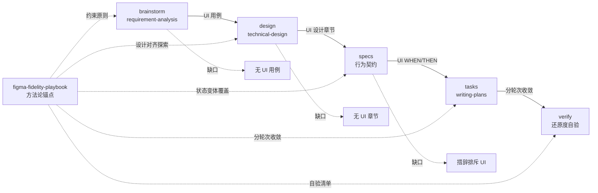

## 一句话描述

为 `superpowers-lite` schema 的规划链路（brainstorm → design → specs → tasks → verify）全链路补齐 UI 维度，以新增的 `figma-fidelity-playbook` skill 为方法论锚点，防止涉及 UI 的变更在规划阶段被结构性遗漏。

## 需求背景

`superpowers-lite` 是 `devkeel` 面向日常开发的精简工作流 schema，当前规划链路的方法论与模板均**无 UI 维度**：

- **brainstorm** 调用 `requirement-analysis`（5W1H/SCAMPER/MECE + 源码调查），模板章节无 UI 位置，"核心功能用例"注释只说"按用户可见能力拆分"，实际产出时"用户可见能力"被窄化为"功能流程能力"，UI/交互用例缺席。
- **design** 调用 `technical-design`（C4/ATAM/STRIDE/SLO），方法论工具箱与强制设计规范五项红线均不含 UI 设计；`design.md` 模板章节（方案设计/数据设计/质量设计/风险与未决/完成检查）无 UI 设计章节。
- **specs** description 直接写"仅 API/跨系统集成时需要"，instruction 适用场景只列举"API 契约/跨系统集成/可测试场景"，且只说"按 design.md 中识别的能力"创建 spec，**无 capability 覆盖度自检**。

链式后果：brainstorm 模板无 UI 维度 → 产出时 UI 只剩 In Scope 散条 → design 模板也无 UI 章节，UI 进一步散落于模块设计 bullet → specs"按 design 识别能力"时 UI 不显著 → **漏掉 UI spec**。

真实触发案例：`max-one` 仓库的 `add-maxone-mobile-login` change 使用本 schema 时，brainstorm In Scope 明确列了"Figma 入口层视觉与交互"与"PhoneLogin/PhoneBind 移动端视觉适配"，但 design 产出无 UI 章节、specs 初版只识别出 `mobile-wechat-auth`（授权流程）与 `mobile-login-gateway`（门禁回跳）两个跨系统能力，**漏掉 `mobile-login-ui`**，经人工指出后才补齐。根因不是执行者疏忽，而是 schema 三环节都没有让 UI 维度"承上启下"的结构性位置。

## 项目现状与架构分析

### harness-cli 仓库架构

```
templates/                          发布模板源（release:templates 发布）
  openspec/schemas/superpowers-lite/
    schema.yaml                     schema 定义（artifacts/instruction/apply）
    templates/                      各 artifact 模板（brainstorm/design/spec/...）
  skills/                           各 skill 的 SKILL.md + references
  versions-yml.yml                  所有模板资产版本唯一权威来源
openspec/                           项目自用副本（dogfood，与 templates/ 同步）
  schemas/superpowers-lite/         与 templates/ 版本完全一致
  changes/                          本 change 产出位置
.harness/skills/                    项目自用 skill 副本（与 templates/skills/ 同步）
```

### 受影响区域

| 区域 | 改动 | 说明 |
|------|------|------|
| `templates/skills/figma-fidelity-playbook/` | 新增 | UI 高保真还原方法论 skill（SKILL.md + 3 references） |
| `.harness/skills/figma-fidelity-playbook/` | 新增 | 项目自用副本，与 templates/ 同步 |
| `templates/versions-yml.yml` | 修改 | 注册 `figma-fidelity-playbook: "1.0.0"` |
| `templates/openspec/schemas/superpowers-lite/schema.yaml` | 修改 | brainstorm/design/specs/tasks/verify 五处 instruction 补 UI 维度；version 6 → 7 |
| `templates/openspec/schemas/superpowers-lite/templates/brainstorm.md` | 修改 | 核心功能用例 + 风险与约束注释补 UI 维度提示 |
| `templates/openspec/schemas/superpowers-lite/templates/design.md` | 修改 | 新增「UI 设计」可选章节 |
| `openspec/schemas/superpowers-lite/` | 修改 | 与 templates/ 版本同步（schema.yaml + brainstorm.md + design.md） |

### 关键模块现状

| 模块 | 现状 | UI 维度缺口 |
|------|------|------------|
| `requirement-analysis` skill | 5W1H/SCAMPER/MECE + 源码调查 | 方法论不强制覆盖 UI 需求维度（不改动 skill 本身，通过 brainstorm instruction 约束） |
| `technical-design` skill | C4/ATAM/STRIDE/SLO + 五项红线 | 方法论工具箱无 UI 设计（不改动 skill 本身，通过 design instruction + 模板章节约束） |
| `brainstorm.md` 模板 | 9 章节，无 UI 位置 | 核心功能用例/风险与约束注释未提示 UI 维度 |
| `design.md` 模板 | 14 章节，无 UI 设计章节 | UI 设计决策无结构化落点 |
| `schema.yaml` specs instruction | "仅 API/跨系统集成时需要" | 措辞排斥 UI；无覆盖度自检 |
| `schema.yaml` tasks instruction | 引用 specs WHEN/THEN 为 TDD RED | 未引用 UI 分轮次收敛流程 |
| `schema.yaml` verify instruction | 7 项检查，无 UI 还原度验证 | 未引用 figma 自验清单 |
| `figma-fidelity-playbook` skill | **不存在** | 需新增，作为全链路 UI 方法论锚点 |

### 规划链路 UI 维度断点



## 风险与约束

| 风险/约束 | 说明 | 缓解 |
|---------|------|------|
| schema 全局性 | superpowers-lite 是默认 schema，改动影响所有使用项目 | UI 章节均为**可选**（标记 optional / "涉及 UI 变更时"），不破坏非 UI change 的现有流程 |
| 两份 schema 同步 | `templates/` 与 `openspec/` 两份必须一致 | tasks 强制同步两份，test 用 diff 校验 |
| figma skill 适用边界 | skill 自身声明"无 Figma 上下文时不使用"，但 brainstorm/design 阶段不一定有 Figma | **分层引用**：规划阶段只引用 skill 的约束性原则（范围/层次/ownership/状态变体），不执行完整流程；完整执行留到 tasks/apply（已有 Figma 上下文时） |
| UI 设计章节方法论空缺 | `technical-design` skill 不含 UI 方法论，design instruction 无法依赖 skill | design instruction 直接给出 UI 章节结构指引，并引用 `figma-fidelity-playbook` 的探索维度作为锚点 |
| 覆盖检查走过场 | specs 覆盖检查对照的 brainstorm In Scope 若 UI 项本身简略，检查易流于形式 | brainstorm 模板同时强化"核心功能用例"的 UI 维度，让 UI 需求在用例层就结构化，覆盖检查有实质内容可对照 |
| skill 嵌入归属 | figma-fidelity-playbook 原源自业务项目（max-one），嵌入 harness-cli 需确定归属 | 作为 `devkeel` 自有 skill 注册（metadata.author=devkeel, version=1.0.0），遵循 skill-versioning 规范 |

**向后兼容性**：所有 UI 维度新增均为可选（模板章节可选 + instruction 条件触发），不修改工作流拓扑（brainstorm → design → specs → tasks → verify 顺序与依赖不变），不删除/重命名现有 artifact，非 UI change 行为不变。

**现有测试覆盖**：harness-cli 有 vitest 套件，本 change 改动的是模板资产（markdown/yaml），不涉及 src/ 运行时代码，现有测试不受影响；新增校验以 diff/grep 为主。

## 目标用户与角色

| 角色 | 关注点 |
|------|--------|
| 使用 superpowers-lite 的 AI Coding Agent（主要） | 规划涉及 UI 的 change 时，三环节自动产出 UI 维度内容，不依赖人工提醒 |
| schema 维护者（harness-cli 工程师） | UI 维度改动是否向后兼容、两份 schema 是否同步、figma skill 是否符合版本规范 |
| 业务项目工程师（下游消费方） | UI 章节是否可选、无 Figma 上下文时是否被强制执行 skill |

## 核心功能用例

### 用例 1：涉及 UI 的 change 在 brainstorm 产出 UI 用例

- **触发**：change 范围包含 UI/交互变更（如新增页面、视觉适配、组件改版）
- **行为**：brainstorm 阶段"核心功能用例"除功能流程用例外，产出 UI/交互用例（视觉呈现、视图状态切换、交互形态）；"风险与约束"纳入设计稿就绪度、视觉规范一致性、桌面/移动兼容等 UI 约束
- **预期**：UI 需求在用例层结构化，不只剩 In Scope 散条

### 用例 2：design 产出 UI 设计章节

- **触发**：brainstorm 产出含 UI 用例，进入 design 阶段
- **行为**：design.md 新增「UI 设计」可选章节，内容对齐 figma-fidelity-playbook 探索维度：实现范围（整页/区块/组件/状态变体）、运行时层次与 ownership、高风险失真点、状态变体清单、视觉适配策略；有 Figma 上下文时调用 figma-fidelity-playbook 做设计对齐探索
- **预期**：UI 设计决策有结构化落点，承接 brainstorm UI 用例

### 用例 3：specs 覆盖 UI 行为契约并做覆盖度自检

- **触发**：design 产出 UI 设计章节，进入 specs 阶段
- **行为**：specs instruction 不再限定"仅 API/跨系统"；识别 capability 后对照 brainstorm In Scope + 核心用例做覆盖度自检，UI 维度产出对应 spec，且 UI 行为契约覆盖关键状态变体（不只默认态）
- **预期**：UI 能力不被遗漏；UI spec 含状态变体场景

### 用例 4：tasks 引用 figma 分轮次收敛流程

- **触发**：specs 含 UI 行为契约，进入 tasks 阶段
- **行为**：tasks instruction 引用 figma-fidelity-playbook 的分轮次收敛（结构 → 视觉 → 交互状态）作为 UI 实现任务的拆解指导
- **预期**：UI 实现任务有方法论指导，不是零散样式修补

### 用例 5：verify 用 figma 自验清单做 UI 还原度验证

- **触发**：apply 完成含 UI 变更的实现，进入 verify 阶段
- **行为**：verify instruction 引用 figma-fidelity-playbook 的 `references/checklist.md` 作为 UI 还原度验证清单（对照 Figma 截图 + 真实运行容器）
- **预期**：UI 还原度有可勾选的验证标准，不只凭肉眼

### 用例 6：非 UI change 不受影响

- **触发**：change 范围不含 UI 变更（纯后端、纯逻辑、bug fix）
- **行为**：brainstorm 不产出 UI 用例、design 跳过 UI 设计章节、specs 不强制 UI spec，流程与本次变更前一致
- **预期**：UI 维度全部可选，不增加非 UI change 的仪式感负担（呼应"流程仪式感与风险成正比"）

## 需求边界

**In Scope:**
- 新增 `figma-fidelity-playbook` skill（SKILL.md + references/workflow.md + references/traps.md + references/checklist.md），注册到 templates/skills/ 与 .harness/skills/，versions-yml.yml 注册 1.0.0
- `schema.yaml` 五处 instruction 补 UI 维度：brainstorm（UI 用例提示）、design（UI 章节指引 + figma 引用）、specs（措辞修正 + 覆盖度自检）、tasks（figma 分轮次收敛引用）、verify（figma checklist 引用）
- `brainstorm.md` 模板：核心功能用例 + 风险与约束注释补 UI 维度提示
- `design.md` 模板：新增「UI 设计」可选章节
- schema.yaml `version: 6 → 7`（内容变更必须 +1）
- 两份 schema（templates/ 与 openspec/）同步

**Out of Scope:**
- 不修改 `requirement-analysis` / `technical-design` skill 本身（方法论保持，通过 instruction + 模板约束补 UI）
- 不修改工作流拓扑（artifact 顺序、依赖、optional 标记不变）
- 不新增/删除/重命名 artifact
- 不强制每个 change 都产出 UI 维度（UI 章节可选，仅"涉及 UI 变更时"触发）
- 不在 harness-cli 内消费具体 Figma 设计稿（figma skill 是通用方法论资产，不绑定具体项目）
- 不改动 src/ 运行时代码、不改动 CLI 命令注册

## 探索过的替代方向

| 替代方向 | 取舍 |
|---------|------|
| **只补 design 中段**（design 模板加 UI 章节 + instruction） | 否决。brainstorm 源头不补，design 无好输入；specs 下游不补，覆盖检查对照单薄。中段补丁治标不治本，真实案例正是 design 无 UI 章节导致 specs 漏识别 |
| **只补 specs 覆盖检查**（specs instruction 加对照 In Scope 自检） | 否决。覆盖检查对照的 brainstorm 若 UI 项本身简略，检查流于形式。且 design 无 UI 章节，specs 识别能力仍无来源 |
| **改动 technical-design skill 加 UI 方法论** | 否决。technical-design 是通用方案设计 skill，强行塞 UI 方法论会稀释其架构/安全聚焦；UI 方法论由专用 skill（figma-fidelity-playbook）承载更符合单一职责 |
| **UI 章节设为必选**（非 UI change 也要写"不涉及"） | 否决。违反"流程仪式感与风险成正比"，增加非 UI change 负担。选"可选 + 条件触发" |
| **全链路补 + figma-fidelity-playbook 锚点**（推荐） | 采纳。三环节模板/instruction 全补 + 新增专用 UI 方法论 skill 作为锚点，分层引用避免误触发，治本 |

## 待确认项

无。关键决策已在讨论中收敛：全链路补（非中段补丁）、figma skill 作锚点（非改 technical-design）、UI 章节可选（非必选）、分层引用（规划阶段只引用约束原则，完整执行留到 apply）、自有 skill 归属（devkeel, 1.0.0）。
