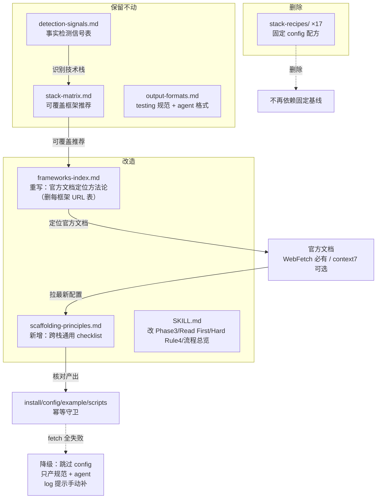

## 一句话描述

删 stack-recipes 17 份 + 重写 frameworks-index 为文档定位方法论 + 新增 scaffolding-principles 清单 + 同步改 SKILL.md；Agent 凭 detection+matrix+官方文档+清单自主产出脚手架，fetch 全失败诚实降级跳过 config。首版交付：4 处 references 改动 + SKILL.md 同步 + .harness 副本同步。

## 方案设计

### 架构概览



### 方案对比

| 维度 | 方案 A：全删+方法论+清单（推荐） | 方案 B：删 recipes 留 frameworks-index URL 表 | 方案 C：删 recipes+matrix 全自主 |
|------|------|------|------|
| 不写死 | ✅ recipes + URL 表全删 | ❌ URL 表仍是小号配方，会过期 | ✅ 全删 |
| 覆盖任意栈 | ✅ Agent 拉文档即可 | ⚠️ 非列表栈仍要自己找 URL | ✅ |
| 选型有锚点 | ✅ 保留 matrix 可覆盖提示 | ✅ 保留 matrix | ❌ 每次从零推导，发散风险 |
| 质量底线 | ✅ scaffolding-principles 清单 | ⚠️ 无清单，靠 recipes 残留习惯 | ⚠️ 无清单 |
| 离线降级 | ✅ 跳过 config 只产规范（诚实） | ⚠️ 无 recipes 兜底，同 A 但未明示 | ✅ 同 A |
| 维护成本 | ✅ 低（方法论+清单少过期） | ⚠️ URL 表仍需维护 | ✅ 最低 |

**采纳方案 A**。理由：recipes（精确 config）和 frameworks-index 的 URL 表都是「写死」且会过期，一并治理才彻底；matrix 极轻量少过期，留作可覆盖提示防止选型发散；scaffolding-principles 补回质量底线。方案 B 治标（URL 表仍过期），方案 C 过度（删 matrix 增发散风险）。

### 模块设计

改动按「1 删 + 1 重写 + 1 新增 + 1 同步」组织：

| 模块 | 文件 | 改动 | 依赖 |
|------|------|------|------|
| 删固定配方 | `references/stack-recipes/`（17 份） | 删除整个目录 | 无 |
| 重写文档定位 | `references/frameworks-index.md` | 删每框架 URL 表，写定位方法论 | 无 |
| 新增质量清单 | `references/scaffolding-principles.md` | 跨栈通用 checklist | 无 |
| 同步入口 | `SKILL.md` | Phase3/Read First/Hard Rule4/流程总览 | 上述三者 |
| 副本同步 | `.harness/skills/verify-init/` | 与 templates/ 一致 | templates/ 改动完成 |

依赖方向：frameworks-index 重写与 scaffolding-principles 新增是平级，SKILL.md 改动引用两者；副本同步依赖 templates/ 全部完成。

### 代码设计预览

#### 1. frameworks-index.md 重写结构

从「每框架 URL 表 + fetch 策略」改为「文档定位方法论 + fetch 链」：

```markdown
# 官方文档定位方法论

Phase 3 脚手架产出前，按本方法论定位每个要补齐框架的官方文档，
作为配置产出的权威来源。不内置任何框架的固定 URL 或 config。

## 定位步骤（从项目现状出发）

1. **从 manifest 取包名** — package.json dependencies/devDependencies、
   pyproject.toml、go.mod、Cargo.toml、pom.xml 中已声明或要安装的包名
2. **定位官方文档源**（按优先级）：
   - context7 MCP（可用时）— resolve-library-id(包名) → query-docs(配置/最佳实践)
   - WebFetch 官方文档站 — 包名对应的官方 docs 站点（从 npm/pypi/crates.io 页面找 homepage）
   - WebSearch — 搜「<包名> testing configuration <年份>」找最新实践
   - GitHub README — 包的仓库 README（通常含 quickstart + 配置示例）
3. **提取产出要素** — 安装命令（对应包管理器）、config 文件 schema、
   一个最小可跑示例、scripts 约定、覆盖率/超时最佳实践

## fetch 链（context7 首选非必需）

1. context7 MCP（可选加速）— 环境有则用，无则跳过，不报错
2. WebFetch（内置必有，主力）— 任何 Claude Code 环境都有
3. 全失败 → 见 SKILL.md Hard Rule 4 降级（跳过 config 只产规范）

## 质量标准

| 标准 | 要求 |
|------|------|
| 来源权威 | 优先官方文档站/GitHub README，不凭记忆 |
| 版本对应 | 确认文档对应当前安装版本，非旧版 |
| 不照搬 | 借鉴结构与深度，不复制全文 |
| 降级明确 | fetch 失败必须 log() 提示，不静默吞错 |
```

#### 2. scaffolding-principles.md 新增结构

跨栈通用 checklist，不含任何栈 config：

```markdown
# 脚手架产出原则

Agent 拉完官方文档后，按本清单核对产出。不写任何技术栈的 config，
只列「一个合格测试脚手架必须包含什么 + 跨栈通用注意点」。

## 必含项（缺一不可）

- [ ] 安装命令 — 用检测到的包管理器（pnpm/npm/pip/uv/go get/cargo add/maven）
- [ ] 配置文件 — 框架官方约定的 config（vitest.config.ts / pytest.ini / 等），已存在则跳过或提示合并
- [ ] 每类测试一个最小示例 — 单测 + (若有)集成/e2e/API，能立刻跑通
- [ ] 执行 scripts — test / test:unit / test:e2e / test:coverage（按栈调整，Python 用 Makefile 或 pyproject）
- [ ] 幂等守卫 — 每步 existsSync 检查，已存在不覆盖

## 跨栈通用注意点（官方文档不会告诉你）

- **CI 先 build** — bin 指向 dist/ 的项目（如 cli-node），集成测试前需 build；
  test:ci 脚本含 `build && test`
- **覆盖率门槛** — 新增/变更文件 ≥80%（项目可在 R4 调整），e2e 不计入
- **e2e trace** — Playwright `trace: 'on-first-retry'`、失败留截图，便于复盘
- **API 测试内存优先** — 后端 API 测试用内存 TestClient（FastAPI TestClient /
  Spring MockMvc），不起独立进程
- **mock 边界** — 只 mock 跨进程边界（HTTP/DB/外部服务），不 mock 被测内部函数
- **执行分层** — test 跑单测（快）、test:e2e 单独跑（慢不阻塞日常）、test:ci 全量

## 产出核对流程

1. 拉到官方文档 → 提取安装/config/示例/scripts
2. 对照「必含项」逐项确认齐全
3. 对照「跨栈注意点」逐项确认已考虑（不适用的标注 N/A）
4. 幂等守卫就位后执行安装/写文件/补 scripts
5. 缺项或无法确认 → 不编造，log() 提示用户补
```

#### 3. SKILL.md 改动 diff 预览

**Read First 段**（删 recipes 加 principles）：

```diff
 - `references/detection-signals.md` — 领域+技术栈+框架已存在检测信号表、降级策略
 - `references/stack-matrix.md` — 领域→技术栈→测试框架映射表（v1 四大类）
-- `references/frameworks-index.md` — 框架对照表 + context7/WebFetch fetch 策略
+- `references/frameworks-index.md` — 官方文档定位方法论 + fetch 链（context7 首选非必需）
+- `references/scaffolding-principles.md` — 脚手架产出原则 checklist（必含项 + 跨栈注意点）
 - `references/output-formats.md` — testing 规范 + test-verifier agent 格式规范
-- `references/stack-recipes/` — 每技术栈固定配方基线（安装/config/示例/scripts）
```

**流程总览**（Phase 3 描述）：

```diff
-Phase 3: 脚手架     → fetch 增强 + 固定基线 → 安装+配置+示例+scripts（幂等）
+Phase 3: 脚手架     → 定位官方文档 → 照 scaffolding-principles 产出 install/config/example/scripts（幂等）
```

**Hard Rule 4**（fetch 降级）：

```diff
-4. **fetch 失败降级不阻塞** — frameworks-index 的 context7/WebFetch 增强失败时，降级用 stack-recipes 固定基线，`log()` 提示，不静默吞错
+4. **fetch 失败降级不阻塞** — context7 + WebFetch 都失败时，跳过精确 config 产出，只生成 testing 规范 + 验证 agent，`log()` 提示「未能获取 <框架> 官方文档，config 请手动补」。不凭记忆编造可能过时的 config
```

**Hard Rule 8**（由 Claude 照配方执行 → 照 principles 产出）：

```diff
-8. **由 Claude 执行安装命令** — 纯文档驱动，不内置安装脚本；按 stack-recipes 配方中的精确命令执行
+8. **由 Claude 执行安装命令** — 纯文档驱动，不内置安装脚本；按官方文档 + scaffolding-principles 产出精确命令执行
```

**Phase 3.1-3.3 重写**（fetch 增强+叠加基线 → 定位文档+照清单产出）：

```diff
-### 3.1 fetch 增强（可选）
-读取 `references/frameworks-index.md`，按 fetch 策略列：
-1. 优先 context7 ... 2. 降级 WebFetch ... 3. 提取增强点
-
-### 3.2 叠加固定基线
-将增强点合并进 `stack-recipes/<stack>.md` 的固定基线配置。fetch 失败 → 仅用固定基线 + log()
-
-### 3.3 执行（由 Claude 照配方）
-1. 安装依赖 ... 2. 写配置文件 ... 3. 写示例测试 ... 4. 更新 scripts

+### 3.1 定位官方文档
+读取 `references/frameworks-index.md`，按定位方法论：从 manifest 取包名 →
+context7（可用时）/ WebFetch（必有）/ WebSearch / GitHub README 找官方文档，
+提取安装命令、config schema、示例、scripts、最佳实践
+
+### 3.2 照清单产出
+读取 `references/scaffolding-principles.md`，对照必含项 + 跨栈注意点核对产出：
+安装命令（检测到的包管理器）/ config 文件（已存在则跳过）/ 每类一个示例 / scripts / 幂等守卫
+
+### 3.3 执行（由 Claude 照 principles）
+1. 安装依赖 — 按官方文档精确命令执行
+2. 写配置文件 — 按官方文档 schema（已存在则跳过或提示合并）
+3. 写示例测试 — 每类一个最小可跑示例
+4. 更新 scripts — test/test:unit/test:e2e/test:coverage（已有则不覆盖）
+fetch 全失败 → 跳过 1-4，log() 提示，只产 Phase 4 规范+agent
```

#### 4. 删除范围

`references/stack-recipes/` 下 17 份全删：

```
frontend-react.md  frontend-vue.md  frontend-angular.md  frontend-svelte.md
backend-node.md  backend-python.md  backend-go.md  backend-java-spring.md
react-native.md  flutter.md  ios-swift.md  android.md
cli-node.md  cli-rust.md  cli-go.md
library-node.md  library-python.md
```

不留任何样例（principles 纯清单 + stack-matrix 已足够 Agent 拼出配方）。

### 数据设计

本次不引入持久化数据模型，仅 markdown 文本资产改动：

| 数据 | 位置 | 用途 |
|------|------|------|
| 文档定位方法论 | `frameworks-index.md` | Agent 找官方文档的步骤 |
| 产出原则清单 | `scaffolding-principles.md` | 脚手架产出核对 + 跨栈注意点 |
| 删除的固定 config | stack-recipes/（删） | 不再依赖写死配置 |

## 质量设计

### 安全（向后兼容性降级）

STRIDE 不适用（无运行时攻击面）。降级为**向后兼容性**分析：

- verify-init skill 未发布（1.0.0 刚加 versions-yml，无 tag），无下游消费者，删 17 份配方无破坏性影响
- detection-signals / stack-matrix / output-formals 不动，Phase 1/2/4 行为不变
- 仅 Phase 3 产出路径改变：从「fetch+固定基线」→「文档+清单」，fetch 全失败降级从「用基线」→「跳过 config」

### 旁路隔离

context7 MCP 是旁路——环境无 context7 时，WebFetch（内置必有）兜底，不阻塞主链路。fetch 全失败时跳过 config 产出但规范+agent 仍产出，主链路（Phase 1/2/4/5）不中断。

## 风险与未决

| 风险 | 缓解 | 状态 |
|------|------|------|
| fetch 全失败无 config 兜底 | 诚实降级跳过 config 只产规范，不编造 | 已在 Hard Rule 4 明示 |
| Agent 拉到过时/错误文档 | frameworks-index 质量标准要求「版本对应」「来源权威」 | 已规划 |
| scaffolding-principles 清单过长变负担 | 只列必含项 + 跨栈注意点，不含任何栈 config | 已规划 |
| 双份副本不同步 | task 用 diff -rq 校验 templates/ 与 .harness/ | 已规划 |

无未决问题。

## 完成检查

- [x] technical-design 方法论已等价应用（方案对比 ≥2 候选 + 打分 + 架构概览 Mermaid + 模块设计 + 代码设计预览 + 风险分析）。注：本变更是纯 skill 模板文本资产改动，不涉及运行时架构，C4/STRIDE/量化 SLO 等重型方法论不适用，已手动降级为「方案对比 + 向后兼容性分析 + 旁路隔离」轻量分析，降级原因已说明。
- [x] 存在 ≥ 2 候选方案对比（方案 A/B/C 含 6 维度打分）
