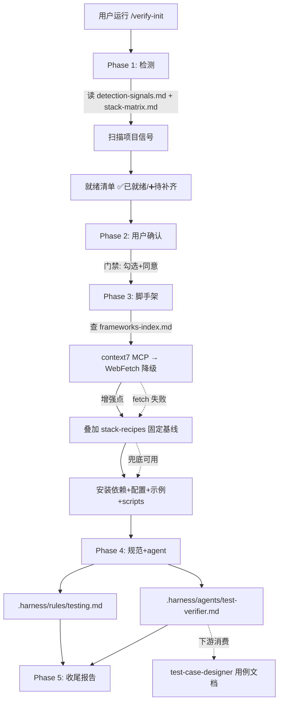

## 一句话描述

新增 `verify-init` skill：扫描项目领域与技术栈，自动检测已有测试框架，经用户确认后增量补齐测试脚手架（框架+配置+示例+scripts）+ 生成通用 testing 规范 + 生成验证 agent；首版交付 SKILL.md + 6 references + 17 stack-recipes + versions-yml 注册。

## 方案设计

### 架构概览



### 方案对比

| 维度 | 方案 A：纯文档驱动 + 固定配方 | 方案 B：文档 + 内置脚本 | 方案 C：纯动态（仅对照表 fetch） |
|------|------|------|------|
| 离线可用 | ✅ 固定配方兜底 | ✅ 脚本内嵌配置 | ❌ fetch 失败即瘫 |
| 可复现性 | ✅ 基线固定，增强可选 | ✅ 脚本确定性 | ❌ 文档版本波动 |
| 维护成本 | 中（18 配方需维护） | 高（脚本 + 配方双份） | 低（只维护对照表） |
| 与项目哲学契合 | ✅ YAGNI 纯逻辑 | ❌ 违反 YAGNI | ⚠️ 降级无兜底 |
| 配置质量上限 | 中-高（基线+增强） | 中（基线为主） | 高（纯最新实践）但无下限 |

**采纳方案 A**。理由：与 harness「防御式存在性检查 + 静默降级」「YAGNI 纯逻辑」哲学一致；固定配方保证质量下限和离线可用，frameworks-index 增强拉高上限。方案 B 维护成本高且违反项目哲学；方案 C 无质量下限、离线不可用。

### 模块设计

skill 内部分 4 类 references，职责清晰、各自可独立理解：

| 模块 | 文件 | 职责 | 依赖 |
|------|------|------|------|
| 检测层 | `detection-signals.md` | 领域+技术栈+框架已存在检测信号表 | 无 |
| 映射层 | `stack-matrix.md` | 领域→技术栈→测试框架映射表（v1 四大类） | 检测层信号 |
| 增强层 | `frameworks-index.md` | 框架对照表 + context7/WebFetch fetch 策略 | 无 |
| 配方层 | `stack-recipes/<stack>.md` ×18 | 每技术栈固定配方基线（安装/config/示例/scripts） | 增强层提供增强点 |
| 产出层 | `output-formats.md` | testing 规范 + test-verifier agent 格式 | 无 |

依赖方向单向无环：检测层 ← 映射层；增强层 ← 配方层；产出层独立。符合项目「lib 层间依赖为有向无环图」精神。

### 领域 → 技术栈 → 框架映射（stack-matrix 摘要）

| 领域 | 信号 | 单测 | e2e/API |
|------|------|------|---------|
| 前端-react | react/next + vite | vitest + RTL + jsdom | Playwright |
| 前端-vue | vue/nuxt | vitest + @vue/test-utils | Playwright |
| 前端-angular | angular | vitest/Karma | Playwright |
| 前端-svelte | svelte/sveltekit | vitest + RTL/svelte | Playwright |
| 后端-node | express/fastify/nestjs/koa | vitest（或已有 Jest） | supertest |
| 后端-python | fastapi/django/flask | pytest | pytest + httpx/TestClient |
| 后端-go | gin/echo/fiber | testing + testify | httptest + testify |
| 后端-java-spring | pom.xml + spring | JUnit 5 + Mockito | MockMvc / RestAssured |
| 移动-rn | react-native | jest + RTL/react-native | Detox / Maestro |
| 移动-flutter | pubspec.yaml | flutter test | integration_test |
| 移动-ios | *.xcodeproj | XCTest | XCUITest |
| 移动-android | build.gradle + android | JUnit 4 + Robolectric | Espresso |
| cli-node | commander/yargs/bin | vitest + execa | execa 跑真实 bin |
| cli-rust | clap/[[bin]] | cargo test + assert_cmd | assert_cmd |
| cli-go | go.mod + main.go | testing + testify | 黄金文件对比 |
| library-node | exports/main 无 bin | vitest | — |
| library-python | [lib]/pyproject | pytest | — |

未命中 → `custom:<标签>`，只配基础结构 + 通用规范，不强制装框架。

### 执行流程（4 阶段）

```
Phase 1 检测       → 领域 + 技术栈 + 已有框架 + 缺口（就绪清单）
Phase 2 确认       → 用户勾选要补齐项（门禁，补齐前需同意）
Phase 3 脚手架     → fetch 增强 + 固定基线 → 安装+配置+示例+scripts（幂等）
Phase 4 规范+agent → testing.md + test-verifier.md
Phase 5 收尾       → 报告 + review 提示 commit
```

**幂等机制**：Phase 3 每步 `existsSync` 守卫——已有框架标记「✅ 已就绪」不重复装，已有配置文件不覆盖，已有 scripts 不覆盖。

**降级机制**：frameworks-index fetch 失败 → 用 stack-recipes 固定基线 + `log()` 提示「未能获取 <框架> 最新文档，使用基线配置」，不阻塞。

### 验证 agent 设计（test-verifier）

**角色**：验证执行者。不写用例（test-case-designer 职责）、不改被测逻辑（executor 职责）。只做：待验证声明 → 映射可执行测试 → 跑 → 判定 → 回报。

**强制启动步骤**：确认验证目标（读 AGENTS.md 路由表 + testing.md）→ 识别变更范围（git diff/status）→ 映射测试类型（纯逻辑→单测 / API→API测试 / 页面→e2e / 跨层→组合）→ 判断是否补回归测试 → 收窄 scope 跑对应 script → 解析结果 → blocker-first 回报。

**衔接 test-case-designer**：不直接消费 TC 文档翻译成代码。当用户要求「验证 TC-xxx」时，把该 TC 预期结果当作验证目标断言，检查现有测试是否覆盖——覆盖则跑、未覆盖则提示「该 TC 缺可执行落点，需先实现测试」。

### 文件结构

```
templates/skills/verify-init/
├── SKILL.md                       主流程编排（4 阶段）+ Hard Rules
└── references/
    ├── detection-signals.md       领域+技术栈+框架已存在检测信号
    ├── stack-matrix.md            领域→技术栈→框架映射表
    ├── frameworks-index.md        框架对照表 + context7/WebFetch fetch 策略
    ├── stack-recipes/             17 技术栈固定配方基线
    │   ├── frontend-react.md / frontend-vue.md / frontend-angular.md / frontend-svelte.md
    │   ├── backend-node.md / backend-python.md / backend-go.md / backend-java-spring.md
    │   ├── react-native.md / flutter.md / ios-swift.md / android.md
    │   ├── cli-node.md / cli-rust.md / cli-go.md
    │   └── library-node.md / library-python.md
    └── output-formats.md          testing 规范 + test-verifier agent 格式
```

**产物去向**：

| 产物 | 位置 |
|------|------|
| 框架配置文件 | 项目根（vitest.config.ts / playwright.config.ts / pytest.ini 等） |
| 示例测试 | tests/ / e2e/ 等 |
| package.json scripts | package.json（已有不覆盖） |
| testing 规范 | `.harness/rules/testing.md` |
| 验证 agent | `.harness/agents/test-verifier.md` |

**版本注册**：`SKILL.md` metadata `author: "devkeel"`, `version: "1.0.0"`；`versions-yml.yml` 注册 `verify-init: "1.0.0"`（两处一致，符合 skill-versioning 规范）。触发词：`验证初始化`、`测试平台搭建`、`verify-init`、`搭建测试基建`。

## 质量设计

### 旁路隔离

frameworks-index 的 context7/WebFetch 增强是「旁路」——fetch 失败不影响主流程（固定基线兜底）。降级时 `log()` 明确提示，不静默吞掉，符合项目「catch 块静默吞错但将决策权交给调用方」精神。

## 风险与未决

| 风险 | 缓解 | 状态 |
|------|------|------|
| 17 个 stack-recipes 工作量大 | tasks.md 按技术栈分组分批生成，每组独立可提交 | 已规划，见 tasks |
| 框架版本演进导致配方过时 | frameworks-index 定期 fetch 最新文档；固定配方作为已验证兜底 | 后续维护项 |
| custom 领域覆盖不足 | v1 明确只覆盖四大类，custom 降级为基础结构+通用规范 | 已在边界声明 |

无未决问题。

## 完成检查

- [x] technical-design 方法论已等价应用（方案对比 ≥2 候选 + 质量属性打分 + 架构概览 Mermaid + 模块设计 + 风险分析）。注：本 skill 是纯模板资产新增，不涉及 src/ 代码或运行时架构，C4/ATAM/STRIDE 等重型方法论不适用，已手动降级为「方案对比 + 模块设计 + 旁路隔离」轻量分析，降级原因已说明。
- [x] 存在 ≥ 2 候选方案对比（方案 A/B/C 含质量属性打分）
