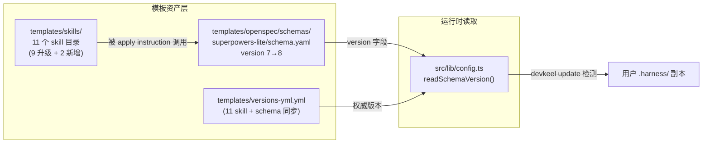
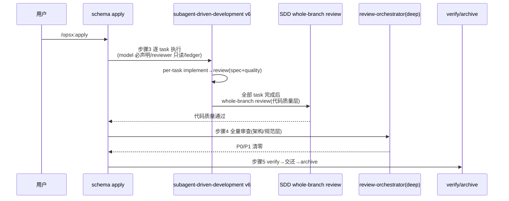

## 一句话描述

9 个 superpowers skill 整目录替换为 v6.0.3 + 嵌入 2 个新 skill + superpowers-lite schema apply 步骤 3/4 适配 v6 新契约（分层互补）+ 版本同步；首版交付清单见 tasks。

## 方案设计

### 架构概览



改动全部落在模板资产层，`src/` 命令层零改动（`readSchemaVersion()` 逻辑不变，只是读到的 version 从 7 变 8）。

### 方案对比

**候选 A：整目录替换（推荐）**
v6 多个 skill 带附属文件（SDD 的 task-reviewer-prompt.md/implementer-prompt.md/scripts、systematic-debugging 的 11 个参考文件、requesting-code-review 的 code-reviewer.md、test-driven-development 的 testing-anti-patterns.md、writing-plans 的 plan-document-reviewer-prompt.md）。整目录删除后从 `/tmp/superpowers-v6/skills/<name>/` 复制，保证附属文件与上游一致。

**候选 B：仅替换 SKILL.md**
放弃，会丢失 v6 新增的附属文件（task-reviewer-prompt.md 等），SDD v6 review 流无法工作。

**候选 C：git subtree/vendor 上游**
放弃，引入维护复杂度，且 harness 的 embed 模式本就是快照嵌入非实时跟踪。

**结论**：候选 A。取舍点见下表。

| 维度 | A 整目录替换 |
|---|---|
| 附属文件完整性 | ✅ 与上游一致 |
| embed spec 合规 | 需后处理：brainstorming 去 visual-companion、所有 skill 注入 `metadata.author/version`、清理 `superpowers:` 前缀 |
| 维护成本 | 单次快照，无持续同步负担 |

### 关键时序

apply 阶段执行链（v6 后）：



步骤 3 与步骤 4 的分层互补是本次设计核心：SDD v6 自带的 whole-branch review 负责代码质量（spec 符合性 + 质量），schema 步骤 4 的 review-orchestrator(deep) 负责架构/规范层（含 architecture-guardian 等专项 reviewer + harness 工具链），两者职责正交、不重复跑同一维度。

### 模块设计

**skill 升级处理规则**（每个 skill 统一流程）：

| 步骤 | 操作 |
|---|---|
| 1 | 删除 `templates/skills/<name>/` 旧目录 |
| 2 | 从 `/tmp/superpowers-v6/skills/<name>/` 复制全部文件 |
| 3 | 注入 frontmatter：`metadata.author: "superpowers"` + `metadata.version: "<v6 实际版本>"` |
| 4 | 清理 `superpowers:` 前缀 → 裸名 |
| 5 | brainstorming 专项：删除 visual-companion.md、scripts/、SKILL.md 中 Visual Companion section（embed spec 要求） |

**v6 skill 版本处理**：v6 SKILL.md 无 `version` 字段（上游不用版本号）。按 skill-versioning.md「外部 skill 保留原作者风格」，但 harness embed spec 要求 `metadata.version` 存在用于 update 检测。折中：用上游 release tag 作为版本号（`"6.0.3"`），保留 semver 风格同时可被 update 机制识别。

**schema apply 步骤 3 改动点**：

| v6 新契约 | schema instruction 对应表述 |
|---|---|
| model 必须声明 | 「每次 dispatch subagent 必须显式声明 model，按 SDD v6 的 model 选择指引（机械任务用廉价模型、判断任务用标准模型、whole-branch review 用最强模型）」 |
| reviewer 只读 | 「task reviewer 只读工作区，不 checkout/不修改代码」 |
| 禁止压制 severity | 「禁止在 dispatch 时告知 reviewer 跳过某 finding 或预判 severity」 |
| scratch 路径 | 「SDD scratch（task brief、review package、progress ledger）走 `.superpowers/sdd/`，已 gitignore」 |
| progress ledger | 「支持断点续跑：apply 启动时先读 `.superpowers/sdd/progress.md`，跳过已完成 task」 |
| diff 文件传递 | 「review package 通过 `scripts/review-package BASE HEAD` 写文件传递，不粘贴 diff」 |

**schema apply 步骤 4 改动点**（分层互补明文化）：

```
步骤 4 全量代码审查（架构/规范层，与步骤 3 SDD whole-branch review 互补）：

SDD v6 的 whole-branch review 已完成代码质量层审查（spec 符合性 + 代码质量）。
本步骤 review-orchestrator(deep) 聚焦架构/规范层：
- 分层越界、依赖方向违规（architecture-guardian）
- CLI 接口、文件系统安全、跨平台兼容（cli-node-reviewer 等专项）
- harness 工具链一致性（config.yml、versions-yml、gitignore）

两者职责正交，不重复审查同一维度。
```

**verify §6 泄漏检测器**：v6 后 SDD scratch 改到 `.superpowers/sdd/`，`docs/superpowers/` 泄漏检测仍保留（输出重定向到 change 目录的约束不变）。无需改动。

### 数据设计

`templates/versions-yml.yml` 的 `skills:` 段新增 2 个条目、更新 9 个版本；`schemas:` 段 `superpowers-lite: "7"` → `"8"`。无数据模型变更。

## 风险与未决

| 风险 | 缓解 |
|---|---|
| 测试 hardcode 旧版本号（5.1.0/5.1.1/7） | 升级后跑 `pnpm test`，按失败项修断言为新版本 |
| `.superpowers/sdd/` 未被 gitignore | 确认 .gitignore 含该条目（随 skill 带入 self-ignoring，但项目根 .gitignore 需补） |
| `superpowers:` 前缀清理遗漏 | 升级后 `grep -rn "superpowers:" templates/skills/` 校验清零 |
| embed spec（spec.md 第 4 行）仍写「8 个 skill / 5.1.0」 | specs artifact 需同步更新 embed spec（11 个 skill + v6 版本） |

无未决问题。

## 完成检查

- [x] technical-design skill 已调用（手动降级：本变更是模板资产升级，架构改动局限于 schema instruction 文字，按 editing-discipline 最小改动原则手动产出 design，未触发完整 technical-design 流程；方案对比已给出 3 候选）
- [x] 存在 ≥ 2 候选方案对比（A/B/C，已说明排除理由）
- [x] 关键时序图已产出（apply 执行链）
- [x] 模块设计已明确 skill 升级处理规则 + schema 步骤 3/4 改动点
- [x] 风险已识别且均有缓解
