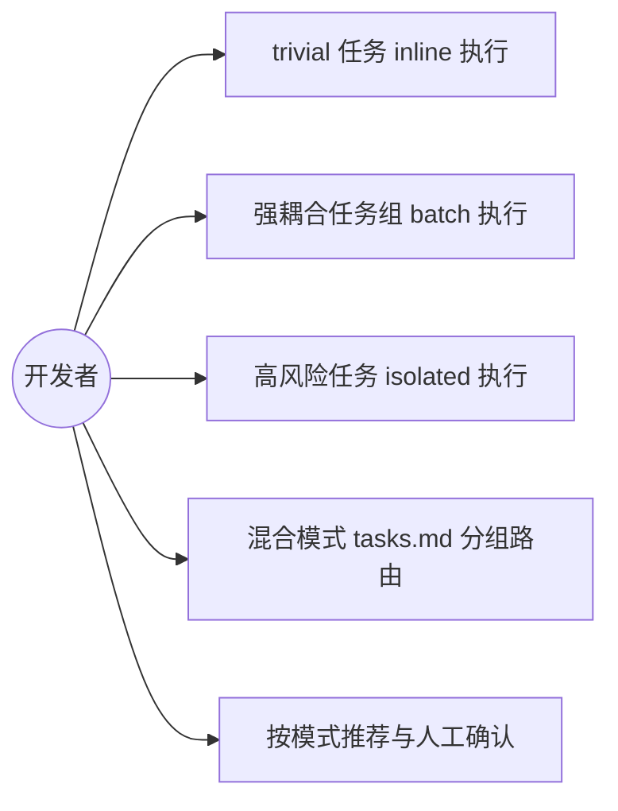

## 一句话描述

为 superpowers-lite 的 apply 阶段引入执行模式分层（inline/batch/isolated，按「风险×耦合度」驱动）+ tasks.md task 粒度规范，把一份 20-task 的 tasks.md apply 耗时从 60-90 分钟降到 20-30 分钟，同时保留高质量档（isolated）给真正高风险的变更。

## 需求背景

当前 superpowers-lite 的 apply 阶段硬编码调用 `subagent-driven-development` skill 逐 task 执行：每个 task 派一个独立 implementer subagent + 每 task 强制 TDD（red-green 双跑）+ 每 task 后 task-reviewer review + 全部完成后 review-orchestrator(deep) 全量审查（最多 3 轮 fix）。

实测痛点：一份 20 个 task 的 tasks.md（案例 `add-mobile-summary-page`，笔记总结页移动端适配，前后端双子项目）apply 执行下来需要 60-90 分钟，无法满足日常开发节奏。开销大头是 **per-task subagent spawn × N**（20 次 cold-start round-trip）+ **每 task TDD red-green 双跑慢测试栈**（后端 5 个 `@SpringBootTest` task 各启动 Spring 上下文，TDD 让其翻倍，约 10 次上下文启动）。

前置研究覆盖了 12 个同类编排框架（GSD Core / BMAD / claude-code-harness / ECC / OMC / OMX / Ralph / addyosmani-agent-skills / mattpocock-skills / gastown / gstack / agency-agents）。结论：subagent-driven-development 的 per-task subagent + 恒定重仪式是独一份的最重范式，没有第二个项目把它当默认形态。共识方向是——默认单 agent 顺序 + 逐 task commit + 按 blast radius 分层验证，subagent/worktree 降为 opt-in 重档。

## 项目现状与架构分析

### apply 执行链现状（schema.yaml 顶层 `apply:` 字段，第 516-683 行，非 artifact）

5 步执行链：

| 步骤 | 现状 | 问题 |
|---|---|---|
| 1. 工作区 | per-change worktree 二选一询问（AskUserQuestion），不是 per-task worktree | worktree 开销不是大头（一 change 一次） |
| 2. 工作区初始化 | submodule + setup 脚本 | 无问题 |
| 3. 执行器 | 记 base SHA → 调 SDD 逐 task；含 SDD v6 契约（model 分级、reviewer 只读、scratch 走 `.superpowers/sdd/`、progress ledger 断点续跑）；测试策略每 task 只跑 `test:` 字段 | **执行单元硬绑定 per-task**，无分层 |
| 4. 全量审查 | review-orchestrator(deep) + fixer 循环，最多 3 轮 | 恒定重仪式，不分模式 |
| 5. 后续 | verify → 交还用户 → archive 两阶段 | 无问题 |

**关键校正**：实际是 **per-change worktree + per-task subagent**，不是每 task 一个 worktree。worktree 创建开销可忽略，真正的大头是 per-task subagent spawn × N + 每 task TDD red-green 双跑慢测试栈。SDD v6 已有的优化（每 task 只跑 `test:` 字段、progress ledger、model 分级、whole-branch review）不能丢。

### SDD skill 现状（templates/skills/subagent-driven-development/SKILL.md）

- per-task 是硬绑定：SKILL.md:11/15 明确 "fresh subagent per task"，Red Flag（:376）禁止并行 dispatch
- **存在兄弟 skill `executing-plans`**：writing-plans 的 Execution Handoff（SKILL.md:159-177）本就提供二选一——Subagent-Driven（per-task fresh subagent + 两阶段 review）vs Inline Execution（executing-plans，batch execution with checkpoints）。但 apply instruction 硬编码只调 SDD，没暴露 executing-plans
- SDD 的"fresh context per task"是其质量价值核心，不该破坏；batch 语义应由不同 skill 承载

### tasks.md 粒度现状

- tasks.md 模板（templates/.../templates/tasks.md）本意是"粗粒度 checkbox（task）+ 缩进微步骤 + `test:`/`commit:` 元数据行"，微步骤是缩进而非独立 checkbox
- **根因在 writing-plans skill**：其 Task Structure 示范（SKILL.md:84-129）把 TDD 五步（写测试/跑失败/实现/跑通过/commit）各写成独立 `- [ ]` checkbox。案例 `add-mobile-summary-page` 的逐 step checkbox 正是遵循了这个示范
- writing-plans 的 Task Right-Sizing（:39-46）已提到 "fold setup/scaffolding into the task whose deliverable needs them"，但未阻止 step 级 checkbox 膨胀

### 已有承接机制（无需新建）

- `[~]` 延迟标记 + verify §7 延迟验证检查（schema.yaml:362-372）：人工验证类步骤本就该用 `[~]` 指向 verify，而非当成可执行 task
- verify §8 UI 还原度验证（:374-381）：浏览器实测本属 verify 阶段

## 风险与约束

| 风险/约束 | 说明 | 缓解 |
|---|---|---|
| 契约破坏性变更 | 改 schema description 第 12 行"每个任务内部均强制 TDD + code-review"是破坏性变更 | 按 skill-versioning 规范 schema version +1 |
| inline 滥用 | 跳过 TDD 若边界不严，可能被用于本该 TDD 的逻辑改动 | tasks.md 模板边界注释定义 inline 条件 + verify 回查；apply 忠实执行不校验模式选择，避免 apply 期语义判断 |
| batch 失去 per-task 隔离 | 一组 task 在单 subagent 内做，某 task 失败可能污染后续 | progress ledger 断点续跑 + 组尾跑一次测试兜底；组内仍逐 task commit 保留回滚粒度 |
| 向后兼容 | 已用 superpowers-lite 的项目，tasks.md 可能已是 step 级 | 新模式需能处理旧格式（降级为 isolated 或提示重新生成）；不强制迁移 |
| 元变更鸡生蛋 | 本 change 改 apply 本身，apply 本 change 时用旧 apply，无法用新 apply 验证自身 | verify/retrospective 人工重点核查 apply 改动；不依赖新 apply 自验证 |
| 既有 SDD 优化不能丢 | SDD v6 的 model 分级、progress ledger、whole-branch review 是已验证优化 | isolated 档保留 SDD 全部行为；分层只改"选哪档"，不改 SDD 内部 |

## 目标用户与角色

| 角色 | 关注点 |
|---|---|
| harness CLI 维护者（本项目） | schema 改动质量、向后兼容、不破坏既有 SDD 优化 |
| harness 使用者（采用 superpowers-lite 的项目开发者） | apply 提速、trivial 任务不被仪式拖累、高风险变更质量不降 |

## 核心功能用例

**UC1 — trivial 任务 inline 执行**
- 触发：task 为装依赖/typo/纯验证类（≤3 文件、无契约变更、无逻辑改动）
- 预期：apply 推荐 inline，单 agent 在当前工作区直接做 + commit，不 spawn subagent、不走 TDD、不跑 code-review。如 `pnpm add hls.js` 应秒级完成

**UC2 — 强耦合任务组 batch 执行**
- 触发：一组共享构建上下文/慢测试栈的 task（如后端 5 个改 `NoteServiceImpl`/`VideoDao` 的 task 共享 Spring 上下文）
- 预期：apply 推荐 batch，单 subagent 顺序做完整组，组内逐 task commit，组尾跑一次测试（Spring 上下文启动从 10 次压到 2 次）

**UC3 — 高风险任务 isolated 执行**
- 触发：破坏性重构/迁移等高风险可逆性需求，或需并行无依赖分支
- 预期：apply 推荐 isolated，per-task worktree subagent + 每 task TDD + task-reviewer + 全量审查（保留当前 SDD 全部行为）

**UC4 — 混合模式 tasks.md 分组路由**
- 触发：一份 tasks.md 含多种性质的 task（如 `add-mobile-summary-page`：后端组 batch + 前端组件组 batch + 装依赖 inline + 人工实测移 verify）
- 预期：apply 按 task 组性质分别路由到不同模式，整体无 task 误入 isolated

**UC5 — 按模式推荐与人工确认**
- 触发：apply 启动时，基于 task 数、Section 结构、`test:` 命令推断慢测试栈
- 预期：AskUserQuestion 给默认推荐（带依据），用户可改；不强制自动判定（慢测试栈/强耦合检测是启发式，自动判定易误分类）

## 需求边界

**In Scope:**
1. apply 阶段引入三档执行模式 inline/batch/isolated，按「风险×耦合度」驱动，AskUserQuestion 带推荐让用户确认
2. isolated 降为 opt-in（不再是默认/唯一），触发条件改为「高风险可逆性需求（破坏性重构/迁移）或需并行无依赖分支」
3. inline 档跳过 TDD/code-review，对应改 schema description 第 12 行
4. inline 档跳过 TDD/code-review，对应改 schema description 第 12 行
5. tasks.md task 粒度规范：tasks artifact instruction 加格式硬约束覆盖 writing-plans 的 Task Structure 示范（不改 writing-plans 源文件，零 fork），task = plan 边界（子项目/强耦合文件组），TDD red/green/commit 作为 task 内缩进微步骤而非独立 checkbox
6. 人工验证类步骤（如浏览器实测）不作为可执行 task，用 `[~]` 标记指向 verify

**Out of Scope:**
- batch/isolated 是否复用现有 `executing-plans` skill（归 design 决定实现映射）
- review-orchestrator 的 3 轮 fix 是否改按层诊断（归 design，brainstorm 仅记录"review 闭环随模式分层"方向）
- 慢测试栈自动检测的精确算法（归 design）
- SDD skill 内部改造（除非 design 确认 isolated 档需要调整）

## 探索过的替代方向

| 替代方向 | 取舍 |
|---|---|
| 只做模式分层，不动 task 粒度 | 否决。per-task 粒度是根病因，若 tasks.md 仍拆到 step 级，batch 也只是把 N 次 spawn 变 N 次 inline commit，仪式感没降 |
| 把 SDD 改成支持 batch 语义 | 否决。SDD 的 per-task fresh context 是其质量价值核心，改它破坏隔离价值；batch 应由不同 skill 承载 |
| 完全弃用 SDD，全走 executing-plans inline | 否决。isolated 高风险场景仍需 per-task 隔离 + review，SDD 不可弃 |
| 引入自动判定，不用 AskUserQuestion | 否决。慢测试栈/强耦合检测是启发式不可靠，自动判定易误分类；带推荐的人工确认更稳（对齐 ECC/OMC 的 blast radius 缩放） |
| inline 仍保留 TDD，只省 spawn | 否决（用户已决策）。装依赖/typo 类本不需要 TDD，保留则核心痛点只部分缓解 |

## 待确认项

| 待确认项 | Owner | 影响范围 |
|---|---|---|
| 本次为元变更，apply 自身存在鸡生蛋：改进 apply 的 change 用旧 apply 执行，无法用新 apply 验证自身 | 本 change 的 verify/retrospective | 本 change 验证可信度，需人工重点核查 apply 改动 |
| batch 档是否复用 `executing-plans` skill，取决于其 TDD/checkpoint 语义，需 design 阶段读源码定 | design artifact | 改动范围（复用则小，新造则大） |
