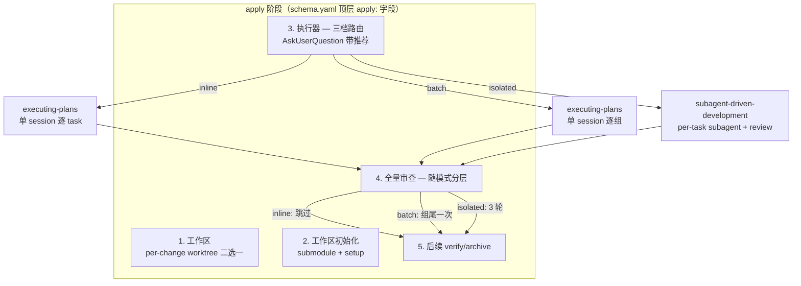
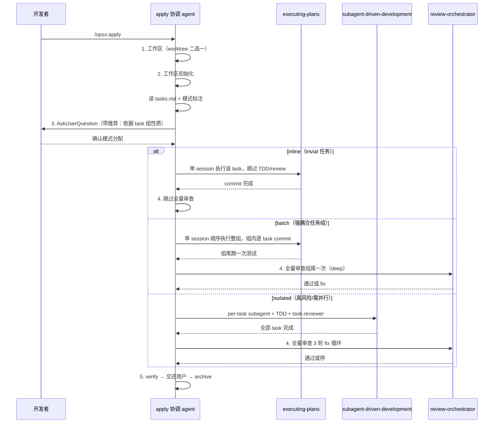

## 一句话描述

apply instruction 内联三档路由（inline/batch/isolated，按「风险×耦合度」驱动，AskUserQuestion 带推荐），inline/batch 复用 executing-plans 单 session 语义、isolated 保留 SDD，全量审查随模式分层；配套改 writing-plans 的 Task Structure 示范与 tasks.md 模板，task = plan 边界、TDD 步骤缩进化、模式标注元数据。首版交付清单：schema.yaml（apply instruction + description 第 12 行，version +1）、writing-plans SKILL.md（Task Structure 示范）、tasks.md 模板（模式标注 + 粒度示范）。

## 方案设计

### 架构概览



三档模式的 skill 映射无需新造 skill——inline/batch 都用 `executing-plans` 的"单 session 顺序执行"语义，isolated 用 SDD。inline 与 batch 的区别在**执行范围**（单 task vs 一组强耦合 task），不在 skill。这与 executing-plans SKILL.md:17"如有 subagent 支持用 SDD 代替"的现状一致——我们只是把"无条件用 SDD"改为"按风险×耦合度选择"。

### 方案对比

| 质量属性 | 方案 A：instruction 内联路由<br/>（推荐） | 方案 B：新建 apply-executor skill 封装路由 |
|---|---|---|
| 改动范围 | schema.yaml（apply+description+tasks instruction）+ tasks.md 模板；零 fork 外部 skill | + 新 skill 目录（SKILL.md + 可能的 prompt 模板） |
| 向后兼容 | mode 必填，缺标 apply 停止提示补标（模板随 schema 同更新，无旧格式问题） | 同左，但多一层 skill 调用链 |
| 可维护性 | 路由逻辑与执行器同处 instruction 文本，apply 时 agent 直读 | 路由独立，但 apply instruction 仍需描述何时调它 |
| 保留既有 SDD 优化 | isolated 档原样调 SDD，零改动 | 同左 |
| 元变更自验证难度 | 低——逻辑都在 schema 文本，人工读 instruction 即可核查 | 高——需追踪新 skill 与 instruction 的交互 |
| 符合项目 YAGNI | ✅ 无新 skill | ❌ 新增可独立测试单元，但 skill 是 prompt 文本无法单测，收益不成立 |

**决策：方案 A。** 依据 coding-philosophy 约定 4（YAGNI——不预留扩展点、无插件系统）。三档路由本质是 instruction 文本里的条件分支，不需要独立可执行单元。方案 B 的"可独立测试"在本场景不成立——skill 是 prompt 文本，测试只能靠真实 apply 跑，无法单元测，多一个 skill 只增加版本管理负担（skill-versioning 规范）。

**task 粒度规范用方案 D（不改 writing-plans）而非直接改 SKILL.md**：writing-plans 是 superpowers 官方 skill，直接改 = fork，升级时 update 的"覆盖/跳过"二选一无法选择性合并。改用 tasks instruction 格式硬约束覆盖 SKILL.md 示范，零 fork。代价是确定性略低（依赖 instruction 压住 SKILL.md 代码块示范），已验证方向可行。

### 关键时序



### 模块设计

**改动对象与职责（2 个文件，无新增模块，零 fork 外部 skill）：**

| 文件 | 改动职责 | 性质 |
|---|---|---|
| `templates/openspec/schemas/superpowers-lite/schema.yaml` | apply instruction 加三档路由；description 改分层表述；tasks artifact instruction 加格式硬约束（覆盖 writing-plans 示范）；version 8→9 | 契约破坏性，version +1 |
| `templates/openspec/schemas/superpowers-lite/templates/tasks.md` | 增加 `> mode:` 元数据行 + mode 边界注释 + 粒度示范（粗 checkbox + 缩进微步骤） | 模板调整，随 schema version |

**writing-plans / SDD / executing-plans skill 内部均不改（零 fork）。** isolated 档原样调 SDD（保留 SDD v6 全部优化），inline/batch 调 executing-plans。task 粒度规范由 tasks artifact instruction 的格式硬约束覆盖 writing-plans SKILL.md 的 Task Structure 示范——不改 writing-plans 源文件，避免 fork 外部 skill 导致 superpowers 升级时冲突退化。

### 代码设计预览

**1. apply instruction 三档路由（改 schema.yaml 第 562-604 行"执行器"段）**

模式在规划期由 tasks.md 模板规范标定（见改动对象 c），apply 阶段**纯校验、不交互**：

```
3. 执行器：
   记 base SHA → 读 tasks.md 每个 Section 的模式标注（> mode: 行，必填）

   校验（非交互，不符即停）：
   - 模式缺失 → 停止，提示 tasks.md 模板已更新需补标 mode（模板随 schema 一起更新，不存在旧格式兼容问题）

   按模式执行（apply 忠实执行 tasks.md 的模式选择，不校验选择对错）：
   - inline：调 executing-plans，单 session 执行该 task，跳过 TDD/code-review，
     commit 前跑该 task 的最小验证并读输出确认（粒度见 tasks.md 模板 inline 边界
     注释；遵循 verification-before-completion，非项目全量测试）
   - batch：调 executing-plans，单 session 顺序执行整组，组内逐 task commit，组尾跑一次测试
   - isolated：调 subagent-driven-development，保留 SDD v6 全部契约
     （model 分级、reviewer 只读、progress ledger、whole-branch review）

   模式正确性的兜底不靠 apply 校验，靠：
   - 规划期 human-review 审 mode 分配
   - verify 回查（任务完成度 + 实际测试执行）
```

判定规则下沉到 tasks.md 模板的边界定义里（单一事实源）。apply 只读模式 + 检查模式存在性，不校验模式选择对错——避免 apply 期做语义判断（无契约/无逻辑改动不可机械判定）。模式误判由规划期 + verify 兜底。

**2. schema description 第 12 行改写**

```
# 现状（第 11-12 行）
apply 阶段使用 subagent-driven-development 逐任务执行，
每个任务内部均强制 TDD + code-review。

# 改写为分层表述
apply 阶段按「风险×耦合度」选择执行模式：
isolated 档使用 subagent-driven-development 逐任务执行，
强制 TDD + 全量 code-review；inline/batch 档使用 executing-plans
单 session 执行，inline 跳过 TDD/code-review，batch 组尾统一验证。
```

**3. tasks.md 模板增加模式标注**

```markdown
## 1. <!-- 功能组名称 -->

> mode: batch  <!-- 必填：inline | batch | isolated。边界见下方注释 -->

<!--
  mode 边界（mode 规范的唯一事实源，apply 忠实执行不校验选择）：
  - inline：≤3 文件、无契约变更、无逻辑改动（装依赖/typo/纯验证）；
    commit 前验证 = 该 task 直接对应的命令（如 `pnpm list`/相关单测），非项目全量测试
  - batch：强耦合组，满足任一：同一子项目目录 / Files 文件重叠 ≥1 / test: 命令同构建栈
           慢测试栈识别：test: 含 @SpringBootTest、mvn、-Dtest=、integration 关键词
  - isolated：破坏性重构/迁移，或需并行无依赖分支
-->

- [ ] **1.1 任务描述**（task = plan 边界，可独立验证的交付物）
  1. 写测试：`path/to/test.ts` — 验证 XX 场景   <!-- 缩进微步骤，非独立 checkbox -->
  2. 实现：`path/to/module.ts`
  3. 验证：`pnpm vitest run path/to/test.ts`
  > test: pnpm vitest run path/to/test.ts
  > commit: feat(scope): 中文描述
```

mode 规范（标注语法 + 三档边界 + 慢测试栈关键词 + batch 分组阈值）全部沉淀在模板注释里，作为单一事实源。writing-plans 填模板时遵循，apply 忠实执行模式选择不校验对错，不再有第二个地方描述"怎么判模式"。这把 design 原留作"tasks 阶段实现细节"的慢测试栈检测关键词、batch 分组阈值固化为模板规范。

**4. tasks artifact instruction 格式硬约束（不改 writing-plans SKILL.md）**

在 tasks artifact instruction 的"按模板结构组织产出"处加格式硬约束（覆盖 writing-plans SKILL.md 的 Task Structure 示范）：

```
按模板结构组织产出。格式硬约束（覆盖 writing-plans SKILL.md 的 Task Structure 示范）：
task = plan 边界，一个 task 一个可独立验证的交付物；TDD 的 red/green/commit
是该 task 内的缩进编号微步骤，不得写成独立 `- [ ]` checkbox。每个 Section
须标 `> mode:`（inline/batch/isolated，边界见模板注释）。commit 点用中文描述。
```

关键决策（方案 D）：不修改 writing-plans SKILL.md 源文件。理由——writing-plans 是 superpowers 官方 skill，直接改会 fork，未来 superpowers 升级时 update 机制虽能检测冲突（弹"覆盖/跳过"二选一），但无法选择性合并，"覆盖"会回退我们的改动、"跳过"会丢失官方更新。改用 tasks instruction 的格式硬约束覆盖 SKILL.md 的 step 级示范，零 fork，官方升级零冲突。代价是确定性略低于直接改源文件（依赖 instruction 够强压住 SKILL.md 完整代码块示范），已通过格式验证测试确认方向可行，完整验证留 verify/后续 change。

**5. 全量审查随模式分层（改 schema.yaml 第 605-628 行"全量代码审查"段）**

| 模式 | 步骤 4 全量审查 |
|---|---|
| inline | 跳过（trivial 无逻辑改动，review 无意义；质量靠 commit 前最小验证 + 边界严格化兜底） |
| batch | 组尾跑一次 review-orchestrator(deep)（不是每 task，最多 3 轮 fix） |
| isolated | 保留完整 3 轮 fix 循环（当前行为不变） |

## 风险与未决

| 风险/未决 | 缓解/Owner |
|---|---|
| **契约破坏**：description + apply 行为变更 | schema version 8→9；mode 必填，缺标则 apply 停止提示补标（模板随 schema 同更新，无旧格式问题） |
| **inline 滥用**：跳过 TDD 被用于逻辑改动 | 模板注释写明 inline 边界 + verify 回查；apply 忠实执行不校验模式选择（无契约/无逻辑不可机械判定，交规划期+verify） |
| **fork 外部 skill 升级冲突**：若改 writing-plans SKILL.md，superpowers 升级时 update 的"覆盖/跳过"无法选择性合并 | 方案 D 零 fork——不改 writing-plans 源文件，task 粒度规范改由 tasks instruction 格式硬约束覆盖；官方升级零冲突 |
| **instruction 覆盖力不确定**：方案 D 依赖 instruction 压住 SKILL.md 代码块示范 | 格式验证测试已确认方向可行；完整验证留 verify/后续 change；退路是回退到直接改 SKILL.md |
| **batch 失 per-task 隔离**：组内某 task 失败污染后续 | progress ledger 断点续跑（executing-plans 单 session 内按 commit 回滚）+ 组尾统一测试兜底；组内逐 task commit 保留回滚粒度 |
| **元变更鸡生蛋**：本 change 用旧 apply 执行，无法用新 apply 自验证 | verify/retrospective 人工重点核查 apply instruction 改动；不依赖新 apply 自验证。固有约束，无法消除 |
| **mode 边界盲区**：单 task 中等改动（有逻辑、非破坏性）无自然落点，不满足 inline/batch/isolated 任一边界 | 边界细化问题，不影响本 change 主线（本 change tasks.md 均为清晰 batch/inline）；留 retrospective 评估是否需补"standard"档 |

慢测试栈检测关键词（@SpringBootTest/mvn/-Dtest=/integration）与 batch 分组阈值（同一子项目目录 / Files 重叠 ≥1 / test: 同构建栈）已固化为 tasks.md 模板注释规范，不再是未决项。

## 完成检查

- [x] technical-design skill 已调用（方案对比 + ATAM 打分表 + 时序 + 模块设计已产出）
- [x] 存在 ≥ 2 倗选方案对比（方案 A instruction 内联 vs 方案 B 新建 skill，含质量属性打分，已选 A 并说明排除 B 的理由——YAGNI）
- [x] 已确认方向与 design 实现细节已区分标注（skill 映射/方案 A+D/审查分层/mode 模板下沉为已确认；慢测试栈关键词/分组阈值已固化进模板规范）
- [x] 迭代修正已纳入：mode 判定从 apply 期交互改为规划期模板标定（单一事实源），apply 忠实执行不校验选择对错（仅检查 mode 存在性）；task 粒度规范从改 writing-plans（fork）改为 tasks instruction 格式硬约束（零 fork）
