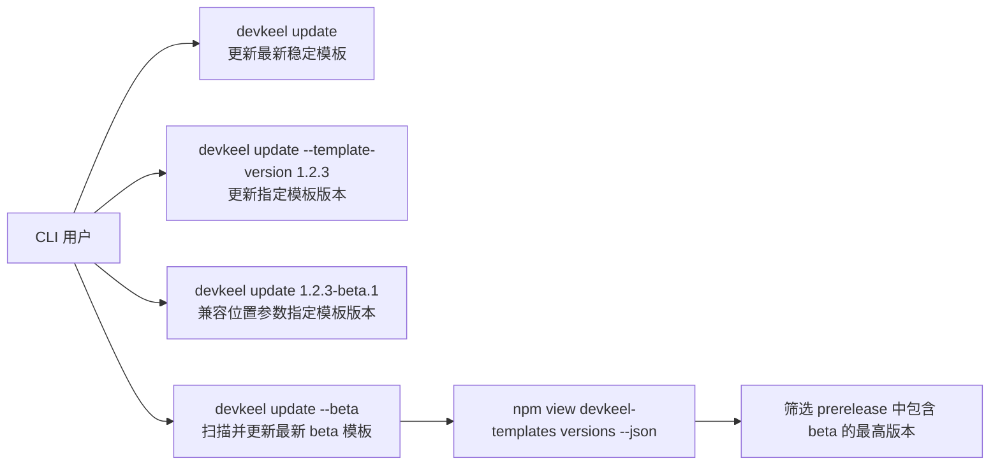

## 一句话描述

让 `devkeel update` 可以更新到指定模板版本，并通过 `--beta` 自动选择 `devkeel-templates` 最新 beta 版本。

## 需求背景

当前 `devkeel update` 会调用 `ensureTemplatesCache()` 拉取 `devkeel-templates` 的 npm `version`，只能更新到 registry 认为的最新稳定模板版本。模板包已经从 CLI 内置资产拆分为独立 npm 包，发布与验证节奏可能早于 CLI 正式版本，因此需要支持开发者在验证模板发版时指定模板版本，或直接使用最新 beta 模板包做预发布验证。

## 项目现状与架构分析

- CLI 入口在 `src/index.ts` 注册 `update` 命令，目前仅支持 `--force` 和 `--dry-run`。
- `src/commands/update.ts` 负责更新流程，启动时调用 `ensureTemplatesCache()` 并把缓存目录设置为当前模板目录。
- `src/lib/templates-cache.ts` 负责查询 npm 最新模板版本、下载 tarball、解压并维护本地缓存。
- `src/lib/config.ts` 的 `getBuiltinVersions()` 会从当前模板目录读取 `package.json` 和 `versions-yml.yml`，因此只要 update 在检测版本前切换到目标模板缓存目录，后续版本对比和写入可以复用现有逻辑。
- 现有测试覆盖 `templates-cache` 的错误诊断、版本格式校验、tarball 解压，以及 `detectUpdates` 的版本差异检测。

## 风险与约束

- 显式模板版本和 `--beta` 都会影响下载目标，必须在进入 npm pack 前校验版本格式，避免 shell 拼接风险。
- `--beta` 不能依赖稳定 `version` 字段，应查询 npm `versions` 列表并筛选 beta 预发布版本。
- `--beta` 与显式模板版本语义冲突，应阻止同时使用。
- 默认 `devkeel update` 行为必须保持不变，继续更新到稳定模板版本。
- 测试不能依赖真实 npm registry，需要把 beta 版本选择逻辑拆成纯函数验证。

## 目标用户与角色

- CLI 维护者：需要在模板 beta 发布后快速验证 update 效果。
- 内部项目开发者：需要在特定项目中回退或锁定某个模板版本执行 update。
- 发布负责人：需要在正式发布前用 beta 模板进行端到端冒烟。

## 核心功能用例

## 需求边界

**In Scope:**
- `devkeel update` 支持 `--template-version <version>`。
- `devkeel update` 兼容可选位置参数 `<template-version>`。
- `devkeel update --beta` 自动扫描 npm versions 列表并选择最新 beta 版本。
- 版本格式校验、冲突参数提示和目标模板版本的测试覆盖。

**Out of Scope:**
- 不改变 `devkeel init` 的模板版本选择策略。
- 不引入 npm dist-tag 发布管理能力。
- 不改变 `.harness/versions.yml` 的数据结构。
- 不处理 alpha、rc 等其他预发布通道。

## 探索过的替代方向

- 仅支持 `--template-version`：实现更窄，但用户提出的是“传入版本”，位置参数更符合临时验证习惯，因此同时兼容。
- 使用 npm `beta` dist-tag：实现简单，但需求强调“自动扫描最新 beta 版本”，且 dist-tag 维护可能滞后于实际 beta 包列表。
- 只在 `update` 命令内处理 beta：会把 npm 输出解析和排序逻辑塞进命令流程，不利于无网络测试；拆到 `templates-cache` 更可测。

## 待确认项

无当前阻塞项。若后续发布流程要求 beta dist-tag 优先，可在本变更基础上增加 tag fallback。
