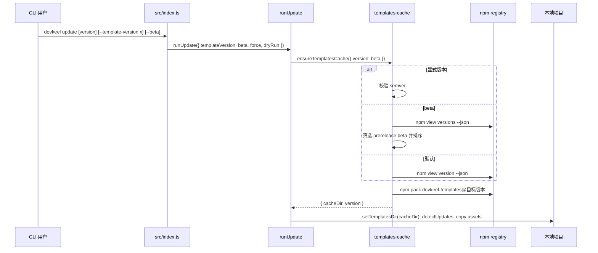

## 一句话描述

在现有 update 管线前增加模板版本选择层：默认稳定版保持不变，显式版本直接下载，`--beta` 从 npm versions 列表选择最高 beta 版本。

## 方案设计

### 设计维度选择

| 维度 | 领域/触点 | 优先级 | 选择原因 | 输出位置 |
|------|-----------|--------|----------|----------|
| D01 范围、目标与非目标 | CLI + 模板更新 | core | 新增用户可见参数和版本选择行为 | 一句话描述、契约与边界 |
| D02 架构边界与模块关系 | 命令模块 + 缓存库层 | supporting | 参数解析在 `src/index.ts`，版本解析和 npm 查询应留在 `templates-cache` | 模块设计 |
| D03 运行边界与职责归属 | CLI 本地进程 + npm 外部进程 | supporting | CLI 负责参数和提示，npm registry 负责版本来源 | 模块设计 |
| D04 流程与失败路径 | 命令执行 + 网络失败 + 非法输入 | core | `--beta` 可能找不到 beta 版本，显式版本可能非法或不存在 | 关键时序 |
| D05 契约与接口 | CLI 参数 + `ensureTemplatesCache` 选项 | core | 新增 `--template-version`、位置参数和 `--beta` 契约 | 命令契约 |
| D06 数据与状态 | 本地模板缓存 | supporting | 缓存仍按版本目录隔离，meta 记录当前拉取版本 | 模块设计 |
| D09 可靠性与恢复 | npm 查询失败、pack 失败 | supporting | 复用 `TemplatesFetchError` 诊断，失败不进入本地文件更新 | 失败路径 |
| D12 兼容与迁移 | CLI 脚本兼容 | supporting | 默认 update、`--force`、`--dry-run` 行为不破坏 | 兼容策略 |
| D13 验证策略 | 单测 + 类型检查 | core | beta 筛选不能依赖真实 registry，需纯函数测试 | 验证策略 |
| D14 风险与决策 | 参数形态与 beta 来源取舍 | core | 记录位置参数兼容和扫描 beta 而非 dist-tag 的决策 | 风险与未决 |

### 方案对比

| 方案 | 说明 | 优点 | 缺点 | 结论 |
|------|------|------|------|------|
| A. 在 `templates-cache` 接收版本选择选项 | `ensureTemplatesCache({ version, beta })` 内部决定版本，再下载缓存 | 版本选择逻辑集中，可单测；命令层保持薄 | 需要扩展缓存层接口 | 采用 |
| B. 在 `runUpdate` 内处理 npm 查询 | 命令层先解析 beta 版本，再调用缓存层下载 | 改动直观 | 命令层耦合 npm 输出解析，不利于测试 | 不采用 |
| C. 依赖 npm `beta` dist-tag | `--beta` 查询 `npm view ... dist-tags.beta` | 实现最短 | 不能满足“自动扫描最新 beta 版本”，依赖发布者维护 tag | 不采用 |

### 关键时序

### 模块设计

| 模块 | 职责 | 不负责 |
|------|------|--------|
| `src/index.ts` | 声明 update 命令参数，把位置参数和 option 归一化后传给 `runUpdate` | 不解析 npm 输出，不排序版本 |
| `src/commands/update.ts` | 校验 `--beta` 与显式版本互斥，调用缓存层，执行现有更新流程 | 不直接调用 npm |
| `src/lib/templates-cache.ts` | 校验模板版本，查询稳定版或版本列表，选择最新 beta，下载并解压模板包 | 不修改项目文件，不处理交互 prompt |
| `tests/templates-cache.test.ts` | 覆盖版本格式、beta 选择、缓存层纯函数 | 不访问真实 registry |
| `tests/update.test.ts` 或 CLI 相关测试 | 覆盖 update 版本选择的调用前行为（可通过纯函数优先） | 不跑真实 `npm pack` |

### 命令契约

- `devkeel update`：保持现状，下载 npm `version` 对应的最新稳定模板。
- `devkeel update --template-version <version>`：下载指定 `devkeel-templates@<version>`。
- `devkeel update <version>`：作为 `--template-version` 的兼容简写。
- `devkeel update --beta`：查询 `npm view devkeel-templates versions --json`，筛选预发布段包含 beta 的版本并选择最高版本。
- `--beta` 与显式版本同时出现时终止执行，提示用户二选一。
- 非法 semver 或找不到 beta 版本时抛出 `TemplatesFetchError`，沿用现有诊断输出。

### 失败路径

- npm `versions` 查询失败：`TemplatesFetchError` 包含原始错误和 registry 诊断，不进入资产更新。
- versions 输出不是数组或字符串：抛出格式异常。
- 没有 beta 版本：抛出“未找到 beta 模板版本”。
- 显式版本格式非法：在 `npm pack` 前失败，避免 shell 拼接风险。
- 指定版本不存在：由 `npm pack` 失败路径提示。

### 兼容策略

默认命令、`--force`、`--dry-run`、交互式逐项更新和自动提交路径保持原样。`.harness/versions.yml` 仍写入目标模板包内的版本信息，不新增字段。缓存目录继续按版本号隔离，因此稳定版、beta 版和历史指定版本可以共存。

### 验证策略

- 在 `tests/templates-cache.test.ts` 先写 RED 测试，覆盖最高 beta 选择、无 beta 返回空、版本 JSON 解析异常。
- 在 `tests/update.test.ts` 或纯函数测试中覆盖 update 目标选项归一化和冲突参数。
- 执行 `pnpm vitest run tests/templates-cache.test.ts tests/update.test.ts`。
- 执行 `pnpm lint` 验证类型。

## 风险与未决

| 风险/决策 | 处理 |
|-----------|------|
| beta 排序实现不完整 | 实现最小 semver 比较，覆盖数字 prerelease 排序；不引入新依赖 |
| 位置参数可能与 option 重复 | option 优先前先检测冲突；同值允许，异值报错 |
| registry beta 发布但未带 `beta` prerelease 标识 | 本期不支持，因需求明确扫描 beta 版本；后续可加 dist-tag fallback |

## 完成检查

- [x] technical-design skill 已调用（读取 CLI profile 与 D01/D02/D03/D04/D05/D06/D09/D12/D13/D14 相关维度）
- [x] 存在 ≥ 2 候选方案对比，或已说明唯一方案的排除理由
