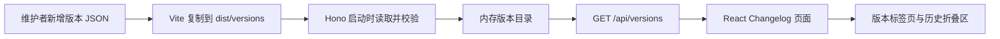
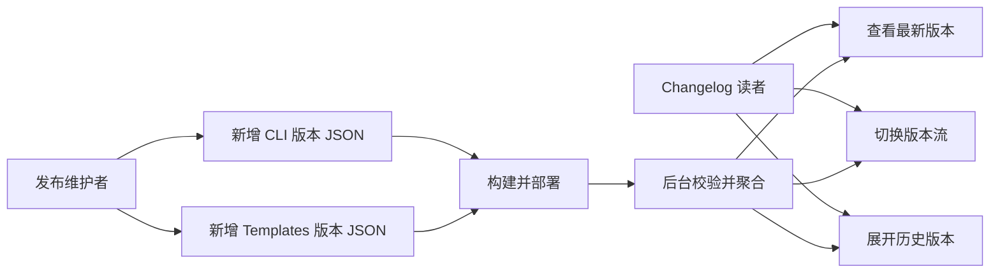

## 一句话描述

将 Changelog 从 TSX 内联版本正文改为 CLI 与 Templates 双版本流的 JSON 数据源，由 Hono 聚合后交给 React 展示，使每次发版只需新增一个版本 JSON 并重新构建部署。

## 需求背景

当前 `web/src/pages/changelog.tsx` 超过 1000 行，CLI 与 Templates 的全部版本标题、日期、分组和条目都直接写在 JSX 中。每次发版需要同时修改版本区块、latest badge、Update Tip 和更新横幅，维护步骤多且容易遗漏；页面结构、交互逻辑和版本内容也因此耦合在同一文件。

目标是把版本内容变为独立、可校验的数据资产。CLI 与 Templates 保持各自版本号和发布节奏，每发布一个版本只增加对应目录下的一个 JSON；允许重新构建与部署，不建设在线编辑或热更新能力。

## 项目现状与架构分析

- `web/src/pages/changelog.tsx` 当前负责样式、页面框架、tab 状态、更新横幅、版本内容和历史折叠区。
- `web/server.ts` 使用 Hono，同时提供 `/api/*` 和 `web/dist` 静态资源，已有后台 API 与 React fetch 的运行模式。
- `web/vite.config.ts` 使用 Vite 构建；`web/public/` 会原样复制到 `web/dist/`，适合承载随构建产物发布的版本 JSON。
- `web/src/pages/stats.tsx` 已有 loading、error 和 API fetch 的可复用交互模式。
- `web/tests/server.test.ts`、`web/tests/react-pages.test.ts` 和路由测试覆盖后台 API、React 页面边界及旧 `.html` URL 兼容。

目标数据流：

## 风险与约束

- CLI 与 Templates 是独立版本流，目录、latest 和排序必须分别计算，不能因同日发版而合并版本号。
- 现有合并条目继续作为单个 JSON 保存，`versions` 数组按旧到新声明，避免重新解释历史文案归属。
- 全量迁移必须保持现有版本集合、标题、分组、条目、链接和代码样式，不保留 TSX fallback 双数据源。
- JSON 文件损坏、字段非法、版本重复或文件名与最后版本不一致时，后台必须汇总错误并阻止服务启动。
- Markdown 只允许安全的文本、强调、行内代码、链接和换行；不得执行原始 HTML 或脚本。
- 页面沿用现有视觉系统、Templates 默认 tab、历史折叠行为和 `/changelog.html` 公开 URL；桌面与移动端布局不得退化。
- `?from=` 来自 CLI 更新检测，数据加载后应展示并定位到最新 CLI，而不是误用 Templates latest。
- 构建后 `dist/versions/cli` 与 `dist/versions/templates` 必须包含完整数据；生产后台只读取构建产物，本地开发通过显式 `versionsDir` 读取 `public/versions`。

## 目标用户与角色

| 角色 | 关注点 |
|------|--------|
| CLI / Templates 发布维护者 | 发版时只新增一个结构明确、可校验的 JSON，不再编辑 React 页面 |
| Harness 使用者 | 继续按版本流查看完整、格式一致的更新内容和历史记录 |
| Web 服务维护者 | 非法数据在部署前或启动时失败，构建产物可独立携带版本数据 |

## 核心功能用例

1. **新增 CLI 版本**：维护者在 `web/public/versions/cli/` 新增以末版本号命名的 JSON；构建部署后，页面自动更新 CLI latest、标题和内容。
2. **新增 Templates 版本**：维护者在 `web/public/versions/templates/` 新增 JSON；构建部署后，Templates tab 与版本 chip 自动更新。
3. **保留合并版本**：当历史条目覆盖多个版本时，一个 JSON 通过有序 `versions` 数组和时间范围完整表达，页面生成原有版本范围标签。
4. **浏览版本内容**：读者打开 `/changelog.html` 后看到加载态，成功后可在两个 tab 间切换；`archived: true` 的条目位于默认收起的历史区域。
5. **安全展示富文本**：版本名称和描述中的强调、行内命令、链接及换行按受限 Markdown 展示，原始 HTML 不执行。
6. **加载失败恢复**：API 请求失败时页面显示明确错误和重试入口，不静默展示过期的内联数据。
7. **更新横幅定位**：带 `?from=` 打开页面时，数据就绪后切换到 CLI tab，展示旧 CLI 到最新 CLI 并定位最新条目。
8. **拦截非法版本数据**：后台一次性检查全部文件，汇总文件路径和字段错误；校验失败时不启动服务。

## 需求边界

**In Scope:**

- 建立 CLI、Templates 分目录的版本 JSON schema，并全量迁移现有版本内容。
- 支持单版本、合并版本、发布时间范围、分组条目、历史折叠标记和受限 Markdown。
- 新增后台版本目录 loader、内存缓存与 `GET /api/versions`。
- 将 React Changelog 改为 API 数据驱动，保留现有页面结构与交互并修正 CLI 更新横幅定位。
- 让 Vite 将 `web/public/versions/` 原样输出到 `web/dist/versions/`。
- 更新 `changelog` skill 至新的 JSON 发版流程，并同步文档规则。
- 增加 loader、API、React、迁移完整性与构建产物测试。

**Out of Scope:**

- 在线上传、编辑、删除版本记录的管理后台。
- 数据库、对象存储、免部署热更新或文件监听。
- 合并 CLI 与 Templates 版本号或发布流程。
- 重写 Changelog 视觉设计、站点路由或 V1 → V2 静态迁移说明。
- 重新拆分已有合并版本条目的文案归属。

## 探索过的替代方向

| 方向 | 结论 |
|------|------|
| Hono 启动时聚合并提供 API | 采用。符合现有后台架构，前端包不携带历史正文，服务重启时一次读取即可 |
| 构建期生成单一 `versions.json` | 不采用。增加生成产物和构建脚本，且不符合后台读取独立版本文件的目标 |
| Vite `import.meta.glob` 直接打包 JSON | 不采用。全部历史进入前端 bundle，前端与数据继续耦合 |
| CLI 与 Templates 合并为一次发布 JSON | 不采用。两条版本流版本号和发布节奏独立，合并会制造不必要耦合 |
| 只迁移新版本，历史继续留在 TSX | 不采用。会形成双数据源，无法真正简化页面维护 |

## 非功能性需求

| 类型 | 目标 | 说明 |
|------|------|------|
| 数据边界 | 版本 JSON 是版本正文唯一来源 | TSX 不保留任何版本标题、分组或条目 fallback |
| 性能 | 每次服务启动只读取一次文件 | API 请求只序列化内存目录，不重复扫描磁盘 |
| 高可用 | 数据错误在启动阶段显式失败 | 不以空列表或部分数据掩盖损坏文件 |
| 数据一致性 | 文件名、版本数组、latest 和排序可验证 | 两条版本流独立校验，重复版本直接报错 |
| 安全 | Markdown 不执行原始 HTML | 链接协议受限，不使用 `dangerouslySetInnerHTML` |
| 扩展性 | 新增版本无需改动 TypeScript | 单条 JSON 可覆盖单版本或合并版本，现有 group 类型可演进 |
| 兼容性 | 保持现有 URL、tab、历史折叠与响应式视觉 | 桌面和移动端均沿用当前样式与交互语义 |

## 待确认项

无。数据模型、运行时聚合方案、全量迁移、Markdown 边界、构建输出和验收要求均已在前置讨论中确认。
