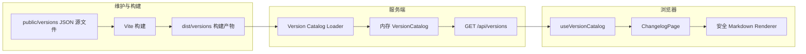
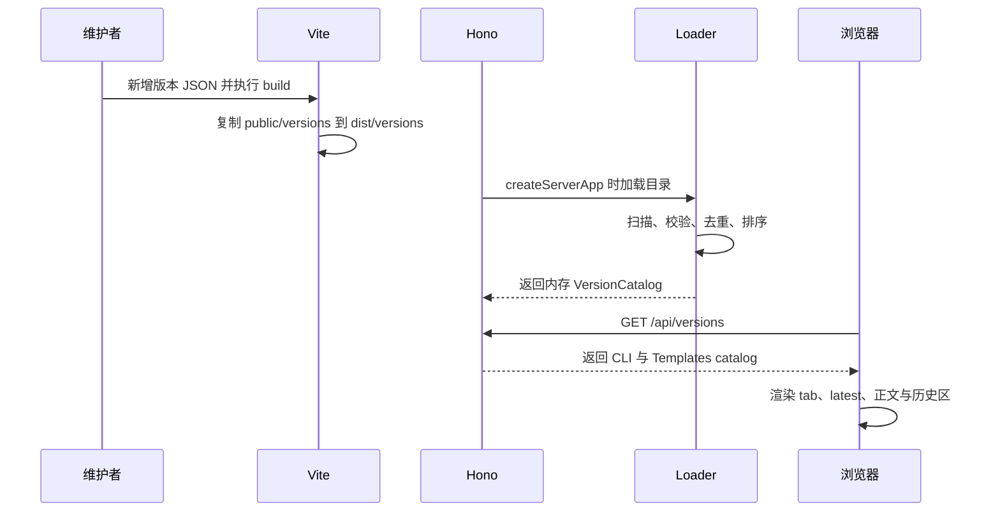
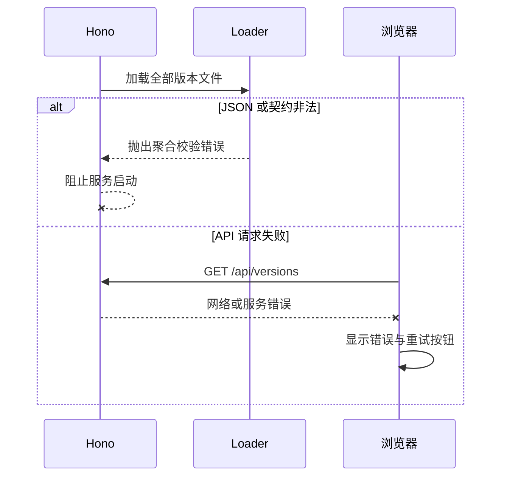

## 一句话描述

以 `web/public/versions/{cli,templates}/*.json` 作为 Changelog 正文唯一来源，新增启动期版本目录加载器和 `/api/versions`，将 React 页面改为安全 Markdown 的数据驱动渲染，并全量迁移历史版本、更新 changelog skill 与验证链路。

## 方案设计

### 设计关注点

本方案跨 frontend、backend、devops 三个领域，重点覆盖 D02 架构边界、D04 成功与失败流程、D05 API/JSON 契约、D06 数据唯一来源、D07 UI 状态、D12 全量迁移与 D13 验证。D03 明确 public/dist/浏览器/服务端的运行边界，D09 与 D10 分别约束启动失败和 Markdown 安全；性能、资源与诊断仅作为完成检查，不展开额外基础设施。

### 架构概览



依赖方向固定为：版本 JSON → 服务端 loader → API 契约 → React hook/组件。浏览器不直接扫描 JSON 文件，服务端不依赖 React 组件，页面不再包含版本正文 fallback。

### 方案对比

| 方案 | 取舍 | 结论 |
|------|------|------|
| Hono 启动时读取、校验并缓存 | 符合现有 API 架构；请求无磁盘扫描；部署错误可前置暴露 | 采用 |
| 构建期合并为单一 JSON | 请求简单，但增加生成步骤与第二份派生数据 | 排除 |
| Vite `import.meta.glob` 打入前端 | 实现直接，但历史正文进入 bundle，数据继续与前端耦合 | 排除 |

### 关键时序

构建与正常加载：



失败路径：



### 模块设计

| 模块 | 运行边界与职责归属 | 不负责 |
|------|--------------------|--------|
| `web/public/versions/` | 源码/构建输入；保存版本正文 | 排序、latest 计算、页面展示 |
| Version types + validator | Node 与浏览器共享纯类型；校验单文件结构 | 文件 I/O、React 渲染 |
| Version Catalog Loader | Node 启动期扫描两条版本流、聚合错误、去重、排序、生成 catalog | 每请求重读、在线写入 |
| `web/server.ts` | 注入 `versionsDir`、持有内存 catalog、提供 `/api/versions` | Markdown 解析、UI 状态 |
| `useVersionCatalog` | 浏览器请求、AbortController、loading/error/retry 状态 | 版本排序和契约修复 |
| `VersionPanel` / `VersionSection` | 根据 catalog 生成现有 tab、latest badge 和历史折叠区 | 直接读取文件、信任原始 HTML |
| `InlineMarkdown` | 将受限 Markdown 转成 React 节点并限制链接协议 | 完整 Markdown 文档、原始 HTML |
| V1 → V2 Migration | React 静态组件，保留非版本说明 | 进入版本 JSON schema |

服务端默认读取 `path.join(staticRoot, 'versions')`；`ServerOptions.versionsDir` 可显式覆盖。生产 `staticRoot` 为 `dist`，缺少构建版本目录时直接失败，不得静默回退源码；测试注入临时目录，本地 `pnpm dev:server` 通过 `--source-versions` 参数显式选择 `public/versions`。服务启动后不再监听文件变化。

### 代码设计预览

共享契约：

```ts
type VersionStream = 'cli' | 'templates'
type ChangeType = 'feat' | 'fix' | 'breaking' | 'refactor' | 'docs'

interface VersionEntry {
  versions: string[]
  releasedAt: { from: string; to?: string }
  title: string
  archived: boolean
  groups: ChangeGroup[]
}

interface ChangeGroup {
  type: ChangeType
  label: string
  items: Array<{ name: string; description: string }>
}

interface VersionCatalogResponse {
  cli: { latest: string; entries: VersionEntry[] }
  templates: { latest: string; entries: VersionEntry[] }
}
```

Loader 约束：

```ts
function loadVersionCatalog(versionsDir: string): VersionCatalogResponse
```

- 只扫描 `cli/*.json` 与 `templates/*.json` 的普通文件。
- 每个流至少一条记录；`versions` 非空且无重复，文件名必须等于最后一个版本加 `.json`。
- 版本号使用至少两段的纯数字点分形式；合并条目的 `versions` 必须按数值语义严格从旧到新，`0.1` 与 `0.1.0` 视为相等而不得相邻声明。
- `releasedAt.from/to` 必须是带时区的有效 ISO 时间，数字时区偏移不得超过 ISO 8601 的 `±14:00`，`to` 不得早于 `from`。
- `title`、group label、item name/description 不得为空，type 必须属于白名单。
- 同一流内任一版本只能出现一次；所有文件错误汇总后以一个异常抛出。
- 条目按 `to ?? from` 倒序；latest 为首条的最后一个版本，且首条必须为 `archived: false`。

API：

```http
GET /api/versions
200 Content-Type: application/json
Cache-Control: no-store
```

成功体严格等于 `VersionCatalogResponse`。catalog 在 `createServerApp` 时创建并由路由闭包持有；API 请求不触发文件 I/O。

### UI 设计

无新增设计稿；现有 Changelog 页面是唯一视觉事实。保留页面色彩、密度、Templates 默认 tab、CLI/模板 badge 差异、响应式布局与 V1 → V2 迁移区，只替换版本正文的数据来源和加载状态。

| 状态 | 页面行为 |
|------|----------|
| loading | Hero、导航和更新说明保留，版本区显示轻量占位，不闪现旧正文 |
| success | Templates 默认激活；latest、分组、Markdown 和历史折叠按 API 渲染 |
| empty | 正常运行中不允许出现；空流在服务启动校验阶段失败 |
| error | 显示可读错误和“重新加载”按钮，tab/正文不伪造 fallback |
| retrying | 保留错误上下文并重新进入加载态，避免重复并发请求 |
| `?from=` | 数据就绪后切到 CLI tab，显示旧 CLI → `cli.latest` 并定位最新 CLI section |

`InlineMarkdown` 使用 React Markdown 渲染链，禁用原始 HTML，仅允许文本、`strong`、`em`、行内 `code`、安全链接和换行。相对链接以及 `http/https` 链接可用，脚本协议和未知协议拒绝。移动端继续使用现有 media query；长命令允许换行或横向滚动，不能撑破版本卡片。

### 数据设计

目录结构：

```text
web/public/versions/
├── cli/
│   ├── 0.8.10.json
│   └── 0.8.6.json
└── templates/
    ├── 1.2.5.json
    └── 1.2.3.json
```

单版本与合并版本使用同一 schema；合并条目文件名取 `versions` 最后一个值。版本展示标签由前端将每个值加 `v` 后以 ` ~ ` 连接，section ID 取最后版本：CLI 为 `v{x}`，Templates 为 `tpl-v{x}`。日期展示由 ISO 时间格式化，不在 JSON 重复保存 display label。

`archived` 是版本条目的展示语义：false 进入 tab 主列表，true 进入历史 `<details>`。每条流按时间排序后的首条必须为 false，保证 latest 始终在主列表可见。两条流分别排序和计算 latest，不允许跨流去重或合并。CLI 的 V1 → V2 静态迁移长文作为历史补充内容保留在同一个默认收起的 `<details>` 内。

## 质量与专项设计

### 性能与资源

版本文件只在服务启动时读取一次，API 只返回内存对象。前端只在页面挂载和用户主动重试时请求；历史正文不进入主 JavaScript bundle。数据规模较小，不引入分页、数据库或文件监听。

### 可靠性与恢复

- 启动校验采用“全量收集、一次报告”，避免修完一个文件后才暴露下一个错误。
- 非法数据不允许部分上线；服务启动失败由部署回滚处理。
- API 请求失败不影响其他站点页面，Changelog 自身提供重试。
- 回滚到旧版本代码时，旧 TSX 不再存在，因此发布单元必须包含代码与完整 `dist/versions`，两者不可拆分部署。

### 安全与隐私

版本内容是公开数据，无鉴权或隐私要求。主要风险是 Markdown/XSS：不使用 `dangerouslySetInnerHTML`，不启用 raw HTML 插件，链接协议使用白名单，并通过恶意 HTML、`javascript:` URL 和脚本标签测试验证。Loader 使用固定的 cli/templates 子目录且不接收 HTTP 路径参数，避免路径遍历。

### 兼容与迁移

1. 将当前 Templates 与 CLI 全部版本 section 逐条转换为 JSON，保留合并范围、标题、group label、条目顺序、链接与代码语义。
2. 建立独立的 38 条历史批准基线，逐条固定 versions、时间、标题、archived、group type/label 及 item 顺序与全文；后续新增合法 JSON 和更高 latest 不进入也不改写该基线。
3. 历史 CLI `0.8.5 ~ 0.8.6` 的性能类视觉分组有意归一为公共 schema 已支持的 `refactor`，继续保留 label `优化` 和原 item 内容/顺序；这是唯一迁移例外，不据此向公共 schema 增加 `perf`。
4. React 接入 API 后删除所有内联版本 JSX，只保留页面框架、样式和 V1 → V2 静态说明。
5. 将 `changelog` skill 从 TSX 编辑流程升级为 JSON 创建流程，major 版本升至 `3.0.0`；同步更新 documentation rule。
6. Vite 构建后由确定性脚本逐流验证 `dist/versions` 与 `public/versions` 的文件集合和逐文件内容一致。

回滚只能按完整发布单元回滚代码与构建产物；不支持新前端配旧 JSON 或旧前端配新 API 的混合部署。

## 验证策略

| 设计点 | 验证 |
|--------|------|
| JSON schema 与聚合错误 | Loader 单测覆盖合法、损坏、缺字段、重复、文件名、日期范围和 type 白名单 |
| 双版本流与 latest | 单测覆盖独立排序、合并版本和 `0.1` 等历史版本 |
| 启动缓存与 API | Server 测试注入临时 versionsDir，断言响应、no-store 和请求后不重读磁盘 |
| UI 状态 | React 测试覆盖 loading、success、error、retry、tab 与 archived 分区 |
| Markdown 安全 | 渲染测试覆盖代码、链接、换行、HTML 与危险协议 |
| 更新横幅 | `?from=` 场景断言 CLI latest、tab 切换与目标 section |
| 全量迁移 | 版本集合、latest、标题与条目数对照测试，不允许 TSX 出现版本正文 |
| 构建产物 | `pnpm --dir web build` 后比较 public/dist versions 文件集合 |
| 回归 | `pnpm --dir web test`、`pnpm --dir web build`、`pnpm test`、`pnpm build` |

## 风险与未决

| 风险/决策 | 影响 | 缓解 |
|-----------|------|------|
| 历史迁移遗漏富文本语义 | 页面内容退化 | 迁移清单 + Markdown 渲染测试 + 人工抽查链接和代码样式 |
| 构建产物缺少版本目录 | 生产启动失败 | 构建测试明确断言 dist 文件集合 |
| public/dist 目录选择错误 | 本地或生产读到旧数据 | 默认只绑定 staticRoot/versions；测试和开发必须显式注入源码目录 |
| 新依赖增加前端包体 | Changelog chunk 略增 | 仅 lazy Changelog chunk 引入，限制 Markdown 插件集合 |

无待决项；上述取舍均已由用户确认。

## 完成检查

- [x] technical-design skill 已调用
- [x] 已完成 frontend、backend、devops 领域识别，并用「设计关注点」说明重点维度
- [x] 已用 core / supporting / checklist / skip 控制输出深度
- [x] D07、D09、D10、D12 仅按本次触点展开，D08/D11 保持 checklist
- [x] 每个 core 维度都有对应自动化或构建验证信号
