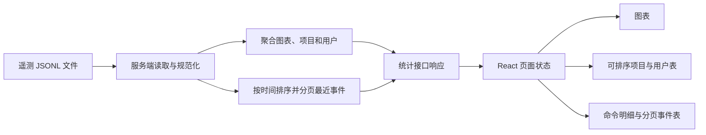
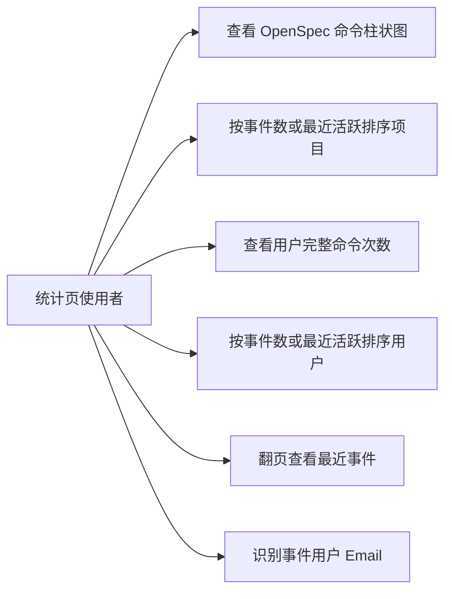

## 一句话描述

完善 stats 遥测统计页的图表、列表排序、用户命令明细和最近事件分页，让维护者能更快识别高频项目、活跃用户与具体使用行为。

## 需求背景

当前 stats 页已经展示遥测 KPI、图表、项目、用户和最近事件，但关键信息仍不够易读：OpenSpec 命令使用横向条形图，命令耗时图表价值有限；项目表默认按最近活跃排序且包含不需要的用户字段；用户表只展示一个最常用命令，无法查看完整命令构成；最近事件被服务端固定截断为 20 条，且缺少 Email。

目标用户是维护 Harness CLI 和模板的工程师。他们需要通过同一页面快速回答三个问题：哪些项目和用户产生了最多事件、某个用户具体使用了哪些命令、超过 20 条的历史事件如何继续查看。

## 项目现状与架构分析

- `web/server.ts` 使用 Hono 提供 `/api/telemetry/stats`。每次请求同步读取 `telemetry.jsonl`，跳过损坏行、统一时间戳后，在一次遍历中聚合命令、版本、项目和用户数据。
- 服务端已在用户聚合阶段维护 `commands: Record<string, number>`，但响应只输出 `topCommand`；项目响应按 `lastSeen` 降序；最近事件在映射前固定 `.slice(0, 20)`，且未映射 `git.userEmail`。
- `web/src/pages/stats.tsx` 通过 `useTelemetryStats` 请求单一 stats 接口。三个列表复用 `TelemetryTable`，但表头目前只是字符串，无法表达排序状态或点击行为。
- 页面已有基于 React state、Portal 和键盘事件实现的 `DetailTrigger`，可复用于用户命令明细，无需引入新的弹窗库或页面级 DOM 脚本。
- `web/src/pages/stats/StatsCharts.tsx` 已将 OpenSpec 数据交给 Chart.js `bar` 配置，但传入横向参数；命令耗时图表仍在版本信息区。
- `web/tests/stats-page.test.tsx` 仅覆盖旧格式、项目详情、执行结果浮层和错误态；`web/tests/server.test.ts` 尚未覆盖遥测聚合与分页；现有测试不能证明本次八项需求。

核心数据流如下：

## 风险与约束

- **分页一致性**：分页总数必须按具有有效时间戳、能够进入最近事件列表的事件计算，不能直接复用包含无时间戳数据的 `totalEvents`。页码超出范围时应钳制到有效页，空数据保持第 1 页。
- **数据规模**：不能为前端分页返回全部事件及可能很大的 `output` 字段。服务端仍会为统计聚合扫描完整文件，但响应最多携带一页 20 条最近事件。
- **排序确定性**：项目和用户默认按事件数降序；事件数或最近活跃相同时，使用另一排序字段及稳定文本键作为 tie-breaker，避免刷新后顺序抖动。
- **请求状态**：分页请求失败时保留当前已展示数据并显示错误；刷新后若总页数缩小，页面落在服务端返回的有效页。
- **兼容性**：保持 `/stats.html`、现有 KPI、命令输出详情和项目详情行为；命令耗时 KPI 不在本次移除范围。服务端可保留 `commandAvgDuration` 字段以避免不必要的契约破坏。
- **UI 一致性**：沿用 stats 页现有颜色、badge、浮层与表格样式，不引入全局主题或设计资产。桌面端正常展示，窄屏继续通过表格横向滚动访问全部列。
- **可访问性**：可排序表头使用真实按钮和 `aria-sort`；命令详情支持键盘触发、Escape 关闭；分页按钮具有明确名称与禁用状态。
- **工程约束**：交互必须由 React state 驱动，不引入 `data-action`、`querySelector` 或 `dangerouslySetInnerHTML`；本地模块导入省略扩展名。

## 目标用户与角色

| 角色 | 关注点 |
|------|--------|
| Harness 维护者 | 识别高频命令、高事件项目和失败行为，判断 CLI 与模板使用情况 |
| 项目/团队负责人 | 查看哪些项目和用户最近活跃，以及用户的完整命令使用构成 |
| 问题排查人员 | 通过分页事件、用户 Email、执行结果和版本信息定位具体事件 |

## 核心功能用例

### 用例 1：查看精简后的图表

- 触发：统计数据加载成功。
- 预期：OpenSpec 命令以竖向柱状图展示命令与调用次数；版本信息区不再出现“命令耗时 (ms)”图表；其他图表和平均耗时 KPI 保持可用。
- 空状态：无 OpenSpec 数据时仍显示既有空状态，不创建空 Chart 实例。

### 用例 2：排序项目列表

- 触发：进入页面或点击“事件”“最近活跃”表头。
- 预期：首次进入按事件数降序；点击另一字段切换排序字段并默认降序；再次点击当前字段切换升降序；当前字段和方向可从表头视觉及 `aria-sort` 判断。
- 视觉：项目表只显示 Org、Repo、CLI、模板、事件、最近活跃六列，不显示 User 和 Email。

### 用例 3：查看用户命令构成

- 触发：点击用户表中的最常用命令 badge。
- 预期：复用现有详情浮层，按使用次数降序展示该用户所有命令及次数；次数相同时按命令名排序；再次点击、点击外部或按 Escape 可关闭。
- 空状态：没有命令明细时显示 `-`，不提供无内容按钮。

### 用例 4：排序用户列表

- 触发：进入页面或点击“事件数”“最近活跃”表头。
- 预期：首次进入按事件数降序；切换字段和升降序的规则与项目表一致，其他用户详情交互不受影响。

### 用例 5：分页查看最近事件

- 触发：最近事件超过 20 条，点击上一页、下一页或具体页码。
- 预期：每页最多 20 条并保持时间倒序；展示当前页和总页数；首页禁用上一页、末页禁用下一页；最后一页可少于 20 条。
- 异常：分页加载失败时不清空当前表格；快速切页不得让较旧响应覆盖最新选择。

### 用例 6：查看事件 Email

- 触发：最近事件加载成功。
- 预期：用户列旁新增 Email 列；长 Email 使用省略号截断并在 `title` 中保留完整值；缺失 Email 显示 `-`。

## 验收标准

1. OpenSpec 图表配置为竖向 `bar`，命令耗时图表不再渲染。
2. 项目表默认事件数降序，事件/最近活跃表头支持字段切换与升降序，且不再包含 User、Email。
3. 用户表默认事件数降序，事件数/最近活跃表头支持相同排序交互。
4. 点击用户最常用命令后，能看到该用户全部命令及准确次数。
5. stats 接口支持最近事件页码和每页 20 条，返回当前页、页大小、可展示事件总数与总页数；无效页码使用安全默认值或有效边界。
6. 最近事件表能翻到第 2 页及末页，分页控制边界正确，事件始终按时间倒序。
7. 最近事件响应及表格包含 Email；长文本具有 `truncate` 样式和完整 `title`。
8. 定向页面和服务端测试覆盖上述行为，`pnpm --dir web test` 与 `pnpm --dir web build` 通过。

## 需求边界

**In Scope:**

- stats 页图表组合与 OpenSpec 图表方向。
- 项目、用户列表的前端排序状态、表头交互和列调整。
- 用户命令次数聚合响应与详情浮层。
- `/api/telemetry/stats` 的最近事件分页参数、分页元数据及 Email 映射。
- stats 页相关组件样式、页面测试和服务端测试。

**Out of Scope:**

- 修改遥测采集字段、用户身份定义或历史 JSONL 格式。
- 引入数据库、索引、缓存或独立分析服务。
- 删除服务端耗时聚合字段或移除“平均耗时” KPI。
- 改造其他 web 页面、全局设计系统或旧 URL 路由。
- 为项目表继续展示用户归属信息；该信息本次明确从 UI 删除。

## 探索过的替代方向

| 方向 | 结论 | 原因 |
|------|------|------|
| 前端一次加载全部最近事件再分页 | 不采用 | `output` 可能较大，事件增长会让响应体无限扩大 |
| 新增独立 `/api/telemetry/events` 接口 | 暂不采用 | 边界更纯粹，但当前只有一个 stats 消费者，会增加重复读取和接口维护成本 |
| 在 stats 接口增加最近事件分页参数 | 采用 | 保持单一数据入口，同时限制响应为一页事件；实现范围最小且可验证 |
| 用下拉框选择项目/用户排序 | 不采用 | 用户已明确希望点击表头；表头排序更直接且可通过 `aria-sort` 表达 |
| 为命令明细新增模态框 | 不采用 | 已有可访问的详情浮层足以承载短列表，避免新增交互体系 |

## 非功能性需求

| 类型 | 目标 | 说明 |
|------|------|------|
| 数据边界 | 每页固定最多 20 条 | 只分页具有有效时间戳的可展示事件；缺失字段使用既有占位符 |
| 性能需求 | 不向浏览器返回全量事件 | 聚合仍为单次文件扫描，响应只携带当前事件页 |
| 高可用 | 局部失败不破坏现有视图 | 损坏 JSONL 行继续跳过；分页请求失败保留当前页数据 |
| 数据一致性 | 同一响应的汇总与事件页来自同一次文件读取 | 页码钳制基于该次读取计算出的事件总数 |
| 扩展性 | 排序列以显式字段描述 | 后续增加可排序列时不需要恢复 DOM 操作或复制表格实现 |
| 可访问性 | 键盘和辅助技术可操作 | 排序、详情、分页全部使用语义化按钮和明确状态 |

## 待确认项

无。需求范围、主要取舍、外部依赖和验收标准均已在当前对话中收敛。
