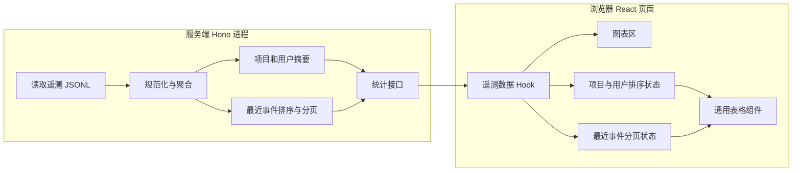
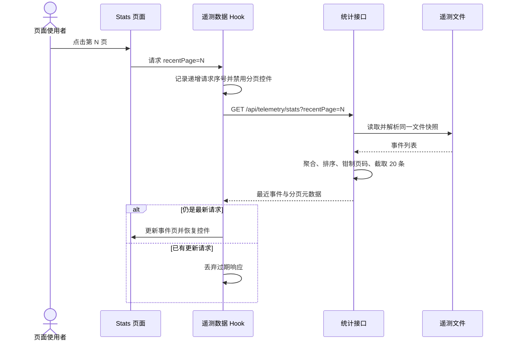

## 一句话描述

在现有 Hono stats 聚合接口和 React stats 页面内增量加入固定 20 条的服务端分页、可访问的客户端表格排序与用户命令明细，同时精简图表和项目列；首版交付 `web/server.ts`、`web/src/pages/stats.tsx`、`web/src/pages/stats/StatsCharts.tsx` 及对应测试的修改。

## 方案设计

### 设计关注点

本变更同时命中 frontend 与 backend：核心覆盖 D04 流程与失败路径、D05 接口契约、D06 数据与状态、D07 UI 与交互、D13 验证策略和 D14 风险决策；D08 性能、D09 恢复、D10 Email 隐私及 D12 兼容作为 supporting。D01 已由 brainstorm 锁定，D02/D03 不改变现有部署和进程边界，仅作为职责 checklist；D11 不新增观测系统。

### 架构概览

保持单进程、单接口和现有依赖方向：服务端仍是遥测文件与页面之间的唯一数据边界，浏览器只持有视图状态，不复制服务端的事件全量数据。



运行边界与职责归属：

| 边界 | 负责 | 不负责 |
|------|------|--------|
| `web/server.ts` | 读取同一文件快照、聚合命令次数、确定默认顺序、分页最近事件、返回分页元数据 | 保存浏览器选择的排序字段、渲染状态 |
| `useTelemetryStats` | 初始加载、刷新、分页请求、竞态隔离、保留上次成功数据 | 对项目/用户做业务聚合 |
| `StatsDashboard` | 项目和用户的独立排序状态、连接分页回调 | 直接操作 DOM 或重新解析遥测数据 |
| `TelemetryTable` | 渲染表头按钮、`aria-sort`、表体及可选 footer | 决定具体业务排序字段 |
| `StatsCharts` | 根据聚合分布生成 Chart.js 配置 | 感知分页和表格排序 |

### 方案对比

| 决策点 | 候选 | 选择与原因 |
|--------|------|------------|
| 最近事件分页 | 前端全量、独立 events 接口、stats 接口分页 | 选择 stats 接口分页：避免全量 `output` 响应，同时保持当前唯一入口和最小变更范围 |
| 表格排序 | 服务端往返、前端排序 | 选择前端排序：项目和用户摘要已全量返回，交互即时且不增加文件扫描；服务端仍给出正确默认顺序 |
| 命令详情 | 模态框、新页面、现有浮层 | 复用 `DetailTrigger`：列表内容短，已有点击、外部关闭和 Escape 行为 |
| 图表移除 | 删除 UI 与服务端字段、仅删除 UI | 仅删除命令耗时图表，保留 `commandAvgDuration` 响应和平均耗时 KPI，降低兼容风险 |

### 关键时序

初始加载和手动刷新会替换完整统计快照；分页请求只提交响应中的 `recentEvents` 与 `recentEventsPagination` 到分页状态，避免无意义地重建图表和重置排序。



失败路径：

- 非正整数 `recentPage` 按 1 处理；超过末页钳制到末页；无事件时返回第 1 页、总页数 1、总数 0。
- 文件不存在或没有有效事件时，沿用空统计响应并补齐分页元数据。
- 请求失败时保留最后一次成功的表格与图表数据，状态栏显示错误；分页控件恢复可操作，用户可重试或刷新。
- 快速连续切页用单调递增请求序号隔离，较早响应不得覆盖较新选择。

### 模块设计

#### 服务端聚合

1. 新增固定常量 `RECENT_EVENTS_PAGE_SIZE = 20` 和只接受安全正整数的页码解析函数。
2. `/api/telemetry/stats` 从查询参数读取 `recentPage`，传给 `readTelemetryStats`。
3. 先筛选具有数字时间戳的可展示事件并按时间降序，再基于该集合计算总数、钳制页码和切片。
4. 最近事件映射补充 `userEmail: event.git?.userEmail`。
5. 用户响应新增已确定排序的 `commands: Array<{ command, count }>`；`topCommand` 继续保留。
6. 项目服务端默认排序改为事件数降序，并使用最近活跃和项目标识作为 tie-breaker。

#### 前端状态与表格

- 项目和用户各自持有 `{ key: 'eventCount' | 'lastSeen', direction: 'asc' | 'desc' }`，默认 `eventCount/desc`。
- 点击非当前字段时切换到该字段的降序；点击当前字段时反转方向。
- 排序对输入数组做复制，不修改接口响应。主字段相同时，另一数值字段固定降序，最终按稳定文本标识升序。
- `TelemetryTable` 的表头从字符串升级为列描述；仅可排序列渲染按钮，并在 `<th>` 暴露 `aria-sort`。
- 项目列描述删除 User、Email；用户最常用命令通过 `DetailCell` 展示完整命令次数；最近事件增加 Email。
- 最近事件表通过 table footer 渲染分页，包含上一页、下一页、当前页附近页码、首末页及省略号；当前页使用 `aria-current="page"`。

### 代码设计预览

统计接口保持现有字段并新增分页与命令明细：

```ts
interface CommandUsage {
  command: string
  count: number
}

interface RecentEventsPagination {
  page: number
  pageSize: 20
  totalItems: number
  totalPages: number
}

interface TelemetryStatsResponse {
  // 既有汇总字段继续保留
  users: Array<{
    topCommand: string
    commands: CommandUsage[]
  }>
  recentEvents: Array<{
    userEmail?: string
    // 既有事件字段继续保留
  }>
  recentEventsPagination: RecentEventsPagination
}
```

请求契约：

| 项目 | 约定 |
|------|------|
| 方法与路径 | `GET /api/telemetry/stats?recentPage=<number>` |
| 默认值 | 缺失、非整数、非正数或超出安全整数范围时使用 1 |
| 上界 | 大于 `totalPages` 时返回末页；空结果的有效页固定为 1 |
| 页大小 | 服务端固定 20，不接受调用方放大 |
| 成功 | HTTP 200，始终返回 `recentEventsPagination` |
| 读取失败 | 沿用当前同步读取行为；前端按请求失败路径保留旧数据 |

排序比较器只处理数值字段，确保 `0` 和缺失值有明确顺序：缺失数值归一为 0；文本 tie-breaker 使用项目 `org/repo/projectId` 或用户 `userEmail/userName`。

### UI 设计

本次没有新增设计稿、截图或线框；设计事实来自现有 stats 页的 glass card、badge、table、tooltip、断点和色彩变量。实现只在现有视觉系统中增加交互提示，不宣称高保真还原新的视觉稿。

组件边界：

- `SortableHeader`（可内联于 `TelemetryTable`）只负责按钮、箭头和 ARIA 状态。
- `Pagination` 只接收分页元数据、加载态与 `onPageChange`，不自行请求。
- `DetailTrigger` 继续作为项目详情、命令详情和执行结果的统一浮层入口。

状态矩阵：

| 区域 | 状态 | 呈现与行为 |
|------|------|------------|
| 全页 | initial loading | 保持既有 KPI/表格加载占位，首次响应后展示数据 |
| 全页 | initial error | 状态栏显示错误，KPI 保持 `-`，表格空态不伪造数据 |
| 排序表 | default | 事件数降序，表头箭头和 `aria-sort="descending"` 一致 |
| 排序表 | alternate/ascending | 点击立即本地更新行序，不发网络请求 |
| 命令详情 | closed/open | badge 可聚焦；打开后显示全部命令次数，支持再次点击、外部点击、Escape 关闭 |
| 最近事件 | empty | 显示既有空态；分页显示第 1/1 页且前后按钮禁用 |
| 最近事件 | page loading | 保留当前行，分页按钮禁用并暴露 busy 状态 |
| 最近事件 | page error | 保留当前行，状态栏显示错误，分页恢复以便重试 |
| 最近事件 | selected page | 当前页按钮具有 selected 样式和 `aria-current` |

适配策略：排序按钮不改变表头高度；箭头与文字同一行。Email 使用现有 `.truncate`，桌面最大宽度 150px、窄屏 100px，并保留 `title`。表格继续横向滚动；分页在窄屏允许换行但保持按钮可点击区域。

### 数据设计

- 权威数据源仍是单次读取的 JSONL 快照；不新增持久状态或迁移。
- 服务端 `commands` 数组按 count 降序、command 升序生成，保证响应和浮层顺序确定。
- `recentEventsPagination.totalItems` 只统计数字时间戳事件；`totalEvents` 保持现有语义，不与分页总数混用。
- 浏览器权威分页位置来自服务端响应的 `page`，不信任请求页码；项目/用户排序是纯派生状态，不写回服务端。
- Email 沿用现有遥测保留周期和接口访问边界，不新增采集、存储或日志。

## 质量与专项设计

### 性能与资源

- 服务端仍需 O(n) 读取和聚合，当前变更不引入数据库或缓存；分页只约束响应体，不能宣称降低文件扫描成本。
- 最近事件响应上限为 20 条，避免全量 `output` 进入浏览器。
- 客户端排序只针对项目和用户摘要，采用复制后 O(m log m) 排序；不对全量事件做浏览器排序。
- 分页响应只更新事件分页状态，防止 Chart.js 实例因页码变化被销毁重建。通过组件测试验证状态边界，构建验证不引入新依赖。

### 可靠性与恢复

- stats 请求无写副作用，可安全重试。
- 请求序号隔离过期响应；失败不清空已有数据，故障范围限制在状态栏和本次分页动作。
- 页码由服务端钳制，文件在两次请求间缩小时不会产生永久空白页。
- 损坏 JSONL 行继续沿用当前跳过策略，不因分页增强而放大单行故障。

### 安全与隐私

Email 是用户数据。本变更只把事件中已经采集、且同一 stats 响应其他区域已返回的 `git.userEmail` 映射到最近事件，不改变采集和访问控制边界；页面不使用 HTML 注入，React 文本渲染和 `title` 都使用字符串。测试使用虚构地址，错误信息与日志不得新增 Email 输出。stats 接口现有鉴权策略不在本变更中扩张或弱化。

### 兼容与迁移

- API 只新增 `recentEventsPagination`、用户 `commands` 和事件 `userEmail`，保留现有字段及 `recentEvents` 数组形态。
- `recentPage` 缺失时返回原来的第一页 20 条，因此旧调用方行为保持不变。
- `commandAvgDuration` 和平均耗时 KPI 保留；只停止渲染命令耗时图表。
- 无数据迁移和不可逆步骤。回滚前端后，新增响应字段会被忽略；回滚服务端后，新前端应将缺失分页元数据降级为单页，避免页面崩溃。

## 验证策略

| 设计点 | 自动化证据 | 负向/边界证据 |
|--------|------------|---------------|
| OpenSpec 竖向柱状图、移除耗时图 | Chart 配置测试或可观测 canvas 配置断言 | 空分布仍显示空状态 |
| 项目列和排序 | `stats-page.test.tsx` 验证六列表头、默认顺序、字段切换和方向反转 | 相同事件数、缺失时间的稳定顺序 |
| 用户排序和命令明细 | 页面交互测试验证两类排序及浮层完整次数 | 空明细不渲染按钮，Escape 关闭 |
| 服务端分页契约 | `server.test.ts` 写入 21+ 条 JSONL，验证两页、总数、倒序、Email | 非法页码、超末页、空文件、无时间戳、损坏行 |
| 前端分页 | 页面测试验证页码 URL、当前页、前后按钮和响应更新 | 失败保留旧行、过期响应不覆盖新页 |
| Email 截断 | 页面测试验证文本、`truncate` class 和完整 `title` | 缺失 Email 显示 `-` |
| React/路由约束 | 现有 `react-pages.test.ts` 与 import specifier 测试 | 不出现 DOM 脚本或类型逃逸 |

验证顺序：

```bash
pnpm --dir web test -- stats-page.test.tsx server.test.ts
pnpm --dir web test
pnpm --dir web build
```

实现后进行一次浏览器手动检查：桌面和窄屏下查看表头箭头、浮层定位、Email 省略和分页换行。该项用于补充 jsdom 无法证明的真实布局，不替代自动化测试。

## 风险与未决

| 决策/风险 | 影响 | 缓解与追溯 |
|-----------|------|------------|
| 同一 stats 请求仍扫描全文件 | 数据量很大时分页不会降低服务端计算成本 | 接受为本次范围；若真实数据证明成为瓶颈，再独立设计缓存/索引，不在本变更预优化 |
| stats 接口分页会返回重复的聚合字段 | 网络有少量冗余 | 事件 `output` 才是主要体积风险；首版保持单接口，浏览器只提交分页字段 |
| Email 在最近事件中更易被看见 | 增加同页信息密度 | 沿用既有访问边界、截断展示、不写日志；用户已明确要求该列 |
| 客户端与服务端都定义默认项目顺序 | 两处规则可能漂移 | 共用相同明确规则并分别以服务端契约测试、前端交互测试锁定 |

无未决问题；需求取舍、owner 与验收边界均已确认。

## 完成检查

- [x] technical-design skill 已调用
- [x] 已识别 frontend + backend，并在「设计关注点」说明重点维度
- [x] 已用 core / supporting / checklist / skip 控制输出深度
- [x] D07、D08、D09、D10、D12 仅按实际触点展开；D11 跳过
- [x] D04/D05/D06/D07/D13/D14 均有自动化、负向或手动验证方式
