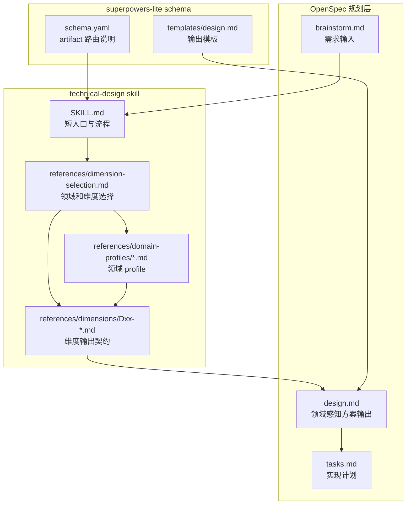
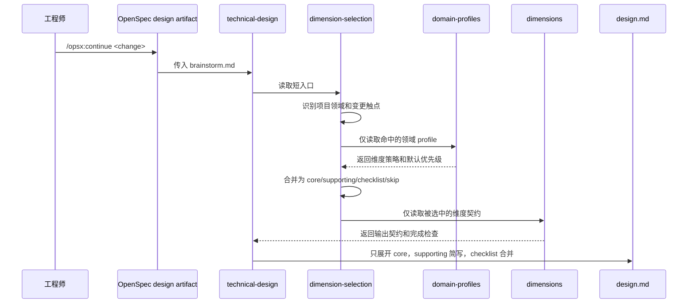

## 一句话描述

把 `technical-design` 改造成“短入口 + 领域 profile + D1-D14 维度契约”的领域感知设计框架；首版交付包括新的 skill 入口说明、按需加载的参考文件树、superpowers-lite design 路由文案、design.md 模板调整、模板复制回归测试和版本号更新。

首版交付清单：

- `technical-design` skill 入口从固定 C4/ATAM/STRIDE/SLO 改为领域识别、触点识别、维度选择和输出优先级控制。
- 新增 `references/dimension-selection.md` 作为短路由入口。
- 新增 `references/domain-profiles/*.md`，覆盖 frontend、backend、desktop、mobile、cli、sdk、devops、custom。
- 新增 `references/dimensions/D01-D14*.md`，每个维度只定义输出契约、适用 lens 和完成检查。
- 将 D03 命名为“运行边界与职责归属”。
- D07 引用 `ui-fidelity-playbook`，但区分有设计事实和无设计事实。
- D10 采用统一安全章节 + frontend/backend-api/desktop/cli/sdk lens。
- 更新 `superpowers-lite` schema 和 design 模板，使其不再固定描述后台方法论。
- 新增模板回归测试，并同步 `.harness` 当前运行时副本与版本记录。

## 方案设计

### 设计维度选择

本次 change 本身是 CLI 模板/知识层改造，不是业务运行时代码改造。设计重点是让未来 `technical-design` 在其他项目中能按领域生成合适文档。

| 维度 | 优先级 | 本次输出方式 | 理由 |
| --- | --- | --- | --- |
| D01 需求边界与目标 | core | 正文展开 | 所有设计都需要明确 in/out 和首版交付 |
| D02 架构与模块边界 | core | 正文展开 | 需要确定短入口、profile、dimension 的职责边界 |
| D03 运行边界与职责归属 | core | 正文展开 | 需要说明 agent 运行时如何按需读取文件和谁负责路由 |
| D04 核心流程与异常路径 | core | 时序图 | 需要定义从 brainstorm 到 design.md 的生成流程 |
| D05 接口与契约 | supporting | 文件契约表 | 主要是 Markdown 文件之间的引用契约 |
| D06 数据与状态设计 | checklist | 不单独成章 | 不新增运行时数据结构，只有文档状态和 artifact 状态 |
| D07 UI/交互/设计系统 | supporting | 方法论引用 | 本次不实现 UI，但 D07 需要引用 ui-fidelity-playbook |
| D08 性能与资源 | supporting | 质量简表 | 关注上下文加载量和文档篇幅，不涉及 QPS/TPS |
| D09 可靠性与恢复 | checklist | 完成检查 | Markdown 模板无运行时恢复逻辑 |
| D10 安全与隐私 | supporting | lens 样板 | 需要定义安全维度如何按领域表达，非本次运行时安全改造 |
| D11 可观测性与诊断 | checklist | 完成检查 | 不新增监控，只要求可验证的测试证据 |
| D12 兼容性与迁移 | core | 正文展开 | 需要保证历史 artifact 不迁移、未来模板生效 |
| D13 验证策略 | core | 正文展开 | 需要模板复制和 schema 文案测试 |
| D14 风险与决策记录 | core | 风险表 | 记录为什么不按领域拆完整模板 |

优先级规则：

- `core`：正文详细展开，可以有图、表、文件树。
- `supporting`：正文用短表或 3-5 条要点。
- `checklist`：只进入完成检查或风险表，不单独成章。
- `skip`：不输出；若容易误判，只写一句跳过原因。

### 架构概览



职责边界：

- `SKILL.md` 只负责流程编排：读取需求输入、识别领域、读取短入口、选择 profile 和维度、控制输出深度。
- `dimension-selection.md` 是唯一的选择规则入口：定义领域标签、变更触点、profile 合并和优先级合并规则。
- `domain-profiles/*.md` 只回答“某领域什么时候启用哪个维度、默认优先级是什么”，不重复维度输出模板。
- `dimensions/Dxx-*.md` 只回答“维度被启用后怎么写”，不内置主启用条件。
- `schema.yaml` 只告诉 OpenSpec design artifact 使用新的领域感知设计流程，不再把 C4/ATAM/STRIDE/SLO 写成固定默认。
- `templates/design.md` 是产物骨架，体现“设计维度选择”和“完成检查”，避免强制空章节。

### 方案对比

| 候选方案 | 上下文控制 | 混合领域支持 | 维护成本 | 人类可读性 | 结论 |
| --- | ---: | ---: | ---: | ---: | --- |
| A. 只在现有模板中追加“按需省略”提示 | 2 | 2 | 5 | 2 | 不推荐。模板已有按需提示，但 skill 红线仍偏后台 |
| B. 按领域拆完整设计模板，如 frontend/backend/desktop design | 3 | 2 | 2 | 3 | 不推荐。内容重复，D8/D10/D13 等公共维度容易漂移 |
| C. D1-D14 维度抽象 + 领域 profile + 按需维度文件 | 5 | 5 | 4 | 5 | 推荐。上下文可控，混合领域可组合，公共契约集中维护 |

推荐方案为 C。领域 profile 只做选择和优先级，维度文件做统一输出契约；这能同时支持后端、前端、桌面、CLI、SDK 等领域，也能处理 Electron + React + API 这类混合变更。

### 关键时序



异常路径：

- 若领域无法识别：使用 `custom` profile，全部维度默认 `conditional`，并要求在 design.md 中记录识别依据。
- 若多个 profile 冲突：任一 profile 标为 `core` 时取最高优先级；任一 profile 标为 `skip` 不能覆盖其他 profile 的 `core/supporting`。
- 若用户明确要求某个维度：用户要求优先于 profile 默认策略，但仍需控制输出深度。
- 若维度文件不存在：design artifact 应停止并说明缺失文件，不凭空生成该维度规则。

### 模块设计

#### 文件结构

```text
templates/skills/technical-design/
  SKILL.md
  references/
    dimension-selection.md
    domain-profiles/
      frontend.md
      backend.md
      desktop.md
      mobile.md
      cli.md
      sdk.md
      devops.md
      custom.md
    dimensions/
      D01-scope-goals.md
      D02-architecture-boundaries.md
      D03-runtime-boundaries.md
      D04-flows-failures.md
      D05-contracts.md
      D06-data-state.md
      D07-ui-interaction.md
      D08-performance-resource.md
      D09-reliability-recovery.md
      D10-security-privacy.md
      D11-observability-diagnostics.md
      D12-compatibility-migration.md
      D13-verification.md
      D14-risks-decisions.md
```

同步位置：

```text
.harness/skills/technical-design/
```

同步原则：

- `templates/skills/technical-design` 是分发源。
- `.harness/skills/technical-design` 是本仓库当前运行时副本。
- 本 change 中两者内容保持一致，避免后续当前仓库继续使用旧 skill。

#### `SKILL.md`

职责：

- 声明本 skill 是领域感知方案设计器。
- 明确 progressive loading：先读 `dimension-selection.md`，再按命中领域读 `domain-profiles/*.md`，最后仅读取选中维度文件。
- 说明 C4、ATAM、STRIDE、SLO、ui-fidelity-playbook 都是按维度路由的方法论，不是全局强制项。
- 要求 design.md 开头输出“设计维度选择”表，解释哪些维度是 `core/supporting/checklist/skip`。

#### `dimension-selection.md`

职责：

- 定义领域标签：frontend、backend、desktop、mobile、cli、sdk、devops、custom。
- 定义变更触点：UI、API、数据、权限、性能、native、CLI、SDK、部署、可观测性等。
- 定义 profile 合并规则和优先级合并规则。
- 不写 D10、D8 等具体维度的输出内容。

#### `domain-profiles/*.md`

示例字段：

```md
| 维度 | 策略 | 默认优先级 | 触发条件 | 输出深度 |
| --- | --- | --- | --- | --- |
| D07 UI/交互/设计系统 | required | core | 页面、组件、弹窗、交互、状态变更 | 正文展开 |
| D10 安全与隐私 | conditional | supporting | URL query、token、登录态、外部内容渲染 | 风险简表 |
```

策略含义：

- `required`：该领域下通常应启用。
- `conditional`：命中触点时启用。
- `checklist`：只需要确认，不单独成章。
- `not-applicable`：默认不适用，但不能覆盖其他命中领域的启用结果。

#### `dimensions/Dxx-*.md`

D1-D14 首版定义：

| ID | 名称 | 说明 |
| --- | --- | --- |
| D01 | 需求边界与目标 | in/out、首版交付、约束、非目标 |
| D02 | 架构与模块边界 | C4、分层、模块职责、依赖方向 |
| D03 | 运行边界与职责归属 | 说明模块运行在哪里、谁负责什么、不负责什么 |
| D04 | 核心流程与异常路径 | 时序、状态机、happy/unhappy path |
| D05 | 接口与契约 | REST/RPC/CLI/SDK/组件 props/事件/错误码 |
| D06 | 数据与状态设计 | 数据模型、缓存、状态管理、一致性、迁移 |
| D07 | UI/交互/设计系统 | 页面结构、组件、状态变体、响应式、a11y、设计事实 |
| D08 | 性能与资源 | 后端延迟/容量、前端渲染/交互、桌面内存/启动、CLI 启动耗时 |
| D09 | 可靠性与恢复 | 降级、重试、错误边界、崩溃恢复、离线/弱网 |
| D10 | 安全与隐私 | 安全资产、信任边界、领域 lens、风险与缓解、验证方式 |
| D11 | 可观测性与诊断 | logs/metrics/traces、前端埋点、crash、debug 输出 |
| D12 | 兼容性与迁移 | 旧入口兼容、灰度、回滚、数据/接口兼容 |
| D13 | 验证策略 | 单测、组件测试、E2E、契约测试、视觉验证、性能验证 |
| D14 | 风险与决策记录 | 方案对比、取舍、未决项、owner、追溯锚点 |

### D07 UI/交互设计

本次不新增产品 UI，但 D07 需要让未来 design 能覆盖前端、移动端和桌面壳层设计。

D07 设计规则：

- 有设计事实时，引用 `ui-fidelity-playbook` 的范围、运行时层次、设计事实来源、高风险失真点、状态变体和运行时验证。
- 无设计事实时，不声称高保真；只输出 UI 意图、组件边界、状态矩阵、适配策略和待补设计事实。
- D07 的“运行时层次”在新命名中应对齐 D03，使用“运行边界与职责归属”，避免继续传播 ownership 生硬表述。

输出契约：

| 字段 | 内容 |
| --- | --- |
| 设计事实来源 | Figma、截图、线框、现有实现、无设计事实 |
| 实现范围 | 整页、区块、弹窗、组件、宿主容器内容区、状态变体 |
| 运行边界 | 宿主层、页面层、组件层、浮层、状态层 |
| 状态变体 | default/loading/empty/error/disabled/hover/active/切换态 |
| 高风险失真点 | 容器、间距、对齐、背景层、资源、滚动、状态跳转 |
| 验证方式 | 真实运行容器截图、组件测试、E2E、视觉对比 |

### D10 安全与隐私设计

D10 的启用条件放在 `dimension-selection.md` 和各领域 profile 中；D10 文件本身只定义启用后的输出契约。

统一输出契约：

| 字段 | 内容 |
| --- | --- |
| 安全资产 | token、用户数据、文件、native 能力、后端资源等 |
| 信任边界 | 哪些输入、调用方、renderer、CLI 参数、外部系统不可信 |
| 采用 lens | frontend、backend-api、desktop、cli、sdk，可多选 |
| 风险与缓解 | 风险点、场景、设计约束、验证方式 |

领域 lens：

| Lens | 关注点 |
| --- | --- |
| frontend | XSS、鉴权态、敏感信息、URL 泄露、前端权限边界 |
| backend-api | 认证授权、越权、注入、数据暴露、滥用、限流 |
| desktop | preload/IPC 白名单、权限隔离、本地文件、外链、renderer/main 信任边界 |
| cli | 参数注入、凭据处理、文件路径、stdout/stderr 泄露 |
| sdk | 公开 API 滥用、供应链、类型误用、错误信息泄露 |

完整 STRIDE 只在以下情况启用：高风险后端入口、外部开放接口、跨租户/跨用户权限、合规数据、复杂威胁面。

### 代码设计预览

#### 回归测试

在 `tests/templates.test.ts` 中新增两类测试：

```ts
it('should copy domain-aware technical-design references', () => {
  const target = path.join(tmpDir, 'skills')
  copyTemplateSkills(target)

  const technicalDesign = path.join(target, 'technical-design')
  expect(fs.existsSync(path.join(technicalDesign, 'references', 'dimension-selection.md'))).toBe(true)
  expect(fs.existsSync(path.join(technicalDesign, 'references', 'domain-profiles', 'frontend.md'))).toBe(true)
  expect(fs.existsSync(path.join(technicalDesign, 'references', 'domain-profiles', 'desktop.md'))).toBe(true)
  expect(fs.existsSync(path.join(technicalDesign, 'references', 'dimensions', 'D03-runtime-boundaries.md'))).toBe(true)
  expect(fs.existsSync(path.join(technicalDesign, 'references', 'dimensions', 'D10-security-privacy.md'))).toBe(true)
})
```

```ts
it('should route design through domain-aware dimensions instead of fixed backend methods', () => {
  const target = path.join(tmpDir, 'openspec')
  copyOpenspecTemplate(target)

  const schema = fs.readFileSync(path.join(target, 'schemas', 'superpowers-lite', 'schema.yaml'), 'utf-8')
  const template = fs.readFileSync(path.join(target, 'schemas', 'superpowers-lite', 'templates', 'design.md'), 'utf-8')

  expect(schema).toContain('领域识别 + D1-D14 设计维度选择')
  expect(schema).toContain('core / supporting / checklist / skip')
  expect(schema).toContain('D03 运行边界与职责归属')
  expect(schema).not.toContain('design 使用 technical-design（C4/ATAM/STRIDE/SLO）')

  expect(template).toContain('### 设计维度选择')
  expect(template).toContain('D03 运行边界与职责归属')
  expect(template).not.toContain('SLO 指标')
})
```

#### schema 文案

`templates/openspec/schemas/superpowers-lite/schema.yaml` 的 design 说明改为：

```yaml
description: 使用领域识别 + D1-D14 设计维度选择的技术方案设计（可选）
```

流程描述中将：

```text
design 使用 technical-design（C4/ATAM/STRIDE/SLO）。
```

改为：

```text
design 使用 technical-design（领域识别 + D1-D14 设计维度选择 + core / supporting / checklist / skip 输出深度控制）。
```

#### design 模板

`templates/openspec/schemas/superpowers-lite/templates/design.md` 新增：

```md
### 设计维度选择

<!-- 列出领域标签、变更触点、D1-D14 维度优先级。 -->
```

并把固定质量章节改为按维度输出：

```md
## 质量与专项设计

<!-- 仅展开被选为 core/supporting 的 D08-D11 等维度。 -->
```

### 数据设计

本 change 不新增运行时数据模型，也不修改 OpenSpec artifact schema 的持久化结构。新增的是 Markdown 参考文件和模板文案：

- `domain-profiles/*.md` 中的 profile 表是静态知识，不由 CLI 解析。
- `dimensions/Dxx-*.md` 是 agent 可读契约，不引入机器校验格式。
- `tests/templates.test.ts` 通过文件存在和关键文案断言提供回归保护。

版本记录：

- `templates/versions-yml.yml` 中 `technical-design` 从 `1.1.0` 提升到 `1.2.0`。
- `.harness/versions.yml` 中 `technical-design` 同步提升到 `1.2.0`。

## 质量设计

### 文档篇幅与上下文控制

| 指标 | 目标 | 告警线 | 验证方式 |
| --- | --- | --- | --- |
| 默认读取入口 | 每次 design 先读 1 个短入口 | 入口包含所有领域细节 | 检查 `dimension-selection.md` 内容边界 |
| 领域 profile 读取 | 只读命中领域 | 无条件读取全部 profile | `SKILL.md` 流程说明检查 |
| 维度展开 | 只展开 `core`，`supporting` 简写，`checklist` 合并 | D1-D14 全量成章 | design 模板和 skill 完成检查 |
| 维度契约唯一性 | Dxx 输出契约只在 `dimensions/Dxx-*.md` 定义 | profile 中复制完整维度模板 | 文件内容审查 |

### 安全与隐私

本 change 不新增运行时入口、网络接口、权限模型或敏感数据处理。安全设计重点是 D10 方法论本身的正确表达：

| Lens | 风险点 | 场景 | 设计约束/缓解 | 验证方式 |
| --- | --- | --- | --- | --- |
| docs | 误导 agent 强制输出 STRIDE | 小型前端或 CLI 变更被要求写完整 STRIDE | D10 明确 STRIDE 仅按触发条件启用 | 文案测试 + 人工审查 |
| docs | 安全启用条件分散 | D10 内部和 profile 同时定义启用逻辑 | 启用条件只放 selection/profile，D10 只放输出契约 | 文件内容审查 |

### 兼容性与迁移

- 历史 `openspec/changes/**/design.md` 不迁移。
- 新项目通过 `templates/skills/technical-design` 获取新结构。
- 当前仓库通过同步 `.harness/skills/technical-design` 立即使用新结构。
- 旧文档中的 C4、ATAM、SLO、STRIDE 不删除其方法论价值，只移动到对应维度或 lens 中按需启用。

### 验证策略

| 验证 | 命令 | 目标 |
| --- | --- | --- |
| 目标模板测试 | `npm test -- tests/templates.test.ts` | 验证 skill references 被复制、schema/template 文案更新 |
| 类型检查 | `npm run lint` | 验证 TypeScript 测试和项目类型无误 |
| 人工抽样 | 阅读 `templates/skills/technical-design/SKILL.md` 和 D10/D07 文件 | 验证方法论边界、领域 profile 和维度契约不重复 |

## 风险与未决

| 风险/未决 | 影响 | 处理 |
| --- | --- | --- |
| D1-D14 首版过细 | 未来 design 仍可能过长 | 通过优先级控制输出深度；后续可合并低频维度 |
| profile 条件写得过宽 | 大多数变更仍命中过多维度 | `tasks.md` 中将 profile 表保持简洁，优先使用 conditional + checklist |
| custom 领域无法精准选择 | 新领域或少见技术栈可能判断不足 | `custom.md` 默认全部 conditional，并要求记录识别依据 |
| `.harness` 与 `templates` 不一致 | 当前仓库和新项目行为不同 | 任务中使用目录同步或逐文件复制，并用 git diff 检查 |
| 测试只验证关键文案 | Markdown 质量仍需人工审查 | 在完成检查中加入抽样阅读和 grep 检查 |

## 完成检查

- [x] technical-design skill 已调用；旧 skill 的固定红线作为现状输入，不作为本设计的强制输出规则。
- [x] 存在 ≥ 2 候选方案对比，并给出推荐方案。
- [x] 已定义 `dimension-selection.md`、`domain-profiles/*.md`、`dimensions/Dxx-*.md` 的职责边界。
- [x] 已明确 `core / supporting / checklist / skip` 控制输出深度。
- [x] 已将 D03 命名为“运行边界与职责归属”。
- [x] 已覆盖 D07 对 `ui-fidelity-playbook` 的引用边界。
- [x] 已覆盖 D10 安全 lens 和 STRIDE 按需启用策略。
- [x] 已给出模板测试、schema/template 文案更新和版本同步策略。
