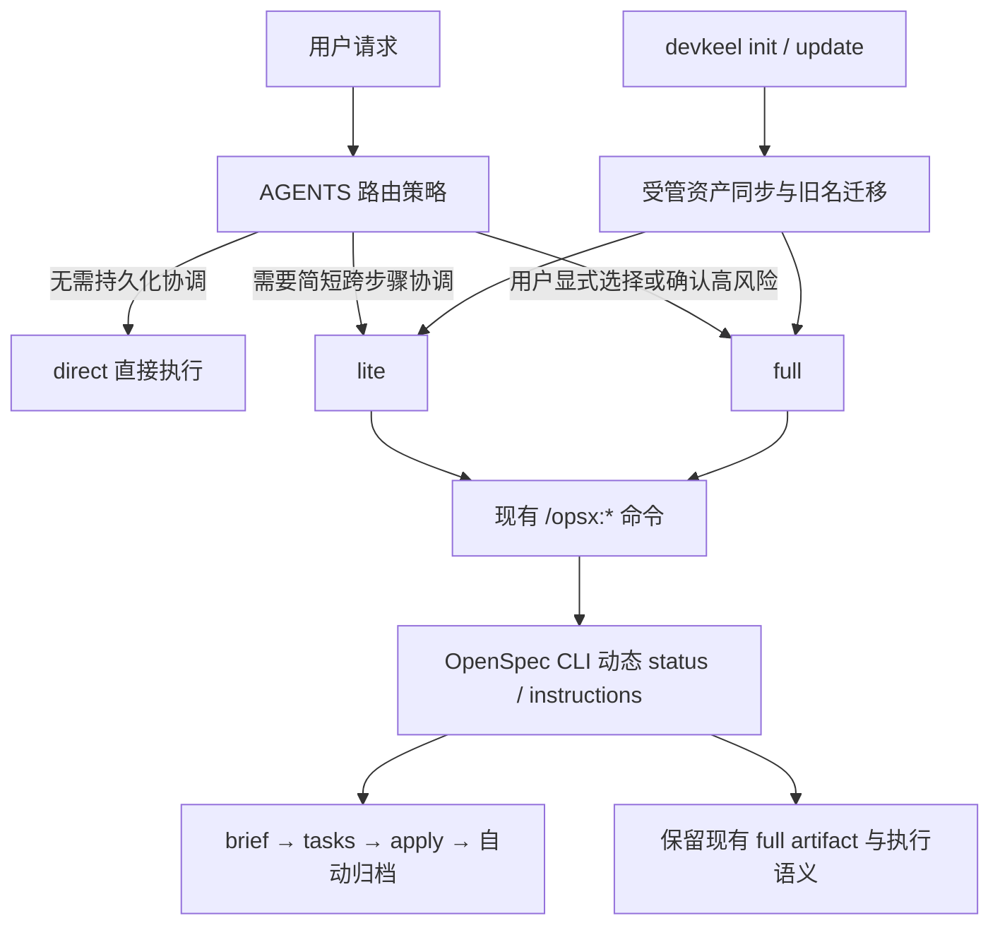

## 一句话描述

以 AGENTS 路由策略、两个 OpenSpec schema 和一套幂等升级迁移组成三档执行架构；首版交付 direct 基线、`lite`、`full` 硬改名、统一 `/opsx:*` 适配、skill 清理及结构化回归测试。

## 方案设计

### 设计关注点

本方案属于 CLI + Harness 工作流 DSL 变更，重点展开 D01 范围、D02 架构边界、D04 流程与失败路径、D05 契约、D12 兼容迁移、D13 验证和 D14 决策；D06 状态与 D09 恢复为 supporting。D08 性能、D10 安全和 D11 诊断仅作 checklist；无新运行进程或 UI，D03、D07 跳过。

### 架构概览



边界规则：

- `templates/agents-md.md` 负责判断 direct/lite/full、询问必要确认、声明最低执行基线，并在通用完成态覆盖 schema instruction 时补偿 lite `all_done` 归档。
- `/opsx:*` commands、同源 `openspec-*` skills 与 OpenSpec CLI 保持上游通用实现，不加入 Harness 专属路由或生命周期分支。
- `templates/openspec/schemas/{lite,full}` 是各流程的单一事实源；dogfood `openspec/schemas/` 与分发模板必须一致。
- `src/lib/update.ts` 提供无交互、可单测的迁移探测/执行原语，`src/commands/update.ts` 与已有项目的 init 路径负责调用；迁移不得混入通用“可能是用户资产”的删除询问。

### 方案对比

| 决策 | 采用方案 | 未采用方案与原因 |
|---|---|---|
| 流程选择 | direct / lite / full 渐进路由 | 文件数或交付项计分容易受任务拆分方式影响 |
| OpenSpec 使用 | lite/full 复用，direct 不使用 | direct 透明建 change 仍会产生维护负担 |
| 默认 schema | 配置默认 `full`；有上下文的普通非 direct 请求显式选择 lite | 配置默认 lite 会使无上下文 `/opsx:new` 无法按约定安全落到 full |
| 旧 schema | `superpowers-lite` 硬迁移为 `full` | 兼容别名会永久增加分支、版本和心智成本 |
| apply 质量门禁 | 最低验证 + 风险触发 TDD/review | 固定 TDD、多轮 review、worktree 与 commit 是当前主要时延来源 |
| 废弃资产清理 | 精确的受管资产迁移 | 现有可拒绝 prompt 会在版本表覆盖后丢失 tombstone，无法保证后续清理 |

### 关键时序

#### 请求路由

1. 先短路用户显式原子操作；普通“调试”不再自动等同于插桩调试。
2. 若任务明显可在当前会话内调查、修改并验证，不需持久化协作状态，则 direct。
3. 若并非明显 direct，且没有 full 风险，默认 lite；边界案例偏向 direct。
4. 若命中 full 风险，只给出原因并询问用户；同意后选择 full，不同意则在用户接受的边界内走 lite/direct。
5. direct 实施中发现范围实质扩大时暂停并询问是否升级 lite；同意后保留现有调查与代码，创建 brief/tasks，并只把已验证工作标为完成。

full 建议信号不是“出现 API/CLI/数据库”本身，而是三个条件同时成立：存在外部控制的消费者、可观察契约的形状或语义改变、因此产生协调/版本/迁移/回滚成本。

#### Lite 生命周期

1. 自动路由且有关键未决问题：先在对话中收敛，再创建 change；显式 `/opsx:new` 可立即建脚手架。
2. `brief` 汇总目标、边界、现状、方案、风险与验收；`tasks` 将其转为可勾选交付项。
3. `/opsx:apply` 由当前 Agent 顺序执行；每项通过自己的验证后才勾选。失败或用户中断时 change 保持 active，后续同一命令从未完成项恢复。
4. 最后一项完成后直接调用普通 OpenSpec archive；lite 不生成 delta specs，也不生成 human-review、verify 或 retrospective。
5. OpenSpec 在 tasks 全勾选时会返回通用 `all_done`，因此 AGENTS 按 `schemaName === "lite"` 补执行普通 archive；commands/skills 与 CLI 不修改。

#### 旧 schema 迁移

1. 探测 `config.yaml`、`settings.json`、`changes/**/.openspec.yaml`（含 archive）、兼容旧 `openspec/archive/**`、旧 schema 目录、版本键和待退休 skill；迁移计划非空时禁止“已是最新版本”提前返回。
2. 先安装并解析验证 `full` 和 `lite`；预读并解析所有候选元数据，任何不可解析输入都在写入前报错。
3. 仅把值严格等于 `superpowers-lite` 的 selector 改为 `full`，逐文件使用临时文件 + rename 写入。
4. 重扫确认无旧 selector 后，删除精确旧 schema 目录和受管的退休 skills，再写入无旧键的新版本表。
5. 若中途失败，保留旧 schema 目录，使尚未改写的 change 仍可解析；重复运行从剩余迁移继续，最终结果幂等。

### 模块设计

| 模块 | 职责变化 | 不负责 |
|---|---|---|
| `templates/agents-md.md` | 三档路由、升级确认、外部契约判定、direct/lite 最低基线、lite 完成态恢复 | full 内部执行细节 |
| `templates/commands/opsx/*` + `templates/skills/openspec-*` | 保持 OpenSpec 上游通用实现与原版本 | Harness 专属路由和生命周期分支 |
| `lite/schema.yaml` | 定义 `brief -> tasks`、apply context 与轻量执行说明 | 强制调用 planning/TDD/review skills |
| `full/schema.yaml` | 承接原 `superpowers-lite` 全部语义，仅改身份和必要引用 | 本期内部优化 |
| `src/lib/update.ts` | 产出迁移计划、精确改写 selector、返回实际变更路径 | CLI 交互和日志 |
| `src/commands/update.ts` / init 增量路径 | 编排新资产就绪、迁移、清理、版本写入和精确 stage | 猜测用户自定义 schema |
| 版本与测试 | 注册双 schema、skill 版本及模板/dogfood/行为一致性 | 修改历史 changelog、v1 快照 |

当前发布页面中描述现行能力的内容随本变更同步；明确标识为历史版本、归档 change 或 changelog 的记录不做全局替换。

### 代码设计预览

建议把迁移从命令流程中抽为纯计划 + 有序执行，避免散落字符串替换：

```ts
interface LegacyMigrationPlan {
  metadataEdits: Array<{ path: string; nextContent: string }>
  retiredManagedAssets: string[]
  staleSchemaDirs: string[]
}

function planLegacyMigrations(projectRoot: string): LegacyMigrationPlan

function applyLegacyMigrations(
  projectRoot: string,
  plan: LegacyMigrationPlan,
): { changedPaths: string[] }
```

`detectUpdates()` 的结果与 `planLegacyMigrations()` 共同决定是否 early return；`collectCommitStagePaths()` 接收迁移实际返回的路径，只追加被改写的 `.openspec.yaml`，不 stage 整个 changes 目录。

`lite` 的核心契约：

```yaml
name: lite
version: 1
artifacts:
  - id: brief
    generates: brief.md
    requires: []
  - id: tasks
    generates: tasks.md
    requires: [brief]
apply:
  requires: [tasks]
  tracks: tasks.md
```

`brief.md` 默认 500–800 个中文字符、硬上限约 1200；超限且无法清楚表达时建议 full。`tasks.md` 不设行数或任务数硬限制，每项只要求结果、范围（可从仓库查明时填写）和验证。

### 数据设计

权威状态仍是仓库文件：change 的 `.openspec.yaml` 决定 schema，`tasks.md` checkbox 决定 lite apply 进度，`.harness/versions.yml` 记录受管资产版本。不得另增 sidecar 进度文件或遥测记录。成功归档由 OpenSpec 移动 change；失败/暂停不改其 active 状态。

## 质量与专项设计

### 可靠性与恢复

- lite 中单任务验证失败时不勾选，输出证据并停止；再次 apply 读取原 tasks 恢复。
- 自动归档失败时实现任务保持全完成，change 仍可通过 `/opsx:archive` 或再次 `/opsx:apply` 恢复。
- 迁移以“新 schema 已就绪”和“旧 selector 已清零”为删除旧目录的双门禁；只删除已由旧版本表证明为 Harness 管理的退休 skill，同名自定义资产不动。
- direct 升级只追加协调产物，不回滚用户已有代码；无法验证的既有工作不得预勾选。

### 兼容与迁移

- `full` 保留原 schema 版本 14 和 artifact/apply 语义；仅名称和引用改变，以便旧 active change 迁移后继续 `status/continue/apply`。
- `lite` 从版本 1 开始。`getBuiltinVersions()` 改为遍历版本注册表读取所有 schema 的真实版本，移除单名称硬编码。
- 不提供 `superpowers-lite` alias。回滚旧 CLI 时，已迁移 selector 可能无法被旧模板识别，因此升级操作必须先确保新 schema 完整存在；本期支持向前幂等恢复，不承诺自动降级。
- `devkeel update` 后必须删除旧 schema、旧版本键及三项退休 skill；该确定性迁移不受通用 deprecated-assets 确认流程影响。

## 验证策略

| 设计点 | 自动化证据 |
|---|---|
| 双 schema 包装 | schema validate；模板与 dogfood 字节一致；版本注册值与 schema version 一致 |
| direct/lite/full 路由 | AGENTS 契约断言 + `opsx-new/propose/ff` 集成场景：有上下文 lite、无上下文 full、显式覆盖 |
| lite artifact 与恢复 | status/instructions 场景验证只有 brief/tasks、apply context、未完成/失败/all_done 及自动归档分支 |
| 按需质量门禁 | 场景断言普通 lite 不调用 worktree/TDD/reviewer/subagent/commit，风险输入可触发一次 specialist review |
| 硬改名迁移 | update 单测覆盖 config/settings/active/archive、版本已最新仍迁移、解析失败保留旧目录、幂等、自定义 schema 不变 |
| 旧 full 兼容 | 迁移 fixture 后执行 OpenSpec status/continue/apply instruction，artifact 状态与迁移前等价 |
| skill 清理 | 初始化/update 测试验证新增 grilling、删除三项退休 skill、保留 full 的 TDD/requesting 依赖且引用无悬空 |

实施时先运行最邻近的 Vitest 文件，再运行 schema/模板集成场景与项目既有全量检查。负向用例至少包括损坏元数据、目标 schema 缺失、用户自定义同名外资产、lite 验证失败和归档失败。

## 风险与未决

- 风险：OpenSpec 的 `all_done` 覆盖 schema instruction。缓解：由 AGENTS 按 schemaName 明确处理，并加恢复场景；不修改 OpenSpec commands/skills 或 CLI。
- 风险：普通 deprecated prompt 可被拒绝且随后丢失受管标记。缓解：为本次精确退休清单建立版本化迁移，不复用可选清理。
- 风险：命令模板与 `.harness` dogfood 镜像、schema 两份副本易漂移。缓解：继续采用字节一致性测试并集中列出同步资产。
- 风险：当前工作区已有 `templates/package.json` 用户改动。实现时保留该修改，不将其覆盖或误归入无关 patch。

当前无阻塞实现的未决项。full 内部轻量化和 lite→full 自动转换作为后续独立 change。

## 完成检查

- [x] technical-design skill 已调用（或手动降级已说明原因）
- [x] 已完成领域识别，并用「设计关注点」摘要说明本方案重点覆盖的维度
- [x] 已用 core / supporting / checklist / skip 控制输出深度
- [x] D07/D10/D08/D09/D11/D12 等专项维度只在命中时展开
- [x] 每个 core 维度都有对应验证方式或无法验证的说明
