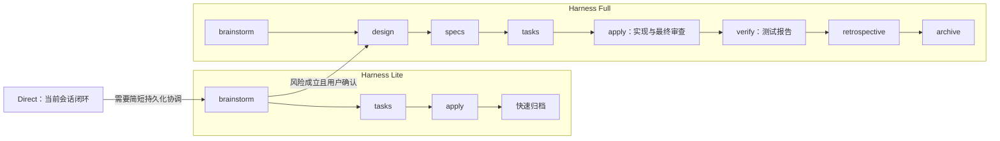

## 目标与范围

基于 Harness Lite 的渐进思路重构 Harness Full：Lite 负责低成本持久化协调，Full 在其上增加不可跳过的设计、规格、验证与回顾治理，但 Apply 仍由当前 Agent 连续、高效地完成。优化目标不是减少质量活动，而是删除与风险无关的流程仪式、重复验证和 Superpowers 编排。

In Scope：

- 同步 Lite：将未发布的 `brief` 直接替换为与 Full 共用的 `brainstorm`，移除固定字符数和按篇幅升级 Full 的规则；保留 `brainstorm → tasks → apply → 快速归档`。
- 重写 Full schema v14、全部 artifact 模板和 apply instruction，使 `brainstorm → design → specs → tasks → apply → verify → retrospective → archive` 每一环节必选并传递上下文。
- 更新 Direct/Lite/Full 路由、Lite 原地升级 Full、已有 active Full change 的兼容规则，以及 OPSX commands、OpenSpec skills、AGENTS.md、配置、初始化/更新逻辑、测试和用户文档。
- 将 human review 变为用户显式调用的独立可选 skill；清理 Harness 托管的 Superpowers skills、版本配置和现行文档引用。

Out of Scope：修改或 fork OpenSpec CLI；重写历史 archive 或历史 changelog；自动执行 commit、push、PR、合并或清理；把 worktree 重新包装成 Harness skill。

## 现状与约束

当前 Full v14 将 design/specs/human-review 设为可选，并在 Apply 中引入 inline/batch/isolated、worktree、实现 subagent、逐任务 TDD/commit、多轮 code review 与重复全量验证。其执行成本主要由编排产生，并不随真实风险变化。Lite 已验证简短 artifact 与当前 Agent 连续执行更适合作为默认基线，但现有 brief 的 500–800/1200 字限制会丢失已经确认的决策，并把文档长度错误地当作 Full 风险信号。

OpenSpec 1.4.1 的 schema 只理解 artifact 依赖图，以及 `apply.requires/tracks/instruction`；没有原生 post-apply phase。Full 仍将 verify、retrospective 注册为 artifacts，`apply.requires: [tasks]` 作为规划与实现分界。原生 `ready` 只表示拓扑依赖满足：`ff/propose/continue` 到 tasks 后必须停止，verify 只能由完成实现和最终 Review 的 Apply 或显式 `/opsx:verify` 生成，retrospective 只能在归档门禁中生成。由于 OpenSpec 只按文件存在判断 tasks 已完成，tasks 阶段的 Lite→Full 原地升级必须在切换 selector 的同一升级事务中补齐 design/specs 并重审 tasks；恢复时用 brainstorm 的流程选择区分升级中的 change 与无需回填的旧 Full change。独立 Verify 可以产出测试 PASS，但必须记录 `Final Review: NOT_RUN`，普通 Archive 只接受同一实现指纹上的 `P0/P1 CLEAR`，避免绕过 Apply 的最终 Review。

版本表定义 Harness 受管 skill 集合。当某个同名 skill 不再由版本表管理时，Init/Update 直接删除 `.harness/skills/<name>` 对应的受管目录；删除前不检查目录内容、发布快照、文件摘要或定制状态，也不保留复用该退休名称的自定义内容。未命中退休名称的用户自建能力不受影响。

## 技术方案

### 路由与升级

Direct 与 Lite 边界不明确时偏向 Direct；无上下文 `/opsx:new` 默认 Lite。只有以下任一情况才建议 Full：用户或项目显式选择；同时存在外部控制消费者、可观察契约语义/形状变化及协调/版本/迁移/回滚成本；或同时存在严重后果与难以通过简单代码回退恢复的风险。API、CLI、数据库、文件数量或模块数量本身不触发 Full。

Agent 说明风险后由用户决定；用户拒绝时记录风险、建议与选择，继续 Lite，除非出现新风险不重复追问。升级在同一 change 原地完成：规划早期切换 `.openspec.yaml` 的 schema 并保留 metadata；若 tasks 或实现已开始，则暂停执行，补齐 design/specs、修订 tasks，只保留已有证据支持的 `[x]`。切换校验失败时回滚 selector，不拆分新 change。

### Artifact 结果

- Brainstorm：Lite 与 Full 使用同一模板，只记录目标、现状、范围与验收、方案方向、约束风险、关键决策及路由选择；不输出分析方法、固定矩阵或长度证明。热上下文直接复用，只有实质未知项才询问。
- Design：面向落地结果描述职责、接口/数据/状态、兼容迁移、发布回滚、故障可观测性、验证与关键权衡。D1–D14 等方法仅供 technical-design 内部判断，不输出维度矩阵、覆盖证明、skip 清单或方法论摘要。
- Specs：每个受影响 capability 写最小、持久、可验证的行为契约或风险不变量；保留 OpenSpec 的 ADDED/MODIFIED/REMOVED/RENAMED、SHALL/MUST 和 Scenario 约束，不复制 design、tasks 或背景说明。内部高风险重构应正式描述所保护的兼容性或安全不变量，不能生成空白占位规格。
- Tasks：一个 checkbox 表示一个可独立验证的交付结果，同一结果的代码、测试、配置和文档合并处理。每项包含来源、结果、范围、约束和本地验证；顺序表达依赖，只有依赖不明显时补充说明。删除 coverage matrix、执行 mode、时间估算、RED/GREEN/commit 微步骤和 writing-plans 调用。末尾单列 Final Verification，记录检查、命令或操作、覆盖目标及 required/optional。
- Verify：以测试报告为结果，包含代码状态与环境、汇总、逐项结果与耗时、失败详情、未验证范围和最终结论；不生成规格证据映射、设计一致性矩阵、交付就绪或 code review 内容。
- Retrospective：只记录目标达成、计划与实现偏差、review/verify 问题及根因、可执行后续，不统计 skill 合规、subagent/commit 次数或强制篇幅。

### Apply 与验证

Apply 每次刷新 schema、状态和当前任务；同一 Agent、未压缩且无外部编辑时复用热上下文，恢复或不确定时只读取 tasks、全局约束和当前任务引用的 design/specs。开始前检查 branch、HEAD、git status，记录既有脏路径并保护用户改动；目标文件已有无法区分的用户修改时停止。

当前 Agent 从首个未完成任务开始顺序执行，不主动派发实现 subagent，不默认创建 worktree、安装依赖、运行全量基线、提交代码或创建 PR。任务存在稳定、快速测试接缝时采用聚焦 RED→GREEN；文档、配置、生成物、视觉或不稳定外部集成不强制 TDD，但必须执行本地验证。任务只有验证通过才标记 `[x]`；失败先在范围内修复，仍失败则保持 `[ ]`、记录最小恢复信息并停止。发现同范围工作时先补 task；若改变设计、规格、外部行为、迁移、范围或验收，则回到上游 artifact 并取得确认。

全部任务完成后只运行一次 `review-orchestrator mode=auto`，范围限定为本次触及的 diff，reviewer 只读且不运行测试。仅 P0/P1 阻断；当前 Agent 重新打开受影响任务、修复并本地验证，再做定向复审，没有固定轮数。Review 通过后 Apply 自动走与 `/opsx:verify` 相同的验证路径并停止，不自动 retrospective、archive 或交付，也不额外生成 Apply Summary。

Verify 以 tasks 的 Final Verification 为执行计划，在最终代码上去重后顺序运行全部独立检查；单项失败后继续无依赖检查。结论仅为 PASS、FAIL、BLOCKED：required 检查失败为 FAIL，因环境/权限/外部条件无法执行为 BLOCKED，optional 缺口仅记录风险。明确的范围内实现缺陷可回到 Apply 修复、定向 Review，并重跑最终计划；设计/规格/范围变化、外部阻塞、同类重复失败或重大扩展则停止。手工证据后补且代码未变时，只更新对应检查。

### 归档与资产

Full archive 比较实现指纹（含 dirty/untracked）以确认 Review/Verify 新鲜，生成 retrospective，默认同步 delta specs 后归档；同步冲突停止。Harness 级 `--force` 可显式绕过 artifact/task、验证结果/新鲜度和 validate 等业务门禁，但不能绕过目标冲突、不可解析 metadata、不安全移动、spec sync 选择或文件系统错误；所绕过门禁和风险写入回顾。Lite 继续快速归档，不套用 Full 门禁。

归档完成后统一询问是否停止、原子 commit、commit+push、commit+push+PR，或仅在安全适用时清理；默认停止，所有 Git/远程/清理动作均须用户显式选择，commit 使用 Harness 原生 skill。

移除 writing-plans、executing-plans、subagent-driven-development、requesting-code-review、verification-before-completion、finishing-a-development-branch、test-driven-development、using-git-worktrees。保留并简化 requirement-analysis、technical-design；保留 review-orchestrator、commit。human-review 可读取 Lite/Full 已有 artifacts 并生成 `human-review.html`，但不进入 schema、status 或门禁。

## 决策与风险

Full 的增加项来自风险治理，而不是最大化 ceremony；阶段必选不等于执行器必须重型。主要风险是 schema、commands、skills、dogfood 与分发模板发生语义漂移，以及 OpenSpec 将 verify 提前显示为 ready。通过 schema instruction 作为对应行为来源、OPSX/skill 薄入口、apply 分界门禁、模板镜像测试和端到端场景控制。

已有旧 Full change 直接使用新 Apply：旧 tasks 中的 mode、commit、Superpowers 字段不再驱动执行；已存在 tasks 时不追溯补齐 design/specs，尚未生成 tasks 时按新完整链继续。Lite 的 brief 尚未发布，可直接替换为 brainstorm，不保留 alias 或迁移层。

## 验收与验证

- Lite 流程为 `brainstorm → tasks → apply → 快速归档`，无固定字符上限；Full 使用相同 brainstorm，并在确认风险后支持同 change 原地升级。
- Full schema 中 design、specs、tasks、verify、retrospective 均必选；`apply.requires: [tasks]`，规划入口不会提前生成 verify，Apply 自动串联 verify 后停止；tasks 阶段从 Lite 原地升级时先补齐 design/specs 并重审 tasks，旧 Full change 不追溯回填；Standalone Verify 不得绕过最终 Review。
- Tasks 模板和 Apply 不再包含 coverage matrix、执行 mode、Superpowers、默认 worktree/实现 subagent、task commit、重复全量测试；任务本地验证、失败恢复、范围升级和最终一次 Review 可执行。
- Verify 根据 Final Verification 生成 PASS/FAIL/BLOCKED 测试报告；Full archive 落实指纹新鲜度、retrospective、默认 spec sync 和显式 force 语义；Lite 不继承这些门禁。
- requirement-analysis、technical-design 输出结果导向文档；human-review 独立可选；所有托管 Superpowers 资产和版本键从当前模板、更新逻辑、文档与测试中清除，版本表不再管理的退休名称对应受管目录被直接删除，不做内容或快照判断，也不保留同名自定义内容；commit、push、PR 分别显式授权，收尾默认停止。
- `/opsx:new/continue/ff/propose/apply/verify/archive` 与对应 OpenSpec skills 使用相同 schema-aware 语义；`openspec status` 保持原生拓扑含义。
- 运行 `npm run lint`、`npm test`、`npm run build`，并通过 Direct/Lite/Full 路由、原地升级、旧 Full 兼容、模板镜像、force archive 和生命周期场景的静态契约与 shell 语法检查；不执行 `tests/integration/run-all.sh` live session runner。
