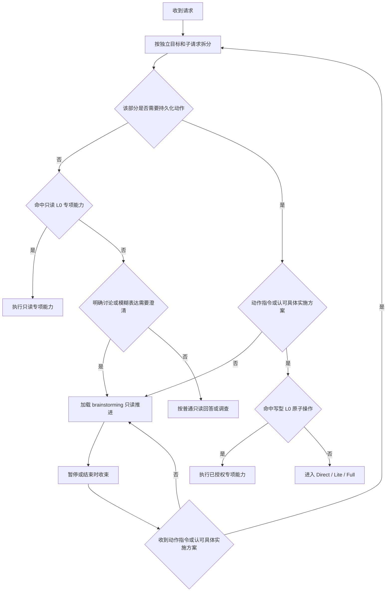
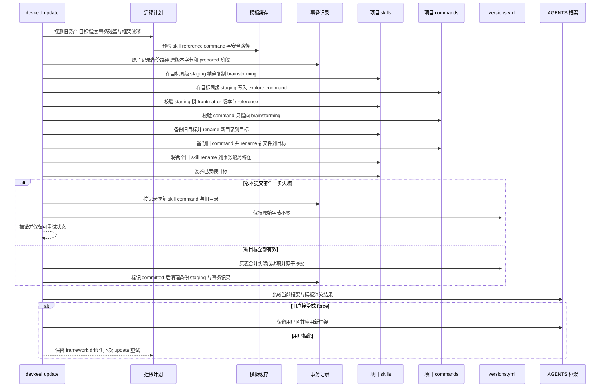

# 技术设计

## 一句话方案

新增唯一的 Harness `brainstorming@7.0.0` 自适应只读 skill，以逐目标 AGENTS 写入授权门禁作为
所有持久化动作的前置路由、以条件 reference 承接 OpenSpec 上下文，并用同级 staging、事务备份
和原子提交保证现有项目安全收敛到单一入口。

## 目标与非目标

设计必须保证：

- 模糊反馈不会获得隐式写入权限；明确动作指令，或明确认可最近一条写明具体持久化动作与范围的
  实施方案或授权询问，只为相应目标授权。认可按语义判断而不依赖固定词表；混合请求的权限不得
  跨子句扩散，任何写型 L0 也不得绕过门禁。
- 事实梳理、问题界定、方向探索、方案比较、方案检验和结论收束由一个物理 skill 自适应完成，
  不恢复固定问卷或产物链。
- brainstorming 在通用和 OpenSpec 模式下都严格只读，结论落盘必须交给独立写入流程。
- fresh init、当前版本 update 和旧 Superpowers 6.0.3 update 最终得到完全相同的受管资产；目标
  结构损坏或 AGENTS 框架漂移仍可重试，全部有效后重复执行为 no-op。
- `/opsx:explore` 命令名保持兼容，但不再保留独立 `openspec-explore` skill。

本设计不改变其他 OPSX 命令、Lite/Full schema、artifact 图、实现验证流程或历史快照；不为
`grilling` 保留别名，也不兼容旧 brainstorming 的自动写文档、commit 和 `writing-plans`。

## 架构概览

```mermaid
flowchart LR
    subgraph 运行时路由
        U[用户请求] --> A[AGENTS 写入授权门禁]
        A -->|未授权讨论或模糊反馈| B[brainstorming SKILL.md]
        A -->|逐目标动作指令或认可具体实施方案| W[写型 L0 / Direct / Lite / Full]
        E[/opsx:explore] --> B
        B --> R{需要 OpenSpec 上下文}
        R -->|是| O[references/openspec-context.md]
        R -->|否| C[通用只读调查]
        O --> S[轻量收束]
        C --> S
        S -->|动作指令或认可具体实施方案| W
    end

    subgraph 受管分发
        T[templates 事实源] --> I[devkeel init / update]
        I --> Q[探测版本 结构 事务残留与框架漂移]
        Q --> N[同级 staging 安装并校验]
        N --> D[事务切换 skill command 与旧目录]
        D --> M[原子合并实际成功版本并清理备份]
        M --> P[项目 .harness 镜像]
        Q --> G[提示或应用 AGENTS 框架]
    end
```

| 组件/边界 | 职责 | 本次变化 | 依赖或契约 |
|---|---|---|---|
| `templates/agents-md.md` | 全局意图、授权与流程路由 | 按独立目标判断权限，在任何写型 L0/L1 前定义未授权只读态和 brainstorming 自动路由 | 对具体实施方案或授权询问的认可只继承最近上下文的动作与范围；不复制 skill 阶段或认可词表 |
| `brainstorming/SKILL.md` | 通用思考姿态和自适应阶段 | 融合 Explore 与 Grilling，严格只读 | description 是触发真源；达成共识不授权写入 |
| `references/openspec-context.md` | OpenSpec 条件上下文 | 区分 topic/list 与已选 change/status，承接动态路径和 artifact 对照 | 已选 change 保留 `changeRoot`、`existingOutputPaths`、`actionContext`；不拥有写入 |
| `/opsx:explore` command | OpenSpec 探索入口 | 加载 `brainstorming` 并传 raw topic/change/hot context | 不重复算法，不再返回 artifact update |
| `src/lib/update.ts` / `src/commands/update.ts` | 受管迁移规划、安全执行与更新重试 | 恢复 brainstorming，退休两个旧 skill，增加结构探测、事务切换与 AGENTS 框架漂移探测 | 提交前失败恢复旧资产和版本；框架拒绝不被版本早退隐藏 |
| versions / init / update | 分发状态与项目同步 | 注册 7.0.0、删除两个旧键、同步模板与 dogfood | `templates/versions-yml.yml` 为版本事实源 |
| specs / tests / Web | 行为契约、回归与用户说明 | 从双入口切换为单一 skill 和授权门禁 | 历史 archive/v1/版本快照保持不变 |

## 核心用例的实现路径

| 核心用例 | 技术路径 | 关键状态或数据 | 失败与边界处理 |
|---|---|---|---|
| 模糊反馈自动讨论 | AGENTS 判定没有明确动作授权，加载 `brainstorming`；skill 先做事实梳理，再自动选择阶段 | 会话内 `未授权` 状态，不持久化 | 文件路径、评价词或方案建议不能提升为授权 |
| 明确动作或认可具体实施方案进入开发 | AGENTS 确认用户直接要求具体写操作，或明确认可最近一条包含具体持久化动作与范围的实施方案或授权询问，再运行写型 L0 或 Direct/Lite/Full | 仅相应目标和动作的会话授权 | 丢失上下文，或只确认未写明具体动作与范围的方向、目标或验收不算写入授权 |
| 混合请求 | 先按独立目标和子句拆分，再逐项判断是否需要写入及是否获授权 | 每个目标独立的授权状态 | “修复 A；B 也许可优化”只允许写 A，B 保持只读 |
| 早期想法 / 候选 / 既定方案 | skill 分别进入方向探索、方案比较或方案检验，可按新证据切换 | 已知事实、候选、推荐、确认决策、开放项 | 不强制全阶段、固定候选数或固定问题轮次 |
| 连续提问 | 只在外部决定会改变方向时，提出 1–3 个同一决策链且当前可回答的问题 | 每问包含判断依据或推荐 | 后问依赖前答时拆轮；环境可查事实先调查 |
| topic-only OpenSpec 探索 | `/opsx:explore` 触发 reference，但尚未选定 change 时按需使用 `list --json` 或通用调查 | raw topic、可选 change 列表 | 不要求或虚构 change-specific 路径，不创建 change |
| 已选 change 探索 | 明确 change 或热 active change 触发 `status --change ... --json`，只读取 CLI 返回路径 | `changeRoot`、`artifactPaths.<id>.existingOutputPaths`、`actionContext` | 不硬编码路径，不写 planning artifact |
| 当前版本升级 | 迁移识别两个旧 skill 或目标结构失配，在同级临时路径完整安装并校验，再事务切换 skill、command 与旧目录 | 模板指纹、旧目录、事务阶段、版本原始字节 | 校验、路径或提交失败时恢复旧资产；用户只能取消整组迁移 |
| 旧 6.0.3 升级 | staging 的精确目录树校验通过后，以同文件系统 rename 替换同名目标并清除全部遗留资源 | 旧目录备份与新 `devkeel/7.0.0` | 交换失败或中断由事务记录恢复，不能留下半覆盖目录 |
| AGENTS 更新被拒绝 | versions 可记录已成功提交的受管资产，但框架内容单独与模板渲染结果比较 | framework drift，不复用 skill 版本作为完成信号 | 下次 update 仍进入框架提示；不得宣称自动路由已生效 |

### 请求路由



授权以独立目标和动作绑定。用户明确认可最近一条仍清晰有效、同时写明具体持久化动作与范围的
实施方案或授权询问时，才继承该范围；按认可语义判断，不维护固定词表。脱离上下文，或只确认
未写明具体动作与范围的方向、目标或验收结论时保持未授权；一个已授权子句不得把相邻的评价或
建议一并带入实现。

L0 仍优先承接对应专项能力，但优先级不能绕过权限：只读 review 或调查可在未授予写权限时执行；
commit、缺陷状态修改、动态插桩或其他会改变本地/外部状态的 L0，必须先获得相应范围授权。
Direct 与 Lite “边界不明确时偏 Direct”也只在写入授权已经成立后适用。

### 受管升级时序



迁移计划增加“必需受管 skill 安装”语义：只要存在旧 discussion skill、旧 6.0.3
`brainstorming`、目标目录/指纹/reference 无效、兼容 command 不匹配，或发现未完成事务，
`brainstorming` 就不是可单独跳过的普通更新项。用户可以在事务开始前取消整个 update，但不能
产生“旧入口已删、新入口被跳过、版本却标记最新”的中间态。

staging、备份和隔离目录都位于目标同一文件系统并使用受控名称；事务记录在第一次 rename 前
原子写入。update 启动时先恢复或完成遗留事务：提交点前恢复原资产，versions 已提交则复验目标并
完成清理。这样既能用目录替换清除 6.0.3 的额外资源，也能关闭两次 rename 之间的进程中断窗口。
AGENTS 框架不是该资产事务的提交条件，但它的渲染差异是独立更新信号，拒绝后不得被最新版本表
掩盖。

`brainstorming` 与 `/opsx:explore` 必须从普通逐项 `copyDirRecursive` 和 commands 批量同步中
排除，由上述事务唯一拥有；两个旧 skill 也不得先被通用 deprecated/retired 清理删除。否则即使
后续事务具备恢复逻辑，早期通用写入仍会破坏旧入口或留下旧 6.0.3 的额外文件。

当 discussion 事务为 required 时，它在任何可逐项跳过的普通组件写入前执行；事务失败即停止整个
update，从而保持开始时的旧入口与 versions 字节。事务提交后才处理普通组件，后续单项失败或
中断不回滚已经有效的新 brainstorming，而由旧版本值在下次 update 触发该普通组件重试。

versions 提交不得直接写整份 builtin 表。它从 update 开始时的原表合并：只更新本轮实际成功应用
的普通组件；discussion 事务成功时原子设置 `brainstorming: 7.0.0` 并移除两个旧键；其他成功迁移
按各自契约更新；被用户跳过或失败的无关组件保留原版本。这样用户接受必需 consolidation、但
跳过另一 skill 后，下次 update 只继续提示该未应用组件，不会因虚假最新版本永久丢失更新入口。

## 接口、数据与状态

### Skill 目录与元数据

```text
templates/skills/brainstorming/
├── SKILL.md
└── references/
    └── openspec-context.md
```

`.harness/skills/brainstorming/` 必须与分发模板字节一致。`SKILL.md` frontmatter 使用：

- `name: brainstorming`
- description 同时表达能力与触发：明确讨论/探索/比较/挑战，以及没有写入授权的模糊反馈；
  明确实现请求不由该 skill 接管。
- `metadata.author: "devkeel"`
- `metadata.version: "7.0.0"`

正文只保留通用行为、权限和阶段；OpenSpec CLI、动态路径与 artifact 映射只放 condition
reference，避免普通讨论加载无关上下文。

reference 将 OpenSpec 调用分为两态：

| 状态 | 允许的调查 | 必须保留的不变量 |
|---|---|---|
| topic-only | 保留 raw topic；仅在现有 change 与主题相关时使用 `openspec list --json`，否则执行通用只读仓库调查 | 不要求或虚构 `changeRoot`、artifact 路径或 active change，不创建 change |
| change-selected | 对用户点名或从热上下文唯一确定的 change 使用 `openspec status --change <name> --json`，再读取现有 artifact | 使用 CLI 返回的 `changeRoot`、`artifactPaths.<id>.existingOutputPaths` 与 `actionContext`，不硬编码默认目录 |

### 自适应阶段契约

| 阶段 | 进入条件 | 必需结果 | 可跳过规则 |
|---|---|---|---|
| 事实梳理 | 所有调用 | 区分用户目标、仓库事实、外部未知与当前成熟度 | 可缩成一句事实确认，不可完全省略 |
| 问题界定 | 目标、成功标准或硬约束仍会改变方向 | 补齐真正阻塞的目标/边界 | 输入充分时跳过 |
| 方向探索 | 只有早期想法或问题空间未成形 | 形成有意义的方向、线索或下一关键决定 | 已有候选时跳过；不强制候选数量 |
| 方案比较 | 已有多个真实候选 | 比较决定因素、代价并给推荐或条件式推荐 | 只有一个合理方向时跳过 |
| 方案检验 | 已有明确或当前最优方案 | 暴露关键假设、失败路径、缓解和残余风险 | 用户只要求开放探索时可暂不进入 |
| 结论收束 | 暂停或结束 | 汇总事实、候选/推荐、确认决策、开放项和另行授权的下一步 | 可简短，不可把讨论写成实现完成 |

讨论质量遵循三条轻量原则：主题横跨多个可独立交付部分时，先拆清边界、依赖和先后关系，再聚焦
当前问题；讨论现有代码时，先遵循已有结构与约定，只纳入直接服务当前目标的改进；按实际需要
设计，避免预设功能和无关重构，并使候选模块的职责、接口、依赖与验证方式清楚。

### 授权与持久状态

brainstorming 不创建持久状态；每个目标的 `未授权` / `已授权` 只存在于当前请求语义中。正常
持久状态仍是版本表、受管目录、AGENTS 和已有 OpenSpec artifacts。update 只可在迁移期间创建
受控 staging、备份、隔离目录与事务记录，并必须在成功或恢复后清理。任何“保存、修改、创建
change、实现、提交”都必须在退出 brainstorming 后由对应入口重新检查权限和契约。

`templates/versions-yml.yml` 是新受管状态的事实源：新增 `brainstorming: "7.0.0"`，删除
`grilling` 与 `openspec-explore`。`brainstorming` 从静态退休集合移除；后两者加入受管退休
集合。更新探测同时比较版本、目标树指纹与必需 reference、explore command、旧目录和未完成事务；
任一不一致都触发必需迁移或安全错误。AGENTS framework content 与当前模板渲染结果单独比较，不用
skill 版本推断是否已经应用。只有资产事务成功后才原子写入新版本。

## 兼容、迁移、发布与回滚

| 起始状态 | 迁移结果 |
|---|---|
| fresh init | 直接复制唯一 brainstorming、reference 和新 explore command |
| 当前版本：grilling + openspec-explore | 安装 7.0.0，校验后删除两个旧目录与版本键 |
| 旧 Superpowers brainstorming 6.0.3 | staging 校验后事务替换同名目录，不保留旧固定流程资源；失败恢复原目录 |
| 版本为 7.0.0 但目标损坏 | 结构/指纹探测触发重新安装；缺失 reference、异常 symlink 或命令不匹配不得 no-op |
| 混合或中断状态 | 先按事务记录和实际目录恢复或完成，再重新规划；重复执行收敛 |
| AGENTS 框架曾被拒绝 | 受管资产可保持最新，但 framework drift 使下次 update 重新提示且不重复资产迁移 |
| consolidation 成功但其他组件被跳过 | 只提交实际成功项和 discussion 键变化；被跳过组件保留旧版本并在下次继续提示 |
| 7.0.0 结构有效、命令与框架一致且无旧目录 | migration 与 update 均为 no-op |

`/opsx:explore` 名称保持兼容，但输出契约收窄为严格只读；`$grilling` 和独立
`openspec-explore` skill 是明确的破坏性移除，现行文档必须给出 `brainstorming` 替代入口。

发布前可以通过 Git 回退整个变更。已安装项目若需回滚，应固定到上一模板版本并重新运行受管
更新，使上一版本的 versions、skill 和 command 集合整体恢复；不支持只恢复单个旧 skill 与
新 AGENTS 混用。

## 失败处理与可观测性

| 失败模式 | 检测信号 | 处理与恢复 |
|---|---|---|
| 新 skill 模板、reference 或 command 缺失或不符 | migration preflight 报目标路径与期望内容 | staging 前停止，不改目标或 versions；修复模板后重跑 |
| 目标或父路径为符号链接或越界 | 复用 canonical path / symlink 安全校验 | 拒绝 staging、替换和删除，保持项目外内容完整 |
| 必需 brainstorming 更新被跳过 | 目标目录校验未达到 7.0.0 | 中止 consolidation，不同步命令和版本；提示整组更新 |
| staging、交换、command 或版本提交失败 | 事务阶段、备份和原 versions 字节 | 提交点前恢复全部旧入口和版本；保留错误证据后可重跑 |
| 进程在 rename 窗口中断 | 下次启动发现事务记录或受控备份/隔离路径 | versions 未提交则回滚，已提交则复验并完成清理 |
| versions 最新但目标结构损坏 | 指纹、frontmatter、必需 reference 或 command 检查失败 | 仍生成 required migration；路径不安全时停止而非覆盖 |
| AGENTS 框架更新被用户拒绝 | update 输出 `skipped` 且 framework drift 仍存在 | 不伪报自动路由已生效；下次 update 越过版本 no-op 再次提示 |
| 运行时错误触发写入 | 集成场景检测工作树、目标文件或 active change 数量变化 | 视为阻断回归；skill 和 AGENTS 均保留独立只读守卫 |

不新增运行时遥测。完成证据由 update 日志、版本表、目录检查、OpenSpec command 静态契约和
集成场景输出提供。

## 验证方案

| 验证对象 | 方法 | 通过标准 |
|---|---|---|
| skill 结构与元数据 | skill validator + `tests/templates.test.ts` / `tests/config.test.ts` | 只有 brainstorming，版本/author/reference 与 dogfood 一致，无两个旧键 |
| 写入授权路由 | `tests/workflow-routing.test.ts` 静态契约断言 | 门禁位于 L0/L1 前；模糊反馈、认可具体实施方案、非具体确认、混合子句和写型 L0 的规则均有可执行断言 |
| 自适应 skill 契约 | skill/template 静态契约断言 | 中文阶段的选择条件、讨论质量、问题批次与只读边界完整且模板与 dogfood 一致 |
| `/opsx:explore` | command/template 同步测试 + OpenSpec context 契约测试 | topic-only 不虚构 change；选定 change 保留 `changeRoot`、`existingOutputPaths`、`actionContext`；没有 artifact update 语义 |
| fresh / re-init | `tests/init.test.ts` | 各目标平台只安装新 skill 和命令，不残留旧目录 |
| 当前与 6.0.3 升级 | `tests/update.test.ts` / 模板增量测试 | staging 完整替换并删除遗留文件；copy/校验/command/版本失败注入后旧目录和 versions 字节不变 |
| 幂等、损坏修复与路径安全 | update 二次运行、reference 缺失、事务中断、目标/父 symlink 负向测试 | 有效状态第二次 no-op；版本最新但结构损坏会修复；路径逃逸被拒绝；中断可恢复 |
| AGENTS 框架重试 | update 交互测试 | 首次拒绝后 versions 可保持最新，第二次仍检测 drift 并能只应用框架 |
| 逐项跳过的版本准确性 | update 交互测试 | consolidation 成功而另一组件被跳过时，只更新实际成功版本；下次仅提示被跳过项 |
| 现行文档 | Web 文档测试和限定路径搜索 | current 页面只描述 brainstorming；archive/v1 快照未被改写 |
| 全仓质量 | `npm run lint`、`npm test`、`npm run build`、`git diff --check`、指令审计 | 全部通过，无模板镜像漂移或解释性冗余阻断项 |

## 关键决策与权衡

| 决策 | 选择与理由 | 代价或未采用方向 |
|---|---|---|
| 物理形态 | 只保留一个 `brainstorming` skill，OpenSpec 作为条件 reference | 放弃独立上游 `openspec-explore` 镜像，需要本地维护必要不变量 |
| 名称与版本 | 复用用户选择的 `brainstorming`，以 Harness 7.0.0 明确断代 | 必须反转退休迁移并处理旧同名目录 |
| 权限 | skill 永久严格只读，落盘由其他入口接管 | 相比旧 Explore 少了直接更新 planning artifact 的便利，但授权边界唯一 |
| 阶段 | Agent 按成熟度自动选择，事实梳理/结论收束保底 | 比固定流水线更依赖高质量触发与静态契约测试 |
| 提问 | 需要时每轮 1–3 个连续问题，依赖问题拆轮 | 不再保留 Grilling 的一次一问绝对规则 |
| 迁移 | skill、command、旧目录与 versions 使用 staging、事务备份和原子提交；AGENTS drift 独立重试 | 更新逻辑需增加结构指纹、事务恢复和框架状态探测，而非只改模板文件 |
| 兼容入口 | 保留 `/opsx:explore`，删除 `$grilling` | 已使用 grilling 的用户必须迁移到 brainstorming |
