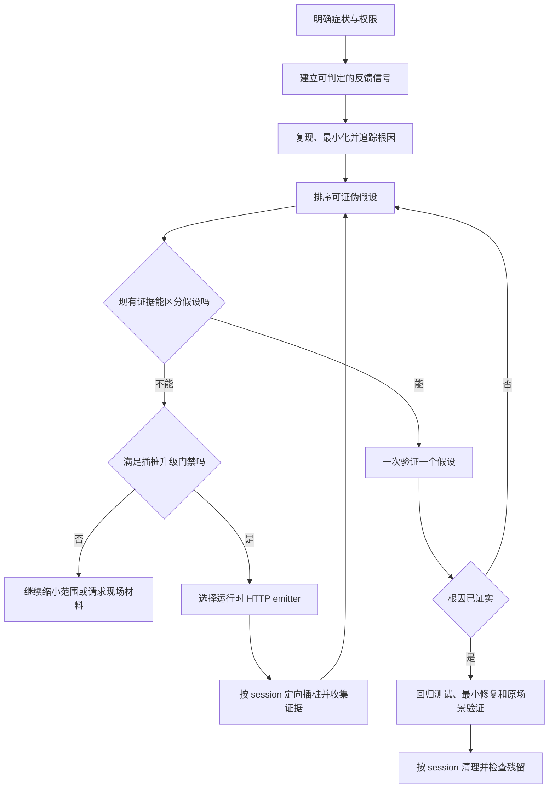

# 变更 Brainstorm

## 目标

将内置 `automated-instrumented-debugging` 原地升级为面向全部 Debug 场景的系统化诊断
skill：简单问题优先通过反馈回路、根因追踪和可证伪假设闭环，只有现有观测手段不足的复杂问题
才升级到临时 HTTP 插桩，并可靠支持 Browser、Node.js、Electron main/renderer/preload 和
Java 8+。

## 现状与问题

- 当前 skill 以启动本地服务和注入浏览器 `fetch` 探针作为默认流程，缺少简单 Bug 的快速诊断
  路径，也会诱导 Agent 在建立复现与根因假设前修改代码。
- 当前探针模板只适用于 JavaScript 浏览器环境，不能直接覆盖 Node.js、Electron 多进程上下文
  和 Java。
- 当前 cleanup 按通用 `#region DEBUG` 正则扫描工作目录，无法按调试会话精确清理，也可能误删
  用户已有的 Debug 区块。
- collector 是临时、内存态工具，但当前协议和生命周期没有明确区分跨运行时兼容、最小运行保护
  与不需要建设的生产级安全能力。
- AGENTS L0 当前只把“困难且确实需要动态插桩”的问题路由到该 skill，无法让普通 Bug 先进入
  统一的系统化诊断流程。

## 核心用例

| 角色/调用方 | 触发场景 | 预期结果 | 关键边界 |
|---|---|---|---|
| Agent | 遇到稳定复现的简单 Bug、测试失败或构建错误 | 复用现有失败信号，定位根因并逐一验证假设，不启动 collector、不插桩 | 不因问题看起来简单而跳过证据；用户只要求诊断时不实施修复 |
| Agent | 现有错误、测试、日志、diff、debugger 或 profiler 不能区分剩余假设 | 在记录观测缺口和探针预测后升级到定向插桩 | 插桩会改代码，必须处于已授权的写入范围；禁止“记录一切” |
| Web/Node 调试目标 | Browser 或 Node.js 代码需要运行时证据 | 通过统一 HTTP collector 上报带 session 的事件 | Browser 使用 `fetch`；Node.js 使用 `node:http`，endpoint 可配置 |
| Electron 调试目标 | main、renderer 或 preload 中出现跨上下文问题 | 各上下文优先直接通过 HTTP 上报，并用 runtime 元数据关联事件 | main 使用 `node:http`；renderer/preload 优先 `fetch`；受 CSP/sandbox 限制时才通过 IPC 转发给 main 后再走 HTTP |
| Java 调试目标 | Java 8+ 应用需要临时插桩 | 使用仅依赖 Java 8 API 的 emitter 上报 HTTP 事件 | 使用 `HttpURLConnection`；不得依赖 Java 9+ API；结构化 JSON 为可选增强 |
| Agent | 修复成功、假设失败或调试被中断 | 仅清理指定 session 的探针、helper、manifest 和 collector | 必须验证无 `HDBG:<session>` 残留，不扫描删除通用 DEBUG 区块 |
| Agent | 性能回归 | 先建立基线并使用 profiler、query plan 或 bisect | 日志插桩不是性能问题的默认手段 |

## 范围与验收

| 范围 | 内容 |
|---|---|
| In Scope | 保留 `automated-instrumented-debugging` 标识并重写触发描述与主流程；建立简单诊断与复杂插桩的升级门禁；拆分渐进加载 references；统一临时 HTTP collector 协议；提供 Browser、Node.js、Electron 和 Java 8+ 插桩模式；实现 session-aware cleanup 与残留检查；更新 L0 路由、内置版本及相关测试 |
| Out of Scope | 重命名 skill 或迁移已发布 skill ID；TLS、认证、权限系统、持久化日志和复杂脱敏；关闭 Electron `webSecurity` 或放宽生产 CSP；支持 Java 7、Kotlin 或其他 JVM 语言；建设通用生产可观测平台 |

验收条件：

1. 普通 Bug 会进入统一 Debug skill，但在已有反馈信号足以定位根因时不会启动 collector 或写入探针。
2. 插桩只在精确症状、观测缺口、可证伪预测和写入授权均明确后启用；每次只验证一个假设。
3. collector 通过同一个 HTTP 入口接收 JSON 与纯文本事件，并能按 session 查询 Browser、Node.js、
   Electron 各上下文和 Java 8+ 的事件。
4. Electron main、renderer、preload 默认直接 HTTP；只有直接请求受运行时策略限制时才使用
   `renderer/preload → IPC → main → HTTP` 降级链路。
5. Java emitter 可用 JDK 8 编译，并在 JDK 8 与至少一个现代 LTS JDK 上通过 collector 联调；
   emitter 失败不会改变业务控制流。
6. 所有临时改动使用简短且会话化的 `HDBG:<session>` 标识；cleanup 只处理指定 session，成功、
   失败和中断路径均能完成残留检查。
7. collector 默认仅监听 loopback、使用内存态有界事件存储并自动退出；不引入生产级安全组件。
8. skill 内容吸收外部参考中的方法但以 Harness 自有结构和语言重写，不大段复制外部原文，也不在
   skill 中增加额外许可声明。
9. 模板源、dogfood 副本、版本清单、AGENTS 路由和自动化测试保持一致，相关测试通过。

## 架构与影响概览

| 区域/模块 | 当前职责或行为 | 本次影响 |
|---|---|---|
| `SKILL.md` | 以自动插桩为主流程并内嵌浏览器模板 | 改为系统化 Debug 状态机，只保留诊断阶段、升级门禁、权限和完成条件 |
| `references/` | 不存在 | 按需承载诊断方法、HTTP 插桩协议、JavaScript/Electron 和 Java 8 运行时细节 |
| `scripts/debug-server.js` | 收集浏览器 JSON 事件 | 演进为运行时无关的临时 HTTP collector，兼容 JSON/纯文本与 session 查询 |
| `scripts/bootstrap.js` | 固定端口启动 collector | 保留轻量启动职责，支持 endpoint/host/port 和临时生命周期参数 |
| `scripts/cleanup.js` | 正则删除所有通用 DEBUG region | 按 session manifest 和精确 `HDBG` 标识清理，并提供残留检查 |
| emitter 模板 | 由 `SKILL.md` 重复展示 `fetch` 片段 | 提供 Web、Node/Electron 和 Java 8 的轻量 helper；业务探针保持单行 |
| Harness 路由与版本 | 仅复杂插桩命中 L0，版本为 1.0.0 | 普通 Debug 命中该 skill，更新内置版本并保持模板/dogfood 同步 |

## 方案方向与取舍

- 采用单一渐进式 Debug skill，而不是同时安装多个触发重叠的诊断 skill。系统化诊断是默认层，
  自动插桩只是遇到运行时观测缺口时的后置能力。
- 先生成少量排序、可证伪的假设，但一次只改变和验证一个变量，兼顾避免首个假设锚定与实验可归因性。
- 所有运行时统一使用 HTTP collector 协议，不为 Electron 建立第二套采集系统。Electron IPC 仅
  是 direct HTTP 被 CSP、sandbox 或 mixed-content 策略阻止时的转发手段。
- Java 统一以 Java 8 为最低基线，使用 `HttpURLConnection`。collector 接受 `text/plain`，
  避免强制引入 Jackson/Gson；项目已有 JSON 库时可选择结构化数据。
- 使用 `/*HDBG:<session>*/` 标记单行探针，使用短 BEGIN/END 变体包围 helper 区块。manifest
  记录本次触及文件，marker 作为中断恢复和兜底依据。
- collector 只实现临时调试所需的最低运行保护：loopback 默认、有界内存、请求大小限制和空闲
  退出；不建设 TLS、认证、持久化和复杂脱敏。

## 约束、风险与决策

| 类型 | 约束或风险 | 决策或应对 |
|---|---|---|
| 权限 | 诊断请求不一定授权修改源码 | 将临时插桩视为写入动作；无明确授权时停在只读证据与建议 |
| 行为扰动 | 异步日志和网络请求可能改变竞态时序 | 探针最小化、非阻塞、短超时、失败吞掉；先用 debugger/现有日志等低扰动手段 |
| Electron | renderer/preload 可能被 CSP、sandbox 或 mixed content 阻止直连 | 先尝试 direct HTTP；不得关闭安全开关；仅在失败时使用窄 IPC 转发到 main |
| Java 兼容 | Java 11 `HttpClient` 等 API 会破坏 Java 8 基线 | 只使用 Java 8 语法和标准库；JDK 8 编译，现代 LTS 运行验证 |
| 清理 | 通用正则可能误删用户代码或遗漏跨语言探针 | 必须传 session，优先 manifest 精确处理，按 `HDBG:<session>` 兜底并执行 `--check` |
| 网络环境 | 容器或远程运行时中的 `localhost` 不一定指向 collector | endpoint 可配置；默认 loopback，显式跨主机时由调用方提供可达地址 |
| 数据 | 临时日志仍可能误带敏感值 | skill 明确禁止记录秘密和大对象；不为临时 collector 引入复杂脱敏系统 |
| 内容来源 | 直接复制外部 skill 会引入不必要的许可处理 | 仅吸收方法并用 Harness 语言重写，不复制实质性原文 |
| 兼容迁移 | 重命名会引入 skill ID 与升级迁移成本 | 本次保留 `automated-instrumented-debugging` 名称，原地升级并通过版本清单发布 |

## 流程选择

选择 Harness Lite。此次改造涉及 skill 工作流、跨运行时插桩、脚本、路由与测试，需要简短的
持久化范围和验收协调；保留现有 skill ID，不产生需要 Full 协调的外部契约迁移。
