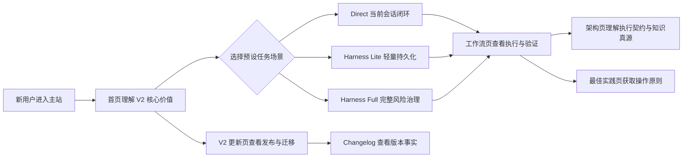

# 变更 Brainstorm

## 目标

将 Harness Templates V2 作为 Web 主站唯一的当前正式版叙事，让新用户从首页即可理解“为每个任务选择最短、但足够可靠的交付路径”，并通过可解释的场景交互认识专项 Skill、Direct、Harness Lite 与 Harness Full；同时保留 V1 历史页面和现有公共 URL 兼容。

## 现状与问题

| 页面或区域 | 当前行为 | 问题 |
|---|---|---|
| 首页 | 强调“编排 · 规范 · 沉淀”、OpenSpec + Superpowers，以及每次会话都经历 Spec → Code → Growth | 与 V2 的按需分流、按需沉淀和当前执行模型冲突，且先解释内部工具组合而非用户价值 |
| 工作流 | 主体已经介绍 Direct / Lite / Full | Hero 与 Footer 仍把固定三阶段描述成所有协作的统一路径，形成两套心智模型 |
| 架构设计 | 已部分切换到三个真源和渐进路由 | 仍存在旧工具提供方、旧调试能力和过时编排口径，需要以当前模板契约为准统一 |
| 最佳实践 | 以 Paseo、Worktree、Commit + MR 为主体 | V2 将 Worktree、隔离、并行和 Commit 定义为按需或单独授权能力，当前页面错误地把可选实践放成默认路径 |
| Templates 2.0 页面 | 已完整复盘重型 Apply、收敛损失和 V2 结果治理 | 当前作为 Changelog 的附属深度页面，缺少正式版能力摘要、新用户入口、迁移清单和动态稳定版本信息 |
| Changelog | 有 Templates V2 深度链接和版本目录加载 | 仍保留 OpenSpec + Superpowers + OMC 的旧架构结论，发布事实和产品架构说明职责混杂 |
| 主导航 | 没有 V2 更新入口，技术分享占据主导航位置 | 无法体现 V2 是当前大版本，也不符合新用户优先的信息层级 |

仓库已经具备 React 页面注册、旧 `.html` 路由兼容、共享 `PageFrame`、版本目录加载和相邻 Web 测试。此次应复用这些结构，不恢复静态 HTML 页面，也不引入另一套页面运行机制。

## 核心用例

| 角色/调用方 | 触发场景 | 预期结果 | 关键边界 |
|---|---|---|---|
| 第一次访问的新用户 | 打开首页并希望快速判断 Harness V2 的用途 | 首屏先看到“最短但足够可靠的交付路径”，随后可通过三个真实场景理解 Direct、Lite、Full 的推荐理由、持久化方式、质量底线和升级条件 | 首屏不要求用户先理解 Schema、Superpowers、OMC 等内部实现名词 |
| 正在评估任务路径的用户 | 在首页切换“当前会话修复”“跨会话功能”“已确认高风险变更”等预设场景 | 路由台以 React 状态切换选中场景和对应解释，并保持键盘、焦点和 `aria-pressed` 等可访问状态一致 | 不提供自由输入或伪装成在线 AI 分类器；不承诺页面实际执行任务路由 |
| 希望理解完整流程的用户 | 进入工作流页 | 看到“意图 → 专项能力或渐进路径 → 连续实施与邻近验证 → 按路径收尾”的统一流程，并理解 Direct → Lite、Lite → Full 的原地升级 | 不再把 Spec → Code → Growth 表述为每次协作的固定阶段 |
| 项目维护者 | 进入架构设计页了解 V2 如何约束 Agent | 看到 `.harness/`、`AGENTS.md`、`openspec/` 三个真源、零额外运行时状态、写入授权边界以及 L0/L1 路由职责 | 架构事实以当前模板和 Schema 为准，不保留旧提供方兼容叙事 |
| 实际使用 Harness 的工程师 | 打开最佳实践页寻找执行建议 | 先获得路径选择、保护收敛、结果型 Tasks、邻近验证和按需增强建议；仅在需要隔离时看到 Paseo/Worktree 附录 | Worktree、Subagent、TDD、独立 Review 和 Commit 不得被描述为所有任务的默认步骤 |
| 从 V1 升级的用户 | 从首页、主导航或 Changelog 进入 V2 更新页 | 能区分 V2 改变了什么、哪些质量活动仍保留、应停止哪些 V1 习惯，以及如何升级 | V1 说明作为次级内容，不占据新用户首页的首要叙事 |
| 关注正式版本的用户 | 查看 V2 更新页或 Changelog | 看到“Templates V2”品牌和版本目录提供的当前稳定版本；加载或请求失败时不显示可能过期的硬编码稳定版本 | 当前包仍为 `2.0.1-beta.1`；Web 不应把 Beta 号硬编码成正式版事实，包发布本身不在本次范围 |
| 旧链接或静态资源调用方 | 访问现有主页、工作流、架构、最佳实践、V2、Changelog、V1、分享和资源 URL | 原 URL 继续可访问，现有 React route/server fallback 契约不变 | “技术分享”移出主导航不等于删除 `/sharing.html` |
| 移动端或键盘用户 | 在窄屏或不用鼠标的情况下浏览和切换路由场景 | 页面无文字溢出，交互可聚焦、可识别，减少动态效果设置得到尊重 | 不新增页面级 DOM 脚本、全屏过渡层或不可访问的纯视觉状态 |

## 范围与验收

| 范围 | 内容 |
|---|---|
| In Scope | 重构 `home`、`workflow`、`architecture`、`best-practices`、`templates-v2`、`changelog` 的当前版叙事与必要页面结构；更新共享主导航；实现首页预设场景路由台；将 V2 具体稳定版本接入现有版本目录事实源；更新与这些边界直接相关的 Web 测试 |
| Out of Scope | 不重构 `capability-inventory`、`v1-home`、`v1-capability-inventory`、`sharing.html`、`stats`；不发布 npm 包、不修改 Templates V2 本身的执行契约；不新增后端 AI 路由服务；不进行完整品牌重做；不改变现有公共 URL |

验收条件：

- 首页以 V2 用户价值为首要叙事，不再把 OpenSpec + Superpowers 或固定 Spec → Code → Growth 作为当前产品模型。
- 首页提供三个预设任务场景；切换后同时更新推荐路径、推荐理由、持久化方式、质量底线和升级条件，且键盘与辅助技术可识别当前选择。
- 工作流页只保留一套与当前模板一致的 L0、Direct、Lite、Full 及路径收尾模型。
- 架构页准确描述三个真源、零额外运行时状态、写入授权和当前 L0/L1 路由，不包含已废弃的工具提供方或调试能力名称。
- 最佳实践页以 V2 操作原则为主体，Paseo/Worktree 仅作为明确标注的可选隔离方案。
- 主导航新增“V2 更新”并在 V2 页面正确显示 active 状态；“技术分享”仍可从页脚或关联入口访问。
- V2 更新页同时服务“当前能力速览、设计复盘、迁移清单、质量能力澄清、正式版升级”五类信息，具体稳定版本不以过期常量硬编码。
- Changelog 只承担发布事实与历史记录，不继续维护另一份旧架构说明。
- 冻结页面源码保持不变，所有已有公共 `.html` URL 和静态资源访问契约保持兼容。
- 页面继续使用 React state、语义组件和 `PageFrame`；不引入 `data-action`、页面级 DOM 操作、`dangerouslySetInnerHTML`、本地模块扩展名或类型检查逃逸。
- 相关 Web 测试、Web 构建和浏览器中的桌面/移动端关键路径验证通过。

## 架构与影响概览

| 区域/模块 | 当前职责或行为 | 本次影响 |
|---|---|---|
| `web/src/components/MarketingNav.tsx` | 主站共享导航，V2 页面当前借用 Changelog active 状态 | 增加独立 V2 导航项和 active page 类型；移除主导航中的技术分享入口，但不删除页面 |
| `web/src/pages/home/` | 首页 Hero、产品概览、固定三阶段入口和快速开始 | 调整信息层级、产品文案和快速开始，增加页面专属的预设场景路由台组件 |
| `web/src/pages/workflow/` | 已混合 V2 渐进路径与 V1 三阶段叙事 | 以任务分流、连续实施、邻近验证和按路径收尾重组顶部与底部叙事，复用已有路径内容 |
| `web/src/pages/architecture.tsx` | 三个真源、路由、能力包和 CLI 架构说明 | 校正旧事实，突出授权边界、零状态和当前路由；不顺带重构无关领域能力内容 |
| `web/src/pages/best-practices.tsx` | 单一 Worktree/Paseo 指南 | 拆成可扫描的 V2 实践 sections，将现有隔离环境内容降级为可选附录 |
| `web/src/pages/templates-v2*` | V1 Apply 成本与 V2 设计复盘 | 保留复盘主体，增加面向正式发布的能力摘要、迁移、质量澄清和版本/升级信息 |
| `web/src/pages/changelog*`、`web/src/lib/version-catalog.ts` | 拉取并展示 CLI 与 Templates 版本目录 | 复用事实源提供 V2 稳定版本，删除静态旧架构说明；失败时保持诚实的无陈旧版本状态 |
| `web/src/routes.ts`、页面注册与 server fallback | 维护 React 页面和公共 URL | 保留现有路径；只调整导航信息架构，不新增重复的 V2 alias |
| `web/tests/` | 守护 React 页面、路由、版本目录和静态资源边界 | 更新关键用户可见契约、交互、冻结页面和旧 URL 回归覆盖，避免仅测试源码字符串的脆弱断言 |

## 方案方向与取舍

| 决策 | 已确认方向 | 放弃的方向与原因 |
|---|---|---|
| 发布定位 | V2 直接作为当前正式版，V1 只作为历史归档 | 不采用 Preview/Beta 并行首页，避免当前产品出现两套默认口径 |
| 核心受众 | 新用户优先，迁移作为次级入口 | 不让首屏承担完整 V1/V2 对比，避免首次理解成本过高 |
| 产品表达 | 保留“AI Agent 项目知识框架”类别，用“最短但足够可靠的交付路径”承载 V2 承诺 | 不把“三个模式”本身包装成产品价值，也不重新定义品牌类别 |
| 首页交互 | 三个真实预设场景，可解释展示路径、理由、产物、质量和升级条件 | 不使用自由输入模拟 AI 推荐，避免无后端能力的假交互；静态决策图记忆点较弱 |
| 视觉策略 | 演进式刷新：保留深色基底、现有字体与页面色系，用路由台和路径颜色形成 V2 识别度 | 不做完整品牌重建，也不只做文案替换；前者扩大范围，后者不足以支撑大版本信息层级 |
| 路径色 | Direct 使用紫色、Lite 使用绿色、Full 使用青色；红/琥珀只表达 V1 成本或风险 | 不创造第四套主题色，保持现有视觉资产可复用 |
| 导航 | 新增“V2 更新”，技术分享移至页脚或关联入口，Changelog 保留 | 不用 V2 更新替换 Changelog，避免降低完整版本历史可发现性 |
| 版本事实 | 页面品牌写 Templates V2，具体稳定版本来自现有版本目录 | 不硬编码 `2.0.0`、`2.0.1` 或当前 Beta 号，避免包与页面漂移 |
| 组件策略 | 延续页面级 section/component 和 React state；只抽取真实共享的版本事实与导航能力 | 不建立新的 CMS、全局状态层或 V2 页面框架，避免与已有 PageFrame/registry 形成第二套约定 |

## 约束、风险与决策

| 类型 | 约束或风险 | 决策或应对 |
|---|---|---|
| 版本事实 | 模板包当前为 `2.0.1-beta.1`，但 Web 定位为 V2 正式版 | Web 不硬编码具体稳定版本；从版本目录选择当前稳定项。若目录没有稳定 V2，展示 V2 品牌和升级入口但不伪造版本号；实际 npm 稳定版发布另行处理 |
| 内容漂移 | 首页、工作流、架构、最佳实践、V2 更新页可能重复解释路径，后续再次不一致 | 为每页限定职责：首页讲价值与选择，工作流讲执行，架构讲机制，最佳实践讲操作，V2 更新讲变化，Changelog 讲事实；测试只守护关键跨页契约 |
| 路由兼容 | 主导航变化可能被误解为删除分享页或改 V2 URL | 保留 `PUBLIC_PAGE_PATHS` 和 `/templates-v2.html`、`/sharing.html`；只改变入口层级和 active 状态 |
| 冻结页面 | capability 与 V1 页面按项目规则不纳入主站 React 重构 | 不修改其源码；通过既有路由测试确认仍可访问 |
| 交互可信度 | 自由输入会暗示真实在线分类能力 | 只提供预设场景选择，并明确显示解释性推荐结果，不提交网络请求 |
| 可访问性 | 路径色和动效可能成为唯一状态信号 | 同时使用文本、标题、`aria-pressed`/语义属性和焦点样式；支持减少动态效果，移动端不依赖横向溢出完成操作 |
| 实现一致性 | 现有主站禁止页面级 DOM 脚本和本地模块扩展名 | 所有交互使用 React state/props；沿用 PageFrame、MarketingNav、registry 和 bundler import 约定 |
| 视觉范围 | 多页面级 CSS 容易演变成无关全局主题重写 | 保留全局 token 和基础样式，只为目标页面增加必要 section/component 样式；视觉大胆点集中在首页路由台 |
| 测试脆弱性 | 现有部分测试依赖固定文案和源码包含判断 | 用户可见交互优先用渲染测试；源码守卫仅用于路由、React 化、冻结边界和禁用模式等结构契约 |

## 流程选择

本次涉及多个主站页面、共享导航、版本事实和跨会话恢复，需要简短持久化协调，但不改变外部公共 URL、不修改 Templates 执行契约，也不存在难以回退的数据、安全或大范围故障风险，因此使用 `lite`。用户已确认创建 Lite change；不因页面数量或视觉改造篇幅升级为 Full。
