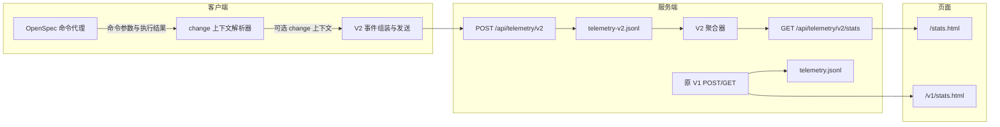

# 技术设计

## 一句话方案

让 Templates V2 CLI 生成带显式版本和结构化 change 上下文的 V2 事件，只发送到独立 V2
endpoint；服务端以独立 JSONL 和聚合器生成 V2 stats，`/stats.html` 展示 V2 change/schema
视图，原 V1 契约原样保留在 `/v1/stats.html`。

## 目标与非目标

本设计必须保证：

- V2 事件在发送、接收、持久化和读取四个边界均不进入 V1 链路。
- schema 和 Lite→Full 数据来自 change 本地事实源，不由服务端猜测原始命令参数。
- schema 数量按项目内唯一 change 计数，跨项目同名 change 不合并。
- change 负责人具有稳定且可解释的“首次事件 Git 身份”语义，缺失时保持为空。
- V1 API、文件和统计响应兼容；默认 UI 路径切到 V2，同时提供明确 V1 入口。

本次不回填 V1 数据、不改变遥测 opt-out 和项目 ID 机制、不引入数据库或外部负责人系统，也
不修改 OpenSpec 的 schema 选择及升级流程。

## 架构概览



V1 与 V2 可复用无状态的小型工具（时间戳规范化、分页、稳定排序），但路由、payload 类型、
文件路径和顶层聚合函数分别定义，避免通过一个隐式模式参数把数据源接错。

| 组件/边界 | 职责 | 本次变化 | 依赖或契约 |
|---|---|---|---|
| `src/lib/telemetry.ts` | 项目/Git/版本信息和 HTTP 上报 | 事件契约升级为 V2；默认 URL 改为 `/api/telemetry/v2`；只接受 `HARNESS_TELEMETRY_V2_URL` 覆盖 | opt-out、超时、错误吞掉、`telemetry.id` 保持 |
| `src/commands/openspec.ts` | 执行 OpenSpec 并记录结果 | 命令结束后解析 change name，读取 selector 和 promotion 标记，传给 `track` | 只返回可证明的上下文，解析失败不影响命令退出 |
| `web/server.ts` V1 边界 | V1 接收和统计 | 保持现状，最多抽取无行为变化的共用纯函数 | `/api/telemetry`、`/api/telemetry/stats`、`telemetry.jsonl` |
| `web/server.ts` V2 边界 | 尚不存在 | 新增校验、`telemetry-v2.jsonl` 写入和 V2 聚合 | `/api/telemetry/v2`、`/api/telemetry/v2/stats` |
| stats React 页面 | 单一 V1 dashboard | 接受明确的 V1/V2 view 配置；V2 加 change KPI/列表，V1 保持原组件行为 | `/stats.html`=V2，`/v1/stats.html`=V1 |
| 路由/注册表 | 注册 `stats` | 增加 `v1-stats` page id/route，两个入口复用页面模块的不同导出 | SPA fallback 已支持 HTML 路径 |

## 核心用例的实现路径

| 核心用例 | 技术路径 | 关键状态或数据 | 失败与边界处理 |
|---|---|---|---|
| 普通 Harness 命令上报 | `track` 组装 `schemaVersion: 2` 通用事件并 POST V2 | 项目 ID、命令、版本、Git、时间、结果 | 网络/超时静默丢弃；不调用 V1 endpoint |
| OpenSpec change 上报 | `runOpenspec` 完成后调用 change 解析器，再把结果传给 `track` | `change.name/schemaName/promotedFrom` | 名称、文件或 YAML 不可判定时省略 `change` 或其可选字段 |
| new/status/instructions | 从 `--change`、`new change <name>` 等确定名称，在 active change 读取事实源 | `.openspec.yaml` 和 `brainstorm.md` | 只接受合法 change 名；不遍历无关目录 |
| archive 后上报 | active change 不存在时，精确匹配 archive 日期前缀与 change 后缀 | 归档目录中的 selector/marker | 多个精确候选时选日期/mtime 最新者；仍不确定则省略 schema |
| V2 stats 去重 | 逐行解析 V2 文件，用项目键+change name 聚合 | first/last event、latest schema、promotion、事件数 | 损坏行跳过；无项目键或 change name 的事件不进入 change map |
| 负责人选择 | 对每个 change 按有效 timestamp 和文件顺序确定最早事件 | 最早事件的 `git.userName/userEmail` | 该事件身份为空时最终 owner 为空，后续事件不补写 |
| 页面查看与排序 | V2 hook 请求 V2 stats；React 派生 change 排序 | project、owner、schema、eventCount、lastSeen | 空数组显示空态；排序只在客户端进行，不触发额外请求 |
| V1 查看 | `/v1/stats.html` 以 V1 配置请求原 stats API | 原 KPI、图表、项目、用户、最近事件 | 与当前 `/stats.html` 行为一致，并提供返回 V2 链接 |

## 接口、数据与状态

### V2 客户端事件

```ts
interface TelemetryV2ChangeContext {
  name: string
  schemaName?: string
  promotedFrom?: 'lite'
}

interface TelemetryV2Event extends TrackMeta {
  schemaVersion: 2
  projectId: string
  command: string
  cliVersion: string
  templateVersion: string
  timestamp: number
  git: GitInfo
  change?: TelemetryV2ChangeContext
}
```

`schemaVersion`、`projectId`、`command`、有限数字 `timestamp` 和对象类型 `git` 是 V2 POST 的
必要字段。`change.name` 必须是非空字符串；schema 只在读取到非空 selector 时发送；
`promotedFrom` 只在 promotion 标记存在且当前 schema 为 `full` 时发送。

V2 默认 endpoint 是 `https://example.com/api/telemetry/v2`。唯一覆盖变量是
`HARNESS_TELEMETRY_V2_URL`；V1 的 `HARNESS_TELEMETRY_URL` 不作为回退，防止现有自定义 V1
地址接收 V2 payload。

### change 上下文解析

新增纯解析和受控文件读取边界，供 `runOpenspec` 在子进程结束后调用：

1. 从 `--change <name>`、`--change=<name>`、`new change <name>`、`archive <name>` 以及已知
   change 型位置参数中解析名称；不使用模糊猜测或“唯一 active change”回退。
2. 优先检查 `openspec/changes/<name>/.openspec.yaml`；archive 成功后检查
   `openspec/changes/archive/YYYY-MM-DD-<name>/.openspec.yaml`。
3. 用 YAML 读取顶层 `schema`。只要 `brainstorm.md` 包含精确 promotion 标记且 schema 为
   `full`，记录 `promotedFrom: lite`。
4. 所有解析和读取错误均返回部分上下文或 `undefined`，不得改变 OpenSpec 原退出码。

### V2 服务端接口与存储

| 接口 | 输入/查询 | 成功 | 失败 |
|---|---|---|---|
| `POST /api/telemetry/v2` | `TelemetryV2Event` JSON | 追加一行到 `telemetry-v2.jsonl`，返回 `{ ok: true }` | 非 JSON 或契约不合法返回 400，不写任何文件 |
| `GET /api/telemetry/v2/stats` | `recentPage`，语义同 V1 | 返回 V2 聚合和分页数据 | 文件缺失返回完整空态；损坏行跳过 |
| V1 POST/GET | 保持现有输入和查询 | 保持现有响应 | 保持现有行为 |

写入继续使用单进程同步 append，以保持与 V1 相同的行原子性假设。V2 读取函数只接收
`telemetry-v2.jsonl` 的明确路径；V1 读取函数只接收 `telemetry.jsonl`。

### V2 change 聚合

项目身份键为：有 `org/repo` 时使用 `repo:${org}/${repo}`，否则使用
`project:${projectId}`。change 键为 `${projectKey}\u0000${change.name}`。无项目身份或无 change
名称的事件仍计入通用 V2 KPI、命令、用户和最近事件，但不计入 change 统计。

每个 change 摘要为：

```ts
interface TelemetryChangeSummary {
  projectId?: string
  org?: string
  repo?: string
  changeName: string
  schemaName?: string
  promotedFrom?: 'lite'
  ownerName?: string
  ownerEmail?: string
  eventCount: number
  firstSeen: number
  lastSeen: number
}
```

- `schemaName` 取时间最新的有效 change schema；时间相同时以后出现的文件行为准。
- 任一有效事件证明 `promotedFrom: lite` 后，该摘要保持升级标识；只有当前 schema 为
  `full` 时计入升级 KPI。
- owner 严格取最早事件当时的 Git 姓名/邮箱；最早事件无身份时保留 `undefined`。
- `schemaChangeDistribution` 从最终 change 摘要计算，一个 change 只进入当前 schema 一次。
- `liteToFullChangeCount` 只统计最终 schema 为 Full 且升级来源为 Lite 的唯一 change；同时返回
  `totalChanges` 和 `changes`。升级比例由页面在 `totalChanges > 0` 时计算或由 API 返回整数百分比。

### 页面状态与路由

- `StatsPage` 使用 V2 view 配置：API 为 `/api/telemetry/v2/stats`，标题标识 V2，显示 V1 入口、
  change KPI、schema 图表和 change 表。
- `V1StatsPage` 使用 V1 view 配置：API 为 `/api/telemetry/stats`，保留当前 KPI、图表和列表，
  显示返回 V2 入口；不渲染 V2 change 专属区域。
- 路由新增 `/v1/stats.html` 和 `v1-stats` page id；原 `/stats.html` 路径不变但数据源切到 V2。
- change 列表的排序 key 扩展为 `project`、`owner`、`schemaName`、`eventCount`、`lastSeen`；文本
  字段默认升序，数值/时间默认降序，重复点击反转，`aria-sort` 与可见箭头同步。

## 兼容、迁移、发布与回滚

### 兼容与迁移

- V1 endpoint、文件、stats shape 和现有 UI 能力不删除。URL 兼容变化仅是 `/stats.html` 改看
  V2；需要 V1 数据的维护者从新增 `/v1/stats.html` 进入。
- 不读取 V1 文件生成 V2 统计，不复制历史行，不尝试从 `openspecArgs` 回填历史 schema。
- V2 上线后的第一条事件形成 change 的 first seen 和 owner 基线，因此它不代表 change 的真实
  创建时间；页面文案和字段命名避免宣称历史创建时间。

### 发布顺序

1. 先部署同时支持 V1/V2 的服务端和两个 stats 页面，验证 V2 空态及 V1 回归。
2. 再发布只发送 V2 的 Templates V2 CLI。
3. 用测试项目产生 Lite、Full、Lite→Full 三类 change 事件，确认 V2 文件、stats 和 UI，且 V1
   文件行数不变。

### 回滚

- 页面问题可回滚前端或临时直接访问 `/v1/stats.html`，不影响采集。
- V2 聚合问题可保留 V2 POST 和文件写入，仅回退/隐藏 V2 页面，修复后可从原始 JSONL 重算。
- V2 CLI 已发布时不得单独回滚掉服务端 V2 POST，否则事件会被静默丢弃；应先回滚 CLI 或保持
  接收路由。CLI 回滚到旧版本会恢复旧版本自身的 V1 行为，但不会把已产生的 V2 数据迁回 V1。
- JSONL append 无数据迁移和不可逆 schema rewrite；代码回滚不删除 V2 文件。

## 失败处理与可观测性

| 失败模式 | 检测信号 | 行为与恢复 |
|---|---|---|
| V2 endpoint 不可达/超时 | 测试中的 fetch mock；生产暂无客户端日志 | CLI 静默继续；检查服务健康后由后续事件恢复，不重放 |
| V2 payload 不合法 | POST 400，V2 文件无新增行 | 修复客户端契约；不得降级写 V1 |
| change 参数不可识别 | 事件存在但 `change` 缺失 | 保留通用统计；增加明确命令形态的解析测试后再扩展 |
| selector/marker 读取失败 | change 仅有 name 或 schema 缺失 | 不影响命令和上报；页面用空值显示 |
| V2 JSONL 损坏行 | stats 总数少于物理行数，契约测试覆盖 | 跳过损坏行并继续；保留文件供人工定位，不影响 V1 |
| stats 请求失败 | 页面错误提示，保留最近成功数据 | 延续当前刷新/分页恢复语义，可重试或切换 V1 页面 |
| V1/V2 串流回归 | 交叉污染测试文件计数/响应 | 阻断交付；修复路由或文件选择后重跑两组测试 |

## 验证方案

| 验证对象 | 方法 | 通过标准 |
|---|---|---|
| V2 endpoint 与环境变量 | CLI 单元测试 mock `fetch`、动态环境和事件 payload | 只请求 V2 URL；不读取 V1 override；opt-out 时零请求 |
| change 上下文解析 | 临时 active/archive change fixture 覆盖参数形态、selector、promotion marker 和损坏文件 | 可判定字段准确，不可判定返回空且不抛错 |
| OpenSpec 上报集成 | mock 子进程或导出纯函数邻近测试 | new/status/archive 的 meta 携带期望 change 上下文且退出码不变 |
| 服务端隔离 | 同一 dataDir 写入 V1/V2 事件并分别调用四个 API | 每个 POST 只增加对应文件；每个 stats 只包含对应事件 |
| change 聚合 | V2 fixture 包含重复事件、跨项目同名 change、Lite/Full/升级及缺失身份 | 唯一数、schema 分布、升级数、owner 和稳定顺序精确 |
| V1 回归 | 运行现有 `web/tests/server.test.ts` V1 用例 | 原断言无契约变化 |
| 双 stats 页面 | React 测试分别渲染 `/stats.html` 与 `/v1/stats.html`，mock 对应 API | 请求数据源正确，导航可达，V2 change 表与 V1 原区域正确 |
| change 表交互 | Testing Library 点击文本/数值表头并检查 DOM/ARIA | 默认序、字段切换、反转、tie-break 和空值展示正确 |
| 构建与类型 | `npm test` 定向文件、`npm run lint`、`pnpm --dir web test -- ...`、`pnpm --dir web build` | 所有 required 检查通过 |

## 关键决策与权衡

| 决策 | 选择与理由 | 代价或未采用方向 |
|---|---|---|
| V2 完全独立 route/file/reader | 最直接证明不串流，便于单独回滚和检查 | 有少量重复代码；不采用单 endpoint 内按版本分流，避免校验错误污染文件 |
| 客户端读取 change 事实源 | CLI 能访问 selector 和升级标记，服务端无需解析命令字符串 | 客户端逻辑增加；不采用服务端解析 `openspecArgs`，其形态不稳定且 archive 信息不足 |
| 结构化 `change` 字段 | 保持事件契约可扩展，普通命令可省略整个对象 | 相比平铺字段多一层；换来明确命名空间 |
| 项目+change 去重 | 满足跨项目隔离且适配同名 change | Git remote 和 projectId 变化会形成新身份；本次不做仓库重命名归并 |
| 最早事件身份即 owner | 符合用户确认且无外部依赖 | 只是遥测语义 owner，不代表组织系统负责人；首次为空不会补写 |
| `/stats.html` 切 V2、V1 下沉到 `/v1/stats.html` | V2 成为当前默认，同时保留明确历史入口 | 旧书签看到的数据源会变化；页面必须清晰标注版本 |
| JSONL 全量聚合 | 与现有部署和测试方式一致，首版成本最低 | 数据增长后扫描成本线性；实际容量成为瓶颈时再独立设计索引/存储 |
