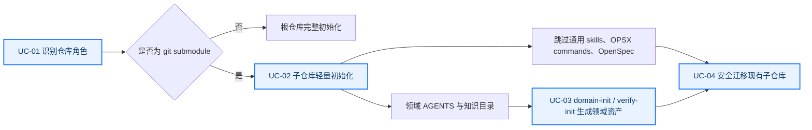

# 头脑风暴

## 目标

> **🎯 目标结果：** Harness CLI 自动识别 git submodule 为领域子仓库，只初始化领域知识承载层，不再复制根仓库通用 skills、OPSX commands 或 OpenSpec；随后安全修复已经被错误初始化的 `maxhub-integrate-ai-front`。

## 一图读懂

> **💡 核心判断：** 子仓库仍需本地 `.harness/rules`、`.harness/skills`、`.harness/agents` 作为领域资产落点，但通用工作流能力只由主仓库提供；仓库角色必须同时约束 init、update、doctor、版本记录和安装文档，不能只修提示语。

## 现状与问题

| 问题域 | 已确认事实 | 直接影响 |
|---|---|---|
| 首次初始化 | `init.ts` 在判断 `isSubmodule` 之前复制全部模板 skills 和 commands | 子仓库出现 `jira-defect-orchestrator`、`openspec-*` 等根仓库能力 |
| 后续更新 | 子仓库写入完整 `versions.yml`，`update` 仍按完整模板注册表检测和同步 | 手工删除后可能被后续 update 重新补回 |
| 文档 | `web/install.md` Step 7 明确要求对子仓库执行完整 init，并声明完整 rules/skills/agents/commands 下沉 | Coding Agent 会稳定复现错误结构 |
| 运行时边界 | `domain-init` 和 `verify-init` 的产出分别是项目领域 assets 与测试规则/验证 agent | 子仓库需要保留生成结果，但不需要复制这两个通用 skill 本体 |
| 真实样本 | `maxhub-integrate-ai-front` 是实际 git submodule，现有 23 个 skills 全部与模板通用 skills 重合，并含 12 个 OPSX commands | 需要可审计迁移，避免删除 18 个领域 rules、2 个 agents 和测试代码 |

## 核心用例

| 用例 ID | 角色/调用方 | 触发场景 | 预期结果 | 关键边界 |
|---|---|---|---|---|
| UC-01 | Harness CLI | 在普通仓库或实际 git submodule 中执行 init/update | 自动得到稳定的 root/domain profile | 保留旧配置兼容；submodule 检测失败时不误删资产 |
| UC-02 | Coding Agent | 在 git submodule 中执行 `devkeel init` | 创建领域 config、领域 AGENTS、知识目录和平台链接 | 不创建 OpenSpec、OPSX commands、模板通用 skills |
| UC-03 | Coding Agent | 对子仓库执行 domain-init / verify-init | 生成的领域 rules、项目 skills、agents 和测试基建保存在子仓库 | 通用 skill 本体仍位于主仓库；不得清理项目自定义资产 |
| UC-04 | 项目维护者 | 修复已经完整初始化的子仓库 | 只移除 CLI 托管的根仓库资产，保留领域产出与业务代码改动 | 迁移前后资产清单可对比；不提交、不推送 |
| UC-05 | Harness 维护者 | 重复 init 或运行 update/doctor | 结果幂等，通用资产不会回流，doctor 按 profile 校验 | 根仓库现有行为保持不变 |

## 范围与验收

| 范围主题 | In Scope | Out of Scope |
|---|---|---|
| CLI profile | submodule 自动识别、domain config、角色化 init/update/doctor/versions | 恢复已删除的 frontend/backend 通用领域模板体系 |
| 文档 | 同步 `web/install.md` 与 `web/public/install.md` 的子仓库流程和目录边界 | 发布网站、修改历史版本页面 |
| 回归测试 | fresh/re-init/update/doctor 的 root/domain 行为及文档一致性 | 与本变更无关的全仓重构 |
| 下游修复 | 清理 `maxhub-integrate-ai-front` 的模板通用 skills、OPSX commands 和对应版本登记 | 删除领域 rules、agents、测试配置或业务改动 |

### 验收条件

1. **子仓库首次初始化：** 实际/模拟 submodule 执行 init 后存在领域 AGENTS 与三个知识目录，但不存在任一模板通用 skill、OPSX command 或 `openspec/`。
2. **子仓库幂等更新：** 重复 init 和 update 不会补回通用 skills/commands，且保留自定义领域资产。
3. **根仓库兼容：** 普通仓库仍安装全部模板 skills、commands 和 OpenSpec，既有根仓库测试通过。
4. **诊断一致：** doctor 对 domain profile 不要求根仓库资产，并能验证平台链接；root profile 行为不变。
5. **文档一致：** 两份 install.md 内容相同，并明确共享能力位于主仓库、子仓库只承载领域产出。
6. **真实项目修复：** `maxhub-integrate-ai-front` 不再包含 23 个模板通用 skills 和 12 个 OPSX commands，18 个领域 rules、2 个 agents 及现有测试/业务改动保持存在。

## 架构与影响概览

| 区域/模块 | 当前职责或行为 | 本次影响 |
|---|---|---|
| `src/lib/config.ts` | 读写项目配置和模板版本注册表 | 持久化 root/domain profile，并生成 profile 对应的受管版本集合 |
| `src/commands/init.ts` | 分发模板、生成 AGENTS、平台链接和 OpenSpec | 在任何模板复制前按 profile 分流；domain 仅建承载层 |
| `src/commands/update.ts` | 按 versions 更新受管资产 | domain 只更新核心/领域 AGENTS，不同步 root skills、commands 或 schemas |
| `src/commands/doctor.ts` | 校验 Harness 目录、链接和 OpenSpec | 按 profile 执行不同必需项检查 |
| `web/install.md` | Coding Agent 初始化事实源 | 描述 root/domain 双层结构及共享 skill 调用方式 |
| 外部业务子仓库 | 领域 Harness 资产与测试基建 | 在 CLI 修复验证后执行一次安全迁移 |

## 方案方向与取舍

| 决策主题 | 选择 | 依据与代价 |
|---|---|---|
| 仓库角色 | 恢复轻量 `root/domain` 分发 profile，并默认由 `detectIsSubmodule` 自动决定；配置持久化角色 | update/doctor 需要稳定事实源；不恢复旧 domainType 或预制领域模板 |
| domain 目录 | 创建空的 rules/skills/agents 作为项目产出落点 | 避免平台 symlink 断裂，同时允许 domain-init/verify-init 增量写入 |
| 版本管理 | domain `versions.yml` 只登记适用于 domain 的受管集合 | 防止 update 将缺失的根仓库资产视为待升级；需要补 profile 过滤测试 |
| 现有资产迁移 | 依据 CLI 模板注册表精确移除已确认的受管根资产 | 比按目录整体删除安全；项目自定义同名覆盖属于剩余风险，迁移前需核对内容来源 |
| Changelog | 本次不创建版本 JSON | 当前任务未授权发版或版本 bump；实现属于下一次 CLI 发布的用户可见 fix，应在发版时记录 |

## 约束、风险与决策

| 类型 | 约束或风险 | 决策或应对 |
|---|---|---|
| 兼容 | 老配置可能没有 profile，或仍含 `project.repoType` | 读取时兼容 `repoType`，缺失时以 git submodule 检测为默认并在 init 重写 |
| 数据安全 | 同名 skill 可能已被项目修改 | CLI 不在普通 update 中自动删除自定义资产；真实项目迁移仅删除已核对为模板副本的目录 |
| 工作树 | Harness CLI 和业务子仓库都已有用户未提交修改 | 只触碰本次范围文件，不覆盖或回滚无关修改 |
| 外部边界 | OpenSpec change 的 allowed edit root 仅为 harness-cli | CLI Apply 完成后，再按用户授权单独处理外部子仓库，不把它伪装成 repo-local artifact |

## 流程选择

> **✅ 流程结论：** 用户明确选择 `lite`。本 change 负责 CLI、测试与安装文档；真实业务子仓库修复在 CLI 验证通过后作为已授权的下游迁移动作执行。
